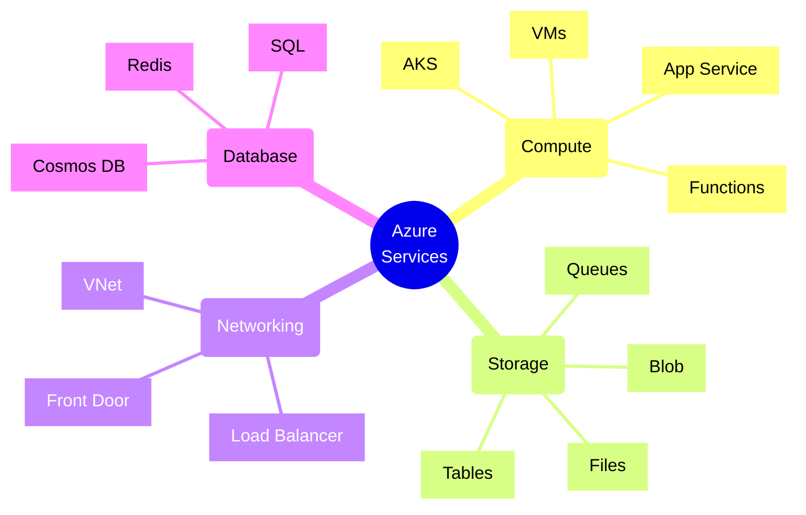
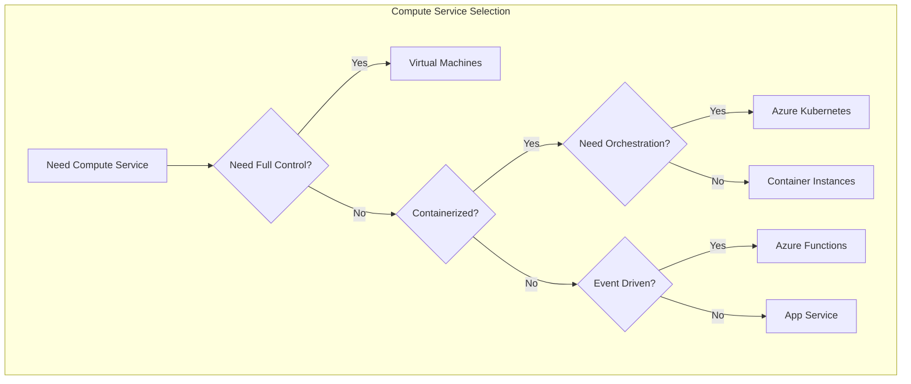
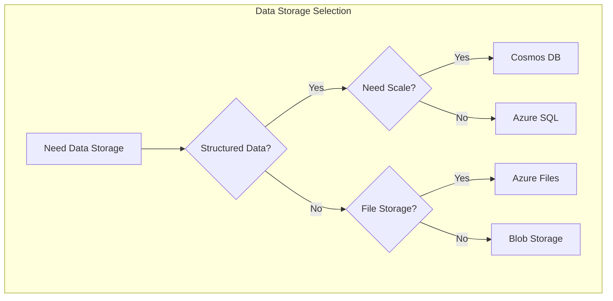
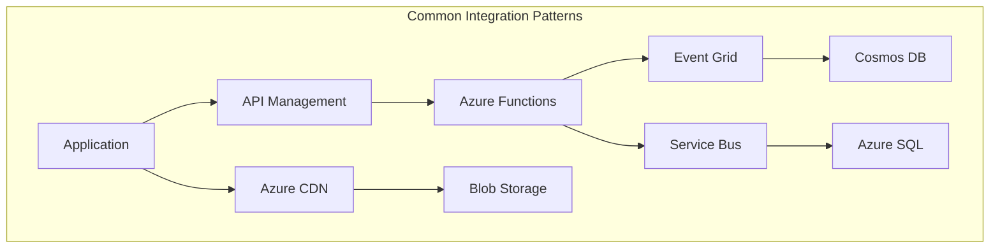
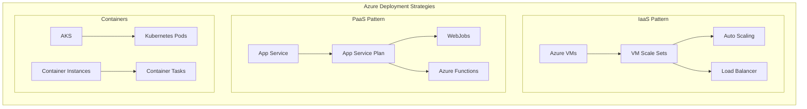
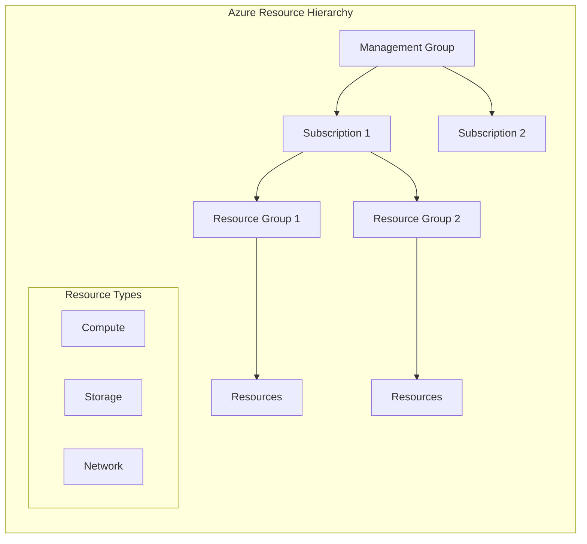
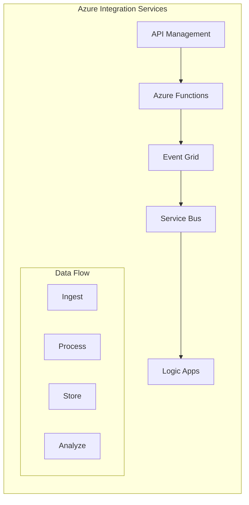

# Azure Services Guide

## Service Selection Decision Trees

## Data Storage Decision Tree

## Service Integration Patterns

## Cloud Deployment Patterns

## Resource Organization

## Integration Patterns

# Azure Service Trade-offs

This document outlines trade-offs between various Azure services.  It's a living document and subject to change as Azure evolves.  "Trade-off" means understanding that choosing one service means potentially sacrificing benefits offered by another. Consider your specific requirements (scale, cost, latency, reliability, complexity) to guide your decisions.

## Messaging & Eventing

### Azure Service Bus

* **Description:**  A fully managed, enterprise-grade messaging service. Supports queuing, topics/subscriptions for publish/subscribe patterns, and reliable messaging.
* **Use Cases:** Reliable asynchronous communication between applications, order processing, integrating disparate systems, implementing complex workflows.
* **Strengths:** Guaranteed delivery, message ordering, transaction support, complex routing, dead-letter queues, mature feature set, strong security.
* **Weaknesses:** Higher cost compared to Event Grid, more complex to configure and manage, can introduce higher latency.
* **Pricing:** Based on messaging units (number of messages sent and received) and features enabled (e.g., Premium features).

### Azure Event Grid

* **Description:** A fully managed, push-based event routing service.  Designed for reactive architectures and integrating with various Azure services and third-party applications.
* **Use Cases:** Reacting to changes in Azure resources (e.g., blob storage uploads, VM state changes), building serverless workflows, integrating with IoT devices.
* **Strengths:** Low latency, highly scalable, cost-effective for high-volume events, simple to use and integrate, native integration with Azure services.
* **Weaknesses:** No guaranteed delivery, no message ordering, limited routing complexity, not designed for critical business transactions.  Best for *reactive* scenarios, not reliable message passing.
* **Pricing:** Based on the number of events processed.

**Trade-off: Service Bus vs. Event Grid**

* **Choose Service Bus when:** Reliable message delivery is paramount, message ordering is required, complex routing is needed, transactional support is necessary, and you're integrating with legacy systems that require a robust messaging infrastructure. You are okay with a higher cost and potentially more latency.
* **Choose Event Grid when:** Low latency and high throughput are critical, you're building reactive architectures, you're primarily integrating with Azure services, and you can tolerate eventual consistency (no guaranteed delivery). Cost is a significant factor.

### Azure Queue Storage

* **Description:** Simple, cost-effective message queue service.
* **Use Cases:** Decoupling application components, background processing, simple task queues.
* **Strengths:** Very low cost, simple to use, scalable.
* **Weaknesses:** No guaranteed delivery, no message ordering, very limited features compared to Service Bus.
* **Pricing:** Low, based on storage and transactions.

**Trade-off: Queue Storage vs. Service Bus**  Queue Storage is a *basic* queue; Service Bus is a full-featured messaging service.

## Compute

### Azure Virtual Machines (VMs)

* **Description:** Infrastructure-as-a-Service (IaaS).  You manage the OS and software.
* **Strengths:** Full control over the environment, wide range of OS and software options.
* **Weaknesses:** Requires significant management overhead, responsible for patching, security, scaling.
* **Pricing:** Based on VM size, operating system, and region.

### Azure App Service

* **Description:** Platform-as-a-Service (PaaS).  Azure manages the OS and infrastructure.
* **Strengths:** Simplified deployment and management, automatic scaling, built-in security features.
* **Weaknesses:** Less control over the environment than VMs.
* **Pricing:** Based on App Service Plan tier (compute resources and features).

### Azure Functions

* **Description:** Serverless compute service.  Execute code on-demand without managing servers.
* **Strengths:** Pay-per-execution pricing, automatic scaling, simplified development.
* **Weaknesses:** Limited execution duration, cold start latency, less control over the environment.

**Trade-off: VMs vs. App Service vs. Functions**  Control vs. Management vs. Cost/Scalability.  Consider the level of control, operational burden, and desired scalability.

## Storage

### Azure Blob Storage

* **Description:** Object storage for unstructured data (images, videos, documents).
* **Strengths:** Highly scalable, cost-effective, durable.
* **Weaknesses:** Not suitable for transactional data.

### Azure Files

* **Description:** Fully managed file shares in the cloud, accessible via SMB protocol.
* **Strengths:** Easy migration from on-premises file shares, simple to use.

### Azure Disks

* **Description:** Block storage for Azure Virtual Machines.
* **Strengths:** High performance for VMs.

## Databases

### Azure SQL Database

* **Description:** Managed SQL Server database service.
* **Strengths:** Familiar SQL Server environment, managed service.

### Azure Cosmos DB

* **Description:** Globally distributed, multi-model database service.
* **Strengths:** Low latency, high availability, flexible data model.
* **Weaknesses:** More complex to manage than SQL Database, potentially higher cost.

**Trade-off: SQL Database vs. Cosmos DB**  Traditional relational vs. NoSQL, globally distributed vs. geographically limited. Consider data model requirements and scalability needs.

## Specialty Services

### Azure Logic Apps

* **Description:**  Cloud-based integration platform for automating workflows and connecting applications.
* **Strengths:** Visual designer, pre-built connectors.
* **Weaknesses:** Can become complex for intricate flows.

### Azure Kubernetes Service (AKS)

* **Description:** Managed Kubernetes service for container orchestration.
* **Strengths:** Containerized application management.
* **Weaknesses:** Significant complexity.

**Note:** This is not an exhaustive list.  Each service has nuances and specific use cases. Always refer to the official Azure documentation for the most up-to-date information.  Consider conducting Proof-of-Concepts (POCs) to evaluate services in your specific environment.  Finally, Azure Advisor can help guide your architecture decisions.