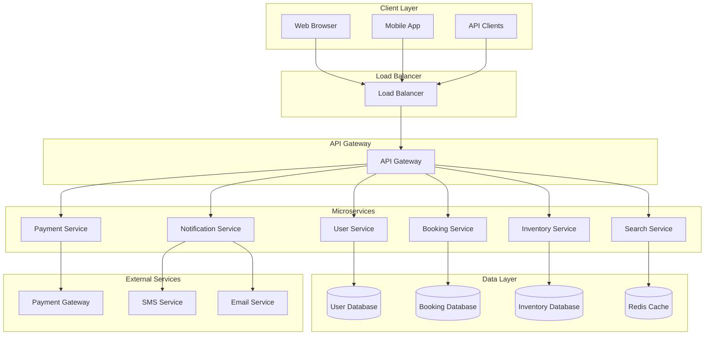
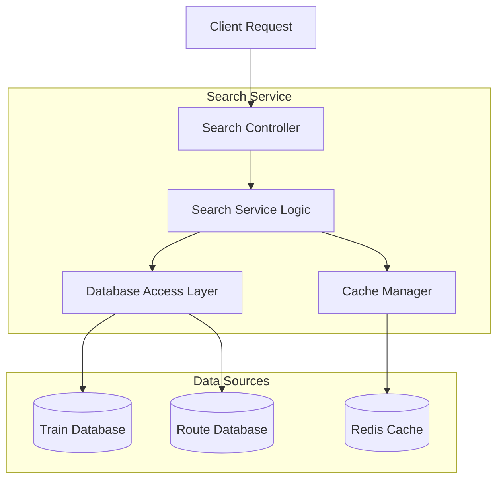
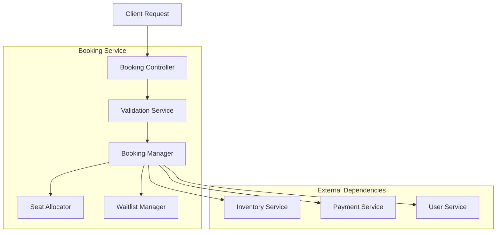
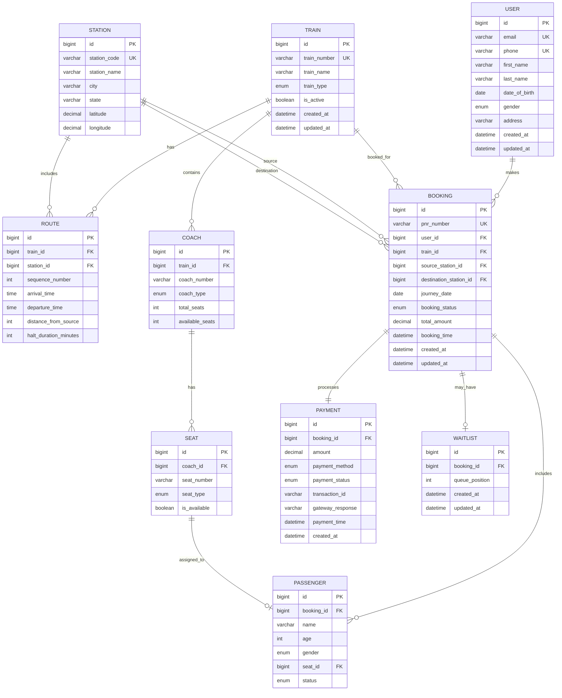
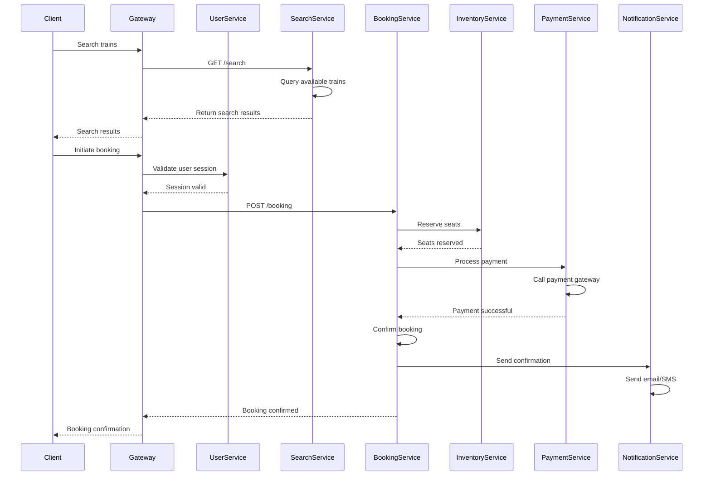
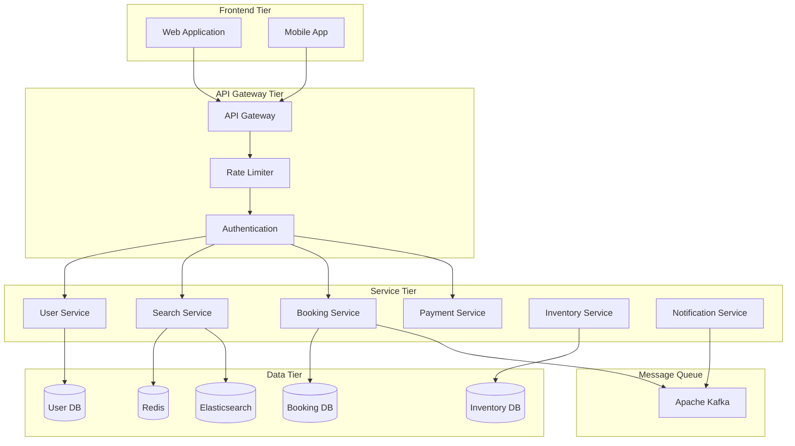
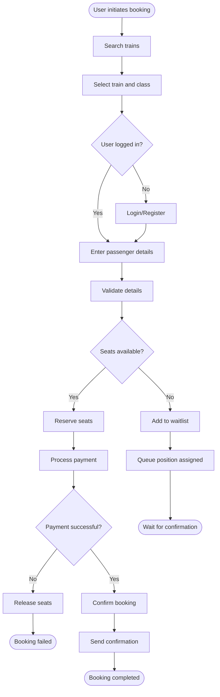
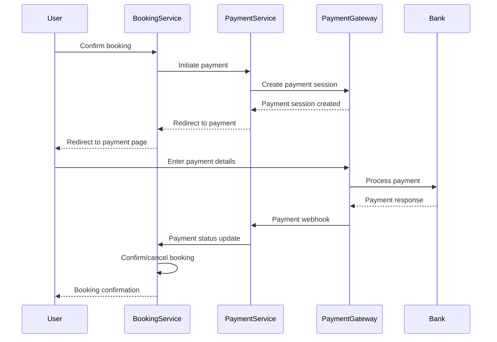

# IRCTC Railway Reservation System - Comprehensive Design Document

## Table of Contents
1. [System Overview](#system-overview)
2. [Functional Requirements](#functional-requirements)
3. [Non-Functional Requirements](#non-functional-requirements)
4. [High-Level Design (HLD)](#high-level-design-hld)
5. [Low-Level Design (LLD)](#low-level-design-lld)
6. [Entity Relationship Diagram (ERD)](#entity-relationship-diagram-erd)
7. [UML Diagrams](#uml-diagrams)
8. [API Design](#api-design)
9. [System Architecture](#system-architecture)
10. [Data Flow](#data-flow)
11. [Security Considerations](#security-considerations)
12. [Performance & Scalability](#performance--scalability)
13. [Monitoring & Observability](#monitoring--observability)
14. [Deployment Architecture](#deployment-architecture)

## System Overview

The IRCTC (Indian Railway Catering and Tourism Corporation) system is a comprehensive railway reservation platform that enables users to:
- Search and book train tickets
- Manage reservations
- Handle payments
- Book meals and accommodations
- Access tourism packages

### Key Stakeholders
- **Passengers**: End users booking tickets
- **Railway Staff**: Managing train schedules and operations
- **System Administrators**: Platform maintenance
- **Payment Partners**: Payment gateway providers
- **Tourism Partners**: Hotel and tour operators

## Functional Requirements

### Core Features
1. **User Management**
   - User registration and authentication
   - Profile management
   - Role-based access control

2. **Train Search & Booking**
   - Search trains by route, date, class
   - Real-time seat availability
   - Ticket booking with passenger details
   - Quota management (General, Tatkal, Ladies, etc.)
   - Waitlist management

3. **Payment Processing**
   - Multiple payment methods (UPI, Cards, Wallets)
   - Payment gateway integration
   - Refund processing
   - Transaction history

4. **Reservation Management**
   - View bookings
   - Cancel/modify reservations
   - Print tickets/e-tickets
   - Booking status tracking

5. **Additional Services**
   - Meal booking
   - Hotel reservations
   - Tourism packages
   - Travel insurance

### Business Rules
- Maximum 6 passengers per booking
- Advance booking period: 120 days
- Tatkal booking: 1 day advance
- Dynamic pricing for premium trains
- Cancellation charges based on time before departure

## Non-Functional Requirements

### Performance Requirements
- **Response Time**: 
  - Search results: < 2 seconds
  - Booking confirmation: < 5 seconds
  - Page load time: < 3 seconds
- **Throughput**: 
  - Support 100,000+ concurrent users
  - Handle 10,000+ bookings per minute during peak hours
- **Availability**: 99.9% uptime (8.76 hours downtime/year)

### Scalability Requirements
- Horizontal scaling capability
- Auto-scaling based on load
- Database sharding support
- CDN integration for static content

### Security Requirements
- HTTPS encryption for all communications
- PCI DSS compliance for payment processing
- Two-factor authentication
- Rate limiting and DDoS protection
- Data encryption at rest and in transit

### Reliability Requirements
- Database backup and recovery
- Disaster recovery with RTO < 4 hours, RPO < 1 hour
- Circuit breaker pattern for external services
- Graceful degradation during partial failures

### Usability Requirements
- Responsive design for mobile and desktop
- Multi-language support
- Accessibility compliance (WCAG 2.1)
- Intuitive user interface

## High-Level Design (HLD)



### Component Description

1. **API Gateway**: Single entry point for all client requests
2. **User Service**: Authentication, authorization, profile management
3. **Search Service**: Train search, availability checking
4. **Booking Service**: Reservation creation, modification, cancellation
5. **Payment Service**: Payment processing, refunds
6. **Inventory Service**: Seat/berth availability management
7. **Notification Service**: Email, SMS notifications

## Low-Level Design (LLD)

### Search Service Architecture



### Booking Service Architecture



## Entity Relationship Diagram (ERD)



## UML Diagrams

### Class Diagram

```mermaid
classDiagram
    class User {
        -Long id
        -String email
        -String phone
        -String firstName
        -String lastName
        -Date dateOfBirth
        -Gender gender
        +register()
        +login()
        +updateProfile()
    }
    
    class Booking {
        -Long id
        -String pnrNumber
        -Long userId
        -Long trainId
        -Date journeyDate
        -BookingStatus status
        -BigDecimal totalAmount
        +createBooking()
        +cancelBooking()
        +modifyBooking()
        +getStatus()
    }
    
    class Train {
        -Long id
        -String trainNumber
        -String trainName
        -TrainType type
        +searchTrains()
        +getAvailability()
        +getSchedule()
    }
    
    class Passenger {
        -Long id
        -String name
        -Integer age
        -Gender gender
        -PassengerStatus status
        +addToBooking()
        +assignSeat()
    }
    
    class Payment {
        -Long id
        -BigDecimal amount
        -PaymentMethod method
        -PaymentStatus status
        -String transactionId
        +processPayment()
        +refund()
        +getStatus()
    }
    
    class Seat {
        -Long id
        -String seatNumber
        -SeatType type
        -Boolean isAvailable
        +book()
        +release()
        +checkAvailability()
    }
    
    User ||--o{ Booking : creates
    Booking ||--o{ Passenger : contains
    Booking ||--|| Payment : processes
    Booking }o--|| Train : for
    Passenger }o--|| Seat : assigned
```

### Sequence Diagram - Ticket Booking Flow



## API Design

### RESTful API Endpoints

#### User Management APIs

```http
POST /api/v1/users/register
POST /api/v1/users/login
POST /api/v1/users/logout
GET /api/v1/users/profile
PUT /api/v1/users/profile
POST /api/v1/users/change-password
```

#### Train Search APIs

```http
GET /api/v1/trains/search
GET /api/v1/trains/{trainId}/availability
GET /api/v1/trains/{trainId}/schedule
GET /api/v1/stations
GET /api/v1/stations/search
```

#### Booking APIs

```http
POST /api/v1/bookings
GET /api/v1/bookings
GET /api/v1/bookings/{pnr}
PUT /api/v1/bookings/{pnr}/modify
DELETE /api/v1/bookings/{pnr}/cancel
GET /api/v1/bookings/{pnr}/status
```

#### Payment APIs

```http
POST /api/v1/payments
GET /api/v1/payments/{transactionId}
POST /api/v1/payments/{transactionId}/refund
GET /api/v1/payments/history
```

### API Request/Response Examples

#### Train Search Request

```json
{
  "method": "GET",
  "endpoint": "/api/v1/trains/search",
  "parameters": {
    "source": "DEL",
    "destination": "BOM",
    "journeyDate": "2025-06-15",
    "class": "3A",
    "quota": "GN"
  }
}
```

#### Train Search Response

```json
{
  "status": "success",
  "data": {
    "trains": [
      {
        "trainId": 12951,
        "trainNumber": "12951",
        "trainName": "MUMBAI RAJDHANI",
        "departureTime": "16:55",
        "arrivalTime": "08:35",
        "duration": "15:40",
        "classes": [
          {
            "classType": "3A",
            "availableSeats": 45,
            "fare": 2550.00,
            "waitlistCount": 0
          }
        ]
      }
    ]
  },
  "timestamp": "2025-05-18T10:30:00Z"
}
```

#### Booking Request

```json
{
  "method": "POST",
  "endpoint": "/api/v1/bookings",
  "body": {
    "trainId": 12951,
    "sourceStation": "DEL",
    "destinationStation": "BOM",
    "journeyDate": "2025-06-15",
    "classType": "3A",
    "quota": "GN",
    "passengers": [
      {
        "name": "John Doe",
        "age": 30,
        "gender": "MALE",
        "nationality": "INDIAN",
        "idType": "AADHAR",
        "idNumber": "123456789012"
      }
    ],
    "contactDetails": {
      "email": "john@example.com",
      "phone": "+919876543210"
    }
  }
}
```

#### Booking Response

```json
{
  "status": "success",
  "data": {
    "pnr": "8217654321",
    "bookingStatus": "CONFIRMED",
    "trainDetails": {
      "trainNumber": "12951",
      "trainName": "MUMBAI RAJDHANI",
      "source": "NEW DELHI",
      "destination": "MUMBAI CENTRAL",
      "journeyDate": "2025-06-15",
      "departureTime": "16:55",
      "arrivalTime": "08:35"
    },
    "passengers": [
      {
        "name": "John Doe",
        "age": 30,
        "seatNumber": "A1-25",
        "status": "CONFIRMED"
      }
    ],
    "totalFare": 2550.00,
    "bookingTime": "2025-05-18T11:15:30Z"
  }
}
```

### API Security

- JWT tokens for authentication
- Rate limiting: 1000 requests per hour per user
- API versioning for backward compatibility
- Input validation and sanitization
- CORS configuration

## System Architecture

### Microservices Architecture



### Technology Stack

#### Backend
- **Programming Language**: Java 17 / Spring Boot
- **Microservices Framework**: Spring Cloud
- **API Gateway**: Spring Cloud Gateway
- **Service Discovery**: Eureka
- **Configuration Management**: Spring Cloud Config

#### Database
- **Primary Database**: PostgreSQL (for transactional data)
- **Cache**: Redis (for session, search results)
- **Search Engine**: Elasticsearch (for train search)
- **Message Queue**: Apache Kafka

#### DevOps & Infrastructure
- **Containerization**: Docker
- **Orchestration**: Kubernetes
- **CI/CD**: Jenkins / GitLab CI
- **Monitoring**: Prometheus, Grafana
- **Logging**: ELK Stack (Elasticsearch, Logstash, Kibana)

#### Frontend
- **Web Framework**: React.js / Angular
- **Mobile**: React Native / Flutter
- **State Management**: Redux / MobX

## Data Flow

### Booking Process Flow



### Payment Flow



## Security Considerations

### Authentication & Authorization
- JWT-based authentication
- Role-based access control (RBAC)
- Multi-factor authentication for sensitive operations
- OAuth 2.0 integration for social login

### Data Protection
- Encryption at rest (AES-256)
- Encryption in transit (TLS 1.3)
- PII data masking in logs
- GDPR compliance measures

### API Security
- Rate limiting and throttling
- API key management
- Input validation and sanitization
- SQL injection prevention
- XSS protection

### Infrastructure Security
- Network segmentation
- VPC with private subnets
- Web Application Firewall (WAF)
- DDoS protection
- Regular security audits

## Performance & Scalability

### Performance Optimization
- Database indexing strategy
- Query optimization
- Caching layers (Redis, CDN)
- Connection pooling
- Asynchronous proce