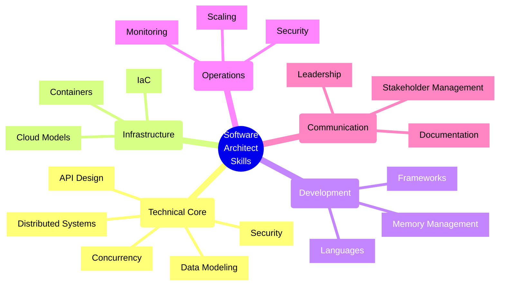

# Software Architect Skills Checklist

Below is a comprehensive checklist of skills for software architects. I've organized them by category and indicated which require deep understanding versus basic understanding.

## Technical Foundations

### Deep Understanding Required
- [ ] [System design principles and patterns](src/System_Design_Principles_and_Patterns.md)
- [ ] [Software architecture patterns](src/Software_Architecture_Patterns.md) (Microservices, Event-driven, Layered, etc.)
- [ ] [Performance optimization techniques](src/Performance_Optimization_Techniques.md)
- [ ] [Scalability principles and implementations](src/Scalability_Principles_and_Implementations.md)
- [ ] [High availability design](src/High_Availability_Design.md) (Active-Active, Active-Passive patterns, Azure Availability Zones, Azure Front Door, Traffic Manager)
- [ ] [Distributed systems concepts](src/Distributed_Systems_Concepts.md)
- [ ] [Concurrency and parallelism concepts](src/Concurrency_and_Parallelism_Concepts.md)
- [ ] [Data modeling and database design](src/Data_Modeling_and_Database_Design.md)
- [ ] [API design (REST, GraphQL, gRPC)](src/API_Design_Concepts.md)
- [ ] [Serverless architecture patterns](src/Serverless_Architecture_Patterns.md)
- [ ] [Security by Design Principles](src/Security_by_Design_Principles.md)

### Basic Understanding Required
- [ ] Low-level programming concepts
- [ ] Multiple programming paradigms (OOP, functional, procedural)
- [ ] [Memory management concepts](src/Memory_Management_Concepts.md)
- [ ] [Operating system fundamentals](src/Operating_System_Fundamentals.md)
- [ ] [Network protocols](src/Network_Protocols.md) (HTTP, TCP/IP, WebSockets)
- [ ] [Internationalization and localization](src/Internationalization_and_Localization.md)

## Cloud & Infrastructure

### Deep Understanding Required
- [ ] [Cloud architecture models](src/Cloud_Architecture_Models.md)
- [ ] [Infrastructure as Code principles](src/Infrastructure_as_Code_Principles.md)
- [ ] [Container orchestration concepts](src/Container_Orchestration_Concepts.md)
- [ ] [Service mesh architectures](src/Service_Mesh_Patterns.md)
- [ ] [Multi-region deployment strategies](src/Multi_Region_Deployment_Strategies.md)
- [ ] [Cost optimization strategies](src/Cost_Optimization_Strategies.md)
- [ ] Resource provisioning and scaling

### Basic Understanding Required
- [ ] Specific cloud provider services (AWS, Azure, GCP)
- [ ] Container technologies (Docker, containerd)
- [ ] Kubernetes components and architecture
- [ ] CI/CD pipeline tools
- [ ] Configuration management tools
- [ ] Terraform, CloudFormation, or equivalent IaC tools
- [ ] Monitoring and observability platforms

## Data Management

### Deep Understanding Required
- [ ] [Data architecture patterns](src/Data_Architecture_Patterns.md)
- [ ] [Relational Database Optimization](src/Relational_Database_Optimization.md)
- [ ] [NoSQL Database Selection Criteria](src/NoSQL_Database_Selection_Criteria.md)
- [ ] [Data Consistency Models](src/Data_Consistency_Models.md)
- [ ] [Data Partitioning Strategies](src/Data_Partitioning_Strategies.md)
- [ ] [Caching Strategies and Implementations](src/Caching_Strategies_and_Implementations.md)
- [ ] [Database Scalability Patterns](src/Database_Scalability_Patterns.md)

### Basic Understanding Required
- [ ] Data pipeline architectures
- [ ] ETL processes
- [ ] Data warehousing concepts
- [ ] Big data processing frameworks
- [ ] SQL and query optimization
- [ ] Time series databases
- [ ] Graph databases

## Security & Compliance

### Deep Understanding Required
- [ ] Threat modeling
- [ ] [Security Architecture Patterns](src/Security_Architecture_Patterns.md)
- [ ] [Zero Trust Architecture Principles](src/Zero_Trust_Architecture_Principles.md)
- [ ] [Authentication and Authorization Frameworks](src/Authentication_and_Authorization_Frameworks.md)
- [ ] [Data Protection Strategies](src/Data_Protection_Strategies.md)
- [ ] Security compliance requirements for your industry

### Basic Understanding Required
- [ ] Common vulnerability types (OWASP Top 10)
- [ ] Encryption technologies
- [ ] PKI infrastructure
- [ ] Security testing methodologies
- [ ] Regulatory frameworks (GDPR, HIPAA, SOC2, etc.)
- [ ] DevSecOps practices

## Development Practices

### Deep Understanding Required
- [ ] Software development methodologies
- [ ] [Technical Debt Management](src/Technical_Debt_Management.md)
- [ ] Refactoring strategies
- [ ] [Testing Best Practices](src/Testing_Best_Practices.md)
- [ ] [Code Quality Metrics and Standards](src/Code_Quality_Metrics_and_Standards.md)

### Basic Understanding Required
- [ ] Version control workflows
- [ ] Code review practices
- [ ] Trunk-based development vs. branching strategies
- [ ] Feature flag implementations
- [ ] Continuous integration practices
- [ ] Test-driven development

## Integration & Communication

### Deep Understanding Required
- [ ] Integration patterns and anti-patterns
- [ ] [Message broker architectures](src/Message_Broker_Architectures.md)
- [ ] Asynchronous communication patterns
- [ ] [API gateway patterns](src/API_Gateway_Patterns.md)
- [ ] Service discovery mechanisms

### Basic Understanding Required
- [ ] Specific message queue technologies (Kafka, RabbitMQ, etc.)
- [ ] Protocol buffers and data serialization
- [ ] Webhook implementation patterns
- [ ] BFF (Backend for Frontend) pattern
- [ ] API management tools

## Observability & Operations

### Deep Understanding Required
- [ ] [Monitoring and Observability Patterns](src/Monitoring_and_Observability_Patterns.md)
- [ ] SLI/SLO/SLA definitions
- [ ] Logging architectures
- [ ] Alerting philosophies
- [ ] Disaster recovery planning
- [ ] [Resilience Patterns](src/Resilience_Patterns.md)

### Basic Understanding Required
- [ ] Specific monitoring tools (Prometheus, Grafana, etc.)
- [ ] Log aggregation systems (ELK, Loki, etc.)
- [ ] APM (Application Performance Monitoring) tools
- [ ] Chaos engineering concepts
- [ ] Blue/green and canary deployment patterns
- [ ] Infrastructure monitoring

## Soft Skills & Leadership

### Deep Understanding Required
- [ ] Technical communication (verbal and written)
- [ ] Stakeholder management
- [ ] Trade-off analysis
- [ ] Technical roadmap planning
- [ ] Technical mentorship
- [ ] Decision-making frameworks
- [ ] Risk assessment and mitigation

### Basic Understanding Required
- [ ] [Project management methodologies](src/Project_Management_Methodologies.md)
- [ ] [Cost estimation techniques](src/Cost_Estimation_Techniques.md)
- [ ] [Team dynamics and collaboration models](src/Team_Dynamics_and_Collaboration_Models.md)
- [ ] [Change management practices](src/Change_Management_Practices.md)
- [ ] [Technical documentation standards](src/Technical_Documentation_Standards.md)
- [ ] [Presentation skills](src/Presentation_Skills.md)

## Domain Knowledge

### Deep Understanding Required
- [ ] Business domain concepts for your industry
- [ ] [Domain-driven design principles](src/Domain_Driven_Design.md)
- [ ] [Business process modeling](src/Business_Process_Modeling.md)

### Basic Understanding Required
- [ ] Industry trends and competitive landscape
- [ ] Regulatory environment for your domain
- [ ] Market dynamics affecting technical choices

## Emerging Technologies

### Basic Understanding Required
- [ ] [AI/ML Application Patterns](src/AI_ML_Application_Patterns.md)
- [ ] [Serverless architecture patterns](src/Serverless_Architecture_Patterns.md)
- [ ] [Edge computing models](src/Edge_Computing_Architectures.md)
- [ ] [IoT architecture patterns](src/IoT_Architecture_Patterns.md)
- [ ] [Blockchain application patterns](src/Blockchain_Application_Patterns.md)
- [ ] [WebAssembly use cases](src/WebAssembly_Use_Cases.md)
- [ ] [Low-code/no-code platforms](src/Low_Code_No_Code_Platforms.md)

## Governance & Standards

### Deep Understanding Required
- [ ] Architecture governance models
- [ ] Technology selection frameworks
- [ ] Architecture review processes
- [ ] [Trade-off Analysis](src/Trade_off_Analysis.md)

### Basic Understanding Required
- [ ] Enterprise architecture frameworks (TOGAF, Zachman, etc.)
- [ ] Industry-specific technical standards
- [ ] Open-source governance

This checklist covers the broad range of skills expected from a software architect. You can use it to identify areas for growth and development in your career. Remember that the depth required in each area can vary depending on your specific industry, company size, and the nature of the applications you're architecting.