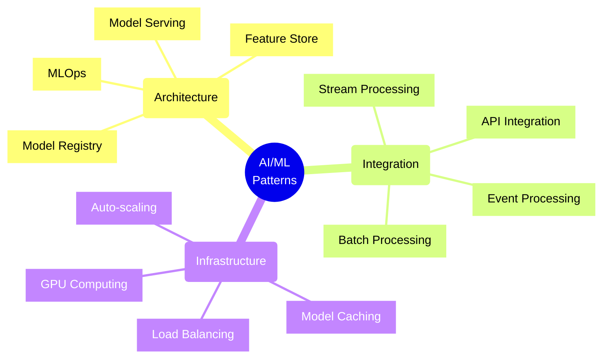
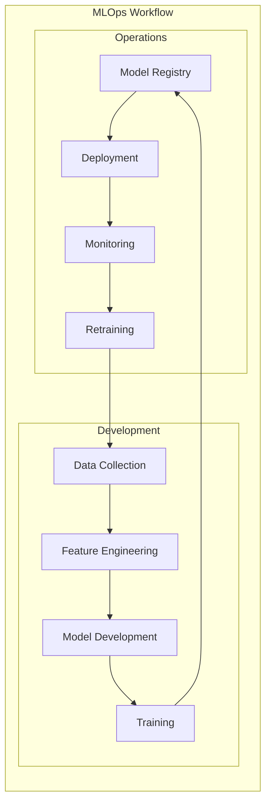
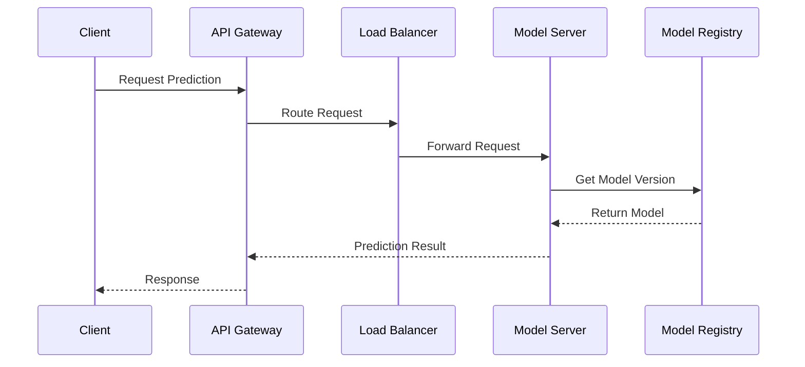
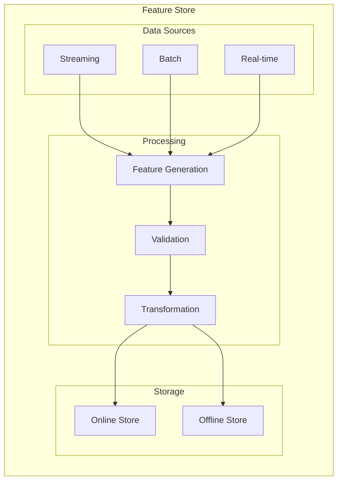
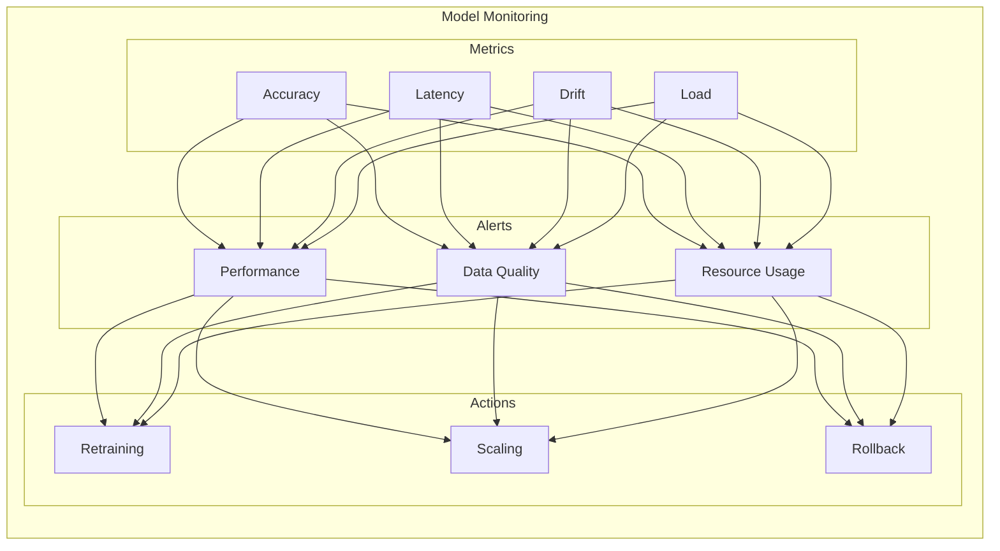
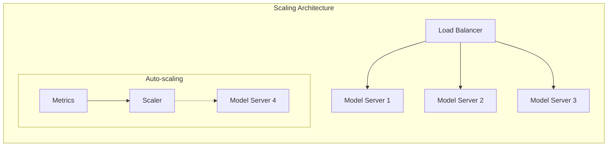

# AI/ML Application Patterns



## MLOps Architecture

### 1. MLOps Pipeline



## Model Serving Patterns

### 1. Real-Time Inference



### 2. Implementation Example
```typescript
// Model Serving Service
class ModelServer {
    private modelRegistry: ModelRegistry;
    private cache: ModelCache;
    private metrics: MetricsCollector;

    async predict(input: Input, modelId: string): Promise<Prediction> {
        const model = await this.loadModel(modelId);
        const startTime = Date.now();
        
        try {
            const prediction = await model.predict(input);
            this.metrics.recordLatency(Date.now() - startTime);
            return prediction;
        } catch (error) {
            this.metrics.recordError(error);
            throw new PredictionError('Failed to generate prediction', error);
        }
    }

    private async loadModel(modelId: string): Promise<Model> {
        if (this.cache.has(modelId)) {
            return this.cache.get(modelId);
        }
        
        const model = await this.modelRegistry.getLatestModel(modelId);
        this.cache.set(modelId, model);
        return model;
    }
}
```

## Feature Engineering Patterns

### 1. Feature Store Architecture



### 2. Feature Pipeline Implementation
```typescript
// Feature Pipeline
class FeaturePipeline {
    private featureStore: FeatureStore;
    private validator: FeatureValidator;
    private transformer: FeatureTransformer;

    async processFeatures(data: RawData): Promise<ProcessedFeatures> {
        const features = await this.generateFeatures(data);
        const validatedFeatures = await this.validator.validate(features);
        const transformedFeatures = await this.transformer.transform(validatedFeatures);
        
        await this.featureStore.store(transformedFeatures);
        return transformedFeatures;
    }

    async getFeatures(entityId: string): Promise<Features> {
        return this.featureStore.getFeatures(entityId);
    }
}
```

## Model Monitoring

### 1. Monitoring Architecture



### 2. Monitoring Implementation
```typescript
// Model Monitor
class ModelMonitor {
    private metrics: MetricsCollector;
    private alertManager: AlertManager;
    private modelRegistry: ModelRegistry;

    async monitorModel(modelId: string): Promise<MonitoringReport> {
        const metrics = await this.collectMetrics(modelId);
        const driftDetected = await this.detectDrift(metrics);
        const performanceIssues = this.analyzePerformance(metrics);
        
        if (driftDetected || performanceIssues) {
            await this.triggerAlert({
                modelId,
                issues: { driftDetected, performanceIssues },
                metrics
            });
        }
        
        return this.generateReport(metrics);
    }

    private async detectDrift(metrics: ModelMetrics): Promise<boolean> {
        const currentDistribution = metrics.predictionDistribution;
        const baselineDistribution = await this.getBaselineDistribution();
        return this.calculateDrift(currentDistribution, baselineDistribution) > this.driftThreshold;
    }
}
```

## Scalability Patterns

### 1. Model Scaling



## Best Practices

1. **Model Development**
   - Version control for models
   - Reproducible training
   - Clear documentation
   - Regular evaluation

2. **Deployment Strategy**
   - Canary deployments
   - A/B testing
   - Rollback capability
   - Performance monitoring

3. **Operational Excellence**
   - Automated pipelines
   - Continuous monitoring
   - Regular retraining
   - Resource optimization

4. **Data Management**
   - Data versioning
   - Quality validation
   - Privacy compliance
   - Efficient storage

Remember: AI/ML applications require careful attention to both model performance and operational efficiency. Regular monitoring, testing, and updates are essential for maintaining reliable AI systems.