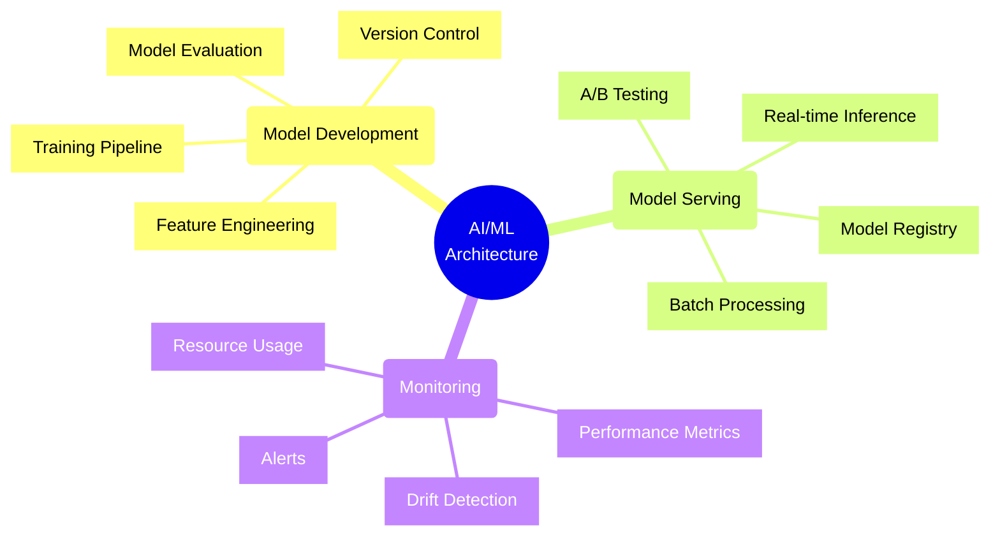
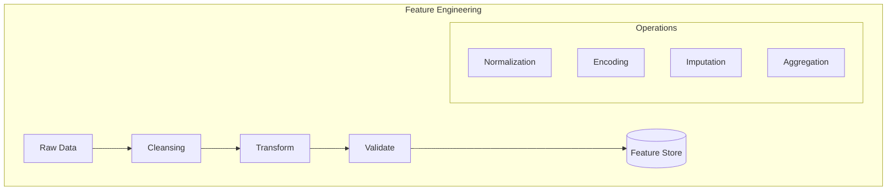
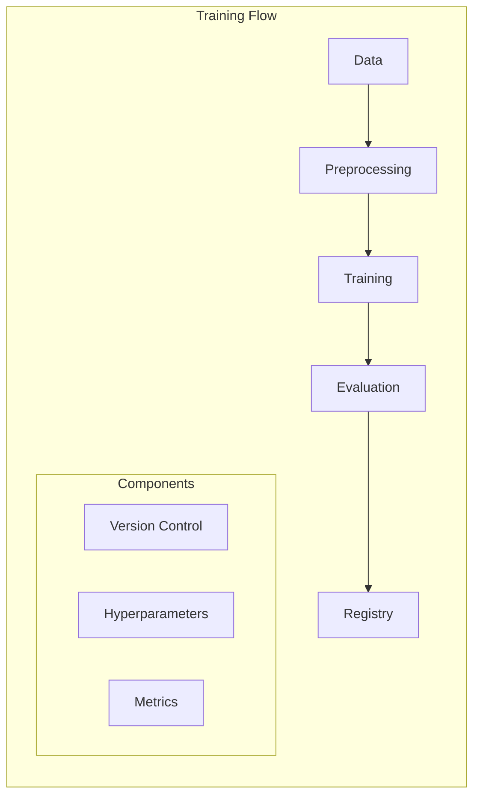
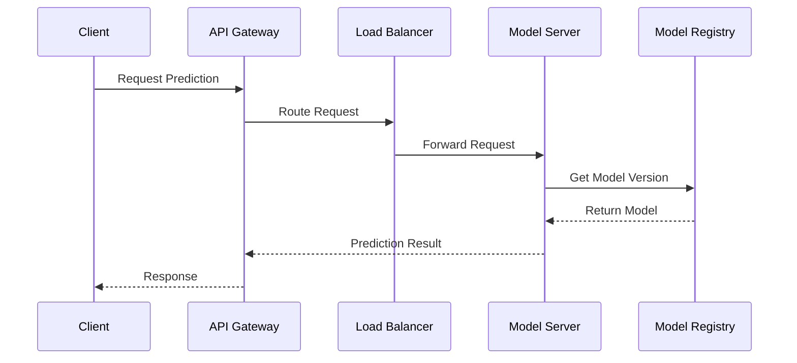
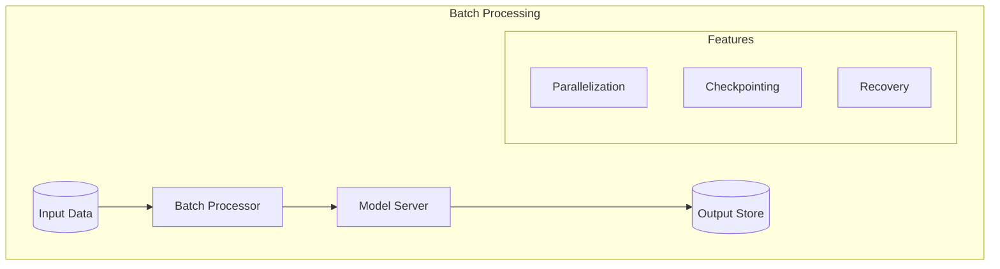
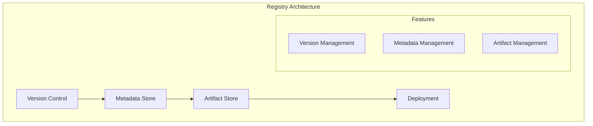
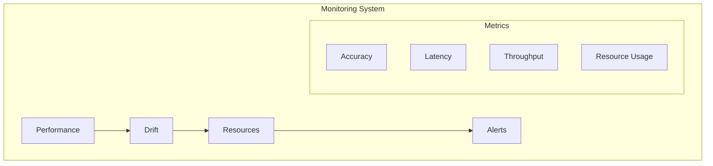

# AI/ML Application Patterns

## Architecture Overview

## Model Development Patterns

### 1. Feature Engineering Pipeline

#### Feature Store Architecture
1. **Online Store**
   - Low latency access
   - Real-time features
   - Cache layer
   - Version control

2. **Offline Store**
   - Historical features
   - Batch processing
   - Data consistency
   - Point-in-time joins

### 2. Training Pipeline

#### Pipeline Components
| Component | Purpose | Artifacts | Monitoring |
|-----------|---------|-----------|------------|
| Data | Source Management | Raw Data | Quality Metrics |
| Preprocessing | Feature Creation | Features | Data Stats |
| Training | Model Building | Model Files | Loss Curves |
| Evaluation | Performance Check | Metrics | KPIs |

## Model Serving Patterns

### 1. Real-Time Inference

#### Serving Components
1. **Model Server**
   - Model loading
   - Inference engine
   - Resource management
   - Request handling

2. **Request Pipeline**
   - Input validation
   - Pre-processing
   - Prediction
   - Post-processing

### 2. Batch Inference

#### Processing Modes
| Mode | Latency | Throughput | Use Case |
|------|---------|------------|----------|
| Real-time | Low | Low | Interactive |
| Near Real-time | Medium | Medium | Streaming |
| Batch | High | High | Bulk Processing |

## Model Management

### 1. Model Registry

### 2. Model Lifecycle
1. **Development**
   - Experimentation
   - Training
   - Validation
   - Documentation

2. **Deployment**
   - Registry storage
   - Environment setup
   - Rollout strategy
   - Monitoring setup

3. **Monitoring**
   - Performance tracking
   - Drift detection
   - Resource usage
   - Error tracking

## Monitoring Framework

### 1. Model Metrics

### 2. Monitoring Checklist
- [ ] Model performance metrics
- [ ] Data drift detection
- [ ] Resource utilization
- [ ] Error tracking
- [ ] Latency monitoring
- [ ] Business KPIs
- [ ] Alert configuration
- [ ] Logging setup

## Testing Framework

### 1. Testing Layers
1. **Model Testing**
   - Unit tests
   - Integration tests
   - Performance tests
   - A/B tests

2. **Data Testing**
   - Schema validation
   - Quality checks
   - Distribution tests
   - Drift detection

### 2. Test Types Matrix
| Test Type | Purpose | Frequency | Criteria |
|-----------|---------|-----------|----------|
| Unit | Component Validation | Every Build | Pass/Fail |
| Integration | System Flow | Daily | Performance |
| A/B | Production Validation | Per Release | Business KPIs |
| Stress | Load Handling | Weekly | Resource Limits |

## Decision Framework

### 1. Architecture Decisions
1. **Model Serving**
   - Latency requirements
   - Throughput needs
   - Resource constraints
   - Scaling requirements

2. **Infrastructure**
   - Compute resources
   - Storage solutions
   - Network capacity
   - Cost constraints

### 2. Technology Selection
| Factor | Consideration | Options |
|--------|---------------|---------|
| Framework | Ecosystem Support | TensorFlow/PyTorch |
| Serving | Deployment Ease | TF Serving/Triton |
| Storage | Data Volume | S3/Azure Blob |
| Compute | Processing Needs | CPU/GPU/TPU |

Remember: AI/ML architectures should focus on reproducibility, scalability, and maintainability while ensuring efficient model serving and monitoring.