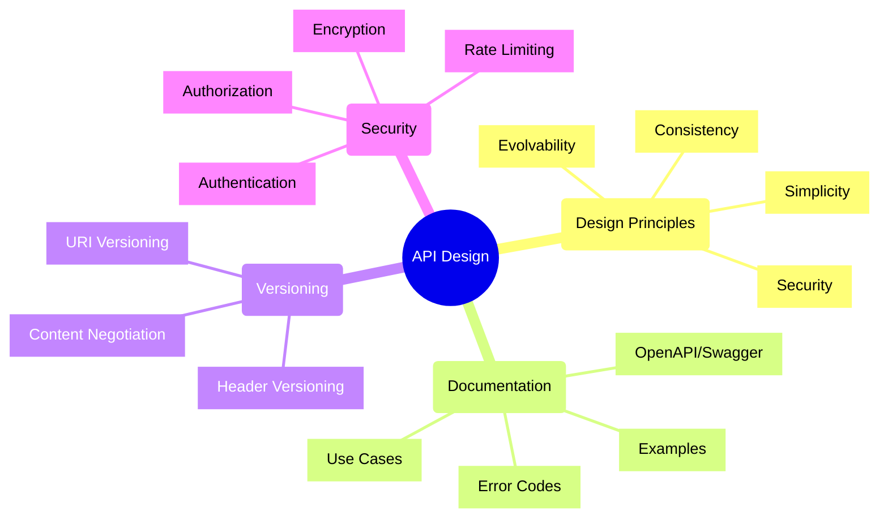
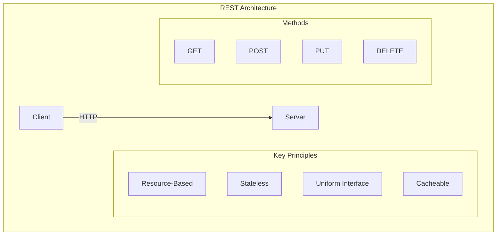
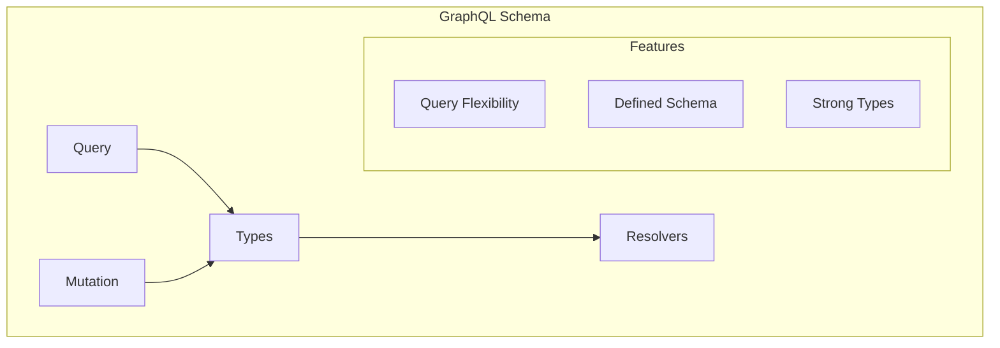
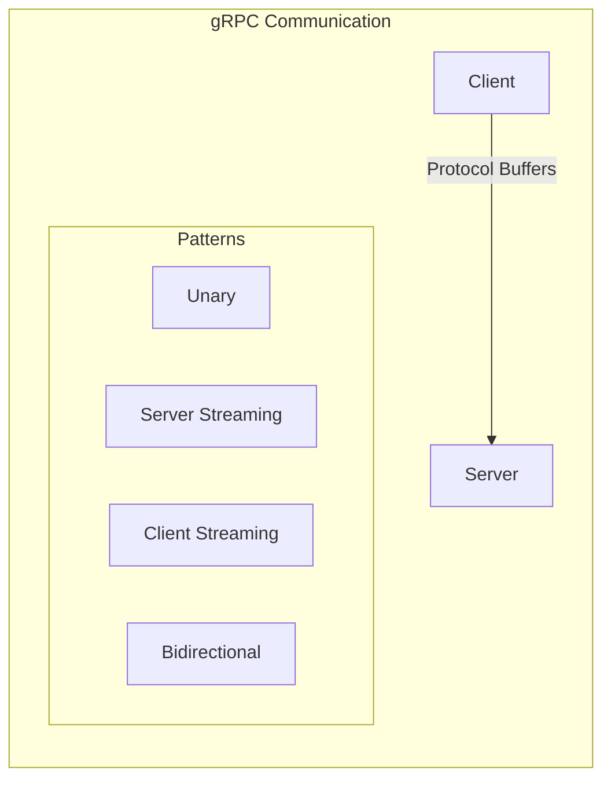
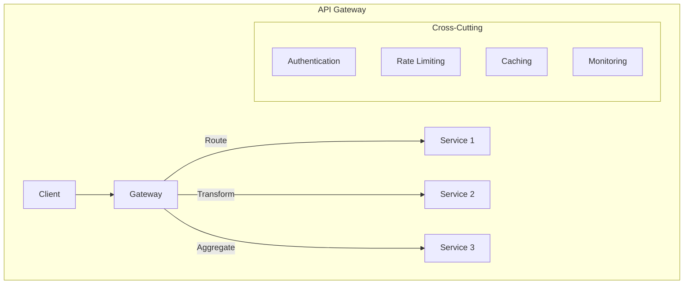
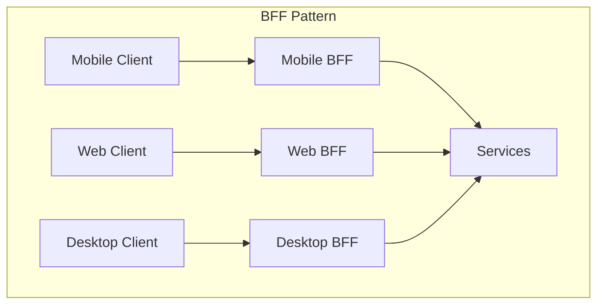

# API Design Concepts and Best Practices

## API Design Principles



## Common API Styles

### 1. REST (Representational State Transfer)



#### Resource Design
- Nouns over verbs
- Hierarchical structure
- Consistent naming
- Clear relationships

#### HTTP Methods
| Method | Purpose | Idempotent | Safe |
|--------|---------|------------|------|
| GET    | Read    | Yes        | Yes  |
| POST   | Create  | No         | No   |
| PUT    | Update  | Yes        | No   |
| DELETE | Remove  | Yes        | No   |

### 2. GraphQL



#### Schema Definition
```graphql
type User {
    id: ID!
    name: String!
    email: String!
    posts: [Post!]!
}

type Post {
    id: ID!
    title: String!
    content: String!
    author: User!
}

type Query {
    user(id: ID!): User
    users(page: Int, limit: Int): [User!]!
}

type Mutation {
    createUser(input: CreateUserInput!): User!
    updateUser(id: ID!, input: UpdateUserInput!): User!
}
```

### 3. gRPC (Google Remote Procedure Call)



#### Service Definition (Protocol Buffers)
```protobuf
syntax = "proto3";

service ProductService {
    rpc GetProduct (ProductRequest) returns (Product);
    rpc ListProducts (ProductFilter) returns (stream Product);
    rpc UpdateProduct (Product) returns (Product);
    rpc WatchProduct (ProductRequest) returns (stream ProductUpdate);
}

message Product {
    string id = 1;
    string name = 2;
    double price = 3;
    string category = 4;
}
```

## API Patterns

### 1. Gateway Pattern



### 2. Backend for Frontend (BFF)



## Design Guidelines

### 1. Naming Conventions
- Use nouns for resources
- Consistent casing
- Clear and descriptive
- Domain-specific terms

### 2. Error Handling
| Status Code | Category | Usage |
|-------------|----------|--------|
| 2xx | Success | Successful operations |
| 4xx | Client Error | Invalid requests |
| 5xx | Server Error | System failures |

### 3. Pagination
- Cursor-based
- Offset/limit
- Page/size
- Link headers

### 4. Security Checklist
- [ ] Authentication
- [ ] Authorization
- [ ] Input validation
- [ ] Rate limiting
- [ ] SSL/TLS
- [ ] API keys
- [ ] Audit logging

### 5. Performance
- Response caching
- Compression
- Batch operations
- Partial responses
- Efficient queries

## Documentation Best Practices

### 1. API Documentation
- Clear descriptions
- Request/response examples
- Error scenarios
- Authentication details
- Rate limits
- API versioning

### 2. OpenAPI/Swagger
```yaml
openapi: 3.0.0
info:
  title: Sample API
  version: 1.0.0
paths:
  /users:
    get:
      summary: List users
      parameters:
        - name: page
          in: query
          schema:
            type: integer
      responses:
        '200':
          description: List of users
        '401':
          description: Unauthorized
```

Remember: Good API design focuses on consistency, usability, and maintainability. Implementation details should follow these design principles rather than drive them.