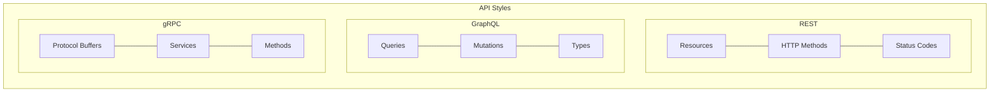
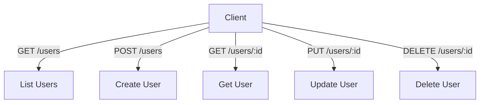
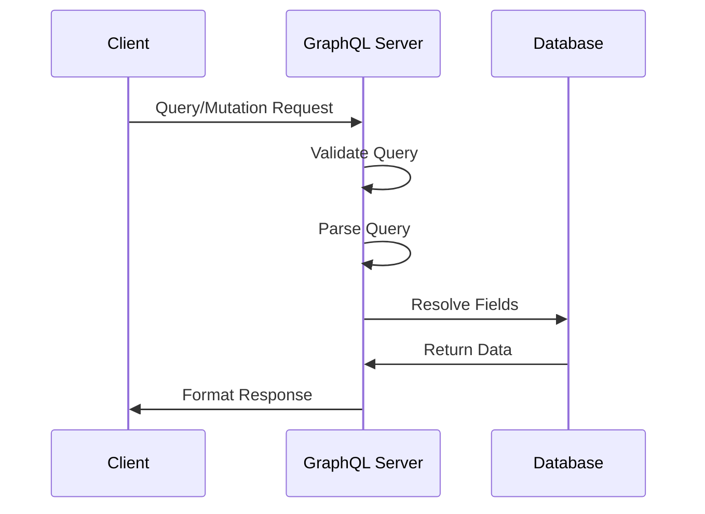
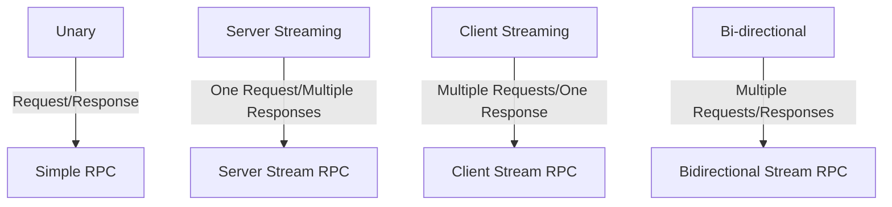
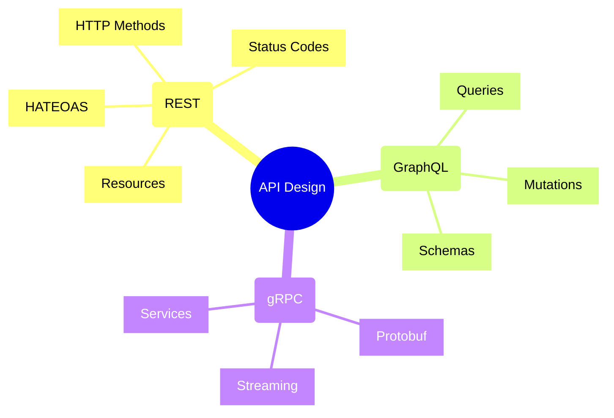
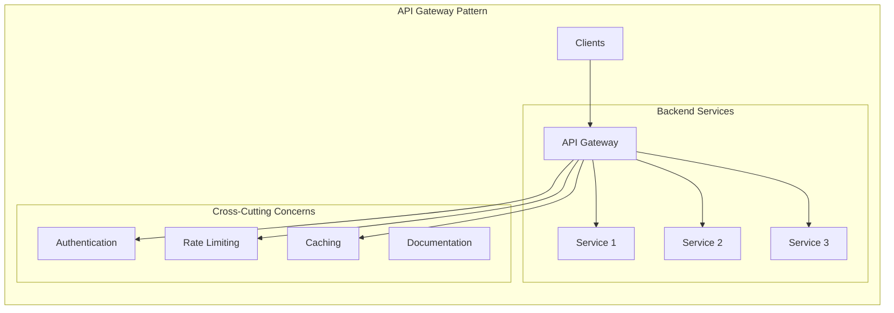
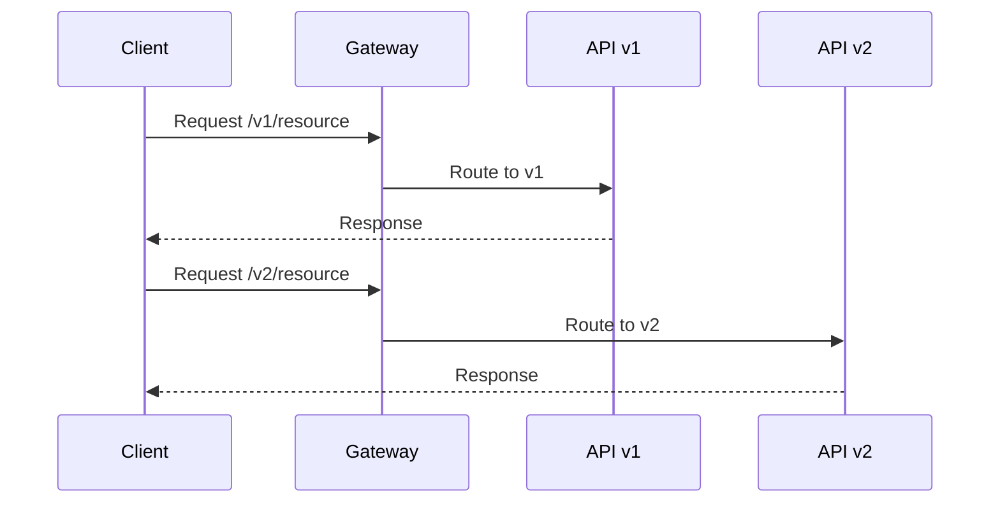
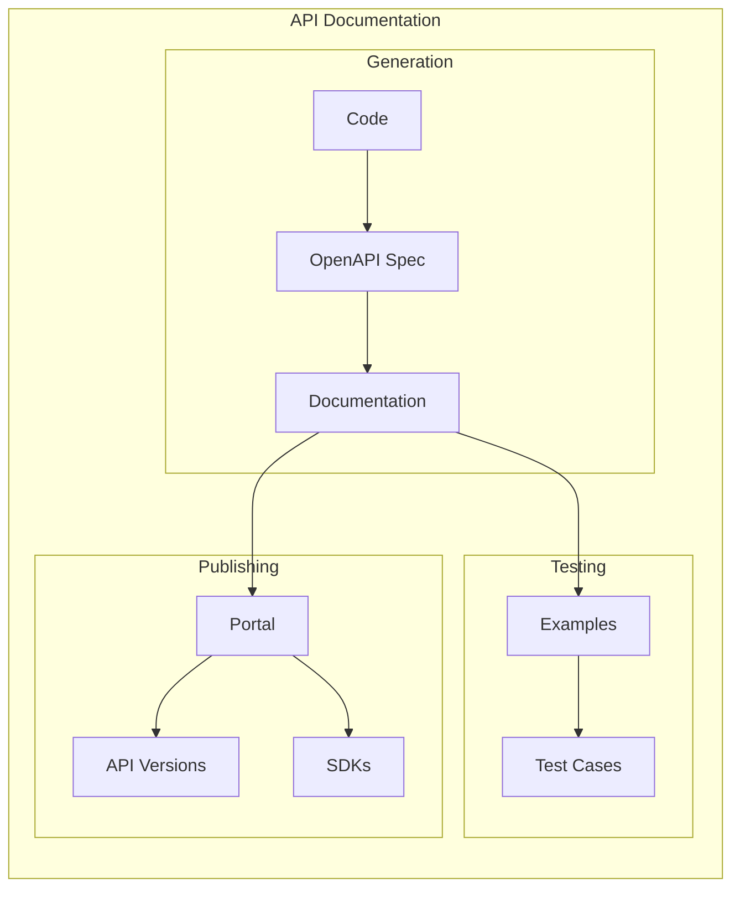

# API Design Concepts and Best Practices



An API (Application Programming Interface) serves as a contract between different software components. This guide covers different API styles, their design principles, and best practices.

## Common API Styles

### 1. REST (Representational State Transfer)

REST is an architectural style that uses HTTP methods to interact with resources.

#### Key Principles
- Stateless
- Resource-based
- Uses standard HTTP methods
- Uniform interface
- Cacheable
- Client-server architecture

#### Example REST API Structure


#### HTTP Methods and Their Use
```
GET     - Retrieve a resource
POST    - Create a new resource
PUT     - Update/Replace a resource
PATCH   - Partial update of a resource
DELETE  - Remove a resource
```

#### Example REST Endpoints for an E-commerce API
```
GET    /api/v1/products           # List all products
GET    /api/v1/products/:id       # Get a specific product
POST   /api/v1/products           # Create a new product
PUT    /api/v1/products/:id       # Update a product
DELETE /api/v1/products/:id       # Delete a product
GET    /api/v1/products/:id/reviews  # Get reviews for a product
```

#### REST Response Example
```json
{
    "id": "123",
    "name": "Wireless Headphones",
    "price": 99.99,
    "category": "Electronics",
    "_links": {
        "self": "/api/v1/products/123",
        "reviews": "/api/v1/products/123/reviews",
        "related": "/api/v1/products/123/related"
    }
}
```

### 2. GraphQL

GraphQL is a query language for APIs that enables declarative data fetching.

#### Key Features
- Single endpoint
- Client-specified queries
- Strong typing
- Real-time updates with subscriptions
- Hierarchical structure

#### Example GraphQL Schema
```graphql
type Product {
    id: ID!
    name: String!
    price: Float!
    category: Category!
    reviews: [Review!]!
}

type Category {
    id: ID!
    name: String!
    products: [Product!]!
}

type Review {
    id: ID!
    rating: Int!
    comment: String
    user: User!
}

type Query {
    product(id: ID!): Product
    products(category: ID, filter: ProductFilter): [Product!]!
}

type Mutation {
    createProduct(input: ProductInput!): Product!
    updateProduct(id: ID!, input: ProductInput!): Product!
}

type Subscription {
    productUpdated(id: ID!): Product!
}
```

#### GraphQL Operation Flow


#### Example GraphQL Query
```graphql
query {
    products(category: "Electronics") {
        id
        name
        price
        reviews {
            rating
            comment
            user {
                name
            }
        }
    }
}
```

### 3. gRPC (Google Remote Procedure Call)

gRPC is a high-performance RPC framework that uses Protocol Buffers.

#### Key Features
- Binary protocol (Protocol Buffers)
- HTTP/2 based
- Streaming support
- Language agnostic
- Code generation
- Bi-directional streaming

#### Service Definition Example (Protocol Buffers)
```protobuf
syntax = "proto3";

service ProductService {
    rpc GetProduct (ProductRequest) returns (Product);
    rpc ListProducts (ProductFilter) returns (stream Product);
    rpc UpdateProduct (Product) returns (Product);
    rpc WatchProduct (ProductRequest) returns (stream ProductUpdate);
}

message Product {
    string id = 1;
    string name = 2;
    double price = 3;
    string category = 4;
}

message ProductRequest {
    string id = 1;
}

message ProductFilter {
    string category = 1;
    double min_price = 2;
    double max_price = 3;
}

message ProductUpdate {
    string id = 1;
    UpdateType type = 2;
    Product product = 3;
}

enum UpdateType {
    CREATED = 0;
    UPDATED = 1;
    DELETED = 2;
}
```

#### gRPC Communication Patterns


# API Design Patterns and Best Practices



## API Architecture Patterns



## API Version Management



## Implementation Examples

### 1. REST API Design

```typescript
// RESTful Resource Controller Pattern
@Controller('users')
class UserController {
    @Get()
    async getUsers(
        @Query() pagination: PaginationDTO
    ): Promise<PagedResponse<User>> {
        return this.userService.getUsers(pagination);
    }
    
    @Get(':id')
    async getUser(@Param('id') id: string): Promise<User> {
        const user = await this.userService.getUser(id);
        if (!user) throw new NotFoundException();
        return user;
    }
    
    @Post()
    @HttpCode(201)
    async createUser(@Body() dto: CreateUserDTO): Promise<User> {
        return this.userService.createUser(dto);
    }
    
    @Put(':id')
    async updateUser(
        @Param('id') id: string,
        @Body() dto: UpdateUserDTO
    ): Promise<User> {
        return this.userService.updateUser(id, dto);
    }
    
    @Delete(':id')
    @HttpCode(204)
    async deleteUser(@Param('id') id: string): Promise<void> {
        await this.userService.deleteUser(id);
    }
}
```

### 2. GraphQL Schema Design

```typescript
// GraphQL Schema and Resolver Pattern
const typeDefs = gql`
    type User {
        id: ID!
        name: String!
        email: String!
        posts: [Post!]!
    }
    
    type Post {
        id: ID!
        title: String!
        content: String!
        author: User!
    }
    
    type Query {
        user(id: ID!): User
        users(page: Int, limit: Int): [User!]!
    }
    
    type Mutation {
        createUser(input: CreateUserInput!): User!
        updateUser(id: ID!, input: UpdateUserInput!): User!
    }
`;

class UserResolver {
    @Query(returns => User)
    async user(@Arg('id') id: string): Promise<User> {
        return this.userService.findById(id);
    }
    
    @FieldResolver()
    async posts(@Root() user: User): Promise<Post[]> {
        return this.postService.findByAuthor(user.id);
    }
    
    @Mutation(returns => User)
    async createUser(
        @Arg('input') input: CreateUserInput
    ): Promise<User> {
        return this.userService.create(input);
    }
}
```

### 3. API Gateway Implementation

```typescript
interface GatewayConfig {
    auth: {
        enabled: boolean;
        provider: AuthProvider;
    };
    rateLimit: {
        enabled: boolean;
        limit: number;
        window: number;
    };
    caching: {
        enabled: boolean;
        ttl: number;
    };
}

class APIGateway {
    constructor(private config: GatewayConfig) {}

    async handleRequest(req: Request): Promise<Response> {
        // Apply cross-cutting concerns
        if (this.config.auth.enabled) {
            await this.authenticateRequest(req);
        }
        
        if (this.config.rateLimit.enabled) {
            await this.checkRateLimit(req);
        }
        
        // Route and handle request
        const response = await this.routeRequest(req);
        
        // Apply caching if enabled
        if (this.config.caching.enabled) {
            await this.cacheResponse(req, response);
        }
        
        return response;
    }

    private async routeRequest(req: Request): Promise<Response> {
        const route = await this.findRoute(req);
        const service = await this.loadBalancer.selectService(route);
        
        return this.proxyRequest(service, req);
    }
}
```

## API Documentation Flow



## Best Practices

1. **API Design Principles**
   - Follow REST conventions
   - Use proper HTTP methods
   - Implement proper error handling
   - Version your APIs

2. **Security**
   - Implement authentication
   - Use proper authorization
   - Validate inputs
   - Rate limit requests

3. **Performance**
   - Implement caching
   - Use pagination
   - Optimize payloads
   - Monitor performance

4. **Documentation**
   - Keep docs updated
   - Provide examples
   - Include error scenarios
   - Maintain changelog

Remember: Good API design focuses on simplicity, consistency, and usability. Always design with the consumer in mind and maintain backward compatibility when possible.