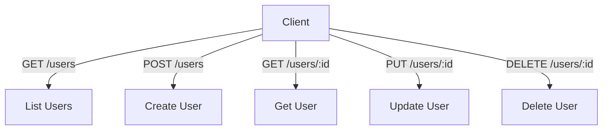
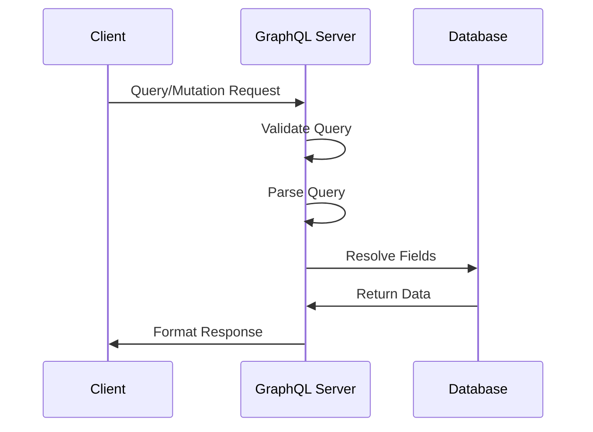
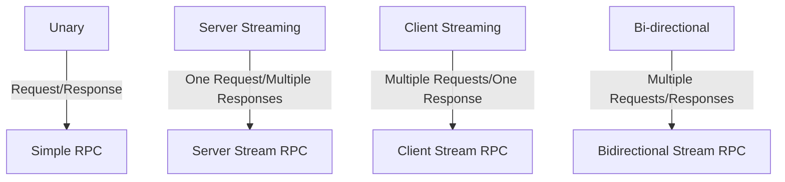
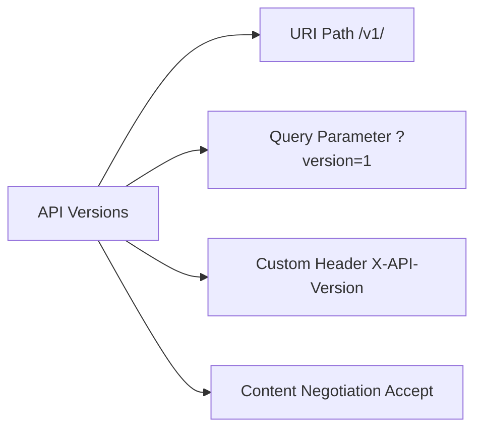
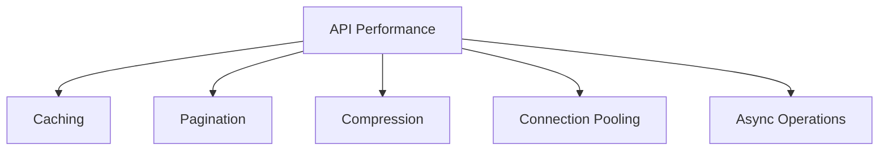
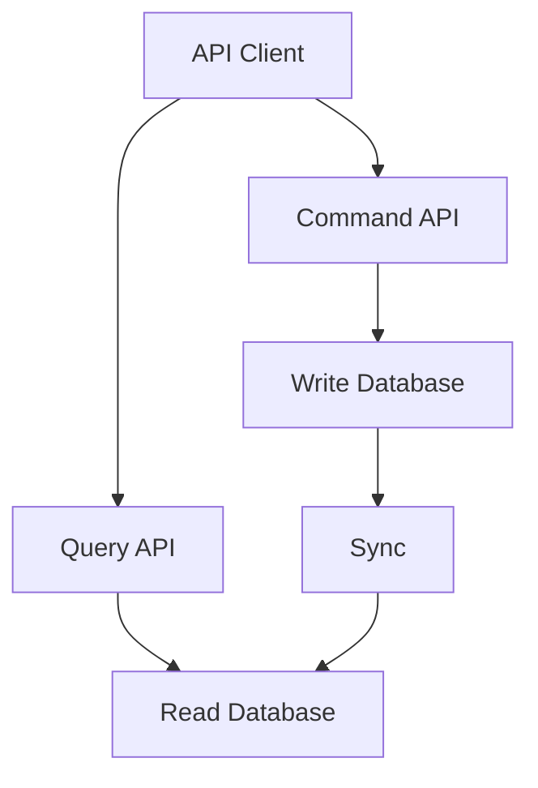
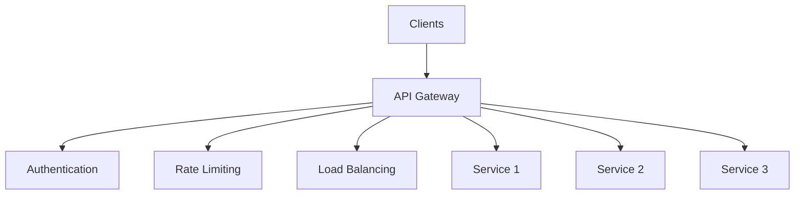
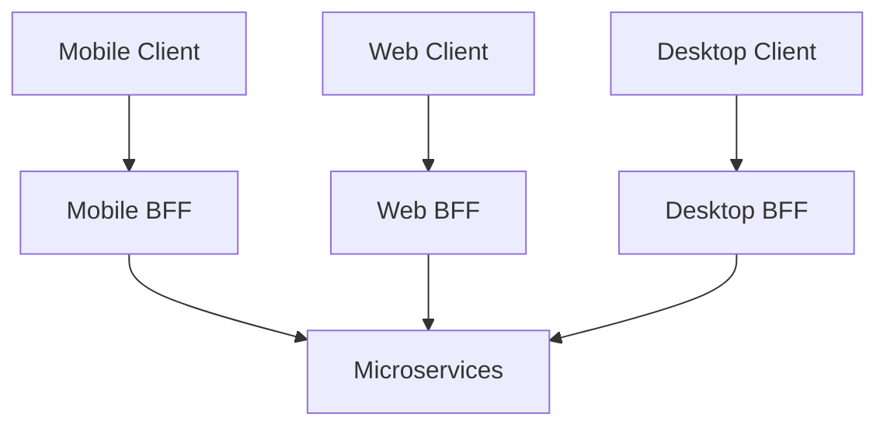

# API Design Concepts and Best Practices

An API (Application Programming Interface) serves as a contract between different software components. This guide covers different API styles, their design principles, and best practices.

## Common API Styles

### 1. REST (Representational State Transfer)

REST is an architectural style that uses HTTP methods to interact with resources.

#### Key Principles
- Stateless
- Resource-based
- Uses standard HTTP methods
- Uniform interface
- Cacheable
- Client-server architecture

#### Example REST API Structure


#### HTTP Methods and Their Use
```
GET     - Retrieve a resource
POST    - Create a new resource
PUT     - Update/Replace a resource
PATCH   - Partial update of a resource
DELETE  - Remove a resource
```

#### Example REST Endpoints for an E-commerce API
```
GET    /api/v1/products           # List all products
GET    /api/v1/products/:id       # Get a specific product
POST   /api/v1/products           # Create a new product
PUT    /api/v1/products/:id       # Update a product
DELETE /api/v1/products/:id       # Delete a product
GET    /api/v1/products/:id/reviews  # Get reviews for a product
```

#### REST Response Example
```json
{
    "id": "123",
    "name": "Wireless Headphones",
    "price": 99.99,
    "category": "Electronics",
    "_links": {
        "self": "/api/v1/products/123",
        "reviews": "/api/v1/products/123/reviews",
        "related": "/api/v1/products/123/related"
    }
}
```

### 2. GraphQL

GraphQL is a query language for APIs that enables declarative data fetching.

#### Key Features
- Single endpoint
- Client-specified queries
- Strong typing
- Real-time updates with subscriptions
- Hierarchical structure

#### Example GraphQL Schema
```graphql
type Product {
    id: ID!
    name: String!
    price: Float!
    category: Category!
    reviews: [Review!]!
}

type Category {
    id: ID!
    name: String!
    products: [Product!]!
}

type Review {
    id: ID!
    rating: Int!
    comment: String
    user: User!
}

type Query {
    product(id: ID!): Product
    products(category: ID, filter: ProductFilter): [Product!]!
}

type Mutation {
    createProduct(input: ProductInput!): Product!
    updateProduct(id: ID!, input: ProductInput!): Product!
}

type Subscription {
    productUpdated(id: ID!): Product!
}
```

#### GraphQL Operation Flow


#### Example GraphQL Query
```graphql
query {
    products(category: "Electronics") {
        id
        name
        price
        reviews {
            rating
            comment
            user {
                name
            }
        }
    }
}
```

### 3. gRPC (Google Remote Procedure Call)

gRPC is a high-performance RPC framework that uses Protocol Buffers.

#### Key Features
- Binary protocol (Protocol Buffers)
- HTTP/2 based
- Streaming support
- Language agnostic
- Code generation
- Bi-directional streaming

#### Service Definition Example (Protocol Buffers)
```protobuf
syntax = "proto3";

service ProductService {
    rpc GetProduct (ProductRequest) returns (Product);
    rpc ListProducts (ProductFilter) returns (stream Product);
    rpc UpdateProduct (Product) returns (Product);
    rpc WatchProduct (ProductRequest) returns (stream ProductUpdate);
}

message Product {
    string id = 1;
    string name = 2;
    double price = 3;
    string category = 4;
}

message ProductRequest {
    string id = 1;
}

message ProductFilter {
    string category = 1;
    double min_price = 2;
    double max_price = 3;
}

message ProductUpdate {
    string id = 1;
    UpdateType type = 2;
    Product product = 3;
}

enum UpdateType {
    CREATED = 0;
    UPDATED = 1;
    DELETED = 2;
}
```

#### gRPC Communication Patterns


## API Design Best Practices

### 1. Versioning


### 2. Security
- Authentication
- Authorization
- Rate limiting
- Input validation
- HTTPS
- API keys
- OAuth 2.0/OpenID Connect

### 3. Error Handling
```json
{
    "status": 400,
    "code": "INVALID_INPUT",
    "message": "Invalid product data",
    "details": [{
        "field": "price",
        "error": "must be greater than 0"
    }]
}
```

### 4. Documentation
- OpenAPI/Swagger for REST
- GraphQL Schema/Introspection
- Protocol Buffers for gRPC
- Code examples
- Authentication details
- Rate limiting info

### 5. Performance Optimization


## API Design Patterns

### 1. CQRS (Command Query Responsibility Segregation)


### 2. API Gateway Pattern


### 3. Backend for Frontend (BFF)


## Comparison of API Styles

### REST
**Pros:**
- Simple and familiar
- Cacheable
- Scalable
- Wide tool support

**Cons:**
- Over/under-fetching
- Multiple round trips
- Endpoint proliferation

### GraphQL
**Pros:**
- Flexible data fetching
- Strong typing
- Single endpoint
- Real-time support

**Cons:**
- Complex caching
- Learning curve
- Server complexity

### gRPC
**Pros:**
- High performance
- Strong typing
- Code generation
- Bi-directional streaming

**Cons:**
- Limited browser support
- Binary protocol
- More complex setup

## API Design Decision Matrix

| Criteria | REST | GraphQL | gRPC |
|----------|------|---------|------|
| Performance | Good | Good | Excellent |
| Browser Support | Excellent | Excellent | Limited |
| Learning Curve | Low | Medium | High |
| Flexibility | Good | Excellent | Good |
| Tooling | Excellent | Good | Good |
| Real-time Support | Limited | Good | Excellent |
| Mobile Support | Good | Good | Excellent |

## Implementation Examples

### 1. REST API Implementation (Node.js/Express)
```javascript
const express = require('express');
const app = express();

app.get('/api/v1/products', (req, res) => {
    // List products
});

app.get('/api/v1/products/:id', (req, res) => {
    // Get single product
});

app.post('/api/v1/products', (req, res) => {
    // Create product
});
```

### 2. GraphQL Implementation (Node.js/Apollo)
```javascript
const typeDefs = gql`
  type Product {
    id: ID!
    name: String!
    price: Float!
  }
`;

const resolvers = {
  Query: {
    products: () => products,
    product: (_, { id }) => products.find(p => p.id === id)
  }
};
```

### 3. gRPC Implementation (Node.js)
```javascript
const service = {
  getProduct: (call, callback) => {
    const product = products.find(p => p.id === call.request.id);
    callback(null, product);
  }
};
```

## Conclusion

Choosing the right API style depends on your specific requirements:

- Use **REST** for:
  - Simple CRUD operations
  - Caching requirements
  - Wide client support

- Use **GraphQL** for:
  - Flexible data requirements
  - Reducing network requests
  - Real-time features
  - Multiple client types

- Use **gRPC** for:
  - Microservices communication
  - High-performance requirements
  - Streaming data
  - Code generation needs

The key is to understand these patterns deeply and select the appropriate style based on your specific use case, performance requirements, and team expertise.