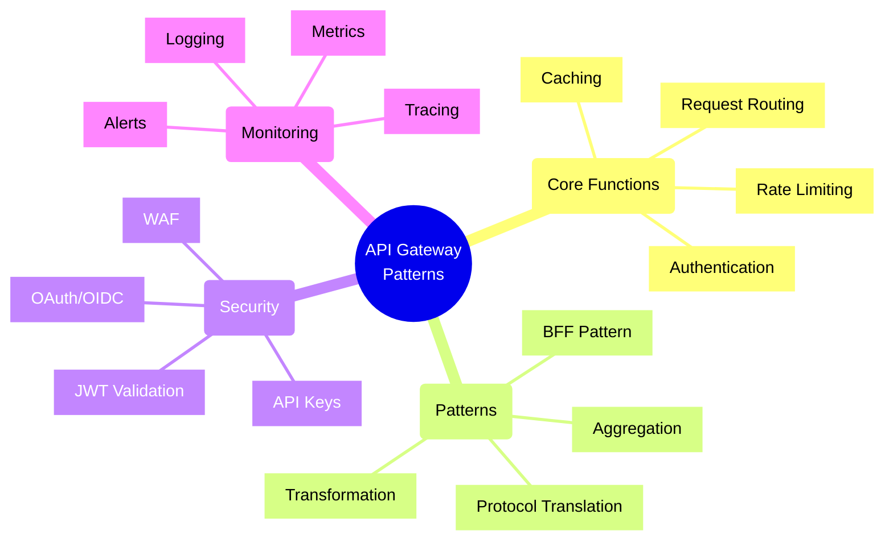
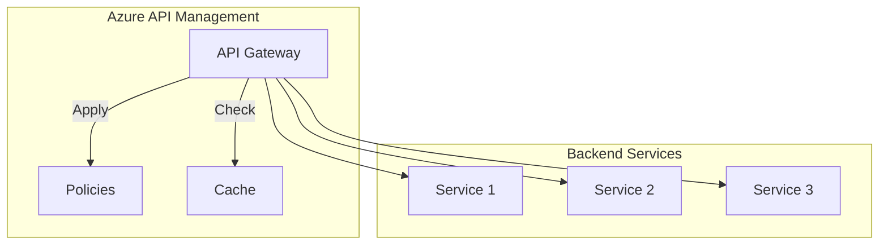
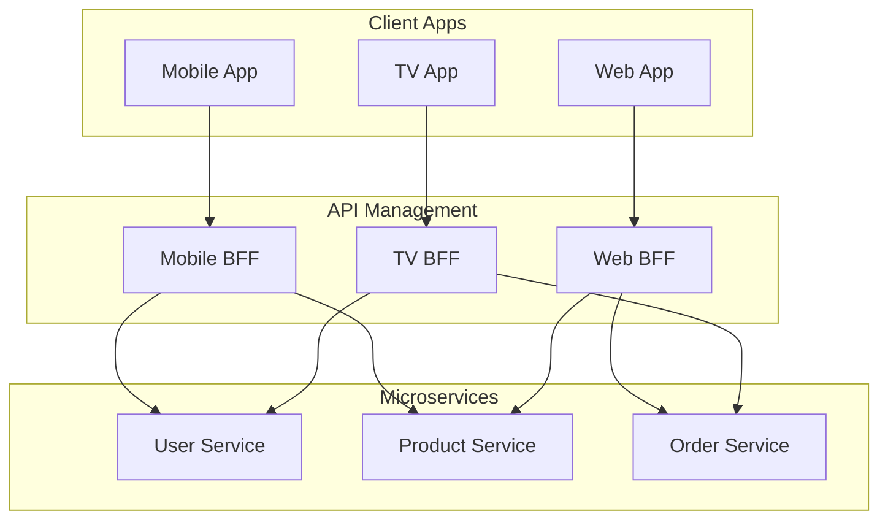
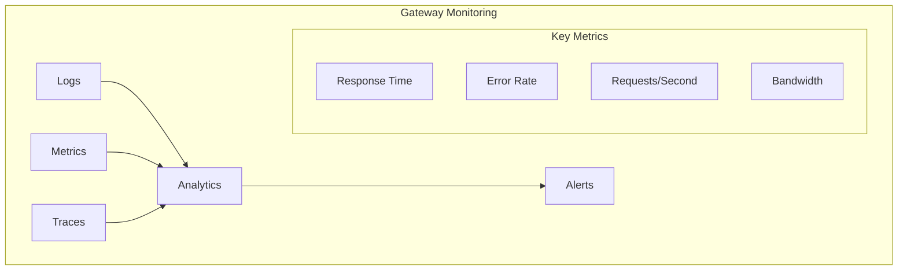

# API Gateway Patterns

## Core Concepts Overview



## Azure Implementation Patterns

### 1. Basic Gateway Pattern



### 2. BFF (Backend for Frontend) Pattern



## Implementation Examples

### 1. Azure API Management Policy
```xml
<policies>
    <inbound>
        <!-- Authentication -->
        <validate-jwt header-name="Authorization" failed-validation-httpcode="401" />
        
        <!-- Rate Limiting -->
        <rate-limit calls="100" renewal-period="60" />
        
        <!-- Caching -->
        <cache-lookup vary-by-developer="false" vary-by-developer-groups="false">
            <vary-by-header>Accept</vary-by-header>
            <vary-by-header>Accept-Charset</vary-by-header>
        </cache-lookup>
        
        <!-- Request Transformation -->
        <set-header name="X-Request-ID" exists-action="override">
            <value>@(context.RequestId)</value>
        </set-header>
    </inbound>
</policies>
```

### 2. Service Integration
```typescript
// Example: BFF Implementation with TypeScript
class MobileBFFGateway {
    constructor(
        private userService: UserServiceClient,
        private productService: ProductServiceClient,
        private cacheManager: CacheManager
    ) {}
    
    async getUserProfile(userId: string): Promise<UserProfile> {
        // Check cache first
        const cached = await this.cacheManager.get(`user:${userId}`);
        if (cached) return cached;
        
        // Aggregate data from multiple services
        const [user, orders, preferences] = await Promise.all([
            this.userService.getUser(userId),
            this.orderService.getUserOrders(userId),
            this.userService.getUserPreferences(userId)
        ]);
        
        // Transform for mobile-specific response
        const profile = this.transformForMobile({ user, orders, preferences });
        
        // Cache the result
        await this.cacheManager.set(`user:${userId}`, profile, '5m');
        
        return profile;
    }
}
```

## Implementation Checklist

### Design Phase
- [ ] Define gateway responsibilities
- [ ] Choose gateway pattern(s)
- [ ] Plan security measures
- [ ] Design caching strategy
- [ ] Define rate limits
- [ ] Plan monitoring approach

### Development Phase
- [ ] Implement authentication
- [ ] Configure rate limiting
- [ ] Set up caching
- [ ] Implement request/response transformation
- [ ] Add logging and monitoring
- [ ] Configure health checks

### Operations Phase
- [ ] Monitor gateway performance
- [ ] Track error rates
- [ ] Analyze traffic patterns
- [ ] Review security logs
- [ ] Update rate limits
- [ ] Optimize caching

## Azure API Management Features

### 1. Security
- OAuth 2.0/OpenID Connect
- Client certificates
- Managed identities
- IP filtering
- JWT validation

### 2. Performance
- Response caching
- Compression
- Rate limiting
- Load balancing
- Request batching

### 3. Monitoring
- Application Insights integration
- Custom metrics
- Diagnostic logs
- Real-time metrics
- Alert rules

## Best Practices

### 1. Security
- Use mutual TLS where possible
- Implement proper authentication
- Enable WAF protection
- Use RBAC for management
- Regular security audits

### 2. Performance
- Implement efficient caching
- Use compression
- Configure timeouts
- Monitor latency
- Optimize payload size

### 3. Reliability
- Implement circuit breakers
- Use retry policies
- Configure fallbacks
- Monitor health status
- Handle failures gracefully

## Trade-offs Analysis

| Pattern | Benefits | Trade-offs |
|---------|----------|------------|
| Simple Gateway | Easy to implement | Limited features |
| BFF | Optimized responses | More maintenance |
| Aggregation | Reduced client calls | Increased complexity |
| Protocol Translation | Flexibility | Performance overhead |

## Monitoring Framework



## Common Patterns

### 1. Authentication & Authorization
- Centralized auth
- Token validation
- Role-based access
- API key management
- OAuth flows

### 2. Traffic Management
- Rate limiting
- Throttling
- Load balancing
- Circuit breaking
- Request routing

### 3. Integration
- Request aggregation
- Response transformation
- Protocol translation
- Service discovery
- Cache management

Remember:
- Start with clear requirements
- Implement security first
- Monitor performance
- Plan for scaling
- Document everything
- Test thoroughly
- Keep it simple