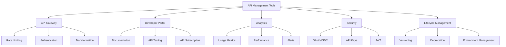
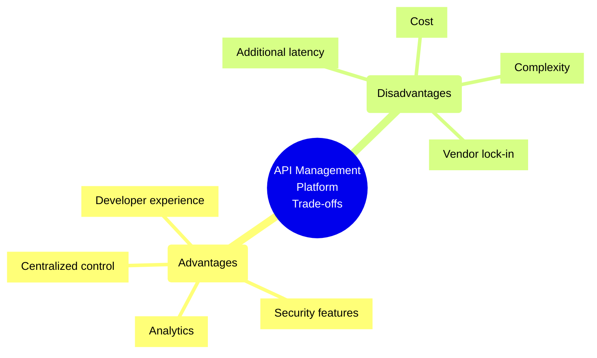
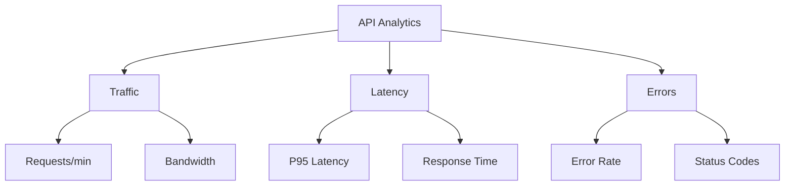
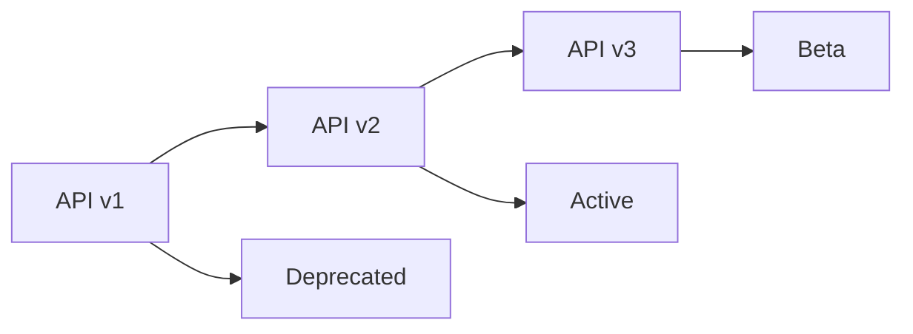

# API Management Tools

## Overview
API Management tools help organizations publish, document, secure, monitor, and analyze their APIs throughout the complete API lifecycle.



## Popular API Management Platforms

### Azure API Management
- Full lifecycle management
- Developer portal
- Policy-based control
- OpenAPI support
- Analytics and monitoring
- Cache management

### AWS API Gateway
- RESTful APIs
- WebSocket APIs
- HTTP APIs
- Custom domain names
- Authorization
- API keys

### Kong
- Open-source option
- Plugin architecture
- High performance
- Service mesh
- Developer portal
- Analytics

### Apigee
- API security
- Traffic management
- Developer portal
- Analytics
- Monetization
- Version management

## Best Practices Checklist

### API Design & Documentation
- [ ] Use OpenAPI/Swagger
- [ ] Implement versioning
- [ ] Document thoroughly
- [ ] Include examples
- [ ] Provide SDKs

### Security
- [ ] Implement authentication
- [ ] Configure authorization
- [ ] Set up rate limiting
- [ ] Enable SSL/TLS
- [ ] Monitor threats

### Operations
- [ ] Monitor performance
- [ ] Track usage
- [ ] Set up alerts
- [ ] Configure caching
- [ ] Plan scaling

## Trade-offs Analysis



## Implementation Examples

### Rate Limiting Policy (Azure API Management)
```xml
<policies>
    <inbound>
        <rate-limit calls="100" 
                   renewal-period="60" 
                   remaining-calls-variable-name="remainingCallsPerSubscription"/>
        <quota calls="10000" 
               renewal-period="604800"/>
        <base/>
    </inbound>
</policies>
```

### Authentication Policy (Kong)
```yaml
plugins:
- name: key-auth
  config:
    key_names: ['apikey']
    hide_credentials: true
    anonymous: null
    key_in_body: false
```

## Monitoring and Analytics

### Key Metrics Dashboard


### Monitoring Setup
```typescript
class APIMonitoring {
  async trackRequest(req: Request, res: Response) {
    const startTime = Date.now();
    
    try {
      await next();
    } finally {
      const duration = Date.now() - startTime;
      metrics.record({
        api: req.path,
        method: req.method,
        statusCode: res.statusCode,
        duration,
        timestamp: new Date()
      });
    }
  }
}
```

## Security Implementations

### OAuth2 Configuration
```json
{
  "oauth2": {
    "authorizationUrl": "https://auth.example.com/oauth2/authorize",
    "tokenUrl": "https://auth.example.com/oauth2/token",
    "scopes": {
      "read:api": "Read access",
      "write:api": "Write access"
    },
    "flow": "authorization_code"
  }
}
```

### JWT Validation
```typescript
class JWTValidator {
  async validateToken(token: string) {
    try {
      const decoded = jwt.verify(token, publicKey, {
        algorithms: ['RS256'],
        audience: 'api://myservice',
        issuer: 'https://auth.example.com'
      });
      
      return {
        valid: true,
        claims: decoded
      };
    } catch (error) {
      return {
        valid: false,
        error: error.message
      };
    }
  }
}
```

## Traffic Management

### Load Balancing Configuration
```yaml
upstream api_backends {
    least_conn;
    server backend1.example.com:8080;
    server backend2.example.com:8080;
    server backend3.example.com:8080;
}

server {
    listen 80;
    server_name api.example.com;
    
    location / {
        proxy_pass http://api_backends;
        proxy_set_header Host $host;
        proxy_set_header X-Real-IP $remote_addr;
    }
}
```

### Circuit Breaker Pattern
```typescript
class APICircuitBreaker {
  private failures = 0;
  private threshold = 5;
  private resetTimeout = 60000;
  private lastFailure: number = 0;
  
  async executeRequest(request: () => Promise<any>) {
    if (this.isOpen()) {
      throw new Error('Circuit is open');
    }
    
    try {
      const result = await request();
      this.onSuccess();
      return result;
    } catch (error) {
      this.onFailure();
      throw error;
    }
  }
}
```

## API Lifecycle Management

### Version Management


### Deprecation Strategy
```typescript
class APIVersionManager {
  async handleRequest(req: Request) {
    const version = req.headers['api-version'];
    
    if (this.isDeprecated(version)) {
      res.header('Warning', '299 - "API version deprecated"');
      // Continue processing but log deprecation
    }
    
    if (this.isUnsupported(version)) {
      throw new UnsupportedVersionError();
    }
    
    return this.routeRequest(version, req);
  }
}
```

## Developer Portal Features

### API Documentation
```yaml
openapi: 3.0.0
info:
  title: Product API
  version: 1.0.0
paths:
  /products:
    get:
      summary: List products
      parameters:
        - name: page
          in: query
          schema:
            type: integer
      responses:
        '200':
          description: Success
          content:
            application/json:
              schema:
                type: array
                items:
                  $ref: '#/components/schemas/Product'
```

### API Testing Console
```javascript
// Interactive API testing component
class APITester {
  async testEndpoint(endpoint, method, params) {
    const response = await fetch(`${this.baseUrl}${endpoint}`, {
      method,
      headers: this.getHeaders(),
      body: method !== 'GET' ? JSON.stringify(params) : undefined
    });
    
    return {
      status: response.status,
      headers: response.headers,
      body: await response.json()
    };
  }
}
```

## API Analytics and Reporting

### Usage Reports
```typescript
interface APIMetrics {
  endpoint: string;
  method: string;
  responseTime: number;
  statusCode: number;
  timestamp: Date;
  userId?: string;
  subscription?: string;
}

class APIAnalytics {
  async generateReport(startDate: Date, endDate: Date) {
    const metrics = await this.getMetrics(startDate, endDate);
    return {
      totalRequests: metrics.length,
      averageResponseTime: this.calculateAverage(metrics),
      errorRate: this.calculateErrorRate(metrics),
      topEndpoints: this.getTopEndpoints(metrics),
      usageBySubscription: this.getUsageBySubscription(metrics)
    };
  }
}
```

## Best Practices Examples

### Error Handling
```typescript
class APIErrorHandler {
  handle(error: Error) {
    if (error instanceof RateLimitError) {
      return {
        status: 429,
        body: {
          error: 'Too Many Requests',
          retryAfter: error.retryAfter
        }
      };
    }
    
    if (error instanceof AuthenticationError) {
      return {
        status: 401,
        body: {
          error: 'Unauthorized',
          message: error.message
        }
      };
    }
    
    // Log unexpected errors
    logger.error('Unexpected error', error);
    return {
      status: 500,
      body: {
        error: 'Internal Server Error'
      }
    };
  }
}
```

## Additional Resources
1. Documentation
   - [Azure API Management](https://docs.microsoft.com/azure/api-management/)
   - [AWS API Gateway](https://docs.aws.amazon.com/apigateway/)
   - [Kong Documentation](https://docs.konghq.com/)
   - [Apigee Docs](https://cloud.google.com/apigee/docs)

2. Learning Resources
   - API Design Best Practices
   - Security Guidelines
   - Performance Optimization
   - Monitoring Strategies
   - Developer Experience