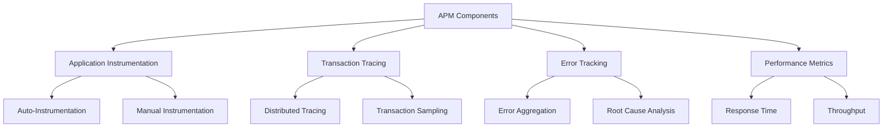
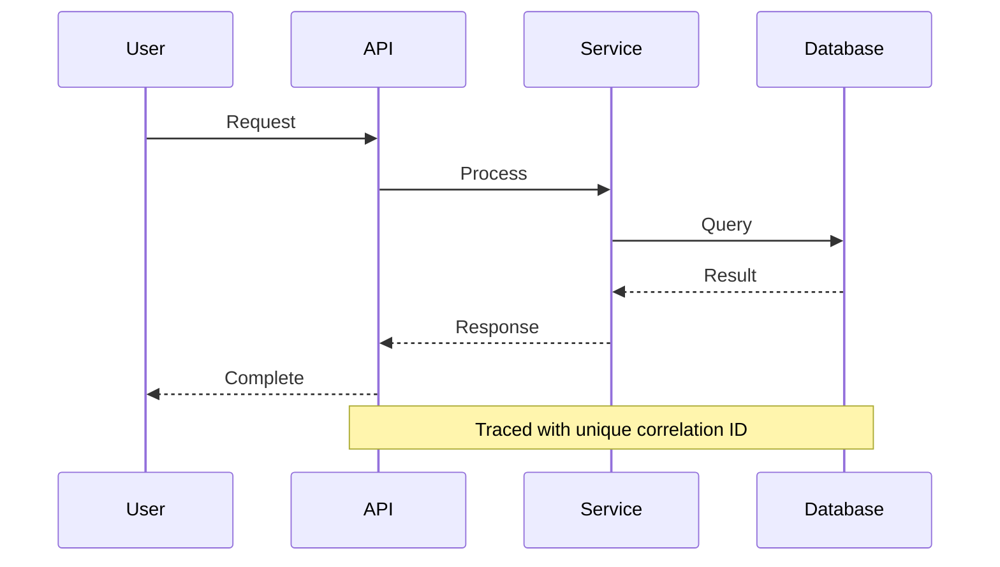
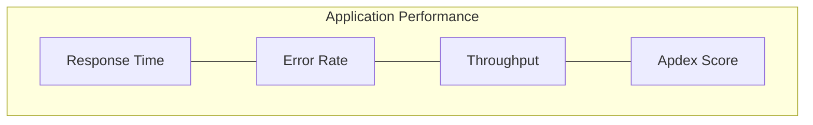

# Application Performance Monitoring (APM) Tools

## Overview
APM tools provide deep visibility into application performance, user experience, and system behavior through code-level insights and transaction tracing.



## Popular APM Solutions

### New Relic
- Full-stack observability
- Real-time analytics
- AI-powered insights
- Custom dashboards
- Infrastructure monitoring
- Distributed tracing

### Datadog APM
- Service maps
- Code-level visibility
- Real-time monitoring
- Custom metrics
- Log correlation
- Continuous profiling

### Elastic APM
- Open source
- ELK stack integration
- Real user monitoring
- Transaction tracing
- Infrastructure monitoring
- Service maps

## Best Practices Checklist

### Implementation
- [ ] Define sampling strategy
- [ ] Configure instrumentation
- [ ] Set up error tracking
- [ ] Plan data retention
- [ ] Implement distributed tracing

### Monitoring
- [ ] Define SLIs/SLOs
- [ ] Set up alerts
- [ ] Configure dashboards
- [ ] Plan capacity
- [ ] Monitor costs

### Operations
- [ ] Regular review
- [ ] Performance baselines
- [ ] Alert tuning
- [ ] Data cleanup
- [ ] Access control

## Implementation Examples

### Auto-Instrumentation (Node.js)
```javascript
// New Relic
require('newrelic');

// Datadog
const tracer = require('dd-trace').init();

// Elastic APM
const apm = require('elastic-apm-node').start({
  serviceName: 'my-service',
  secretToken: 'xxx',
  serverUrl: 'http://localhost:8200'
});
```

### Manual Instrumentation
```typescript
class OrderService {
  async createOrder(order: Order) {
    const span = apm.startSpan('createOrder');
    try {
      const result = await this.processOrder(order);
      span.end();
      return result;
    } catch (error) {
      span.setTag('error', true);
      span.setTag('error.message', error.message);
      span.end();
      throw error;
    }
  }
}
```

## Distributed Tracing

### OpenTelemetry Integration
```typescript
import { trace } from '@opentelemetry/api';
import { registerInstrumentations } from '@opentelemetry/instrumentation';
import { ExpressInstrumentation } from '@opentelemetry/instrumentation-express';

registerInstrumentations({
  instrumentations: [
    new ExpressInstrumentation()
  ]
});

const tracer = trace.getTracer('my-service');

app.get('/api/orders', async (req, res) => {
  const span = tracer.startSpan('get-orders');
  try {
    const orders = await orderService.getOrders();
    span.end();
    res.json(orders);
  } catch (error) {
    span.recordException(error);
    span.end();
    res.status(500).send(error.message);
  }
});
```

## Performance Patterns

### Circuit Breaker with APM
```typescript
class CircuitBreakerWithAPM {
  private apm: APMClient;
  private breaker: CircuitBreaker;

  async execute(operation: () => Promise<any>) {
    const span = this.apm.startSpan('circuit-breaker');
    try {
      const result = await this.breaker.execute(operation);
      span.setTag('circuit', 'closed');
      span.end();
      return result;
    } catch (error) {
      span.setTag('circuit', 'open');
      span.setTag('error', true);
      span.end();
      throw error;
    }
  }
}
```

## Monitoring Configurations

### Service Level Objectives (SLO)
```yaml
slos:
  - name: API Response Time
    target: 99.9
    window: 30d
    indicator:
      metric: http.server.duration
      threshold: 200ms
      
  - name: Error Rate
    target: 99.95
    window: 24h
    indicator:
      metric: http.server.errors
      threshold: 1%
```

### Alert Configuration
```json
{
  "alert": {
    "name": "High Error Rate",
    "type": "metric alert",
    "query": "sum(last_5m):sum:trace.http.request.errors{env:prod} / sum:trace.http.request.hits{env:prod} > 0.05",
    "message": "Error rate is above 5% for the last 5 minutes",
    "thresholds": {
      "critical": 0.05,
      "warning": 0.02
    }
  }
}
```

## Visualization Examples

### Transaction Flow


### Performance Dashboard


## Error Tracking

### Error Grouping
```typescript
interface ErrorGroup {
  type: string;
  message: string;
  stack: string;
  frequency: number;
  firstSeen: Date;
  lastSeen: Date;
  environments: string[];
  users: number;
  samples: ErrorInstance[];
}

interface ErrorInstance {
  timestamp: Date;
  user?: string;
  context: Record<string, any>;
  breadcrumbs: Breadcrumb[];
}
```

### Error Context
```typescript
class ErrorTracker {
  captureError(error: Error, context: Record<string, any>) {
    return this.apm.captureError(error, {
      tags: {
        environment: process.env.NODE_ENV,
        version: process.env.APP_VERSION
      },
      custom: context,
      user: context.user,
      timestamp: new Date(),
      transaction: context.transactionId
    });
  }
}
```

## Performance Optimization

### Resource Profiling
```typescript
class ResourceProfiler {
  async profileFunction<T>(
    name: string,
    fn: () => Promise<T>
  ): Promise<T> {
    const start = process.hrtime();
    const startMemory = process.memoryUsage();
    
    try {
      const result = await fn();
      return result;
    } finally {
      const [seconds, nanoseconds] = process.hrtime(start);
      const endMemory = process.memoryUsage();
      
      this.apm.recordMetric('function.duration', {
        name,
        duration: seconds + nanoseconds / 1e9
      });
      
      this.apm.recordMetric('function.memory', {
        name,
        heap: endMemory.heapUsed - startMemory.heapUsed
      });
    }
  }
}
```

## Best Practices Examples

### Transaction Naming
```typescript
// Good
apm.setTransactionName('GET /api/users/:id');

// Bad
apm.setTransactionName('getUser');
```

### Sampling Configuration
```javascript
{
  "sampling": {
    "default_sample_rate": 0.1,
    "rules": [
      {
        "service": "critical-service",
        "sample_rate": 1.0
      },
      {
        "http.url": "/health",
        "sample_rate": 0.01
      }
    ]
  }
}
```

## Additional Resources
1. Documentation
   - [New Relic Documentation](https://docs.newrelic.com/)
   - [Datadog APM Documentation](https://docs.datadoghq.com/tracing/)
   - [Elastic APM Documentation](https://www.elastic.co/guide/en/apm/guide/current/index.html)

2. Learning Resources
   - APM Implementation Patterns
   - Performance Optimization
   - Distributed Tracing
   - Error Monitoring