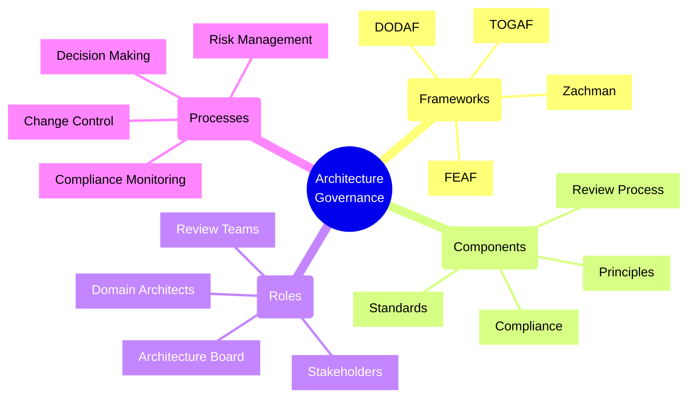
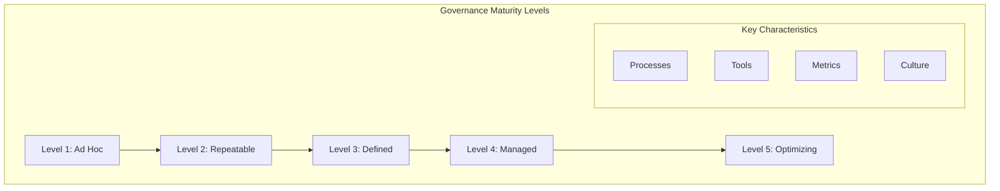
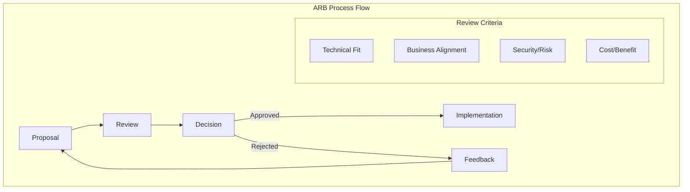
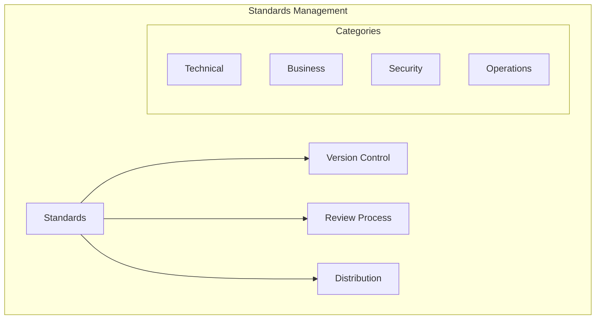
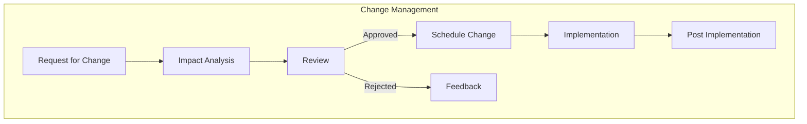
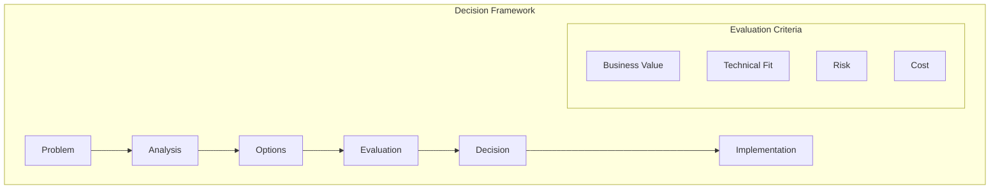
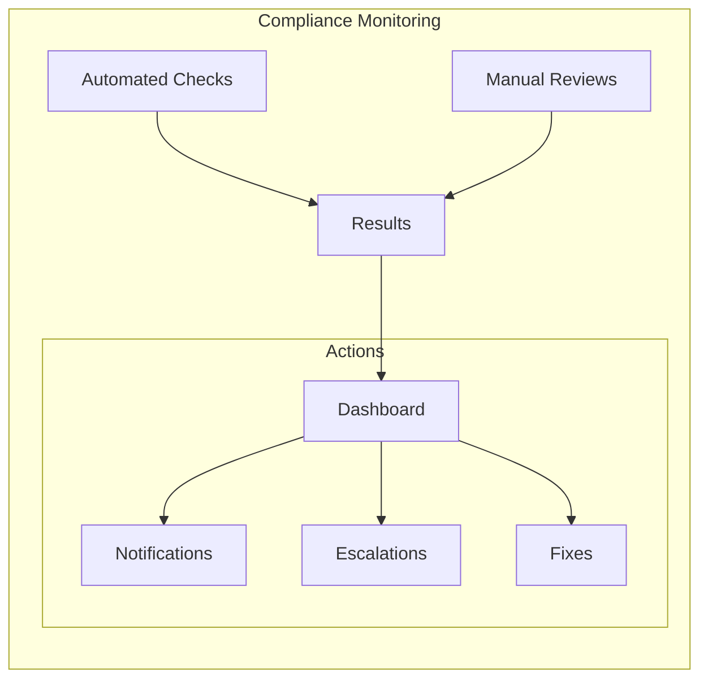

# Architecture Governance Models

## Governance Patterns

### 1. Federated Governance
- Central architecture team sets standards
- Domain teams have autonomy within boundaries
- Regular alignment meetings
- Distributed decision making with oversight

### 2. Centralized Governance
- Single architecture authority
- Standardized processes
- Consistent enforcement
- Central decision making

### 3. Hybrid Governance
- Mix of central and distributed control
- Policy-based boundaries
- Local autonomy for specific domains
- Shared decision making framework

## Maturity Model

### Maturity Levels Checklist
- [ ] Level 1: Ad Hoc
  - Basic documentation exists
  - Informal review process
  - Individual-dependent decisions
  
- [ ] Level 2: Repeatable
  - Standard templates
  - Basic review workflow
  - Documented decisions
  
- [ ] Level 3: Defined
  - Formal processes
  - Clear roles and responsibilities
  - Metrics tracking
  
- [ ] Level 4: Managed
  - Automated workflows
  - Compliance monitoring
  - Performance metrics
  
- [ ] Level 5: Optimizing
  - Continuous improvement
  - Predictive analytics
  - Innovation enablement

## Core Governance Components

### 1. Architecture Review Board (ARB)

### 2. Architecture Standards Management

### 3. Change Management Process

## Governance Implementation

### 1. Decision Making Framework

### 2. Compliance Monitoring

## Evaluation Framework

### 1. Governance KPIs
| Metric | Description | Target | Measurement |
|--------|-------------|--------|-------------|
| Architecture Compliance | % of projects following standards | >95% | Monthly |
| Review Cycle Time | Days to complete review | <5 days | Per Review |
| Technical Debt | Ratio of debt to new features | <20% | Quarterly |
| Standards Adoption | % teams using standards | >90% | Monthly |

### 2. Risk Assessment Matrix
| Impact | Likelihood | Risk Level | Required Actions |
|--------|------------|------------|------------------|
| High | High | Critical | Immediate ARB Review |
| High | Low | High | Standard Review |
| Low | High | Medium | Team Review |
| Low | Low | Low | Self Assessment |

## Best Practices

1. **Governance Structure**
   - Define clear roles and responsibilities
   - Establish review processes
   - Document decision frameworks
   - Maintain standards repository

2. **Process Management**
   - Implement change control
   - Monitor compliance
   - Track architecture decisions
   - Measure governance effectiveness

3. **Communication**
   - Regular stakeholder updates
   - Clear documentation
   - Transparent decision-making
   - Feedback mechanisms

4. **Tools and Automation**
   - Automated compliance checking
   - Documentation management
   - Workflow automation
   - Metrics collection

## Implementation Checklist

### 1. Foundation Setup
- [ ] Define governance framework
- [ ] Establish architecture principles
- [ ] Create review board charter
- [ ] Document decision rights

### 2. Process Implementation
- [ ] Design review workflow
- [ ] Create standards templates
- [ ] Implement change management
- [ ] Set up compliance monitoring

### 3. Tool Selection
- [ ] Architecture repository
- [ ] Workflow automation
- [ ] Documentation platform
- [ ] Metrics dashboard

### 4. Training and Communication
- [ ] Role-based training
- [ ] Communication plan
- [ ] Stakeholder engagement
- [ ] Feedback mechanisms

Remember: Architecture governance is essential for maintaining consistency, quality, and alignment with business objectives. Effective governance balances control with agility to enable innovation while managing risk.