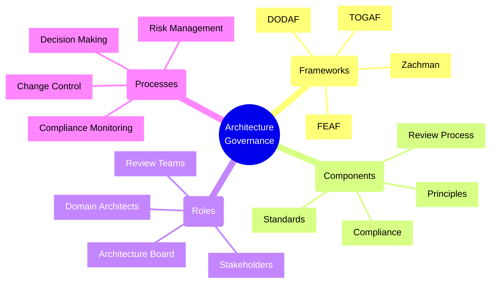
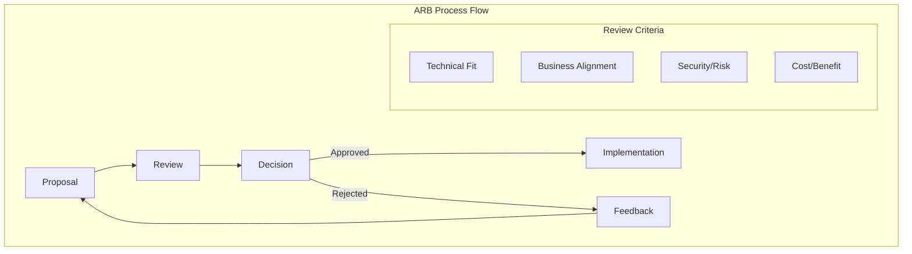
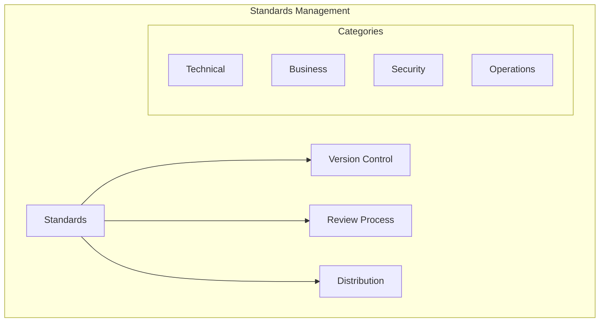
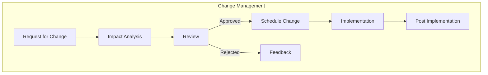
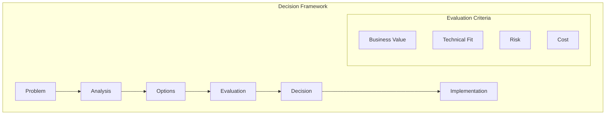
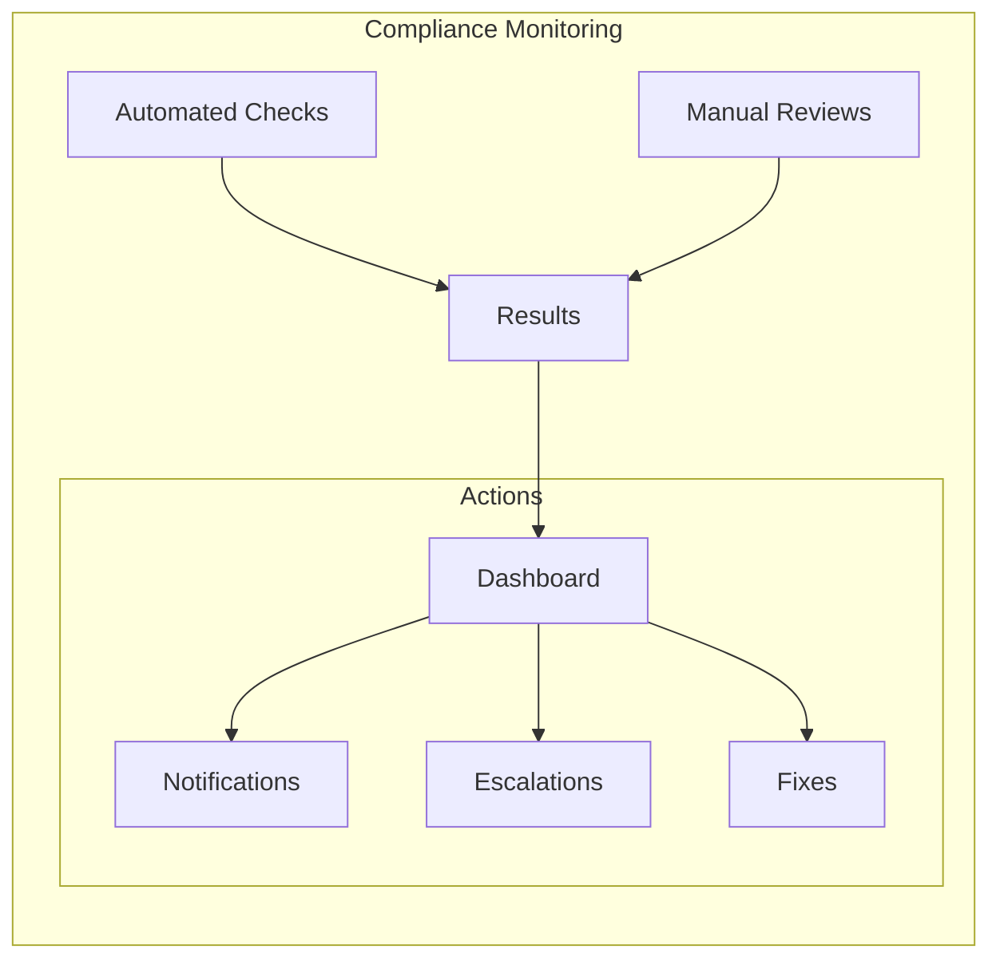

# Architecture Governance Models



## Core Governance Components

### 1. Architecture Review Board (ARB)



Implementation Example:
```typescript
// Architecture review tracking system
interface ArchitectureReview {
    id: string;
    title: string;
    status: ReviewStatus;
    proposal: ProposalDocument;
    reviewers: Reviewer[];
    decisions: Decision[];
    compliance: ComplianceCheck[];
}

class ArchitectureReviewBoard {
    private reviews: Map<string, ArchitectureReview>;
    private standards: ArchitectureStandards;
    
    async reviewProposal(proposal: ProposalDocument): Promise<Decision> {
        const review: ArchitectureReview = {
            id: generateId(),
            title: proposal.title,
            status: 'IN_REVIEW',
            proposal,
            reviewers: await this.assignReviewers(proposal),
            decisions: [],
            compliance: []
        };

        // Check compliance with standards
        const complianceResults = await this.checkCompliance(proposal);
        review.compliance = complianceResults;

        // Gather reviewer decisions
        const decisions = await this.collectReviewerDecisions(review);
        review.decisions = decisions;

        // Make final decision
        const finalDecision = this.makeFinalDecision(decisions, complianceResults);
        
        await this.notifyStakeholders(review, finalDecision);
        return finalDecision;
    }

    private async checkCompliance(proposal: ProposalDocument): Promise<ComplianceCheck[]> {
        return Promise.all([
            this.standards.checkSecurityCompliance(proposal),
            this.standards.checkTechnicalAlignment(proposal),
            this.standards.checkBusinessAlignment(proposal)
        ]);
    }
}
```

### 2. Architecture Standards Management



Implementation Example:
```typescript
// Architecture standards system
class ArchitectureStandards {
    private standards: Map<string, Standard>;
    private versionControl: VersionControl;
    
    async updateStandard(standard: Standard): Promise<void> {
        // Create new version
        const newVersion = await this.versionControl.createVersion({
            standardId: standard.id,
            content: standard,
            author: standard.author,
            timestamp: new Date()
        });

        // Review process
        const reviewResult = await this.reviewStandardUpdate(newVersion);
        
        if (reviewResult.approved) {
            // Publish new version
            await this.publishStandard(newVersion);
            
            // Notify affected teams
            await this.notifyTeams(standard.id, newVersion.version);
        }
    }

    async checkCompliance(proposal: Proposal, standardId: string): Promise<ComplianceResult> {
        const standard = await this.getActiveStandard(standardId);
        const checker = this.getComplianceChecker(standard.type);
        
        return checker.check(proposal, standard);
    }
}

// Standard definition example
const securityStandard: Standard = {
    id: 'SEC-001',
    name: 'API Security Standard',
    version: '2.0',
    type: 'Security',
    requirements: [
        {
            id: 'SEC-001-1',
            name: 'Authentication',
            description: 'All APIs must use OAuth 2.0 with PKCE',
            validation: async (proposal) => {
                // Validation logic
                return {
                    compliant: true,
                    evidence: ['OAuth 2.0 configuration found']
                };
            }
        }
    ]
};
```

### 3. Change Management Process



Implementation Example:
```typescript
// Change management system
class ArchitectureChangeManager {
    private readonly changeRequests: Map<string, ChangeRequest>;
    private readonly impactAnalyzer: ImpactAnalyzer;
    private readonly scheduler: ChangeScheduler;

    async processChangeRequest(request: ChangeRequest): Promise<ChangeResult> {
        // Record change request
        const change = await this.recordChange(request);

        // Perform impact analysis
        const impact = await this.impactAnalyzer.analyzeChange(request);

        if (impact.severity > this.thresholds.highImpact) {
            // Require architecture review
            await this.triggerArchitectureReview(change, impact);
        }

        // Schedule implementation
        const schedule = await this.scheduler.scheduleChange(change, impact);

        return {
            changeId: change.id,
            impact,
            schedule,
            requirements: this.generateRequirements(impact)
        };
    }

    private async recordChange(request: ChangeRequest): Promise<Change> {
        const change: Change = {
            id: generateId(),
            type: request.type,
            description: request.description,
            components: request.affectedComponents,
            status: 'REGISTERED',
            timeline: {
                submitted: new Date(),
                targetCompletion: request.targetDate
            }
        };

        await this.changeRequests.set(change.id, change);
        return change;
    }
}
```

## Governance Implementation

### 1. Decision Making Framework



Implementation Example:
```typescript
// Architecture decision framework
class ArchitectureDecisionFramework {
    async evaluateDecision(
        decision: ArchitectureDecision
    ): Promise<DecisionResult> {
        // Gather evaluation criteria
        const criteria = await this.gatherCriteria(decision.type);
        
        // Evaluate each option
        const evaluations = await Promise.all(
            decision.options.map(option =>
                this.evaluateOption(option, criteria)
            )
        );

        // Calculate scores
        const scores = evaluations.map(eval => ({
            option: eval.option,
            score: this.calculateScore(eval, criteria)
        }));

        // Make recommendation
        const recommendation = this.makeRecommendation(scores);

        return {
            decision: decision.id,
            evaluations,
            scores,
            recommendation,
            rationale: this.generateRationale(recommendation, scores)
        };
    }

    private calculateScore(
        evaluation: OptionEvaluation,
        criteria: EvaluationCriteria[]
    ): number {
        return criteria.reduce((score, criterion) => {
            const weight = criterion.weight;
            const value = evaluation.scores[criterion.id];
            return score + (weight * value);
        }, 0);
    }
}
```

### 2. Compliance Monitoring



Implementation Example:
```typescript
// Architecture compliance monitoring
class ComplianceMonitor {
    private readonly checks: ComplianceCheck[];
    private readonly reporters: ComplianceReporter[];
    
    async runComplianceCheck(): Promise<ComplianceReport> {
        const results = await Promise.all(
            this.checks.map(check => this.runCheck(check))
        );

        const report = this.aggregateResults(results);
        
        // Handle violations
        await this.handleViolations(report.violations);
        
        // Generate reports
        await Promise.all(
            this.reporters.map(reporter =>
                reporter.generateReport(report)
            )
        );

        return report;
    }

    private async handleViolations(
        violations: ComplianceViolation[]
    ): Promise<void> {
        for (const violation of violations) {
            if (violation.severity >= this.thresholds.critical) {
                await this.triggerEscalation(violation);
            }

            if (violation.autoFixable) {
                await this.attemptAutoFix(violation);
            }
        }
    }
}
```

## Best Practices

1. **Governance Structure**
   - Define clear roles and responsibilities
   - Establish review processes
   - Document decision frameworks
   - Maintain standards repository

2. **Process Management**
   - Implement change control
   - Monitor compliance
   - Track architecture decisions
   - Measure governance effectiveness

3. **Communication**
   - Regular stakeholder updates
   - Clear documentation
   - Transparent decision-making
   - Feedback mechanisms

4. **Tools and Automation**
   - Automated compliance checking
   - Documentation management
   - Workflow automation
   - Metrics collection

Remember: Architecture governance is essential for maintaining consistency, quality, and alignment with business objectives. Effective governance balances control with agility to enable innovation while managing risk.