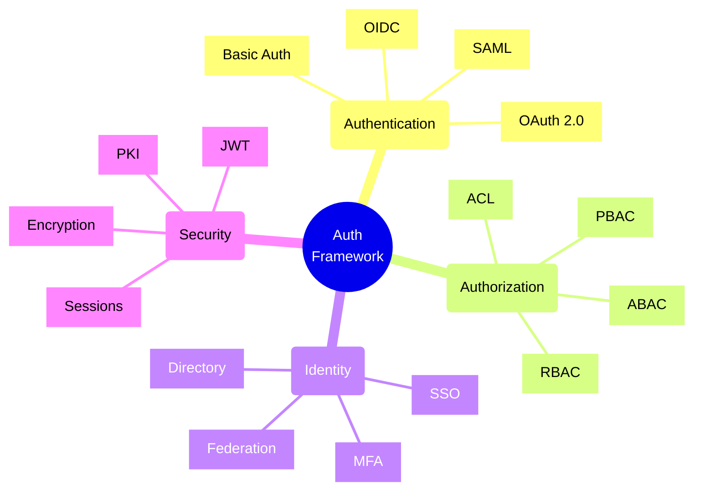
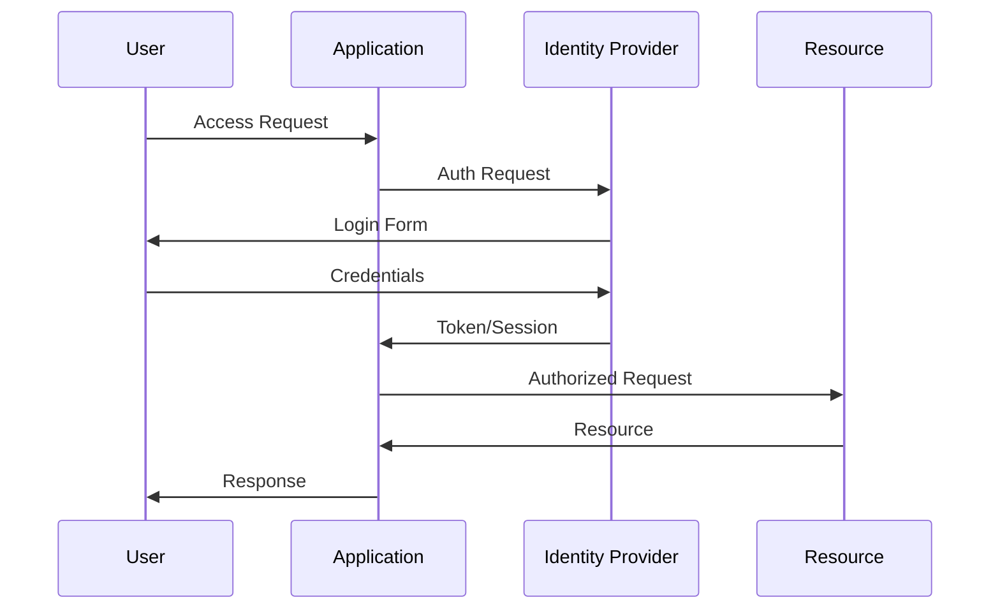
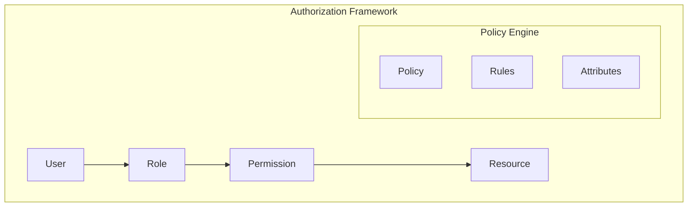

# Authentication and Authorization Frameworks

## Core Components

### 1. Authentication Flow

### 2. Authorization Model

## Implementation Checklist

### Authentication Setup
- [ ] Configure identity provider
- [ ] Set up MFA
- [ ] Implement password policies
- [ ] Configure session management
- [ ] Set up social auth (if needed)
- [ ] Implement rate limiting
- [ ] Configure account lockout
- [ ] Set up password recovery
- [ ] Enable audit logging

### Authorization Framework
- [ ] Define roles and permissions
- [ ] Implement RBAC/ABAC
- [ ] Set up policy engine
- [ ] Configure access controls
- [ ] Implement token validation
- [ ] Set up API authorization
- [ ] Configure resource policies
- [ ] Enable policy audit
- [ ] Test authorization rules

### Security Configuration
- [ ] Enable SSL/TLS
- [ ] Configure token security
- [ ] Set up key management 
- [ ] Implement CORS
- [ ] Configure CSP
- [ ] Set up WAF
- [ ] Enable security headers
- [ ] Configure session security
- [ ] Regular security reviews

### Operations Setup
- [ ] Configure monitoring
- [ ] Set up alerting
- [ ] Implement logging
- [ ] Configure backups
- [ ] Set up DR procedures
- [ ] Enable audit trails
- [ ] Configure reporting
- [ ] Test recovery procedures
- [ ] Regular maintenance

## Trade-offs

### Security vs. Usability
- **High Security**
  - Pros:
    * Better protection
    * Reduced risk
    * Compliance adherence
  - Cons:
    * User friction
    * More complexity
    * Higher support needs

### Centralized vs. Decentralized
- **Centralized Auth**
  - Pros:
    * Easier management
    * Consistent policy
    * Better control
  - Cons:
    * Single point of failure
    * Higher impact on issues
    * Potential bottleneck

### Session vs. Token
- **Token-based**
  - Pros:
    * Stateless
    * Better scalability
    * More flexibility
  - Cons:
    * Token size
    * Revocation challenges
    * More complexity

### Custom vs. Standard
- **Standard Solutions**
  - Pros:
    * Proven security
    * Better interoperability
    * More documentation
  - Cons:
    * Less flexibility
    * Feature limitations
    * Dependency risks

## Best Practices

1. **Authentication**
   - Use MFA
   - Strong password policy
   - Secure session management
   - Rate limiting
   - Account recovery
   - Audit logging
   - Regular reviews

2. **Authorization**
   - Least privilege
   - Role-based access
   - Regular audits
   - Policy documentation
   - Access reviews
   - Monitor changes
   - Test policies

3. **Security**
   - TLS everywhere
   - Secure storage
   - Token protection
   - Key management
   - Regular updates
   - Security testing
   - Compliance checks

4. **Operations**
   - Monitor access
   - Alert on issues
   - Log security events
   - Regular backups
   - DR testing
   - Team training
   - Documentation

## Security Controls Matrix

| Control | Implementation | Monitoring | Review Frequency |
|---------|----------------|------------|-----------------|
| Authentication | MFA + Password | Real-time | Daily |
| Authorization | RBAC + ABAC | Real-time | Weekly |
| Session | Token + Timeout | Real-time | Daily |
| Access Control | Policy-based | Real-time | Weekly |
| Encryption | TLS 1.3 + AES | Daily | Monthly |
| Audit | Full logging | Real-time | Weekly |

## Common Attack Vectors

1. **Authentication Attacks**
   - Brute force
   - Credential stuffing
   - Password spraying
   - Session hijacking
   - Token theft

2. **Authorization Attacks**
   - Privilege escalation
   - Insecure direct object references
   - Missing function level access control
   - Unauthorized API access

3. **Infrastructure Attacks**
   - Man-in-the-middle
   - SSL stripping
   - DNS hijacking
   - DDoS

4. **Application Attacks**
   - XSS
   - CSRF
   - Injection
   - Parameter tampering

Remember: Security is a continuous process. Regularly review and update your authentication and authorization frameworks to address new threats and maintain strong security posture.