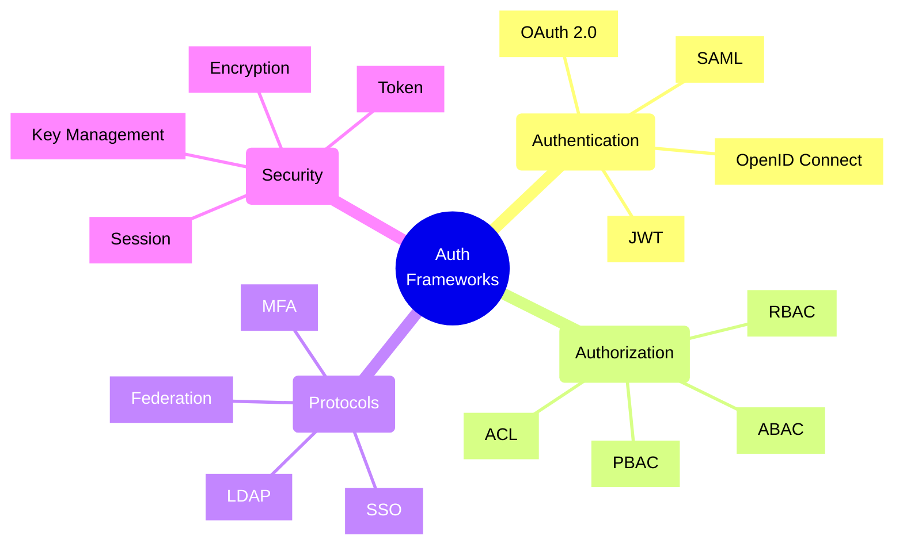
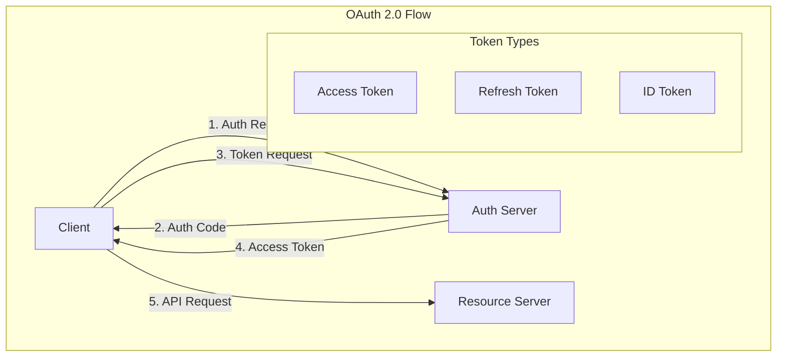
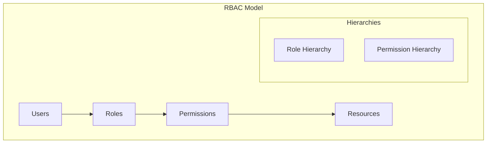
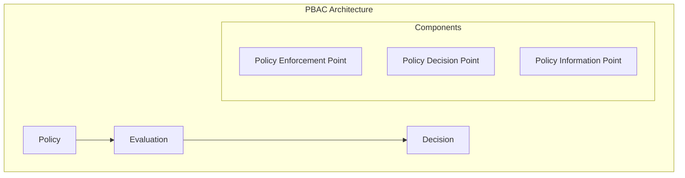

# Authentication and Authorization Frameworks



## Authentication Frameworks

### 1. OAuth 2.0 + OpenID Connect



Implementation Example:
```typescript
// OAuth2 client implementation
class OAuth2Client {
    constructor(
        private config: OAuth2Config,
        private storage: TokenStorage,
        private httpClient: HTTPClient
    ) {}

    async authenticate(): Promise<TokenSet> {
        // Generate PKCE challenge
        const codeVerifier = this.generateCodeVerifier();
        const codeChallenge = await this.generateCodeChallenge(
            codeVerifier
        );

        // Build authorization URL
        const authUrl = this.buildAuthorizationUrl({
            client_id: this.config.clientId,
            redirect_uri: this.config.redirectUri,
            response_type: 'code',
            scope: this.config.scope,
            code_challenge: codeChallenge,
            code_challenge_method: 'S256',
            state: this.generateState()
        });

        // Handle authorization response
        const authCode = await this.handleAuthorizationResponse();

        // Exchange code for tokens
        const tokens = await this.exchangeCode(
            authCode,
            codeVerifier
        );

        // Store tokens securely
        await this.storage.storeTokens(tokens);

        return tokens;
    }

    async refreshTokens(): Promise<TokenSet> {
        const tokens = await this.storage.getTokens();
        if (!tokens.refreshToken) {
            throw new NoRefreshTokenError();
        }

        const newTokens = await this.exchangeRefreshToken(
            tokens.refreshToken
        );

        await this.storage.storeTokens(newTokens);
        return newTokens;
    }

    private async exchangeCode(
        code: string,
        codeVerifier: string
    ): Promise<TokenSet> {
        const response = await this.httpClient.post(
            this.config.tokenEndpoint,
            {
                grant_type: 'authorization_code',
                code,
                client_id: this.config.clientId,
                client_secret: this.config.clientSecret,
                redirect_uri: this.config.redirectUri,
                code_verifier: codeVerifier
            }
        );

        return this.validateTokenResponse(response);
    }
}

// OpenID Connect client
class OpenIDConnectClient extends OAuth2Client {
    async authenticateWithOIDC(): Promise<OIDCTokenSet> {
        const tokens = await super.authenticate();
        
        // Validate ID Token
        if (!tokens.idToken) {
            throw new MissingIDTokenError();
        }

        const claims = await this.validateIDToken(tokens.idToken);
        
        return {
            ...tokens,
            claims
        };
    }

    private async validateIDToken(
        idToken: string
    ): Promise<IDTokenClaims> {
        const jwks = await this.fetchJWKS();
        const decoded = await this.verifyJWT(idToken, jwks);
        
        // Validate claims
        this.validateClaims(decoded);
        
        return decoded;
    }
}
```

### 2. Role-Based Access Control (RBAC)



Implementation Example:
```typescript
// RBAC implementation
class RBACService {
    constructor(
        private roleRepository: RoleRepository,
        private permissionRepository: PermissionRepository,
        private cache: CacheService
    ) {}

    async hasPermission(
        userId: string,
        permission: Permission,
        resource: Resource
    ): Promise<boolean> {
        // Check cache first
        const cacheKey = this.buildCacheKey(
            userId,
            permission,
            resource
        );
        const cached = await this.cache.get(cacheKey);
        if (cached !== undefined) {
            return cached;
        }

        // Get user roles
        const roles = await this.roleRepository
            .getRolesForUser(userId);

        // Check permissions including role hierarchy
        const hasPermission = await this.checkRolePermissions(
            roles,
            permission,
            resource
        );

        // Cache result
        await this.cache.set(
            cacheKey,
            hasPermission,
            this.cache.TTL.PERMISSIONS
        );

        return hasPermission;
    }

    async grantRole(
        userId: string,
        roleId: string
    ): Promise<void> {
        await this.roleRepository.assignRole(userId, roleId);
        await this.invalidateUserPermissionCache(userId);
    }

    async revokeRole(
        userId: string,
        roleId: string
    ): Promise<void> {
        await this.roleRepository.removeRole(userId, roleId);
        await this.invalidateUserPermissionCache(userId);
    }

    private async checkRolePermissions(
        roles: Role[],
        permission: Permission,
        resource: Resource
    ): Promise<boolean> {
        // Include inherited roles
        const allRoles = await this.getAllInheritedRoles(roles);
        
        // Check permissions
        for (const role of allRoles) {
            if (await this.roleHasPermission(
                role,
                permission,
                resource
            )) {
                return true;
            }
        }

        return false;
    }
}
```

### 3. Policy-Based Access Control (PBAC)



Implementation Example:
```typescript
// PBAC implementation
class PolicyService {
    constructor(
        private policyRepository: PolicyRepository,
        private policyEvaluator: PolicyEvaluator,
        private contextProvider: ContextProvider
    ) {}

    async evaluateAccess(
        subject: Subject,
        action: Action,
        resource: Resource
    ): Promise<Decision> {
        // Get applicable policies
        const policies = await this.policyRepository
            .getPoliciesFor(resource.type);

        // Get evaluation context
        const context = await this.contextProvider
            .getContext(subject, resource);

        // Evaluate all applicable policies
        const decisions = await Promise.all(
            policies.map(policy =>
                this.evaluatePolicy(policy, {
                    subject,
                    action,
                    resource,
                    context
                })
            )
        );

        // Combine decisions according to combination algorithm
        return this.combineDecisions(decisions);
    }

    private async evaluatePolicy(
        policy: Policy,
        data: EvaluationData
    ): Promise<Decision> {
        try {
            // Evaluate conditions
            const conditions = await Promise.all(
                policy.conditions.map(condition =>
                    this.policyEvaluator.evaluateCondition(
                        condition,
                        data
                    )
                )
            );

            // Check if all conditions are met
            const allow = conditions.every(result => result);

            return {
                effect: allow ? 'ALLOW' : 'DENY',
                policy: policy.id,
                reason: allow ? 
                    'All conditions satisfied' : 
                    'Conditions not met'
            };
        } catch (error) {
            return {
                effect: 'DENY',
                policy: policy.id,
                reason: 'Error evaluating policy'
            };
        }
    }
}
```

## Security Best Practices

1. **Authentication**
   - Implement MFA
   - Use secure protocols
   - Handle sessions securely
   - Protect credentials

2. **Authorization**
   - Follow least privilege
   - Implement role hierarchy
   - Use fine-grained permissions
   - Audit access

3. **Token Management**
   - Secure token storage
   - Handle token expiration
   - Implement refresh flows
   - Revoke compromised tokens

4. **Security Controls**
   - Rate limiting
   - Input validation
   - Audit logging
   - Error handling

Remember: Authentication and authorization are foundational security components. Always follow security best practices and regularly update your security measures to protect against new threats.