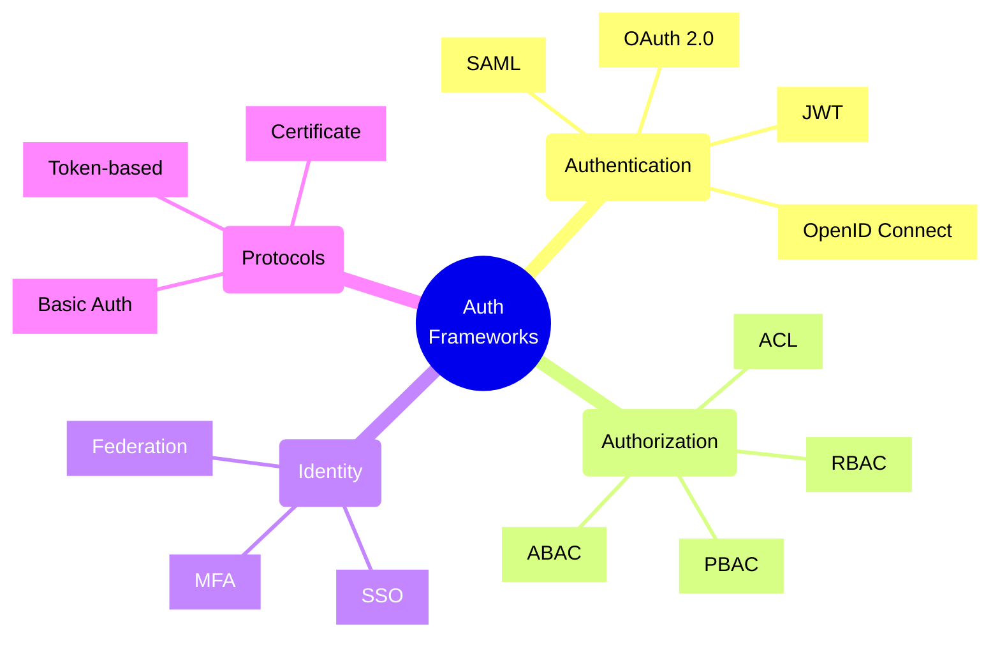
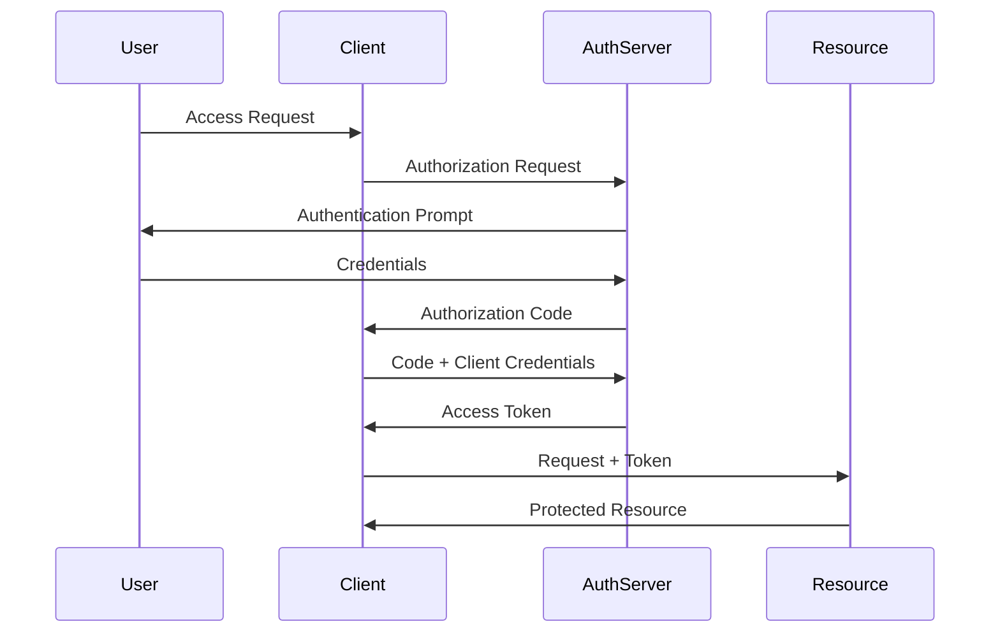
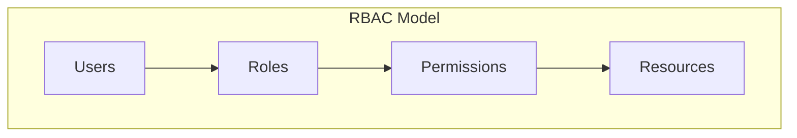
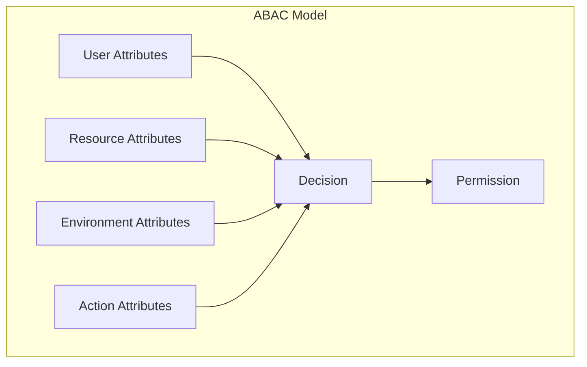
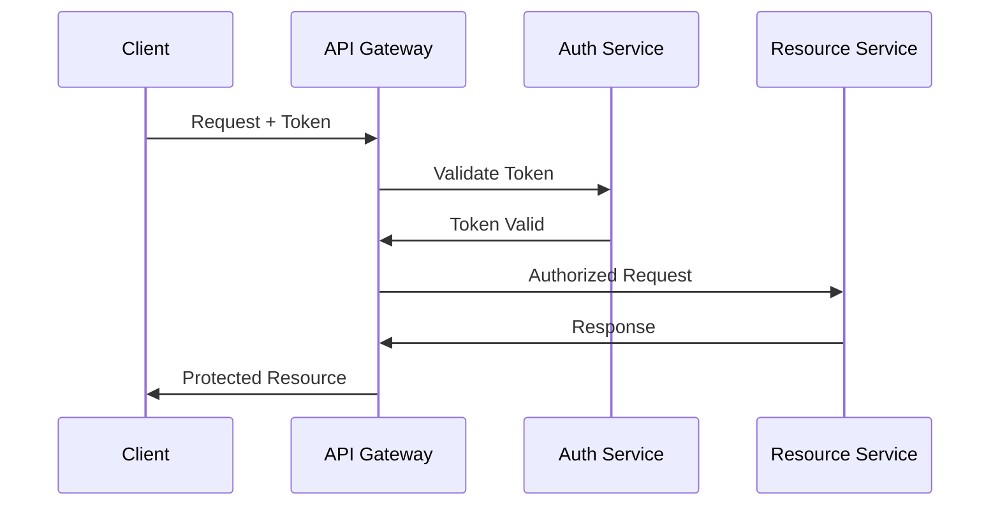
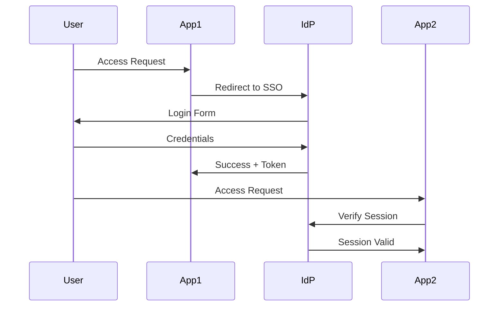

# Authentication and Authorization Frameworks



## Common Authentication Frameworks

### 1. OAuth 2.0
- Industry standard for authorization
- Provides delegated access
- Multiple grant types
- Token-based security



### 2. OpenID Connect
- Authentication layer on top of OAuth 2.0
- Provides user identity verification
- Standard claims about user
- Single sign-on (SSO) support

### 3. SAML (Security Assertion Markup Language)
- XML-based standard
- Enterprise SSO solution
- Federation capabilities
- Rich attribute support

## Authorization Models

### 1. Role-Based Access Control (RBAC)



### 2. Attribute-Based Access Control (ABAC)



## Implementation Patterns

### 1. Token-Based Authentication
```typescript
interface TokenService {
    generateToken(user: User): string;
    verifyToken(token: string): boolean;
    refreshToken(token: string): string;
}

class JWTService implements TokenService {
    private readonly secret: string;

    constructor(secret: string) {
        this.secret = secret;
    }

    generateToken(user: User): string {
        return jwt.sign({ userId: user.id, roles: user.roles }, this.secret, {
            expiresIn: '1h'
        });
    }
}
```

### 2. Authorization Middleware
```typescript
class AuthorizationMiddleware {
    constructor(private rbacService: RBACService) {}

    async checkPermission(user: User, resource: string, action: string): Promise<boolean> {
        const roles = user.roles;
        return await this.rbacService.hasPermission(roles, resource, action);
    }
}
```

## Security Best Practices

1. **Token Security**
   - Use secure token storage
   - Implement token expiration
   - Rotate refresh tokens
   - Validate token signatures

2. **Authentication Best Practices**
   - Implement MFA where possible
   - Use strong password policies
   - Rate limit authentication attempts
   - Secure session management

3. **Authorization Guidelines**
   - Follow principle of least privilege
   - Regular permission audits
   - Fine-grained access control
   - Role hierarchy management

4. **General Security**
   - Use HTTPS everywhere
   - Secure cookie configuration
   - CSRF protection
   - XSS prevention

## Common Implementation Scenarios

### 1. API Security


### 2. Single Sign-On


## Framework Selection Guide

Consider these factors when choosing an auth framework:

1. **Scale and Complexity**
   - User base size
   - Geographic distribution
   - Integration requirements
   - Performance needs

2. **Security Requirements**
   - Compliance needs
   - Risk profile
   - Data sensitivity
   - Audit requirements

3. **Technical Constraints**
   - Existing infrastructure
   - Team expertise
   - Integration points
   - Performance requirements

4. **Business Needs**
   - Time to market
   - Cost considerations
   - Maintenance overhead
   - Future scalability

Remember: Authentication and authorization are critical security components. Always follow security best practices and keep frameworks updated to protect against emerging threats.