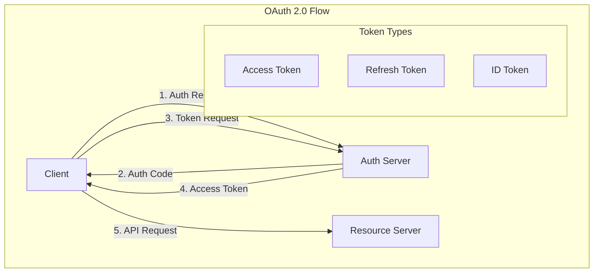
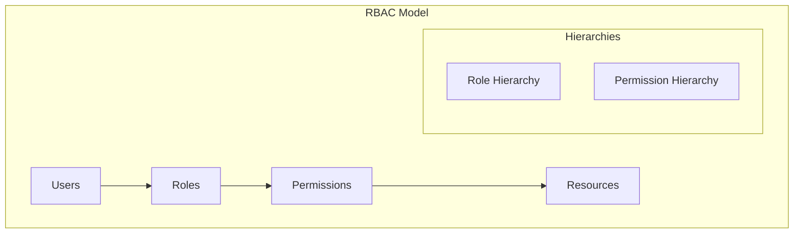
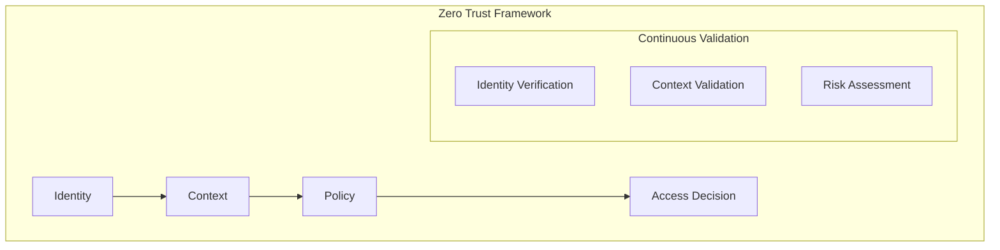

# Authentication and Authorization Frameworks

## Authentication Frameworks

### 1. OAuth 2.0 + OpenID Connect

#### Key Components
- Authorization Server
- Resource Server
- Client Application
- Resource Owner
- Identity Provider

#### Flow Types
1. Authorization Code Flow
   - Most secure for web applications
   - Supports refresh tokens
   - Backend token storage

2. Implicit Flow
   - Legacy flow for SPAs
   - No refresh tokens
   - Less secure

3. Client Credentials
   - Service-to-service
   - No user interaction
   - Machine-to-machine

### 2. Role-Based Access Control (RBAC)

#### Components
1. **Users**
   - Individual actors
   - Service accounts
   - External systems

2. **Roles**
   - Collections of permissions
   - Hierarchical structure
   - Business functions

3. **Permissions**
   - Granular access rights
   - Resource-specific
   - Action-based

4. **Resources**
   - Protected assets
   - API endpoints
   - Data objects

### 3. Zero Trust Authentication

#### Principles
1. **Always Verify**
   - No implicit trust
   - Continuous authentication
   - Context-aware

2. **Least Privilege**
   - Minimal access rights
   - Time-bound access
   - Just-in-time privilege

3. **Device Trust**
   - Device health
   - Compliance status
   - Risk assessment

## Best Practices

### 1. Security
- Use strong authentication methods
- Implement MFA where possible
- Secure token storage
- Regular access reviews

### 2. User Experience
- Minimize authentication steps
- Clear error messages
- Self-service capabilities
- Session management

### 3. Operations
- Monitoring and alerting
- Audit logging
- Performance optimization
- Scalability planning

### 4. Compliance
- Data protection
- Privacy regulations
- Industry standards
- Regular audits

## Decision Framework

| Factor | Consideration | Example Use Case |
|--------|---------------|------------------|
| User Type | Internal/External | Employee Portal |
| Security Level | Low/Medium/High | Financial Data |
| Integration | Single/Multiple IdPs | B2B Platform |
| Compliance | Regulations | Healthcare System |
| Scale | User Volume | Public API |

Remember: Authentication and authorization should be treated as foundational architectural components, not just implementation details.