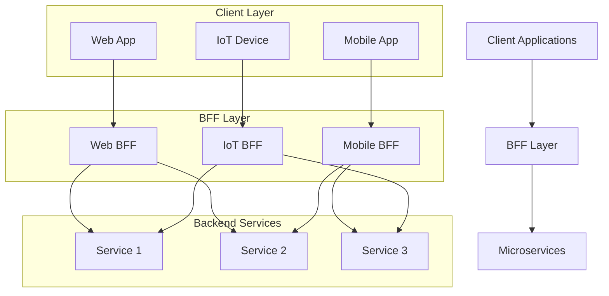
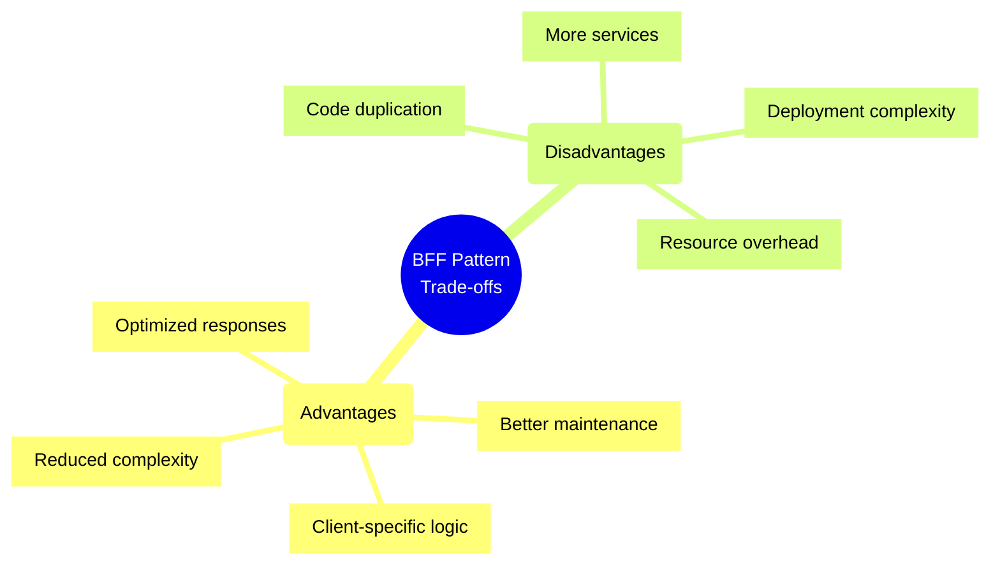
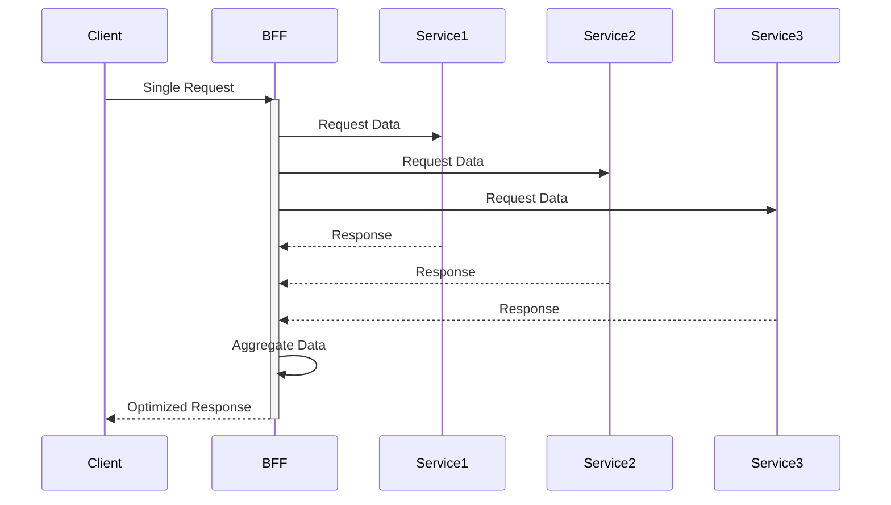
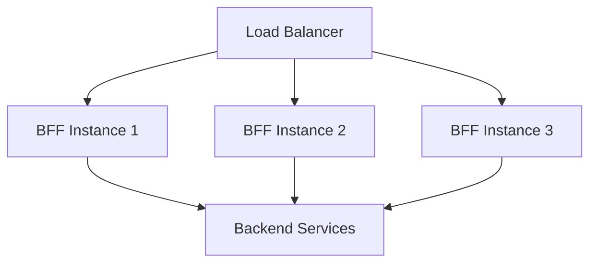
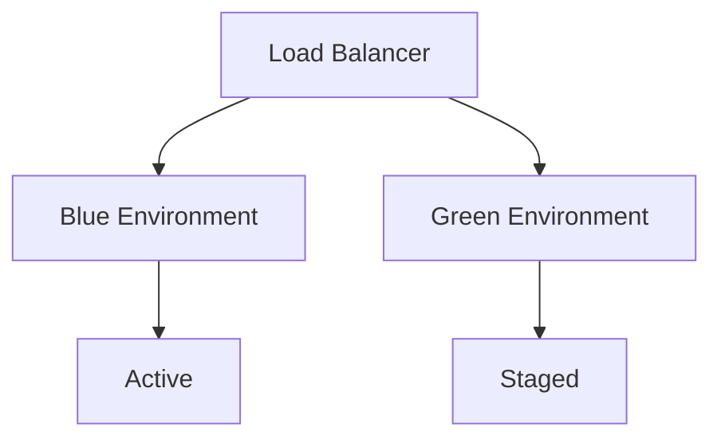
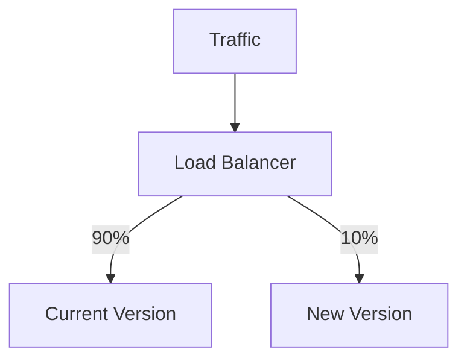

# Backend for Frontend (BFF) Pattern

## Overview
The Backend for Frontend (BFF) pattern is an architectural pattern where separate backend services are created for specific frontend applications or interfaces.



## Key Characteristics
- Frontend-specific backends
- Optimized data transfer
- Simplified client logic
- Improved maintainability
- Better separation of concerns

## Best Practices Checklist

### Architecture Design
- [ ] Identify client-specific needs
- [ ] Define clear boundaries
- [ ] Plan API contracts
- [ ] Consider scaling strategy
- [ ] Design for resilience

### Development
- [ ] Use consistent patterns
- [ ] Implement proper error handling
- [ ] Add comprehensive logging
- [ ] Include monitoring
- [ ] Document APIs

### Operations
- [ ] Monitor performance
- [ ] Track usage metrics
- [ ] Plan scaling rules
- [ ] Set up alerts
- [ ] Define SLAs

## Trade-offs Analysis



## Implementation Examples

### Basic BFF Structure
```typescript
// Web BFF
class WebBFF {
  async getProductDetails(id: string) {
    const product = await productService.get(id);
    const reviews = await reviewService.getForProduct(id);
    const images = await imageService.getHighRes(id);
    
    return {
      ...product,
      reviews,
      images
    };
  }
}

// Mobile BFF
class MobileBFF {
  async getProductDetails(id: string) {
    const product = await productService.get(id);
    const reviews = await reviewService.getForProduct(id);
    const images = await imageService.getLowRes(id);
    
    return {
      id: product.id,
      name: product.name,
      price: product.price,
      thumbnail: images[0],
      reviewCount: reviews.length
    };
  }
}
```

## Common Patterns

### Request Aggregation


### Response Transformation
```typescript
interface BackendProduct {
  id: string;
  name: string;
  description: string;
  price: number;
  inventory: number;
  metadata: Record<string, unknown>;
}

interface WebProduct {
  id: string;
  name: string;
  description: string;
  price: string; // Formatted
  availability: boolean;
  details: string[];
}

class ProductTransformer {
  toWeb(product: BackendProduct): WebProduct {
    return {
      id: product.id,
      name: product.name,
      description: product.description,
      price: formatPrice(product.price),
      availability: product.inventory > 0,
      details: extractDetails(product.metadata)
    };
  }
}
```

## Performance Considerations

### Caching Strategy
```typescript
class CachedBFF {
  private cache: Cache;
  
  async getProductDetails(id: string) {
    const cacheKey = `product:${id}`;
    const cached = await this.cache.get(cacheKey);
    
    if (cached) {
      return cached;
    }
    
    const data = await this.fetchProductDetails(id);
    await this.cache.set(cacheKey, data, '1h');
    return data;
  }
}
```

### Load Balancing


## Security Considerations

### Authentication
```typescript
class SecureBFF {
  async authenticate(req: Request) {
    const token = req.headers.authorization;
    if (!token) {
      throw new UnauthorizedError();
    }
    
    const user = await this.authService.verify(token);
    return user;
  }
  
  async getProtectedResource(req: Request) {
    const user = await this.authenticate(req);
    // Fetch and return resource
  }
}
```

### Rate Limiting
```typescript
import rateLimit from 'express-rate-limit';

const limiter = rateLimit({
  windowMs: 15 * 60 * 1000, // 15 minutes
  max: 100 // limit each IP to 100 requests per windowMs
});

app.use('/api/', limiter);
```

## Monitoring and Observability

### Metrics Collection
```typescript
class MonitoredBFF {
  private metrics: MetricsClient;
  
  async handleRequest(req: Request) {
    const start = Date.now();
    try {
      const result = await this.processRequest(req);
      this.metrics.recordSuccess('request', Date.now() - start);
      return result;
    } catch (error) {
      this.metrics.recordError('request', error);
      throw error;
    }
  }
}
```

### Health Checks
```typescript
class HealthCheck {
  async check() {
    return {
      status: 'healthy',
      dependencies: {
        database: await this.checkDatabase(),
        cache: await this.checkCache(),
        services: await this.checkServices()
      }
    };
  }
}
```

## Deployment Strategies

### Blue-Green Deployment


### Canary Release


## Testing Strategies

### Integration Testing
```typescript
describe('Product BFF', () => {
  it('should aggregate product data', async () => {
    const bff = new ProductBFF();
    const result = await bff.getProductDetails('123');
    
    expect(result).toHaveProperty('product');
    expect(result).toHaveProperty('reviews');
    expect(result).toHaveProperty('images');
  });
});
```

## Best Practices Examples

### Error Handling
```typescript
class ErrorHandling {
  async handleError(error: Error) {
    if (error instanceof ServiceUnavailableError) {
      return this.handleServiceUnavailable(error);
    }
    
    if (error instanceof ValidationError) {
      return this.handleValidationError(error);
    }
    
    // Log unexpected errors
    logger.error('Unexpected error', error);
    throw new InternalServerError();
  }
}
```

### Circuit Breaking
```typescript
class CircuitBreaker {
  private failures = 0;
  private lastFailure: Date | null = null;
  
  async call(service: () => Promise<any>) {
    if (this.isOpen()) {
      throw new CircuitBreakerError();
    }
    
    try {
      const result = await service();
      this.reset();
      return result;
    } catch (error) {
      this.recordFailure();
      throw error;
    }
  }
}
```

## Additional Resources
1. Documentation
   - [Pattern & Practices](https://microservices.io/patterns/apigateway.html)
   - [Martin Fowler's Blog](https://martinfowler.com/articles/gateway-pattern.html)
   - [Sam Newman's Building Microservices](https://samnewman.io/books/building_microservices/)

2. Learning Resources
   - API Design Best Practices
   - Microservices Architecture
   - Frontend Architecture
   - Performance Optimization