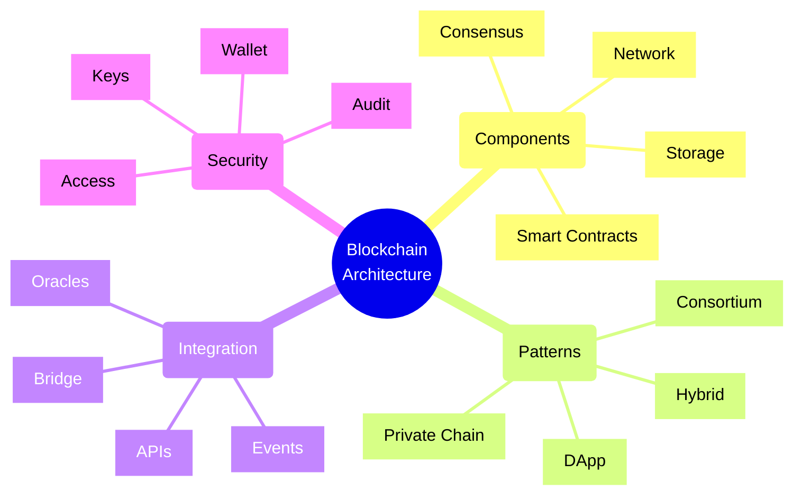
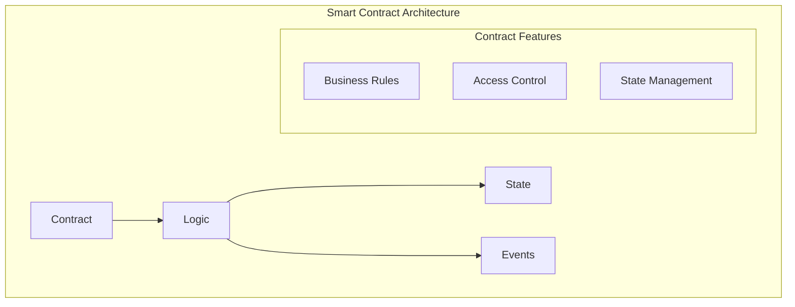
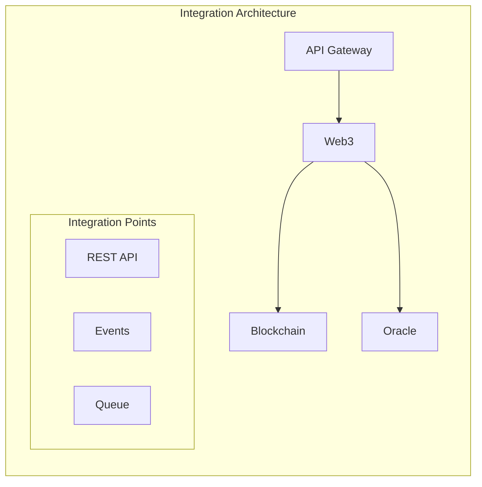

# Blockchain Application Patterns



## Core Architecture Components

### 1. Smart Contract Layer



### 2. Integration Layer



## Implementation Patterns

### 1. DApp Architecture Pattern
```typescript
interface BlockchainConfig {
    network: Network;
    contract: Contract;
    wallet: Wallet;
    provider: Provider;
}

class DAppService {
    constructor(
        private config: BlockchainConfig,
        private web3Service: Web3Service,
        private eventService: EventService
    ) {}

    async executeTransaction(tx: Transaction): Promise<Receipt> {
        // Validate transaction
        await this.validateTransaction(tx);
        
        // Sign and send
        const signed = await this.config.wallet.signTransaction(tx);
        const receipt = await this.config.provider.sendTransaction(signed);
        
        // Handle events
        await this.handleEvents(receipt);
        
        return receipt;
    }
}
```

### 2. Hybrid Architecture Pattern
```typescript
interface HybridArchitecture {
    onChain: {
        proofs: ProofStorage;
        state: StateContract;
        access: AccessControl;
    };
    offChain: {
        database: Database;
        cache: Cache;
        api: API;
    };
}

class HybridService {
    constructor(
        private blockchain: BlockchainService,
        private database: DatabaseService,
        private syncService: SyncService
    ) {}

    async processTransaction(tx: Transaction): Promise<void> {
        // Store proof on chain
        const proof = await this.createProof(tx);
        await this.blockchain.storeProof(proof);
        
        // Store data off chain
        await this.database.storeData(tx.data);
        
        // Sync state
        await this.syncService.syncState({
            proof,
            data: tx.data
        });
    }
}
```

## Common Patterns

### 1. Data Management
- On-chain storage
- Off-chain storage
- IPFS integration
- State management
- Data validation
- Proof storage

### 2. Access Control
- Role-based access
- Token-based access
- Multi-signature
- Time locks
- Emergency stops
- Upgradability

### 3. Integration
- Oracle integration
- API endpoints
- Event handling
- Bridge patterns
- State channels
- Layer 2 scaling

### 4. Security
- Wallet management
- Key storage
- Access control
- Audit logging
- Vulnerability scanning
- Upgrade patterns

## Implementation Framework

### Smart Contract Layer
| Component | Purpose | Pattern | Security |
|-----------|---------|----------|-----------|
| Logic | Business rules | Modular | Access control |
| State | Data storage | Minimal | State validation |
| Events | Notifications | Standard | Event filtering |
| Access | Permissions | RBAC | Multi-sig |

### Integration Patterns
| Pattern | Use Case | Pros | Cons |
|---------|----------|------|------|
| Direct Chain | Simple dApps | Trustless | High latency |
| Hybrid | Enterprise | Scalable | Complexity |
| Layer 2 | High volume | Performance | Setup cost |
| State Channel | Frequent tx | Speed | Limited scope |

## Azure Blockchain Implementation

### 1. Core Services
- Azure Blockchain Service (Ethereum)
- Azure Confidential Ledger
- Key Vault for key management
- Event Grid for events
- Logic Apps for workflows

### 2. Integration Services
- API Management
- Event Hub
- Service Bus
- Azure Functions
- Storage accounts

### 3. Development Tools
- VS Code extensions
- Truffle integration
- Hardhat support
- Testing frameworks
- Monitoring tools

## Best Practices

### 1. Smart Contract Design
- Minimize storage
- Optimize gas usage
- Use events wisely
- Implement security
- Plan upgrades
- Handle errors
- Test thoroughly

### 2. Architecture Design
- Choose right chain
- Plan for scale
- Handle privacy
- Manage keys
- Monitor performance
- Document patterns
- Audit security

### 3. Operations
- Monitor transactions
- Track gas costs
- Handle upgrades
- Manage access
- Backup keys
- Audit changes
- Test security

Remember:
- Security first
- Gas efficiency
- Proper testing
- Key management
- Event handling
- Documentation
- Regular audits