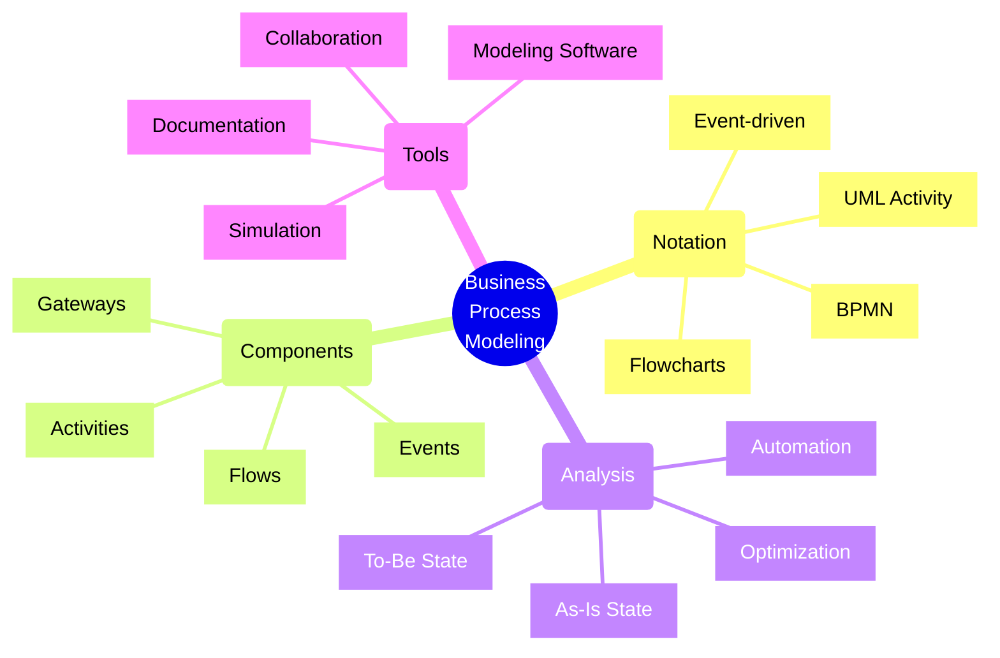
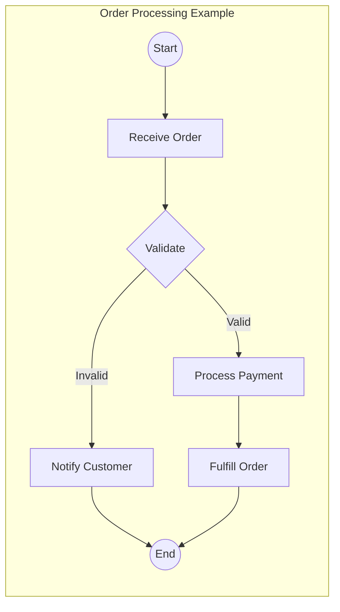
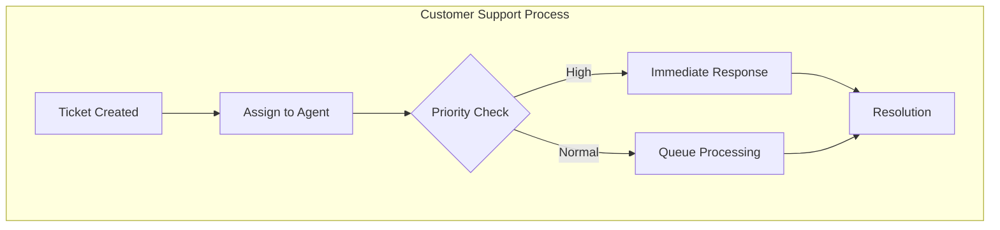
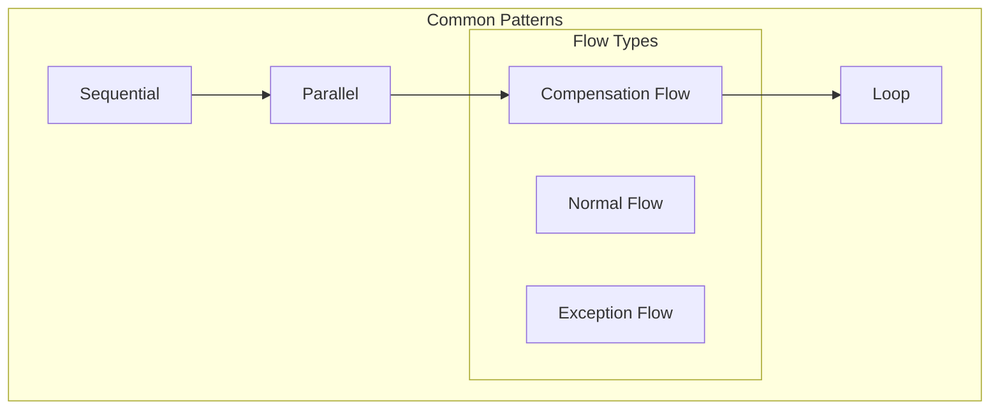

# Business Process Modeling

## Core Concepts Overview



## Process Modeling Framework

### 1. BPMN (Business Process Model and Notation)



### 2. Event-Driven Process Chain



## Implementation Examples

### 1. Order Processing Workflow
```typescript
interface OrderWorkflow {
    readonly steps: WorkflowStep[];
    readonly status: WorkflowStatus;
    
    start(): Promise<void>;
    proceed(): Promise<void>;
    rollback(): Promise<void>;
}

class ECommerceOrderWorkflow implements OrderWorkflow {
    constructor(
        private orderService: OrderService,
        private paymentService: PaymentService,
        private inventoryService: InventoryService,
        private notificationService: NotificationService
    ) {}

    async start(): Promise<void> {
        // Initialize workflow
        await this.validateOrder();
        await this.processPayment();
        await this.reserveInventory();
        await this.notifyCustomer();
    }

    private async validateOrder(): Promise<void> {
        // Validation logic
        const validation = await this.orderService.validate(this.orderId);
        if (!validation.isValid) {
            throw new InvalidOrderError(validation.errors);
        }
    }
}
```

### 2. Service Request Handling
```typescript
interface ServiceRequest {
    readonly id: string;
    readonly type: RequestType;
    readonly priority: Priority;
    readonly status: RequestStatus;
    readonly assignee?: string;
}

class ServiceRequestWorkflow {
    constructor(
        private requestService: RequestService,
        private assignmentService: AssignmentService,
        private slaService: SLAService
    ) {}

    async processRequest(request: ServiceRequest): Promise<void> {
        // Determine routing
        const routing = await this.determineRouting(request);
        
        // Check SLA requirements
        const sla = await this.slaService.getSLA(request.type);
        
        // Assign based on routing and SLA
        await this.assignmentService.assign({
            requestId: request.id,
            routing,
            sla,
            priority: request.priority
        });
    }
}
```

## Modeling Types

### 1. Process Flow Diagrams
- Sequential activities
- Decision points
- Parallel processes
- Events and triggers
- System boundaries
- Actor interactions

### 2. Activity Diagrams
- Work breakdown
- System actions
- User actions
- State transitions
- Exception flows
- Synchronization points

### 3. State Machines
- Status definitions
- State transitions
- Guards and conditions
- Entry/exit actions
- Composite states
- History states

## Implementation Checklist

### Analysis Phase
- [ ] Identify stakeholders
- [ ] Document current process
- [ ] Identify pain points
- [ ] Define objectives
- [ ] Gather requirements
- [ ] Set success metrics

### Design Phase
- [ ] Model current state
- [ ] Design future state
- [ ] Define transitions
- [ ] Plan automation
- [ ] Create documentation
- [ ] Review with stakeholders

### Implementation Phase
- [ ] Develop workflows
- [ ] Configure systems
- [ ] Set up monitoring
- [ ] Train users
- [ ] Document procedures
- [ ] Plan rollout

## Best Practices

### 1. Process Analysis
- Start with high-level view
- Document assumptions
- Include all stakeholders
- Validate with users
- Consider exceptions
- Plan for changes

### 2. Modeling Techniques
- Use standard notation
- Keep diagrams clear
- Show decision points
- Include timeframes
- Document roles
- Show dependencies

### 3. Implementation
- Start small
- Validate early
- Monitor metrics
- Gather feedback
- Iterate improvements
- Document changes

## Process Framework

| Component | Purpose | Tools | Best Practices |
|-----------|---------|-------|----------------|
| Analysis | Current state | Interviews, Observation | Document everything |
| Design | Future state | BPMN, UML | Keep it simple |
| Simulation | Validation | Process simulators | Test scenarios |
| Implementation | Execution | Workflow engines | Incremental rollout |

## Process Patterns



## Common Scenarios

### 1. Order Processing
- Order placement
- Validation
- Payment processing
- Inventory check
- Fulfillment
- Shipping
- Notifications

### 2. Service Management
- Ticket creation
- Classification
- Assignment
- Resolution
- Verification
- Closure
- Feedback

### 3. Document Approval
- Submission
- Initial review
- Revisions
- Approvals
- Publication
- Distribution
- Archival

## Modeling Tools

### 1. Design Tools
- Visio
- Draw.io
- Lucidchart
- BPMN.io
- Enterprise Architect
- Bizagi

### 2. Analysis Tools
- Process mining tools
- Simulation software
- Performance analyzers
- Bottleneck detectors
- Cost calculators
- Time analyzers

### 3. Implementation Tools
- Workflow engines
- BPM suites
- Integration platforms
- Monitoring tools
- Documentation systems
- Collaboration platforms

Remember:
- Start with understanding
- Keep models simple
- Validate with stakeholders
- Plan for exceptions
- Monitor and measure
- Continuously improve
- Document everything
- Train users properly