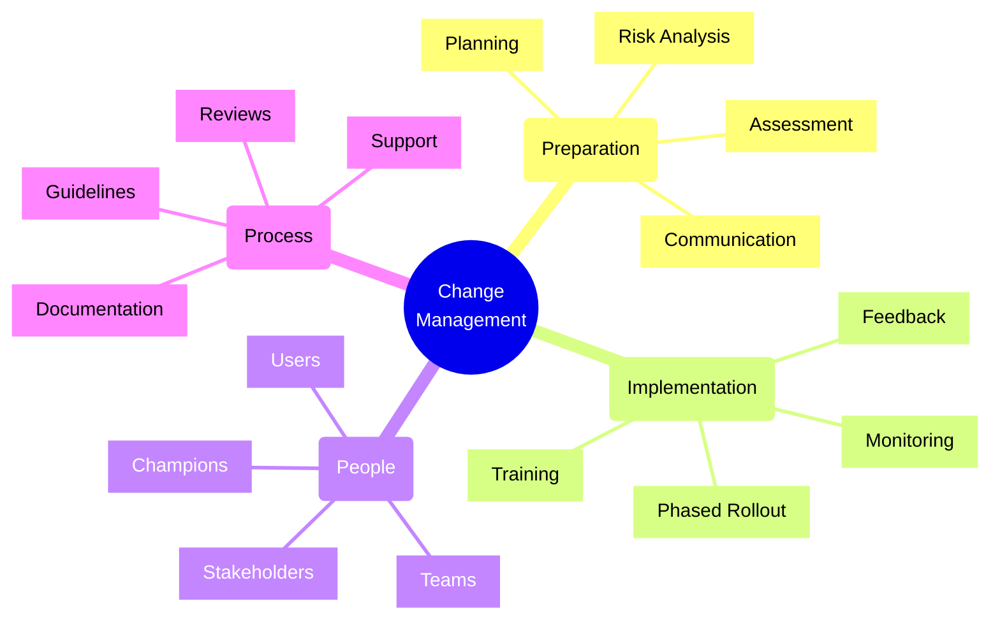
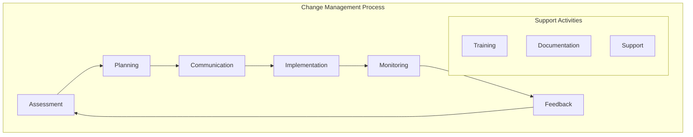
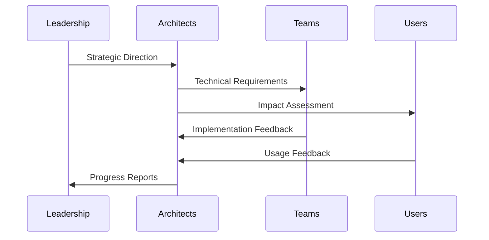
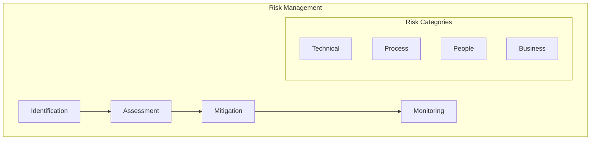

# Change Management Practices

## Core Concepts Overview



## Change Management Framework

### 1. Change Process Flow



### 2. Stakeholder Management



## Implementation Examples

### 1. Change Communication Plan
```typescript
// Example: Change Communication Strategy
interface ChangeComm {
    stakeholders: Stakeholder[];
    communications: Communication[];
    timeline: Timeline;
}

class ChangeManagementPlan {
    private stakeholders: Map<string, StakeholderInfo> = new Map();
    private communications: Communication[] = [];
    
    addStakeholder(stakeholder: Stakeholder) {
        this.stakeholders.set(stakeholder.id, {
            ...stakeholder,
            communicationPreference: this.determinePreference(stakeholder),
            impactLevel: this.assessImpact(stakeholder)
        });
    }
    
    scheduleCommunication(comm: Communication) {
        // Validate against communication matrix
        if (this.validateCommunication(comm)) {
            this.communications.push({
                ...comm,
                scheduledDate: this.determineOptimalTime(comm),
                channels: this.selectChannels(comm)
            });
        }
    }
    
    generateTimeline(): Timeline {
        return {
            phases: this.determinePhases(),
            milestones: this.identifyMilestones(),
            checkpoints: this.defineCheckpoints()
        };
    }
}
```

### 2. Implementation Strategy
```typescript
// Example: Phased Rollout Implementation
class PhaseRollout {
    private phases: Phase[] = [];
    private metrics: MetricCollector;
    private rollbackStrategy: RollbackPlan;
    
    constructor(
        private config: RolloutConfig,
        private monitoring: MonitoringService
    ) {
        this.initializePhases();
        this.setupMetrics();
        this.prepareRollback();
    }
    
    async executePhase(phaseId: string): Promise<PhaseResult> {
        const phase = this.phases.find(p => p.id === phaseId);
        if (!phase) throw new Error('Phase not found');
        
        try {
            // Execute pre-flight checks
            await this.preFlightChecks(phase);
            
            // Implement changes
            await this.implementChanges(phase);
            
            // Monitor results
            const metrics = await this.collectMetrics(phase);
            
            // Evaluate success criteria
            if (this.meetsSuccessCriteria(metrics)) {
                return { success: true, metrics };
            } else {
                await this.rollback(phase);
                return { success: false, metrics };
            }
        } catch (error) {
            await this.handleFailure(phase, error);
            throw error;
        }
    }
}
```

## Implementation Checklist

### Assessment Phase
- [ ] Identify stakeholders
- [ ] Assess impact
- [ ] Analyze risks
- [ ] Define scope
- [ ] Set objectives
- [ ] Gather requirements

### Planning Phase
- [ ] Create timeline
- [ ] Define phases
- [ ] Plan resources
- [ ] Design training
- [ ] Prepare documentation
- [ ] Define metrics

### Implementation Phase
- [ ] Execute communications
- [ ] Deliver training
- [ ] Monitor progress
- [ ] Collect feedback
- [ ] Address issues
- [ ] Track metrics

### Review Phase
- [ ] Evaluate results
- [ ] Gather lessons learned
- [ ] Document outcomes
- [ ] Plan improvements
- [ ] Update processes
- [ ] Share success stories

## Best Practices

### 1. Communication
- Clear messaging
- Regular updates
- Multiple channels
- Two-way feedback
- Progress tracking
- Success sharing

### 2. People Management
- Stakeholder engagement
- Team involvement
- Change champions
- Training support
- Regular feedback
- Recognition

### 3. Process Management
- Clear documentation
- Measurable goals
- Risk mitigation
- Progress tracking
- Quality assurance
- Continuous improvement

## Change Impact Analysis

| Area | Impact | Mitigation | Success Criteria |
|------|---------|------------|-----------------|
| Technical | System changes | Phased rollout | Performance metrics |
| Process | Workflow updates | Training | Adoption rates |
| People | Role changes | Support | Satisfaction scores |
| Business | Operations | Monitoring | Business metrics |

## Risk Management Framework



## Communication Strategy

### 1. Stakeholder Matrix
- Leadership: Strategic updates
- Teams: Detailed plans
- Users: Impact and benefits
- Support: Training and docs

### 2. Communication Channels
- Meetings
- Documentation
- Training sessions
- Email updates
- Chat platforms
- Knowledge base

### 3. Feedback Mechanisms
- Surveys
- Focus groups
- Regular check-ins
- Issue tracking
- Usage metrics
- Success stories

## Training Framework

### 1. Training Types
- Overview sessions
- Technical deep-dives
- Hands-on workshops
- Self-paced learning
- Reference materials
- Office hours

### 2. Support Structure
- Documentation
- Help desk
- Champions network
- Mentoring
- Communities
- Regular updates

## Success Metrics

### 1. Technical Metrics
- System performance
- Error rates
- Adoption rates
- Support tickets
- Recovery time
- Availability

### 2. Business Metrics
- Productivity
- Cost savings
- Time savings
- User satisfaction
- Business impact
- ROI measures

Remember:
- Start with clear goals
- Engage stakeholders early
- Communicate effectively
- Monitor progress
- Support users
- Learn from feedback
- Document everything
- Celebrate success