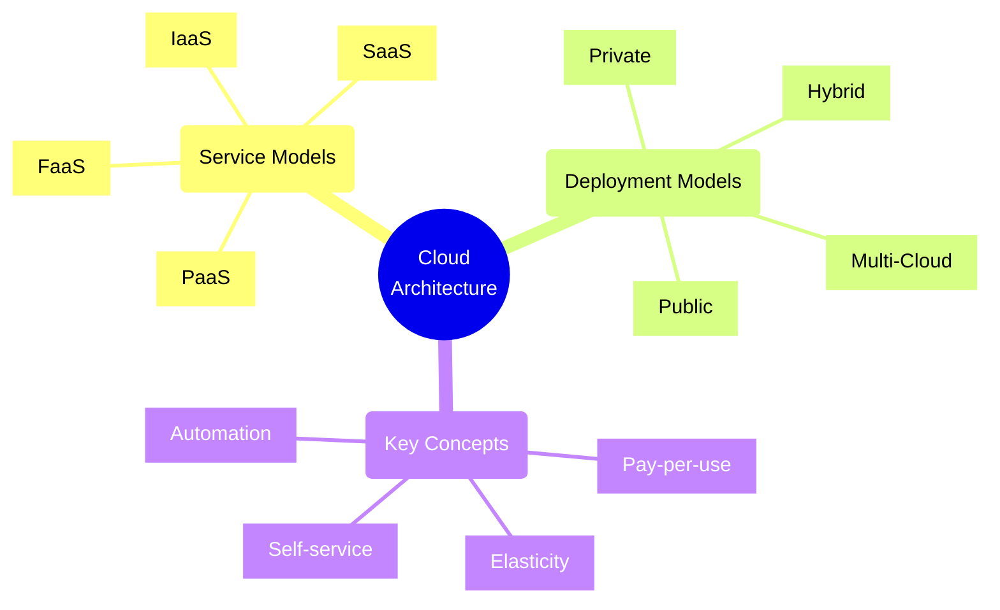
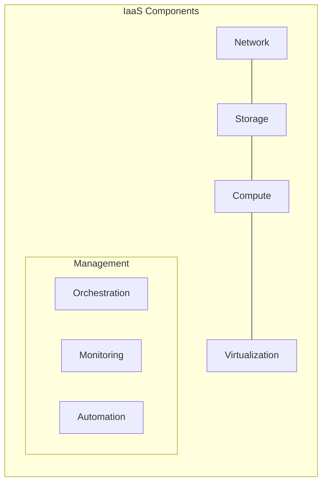
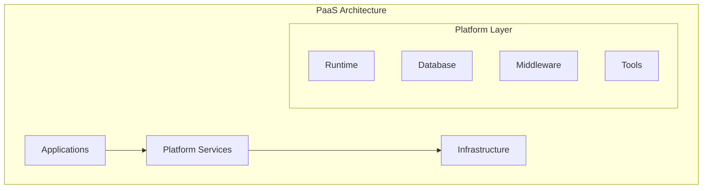
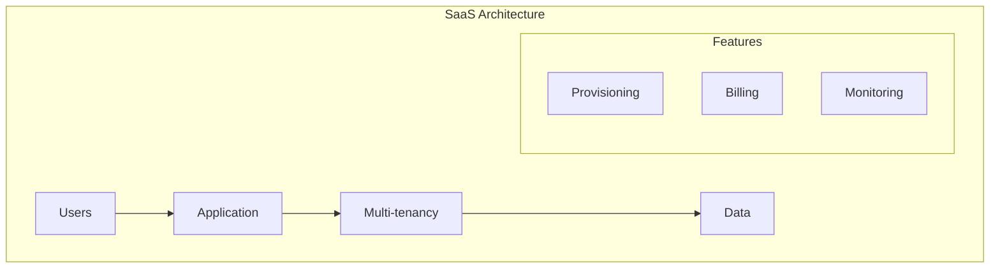
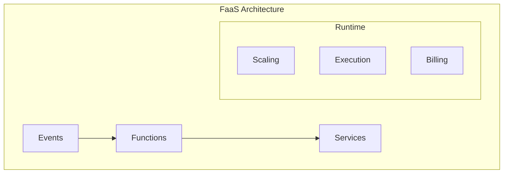
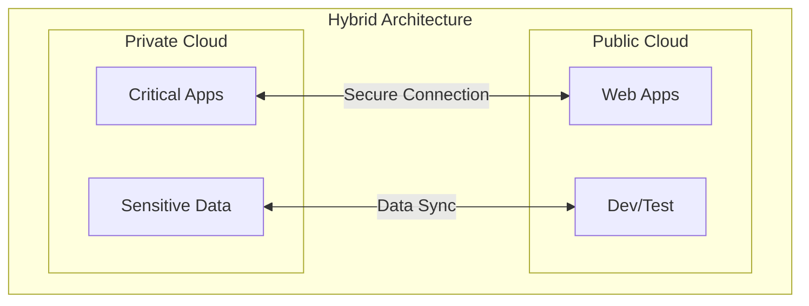
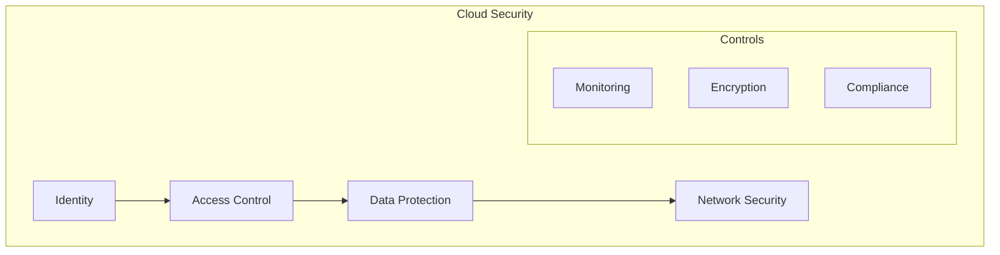

# Cloud Architecture Models



## Cloud Design Patterns

### 1. Availability Patterns
- Deployment Stamps
- Geodes Pattern
- Health Endpoint Monitoring
- Queue-Based Load Leveling

### 2. Data Management Patterns
- Cache-Aside
- CQRS
- Event Sourcing
- Sharding
- Valet Key

### 3. Security Patterns
- Federated Identity
- Gatekeeper
- Valet Key
- Claims-Based Authorization

### 4. Performance Patterns
- Competing Consumers
- Cache-Aside
- Priority Queue
- Throttling

## Service Models Comparison

| Aspect | IaaS | PaaS | SaaS | FaaS |
|--------|------|------|------|------|
| Control | High | Medium | Low | Low |
| Maintenance | High | Medium | Low | Minimal |
| Scalability | Manual | Auto/Manual | Auto | Auto |
| Use Case | Infrastructure | App Development | Business Apps | Event Processing |

## Infrastructure as a Service (IaaS)



### Characteristics
- Virtual machines and networking
- Storage management
- Maximum control over infrastructure
- Responsibility for OS and software

### Use Cases
1. Development and test environments
2. Website hosting
3. Data storage and backup
4. High-performance computing

### Implementation Example
```typescript
// IaaS Resource Manager
class IaaSResourceManager {
    async provisionInfrastructure(config: InfraConfig): Promise<InfrastructureStack> {
        const network = await this.setupNetwork(config.networkConfig);
        const storage = await this.provisionStorage(config.storageConfig);
        const compute = await this.deployCompute(config.computeConfig);

        return {
            network,
            storage,
            compute,
            monitoring: await this.setupMonitoring([network, storage, compute])
        };
    }

    private async setupNetwork(config: NetworkConfig): Promise<NetworkStack> {
        return {
            vnet: await this.createVirtualNetwork(config),
            subnets: await this.createSubnets(config.subnets),
            securityGroups: await this.setupSecurityGroups(config.security)
        };
    }
}
```

## Platform as a Service (PaaS)



### Characteristics
- Managed runtime environment
- Built-in development tools
- Automated scaling
- Simplified deployment

### Use Cases
1. Web applications
2. API backends
3. IoT applications
4. Data analytics

### Implementation Example
```typescript
// PaaS Application Manager
class PaaSApplicationManager {
    async deployApplication(app: Application): Promise<DeploymentResult> {
        const environment = await this.prepareEnvironment(app.requirements);
        const dependencies = await this.resolveDependencies(app.dependencies);
        
        const deployment = await this.platformClient.deploy({
            app: app.package,
            env: environment,
            config: this.generateConfig(app, environment)
        });

        return {
            url: deployment.url,
            resources: deployment.resources,
            monitoring: await this.setupMonitoring(deployment)
        };
    }
}
```

## Software as a Service (SaaS)



### Characteristics
- Fully managed applications
- Subscription-based pricing
- Automatic updates
- Multi-tenant architecture

### Use Cases
1. Email and collaboration
2. CRM systems
3. HR management
4. Financial applications

### Implementation Example
```typescript
// SaaS Tenant Manager
class SaaSTenantManager {
    async provisionTenant(tenant: Tenant): Promise<TenantEnvironment> {
        const database = await this.setupTenantDatabase(tenant);
        const storage = await this.allocateStorage(tenant.requirements);
        
        const environment = await this.createTenantEnvironment({
            tenant,
            database,
            storage,
            features: await this.enableFeatures(tenant.subscription)
        });

        return this.configureTenant(environment);
    }
}
```

## Function as a Service (FaaS)



### Characteristics
- Event-driven execution
- Automatic scaling
- Pay-per-execution
- Stateless functions

### Implementation Example
```typescript
// FaaS Function Manager
class FaaSFunctionManager {
    async deployFunction(func: ServerlessFunction): Promise<FunctionEndpoint> {
        const runtime = await this.setupRuntime(func.runtime);
        const triggers = await this.configureTriggers(func.triggers);
        
        const deployment = await this.functionsPlatform.deploy({
            code: func.code,
            config: this.generateConfig(func),
            bindings: triggers
        });

        return {
            url: deployment.url,
            auth: deployment.auth,
            monitoring: await this.setupMonitoring(deployment)
        };
    }
}
```

## Cloud Deployment Models

### 1. Public Cloud
- Characteristics:
  - Shared infrastructure
  - Pay-as-you-go
  - Quick provisioning
  - Global scale
- Best for:
  - Variable workloads
  - Public-facing applications
  - Cost-sensitive projects
  - Rapid deployment needs

### 2. Private Cloud
- Characteristics:
  - Dedicated infrastructure
  - Enhanced security
  - Complete control
  - Customization options
- Best for:
  - Regulated industries
  - Sensitive data
  - Legacy applications
  - Specific compliance requirements

### 3. Hybrid Cloud

- Characteristics:
  - Mixed deployment
  - Workload flexibility
  - Data sovereignty
  - Cost optimization
- Best for:
  - Variable workloads
  - Disaster recovery
  - Development/Testing
  - Gradual cloud migration

### 4. Multi-Cloud
- Characteristics:
  - Multiple providers
  - Vendor independence
  - Best-of-breed services
  - Geographic distribution
- Best for:
  - Risk mitigation
  - Global presence
  - Service optimization
  - Vendor leverage

## Implementation Framework

### 1. Assessment Checklist
- [ ] Workload characteristics
- [ ] Security requirements
- [ ] Compliance needs
- [ ] Performance requirements
- [ ] Cost constraints
- [ ] Scalability needs
- [ ] Integration requirements
- [ ] Data governance

### 2. Migration Strategy
- Assess current state
- Define target state
- Create migration plan
- Execute in phases
- Validate and test
- Monitor and optimize

### 3. Security Framework


### 4. Operations Framework
- Monitoring strategy
- Backup and recovery
- Cost management
- Performance optimization
- Incident response
- Change management

## Architecture Decision Framework

Consider these factors when choosing a cloud model:

1. **Control Requirements**
   - Infrastructure control needs
   - Custom configuration requirements
   - Security requirements
   - Compliance needs

2. **Operational Factors**
   - Team expertise
   - Maintenance overhead
   - Deployment frequency
   - Scaling requirements

3. **Cost Considerations**
   - Capital vs operational expenses
   - Resource utilization
   - Management costs
   - Scaling costs

4. **Technical Requirements**
   - Performance needs
   - Integration requirements
   - Data residency
   - Security compliance

## Best Practices

### 1. Design Principles
- Design for failure
- Implement security at every layer
- Automate everything possible
- Use managed services when available
- Monitor and measure everything
- Implement proper cost controls
- Plan for disaster recovery
- Use infrastructure as code

### 2. Implementation Guidelines
- Start small and scale up
- Use reference architectures
- Implement proper tagging
- Follow least privilege principle
- Regular security reviews
- Continuous optimization
- Document everything
- Train the team

### 3. Operational Excellence
- Automated deployments
- Regular health checks
- Performance monitoring
- Cost optimization
- Security scanning
- Compliance auditing
- Backup verification
- Disaster recovery testing

Remember: Choose the cloud model that best fits your specific requirements while considering the trade-offs between control, responsibility, and management overhead.