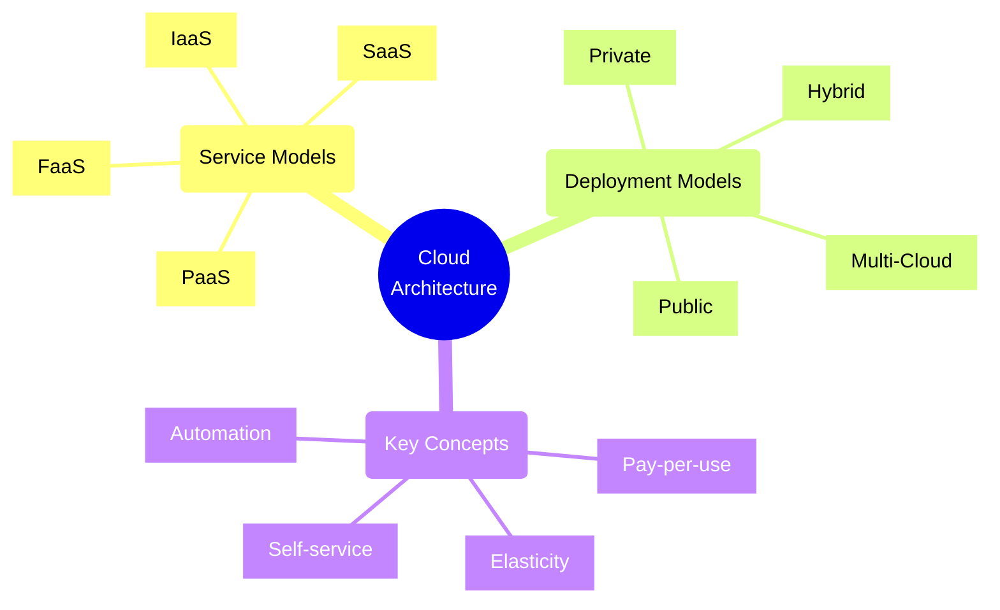
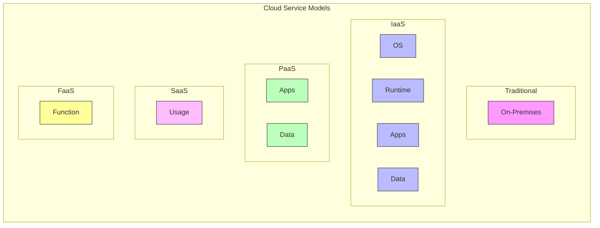
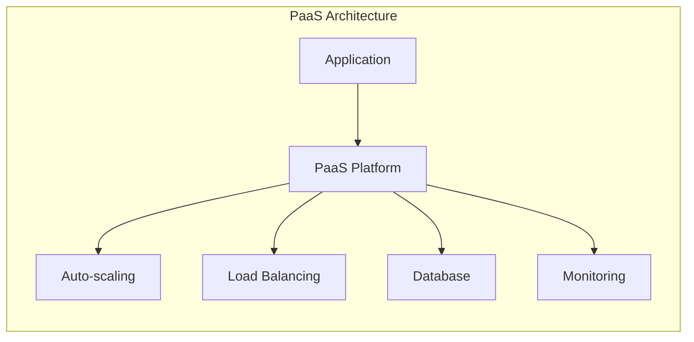
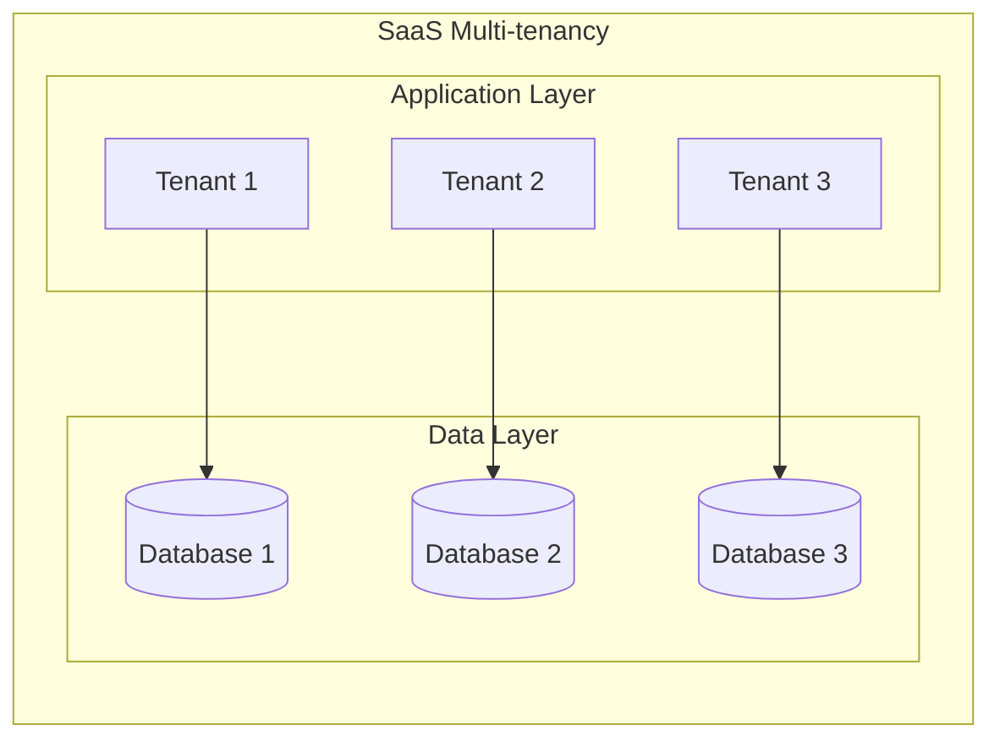
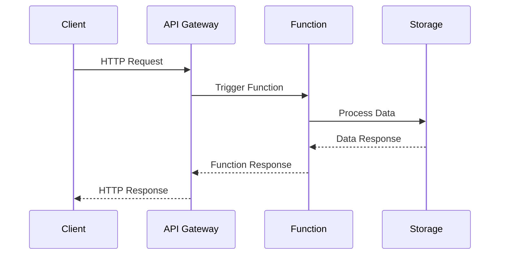
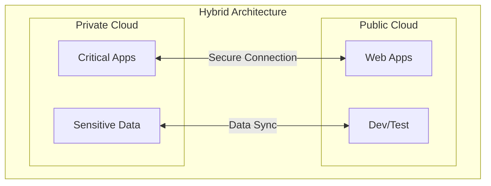

# Cloud Architecture Models



## Service Models Comparison



## Infrastructure as a Service (IaaS)

### Characteristics
- Virtual machines and networking
- Storage management
- Maximum control over infrastructure
- Responsibility for OS and software

### Use Cases
1. Development and test environments
2. Website hosting
3. Data storage and backup
4. High-performance computing

### Implementation Example
```yaml
# Azure VM Configuration
resource "azurerm_virtual_machine" "example" {
  name                  = "production-vm"
  location              = "eastus"
  resource_group_name   = "production-rg"
  network_interface_ids = [azurerm_network_interface.example.id]
  vm_size              = "Standard_DS1_v2"

  storage_os_disk {
    name              = "osdisk"
    caching           = "ReadWrite"
    create_option     = "FromImage"
    managed_disk_type = "Premium_LRS"
  }
}
```

## Platform as a Service (PaaS)

### Characteristics
- Managed runtime environment
- Built-in development tools
- Automated scaling
- Simplified deployment



### Use Cases
1. Web applications
2. API backends
3. IoT applications
4. Data analytics

### Implementation Example
```yaml
# Azure App Service Configuration
resource "azurerm_app_service" "example" {
  name                = "webapp-example"
  location            = "eastus"
  resource_group_name = "production-rg"
  app_service_plan_id = azurerm_app_service_plan.example.id

  site_config {
    dotnet_framework_version = "v6.0"
    always_on               = true
  }

  app_settings = {
    "WEBSITE_RUN_FROM_PACKAGE" = "1"
  }
}
```

## Software as a Service (SaaS)

### Characteristics
- Fully managed applications
- Subscription-based pricing
- Automatic updates
- Multi-tenant architecture



### Use Cases
1. Email and collaboration
2. CRM systems
3. HR management
4. Financial applications

## Function as a Service (FaaS)

### Characteristics
- Event-driven execution
- Automatic scaling
- Pay-per-execution
- Stateless functions



### Implementation Example
```typescript
// Azure Function
module.exports = async function (context, req) {
    context.log('JavaScript HTTP trigger function processed a request.');

    const name = req.query.name || (req.body && req.body.name);
    
    const responseMessage = name
        ? "Hello, " + name
        : "Please pass a name";

    context.res = {
        status: 200,
        body: responseMessage
    };
}
```

## Cloud Deployment Models

### 1. Public Cloud
- Shared infrastructure
- Pay-as-you-go pricing
- Quick scalability
- Managed services

### 2. Private Cloud
- Dedicated infrastructure
- Enhanced security
- Compliance control
- Customizable environment

### 3. Hybrid Cloud


### 4. Multi-Cloud
- Multiple providers
- Vendor flexibility
- Geographic distribution
- Risk mitigation

## Architecture Decision Framework

Consider these factors when choosing a cloud model:

1. **Control Requirements**
   - Infrastructure control needs
   - Custom configuration requirements
   - Security requirements
   - Compliance needs

2. **Operational Factors**
   - Team expertise
   - Maintenance overhead
   - Deployment frequency
   - Scaling requirements

3. **Cost Considerations**
   - Capital vs operational expenses
   - Resource utilization
   - Management costs
   - Scaling costs

4. **Technical Requirements**
   - Performance needs
   - Integration requirements
   - Data residency
   - Security compliance

Remember: Choose the cloud model that best fits your specific requirements while considering the trade-offs between control, responsibility, and management overhead.