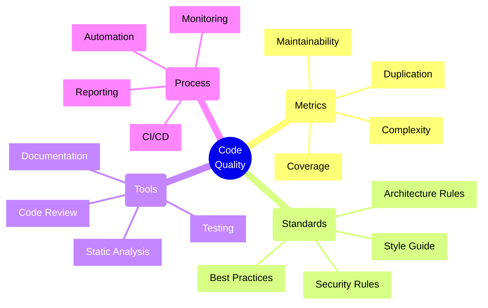
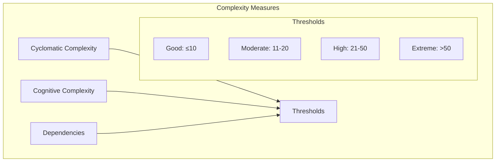
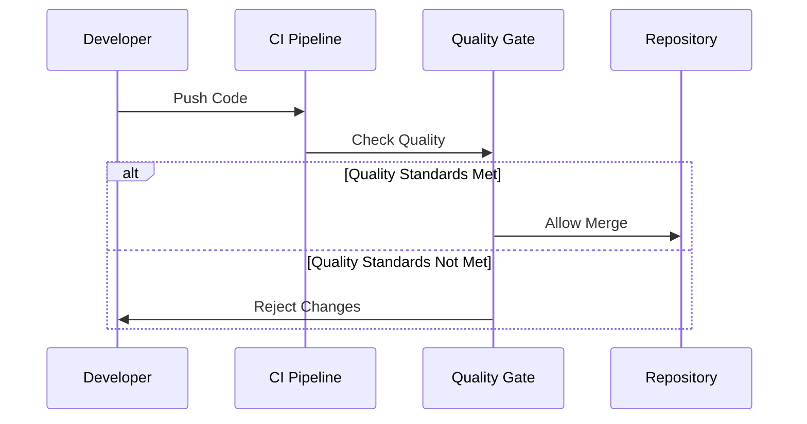
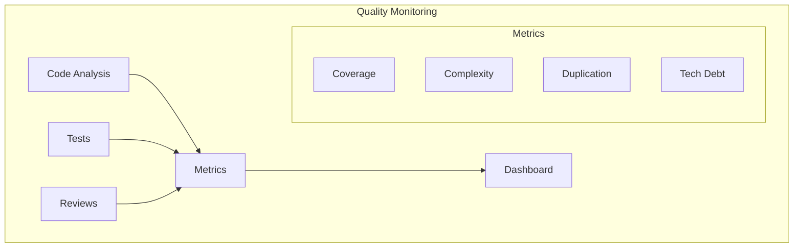

# Code Quality Metrics and Standards

## Core Concepts Overview



## Key Quality Metrics

### 1. Code Complexity Metrics



### 2. Quality Gates



## Implementation Examples

### 1. SonarQube Configuration
```typescript
// Example: SonarQube configuration file (sonar-project.properties)
sonar.projectKey=my-project
sonar.projectName=My Project
sonar.projectVersion=1.0

# Source configuration
sonar.sources=src
sonar.tests=test
sonar.exclusions=node_modules/**

# Quality gates
sonar.qualitygate.wait=true

# Code coverage
sonar.javascript.lcov.reportPaths=coverage/lcov.info

# Duplicate code detection
sonar.cpd.exclusions=test/**

# Complexity thresholds
sonar.javascript.maxFileComplexity=20
sonar.javascript.maxFunctionComplexity=10
```

### 2. ESLint Configuration
```javascript
// Example: ESLint configuration with TypeScript and best practices
module.exports = {
    root: true,
    parser: '@typescript-eslint/parser',
    plugins: [
        '@typescript-eslint',
        'prettier',
        'security'
    ],
    extends: [
        'eslint:recommended',
        'plugin:@typescript-eslint/recommended',
        'plugin:security/recommended',
        'prettier'
    ],
    rules: {
        // Complexity rules
        'complexity': ['error', { max: 10 }],
        'max-depth': ['error', { max: 3 }],
        'max-lines': ['error', { max: 500 }],
        
        // Best practices
        '@typescript-eslint/explicit-function-return-type': 'error',
        '@typescript-eslint/no-explicit-any': 'error',
        'security/detect-object-injection': 'error',
        
        // Style
        'prettier/prettier': 'error'
    }
};
```

## Implementation Checklist

### Design Phase
- [ ] Define quality metrics
- [ ] Set quality gates
- [ ] Choose tools
- [ ] Define standards
- [ ] Create style guides
- [ ] Plan automation

### Development Phase
- [ ] Configure linters
- [ ] Set up CI/CD
- [ ] Implement code reviews
- [ ] Configure testing
- [ ] Set up documentation
- [ ] Enable metrics collection

### Monitoring Phase
- [ ] Track metrics
- [ ] Review trends
- [ ] Update standards
- [ ] Provide feedback
- [ ] Improve processes
- [ ] Regular audits

## Quality Tools and Standards

### 1. Static Analysis Tools
- **SonarQube/SonarCloud**
  - Code quality analysis
  - Security scanning
  - Duplicate detection
  - Technical debt tracking

- **ESLint/TSLint**
  - Style enforcement
  - Best practices
  - Error detection
  - Custom rules

### 2. Code Review Tools
- **Azure DevOps**
  - Pull request workflows
  - Code review policies
  - Branch protection
  - Automated checks

- **GitHub**
  - Code review process
  - Status checks
  - Branch protection
  - Review assignments

## Best Practices

### 1. Code Style
- Follow consistent naming
- Use proper formatting
- Maintain documentation
- Follow patterns
- Keep code simple

### 2. Testing
- Write unit tests
- Implement integration tests
- Use test coverage
- Test edge cases
- Regular test runs

### 3. Documentation
- Clear comments
- API documentation
- Architecture docs
- Runbooks
- Change logs

## Metric Analysis Framework

| Metric | Good | Warning | Critical | Action |
|--------|------|---------|----------|---------|
| Coverage | >80% | 60-80% | <60% | Add tests |
| Complexity | <10 | 10-20 | >20 | Refactor |
| Duplication | <3% | 3-5% | >5% | Remove dupes |
| Tech Debt | <5d | 5-10d | >10d | Plan fixes |

## Quality Monitoring Framework



## Common Standards

### 1. Code Organization
- Clear file structure
- Modular design
- Separation of concerns
- Clear dependencies
- Proper layering

### 2. Code Quality
- No code smells
- No duplicates
- Proper error handling
- Clear interfaces
- Good performance

### 3. Security Standards
- Input validation
- Output encoding
- Secure dependencies
- Authentication checks
- Authorization checks

## Azure DevOps Integration

### 1. Pipeline Configuration
```yaml
# Example: Azure DevOps pipeline with quality checks
trigger:
  - main

pool:
  vmImage: 'ubuntu-latest'

steps:
- task: NodeTool@0
  inputs:
    versionSpec: '16.x'

- script: |
    npm install
    npm run lint
    npm run test
  displayName: 'Run tests and lint'

- task: SonarQubePrepare@5
  inputs:
    SonarQube: 'SonarQube'
    scannerMode: 'CLI'
    configMode: 'file'

- task: SonarQubeAnalyze@5
  displayName: 'Run Code Analysis'

- task: SonarQubePublish@5
  inputs:
    pollingTimeoutSec: '300'

- task: BuildQualityChecks@8
  inputs:
    checkCoverage: true
    coverageFailOption: 'fixed'
    coverageType: 'lines'
    coverageThreshold: '80'
```

Remember:
- Quality is everyone's responsibility
- Automate as much as possible
- Review metrics regularly
- Keep standards updated
- Train team members
- Celebrate improvements
- Learn from issues