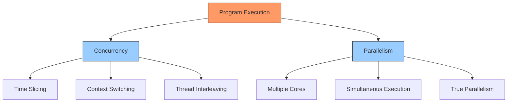
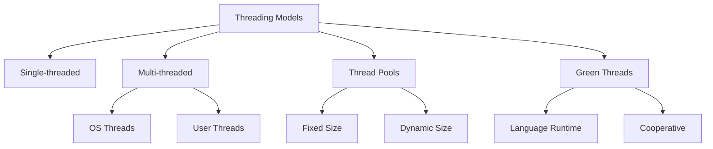
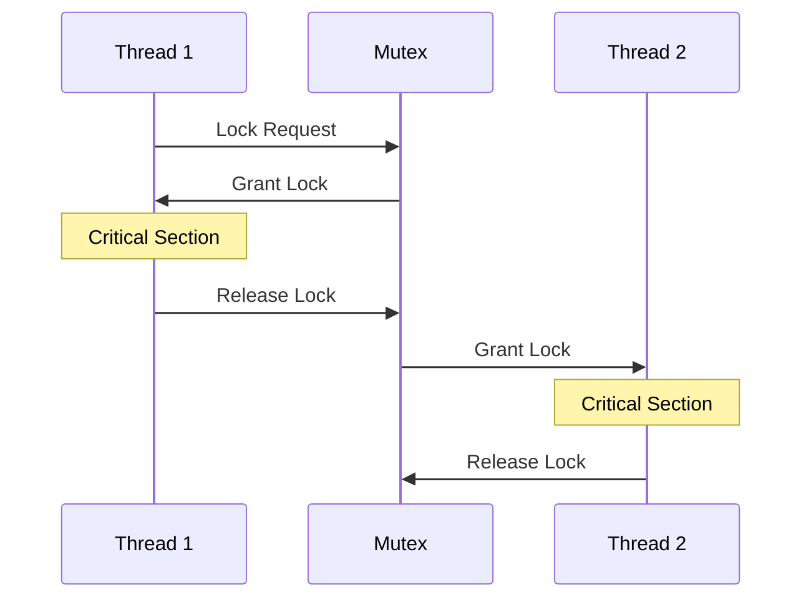
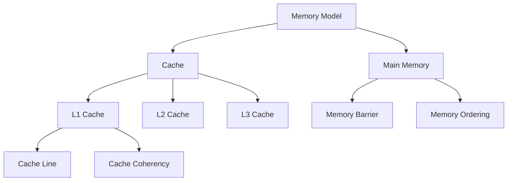
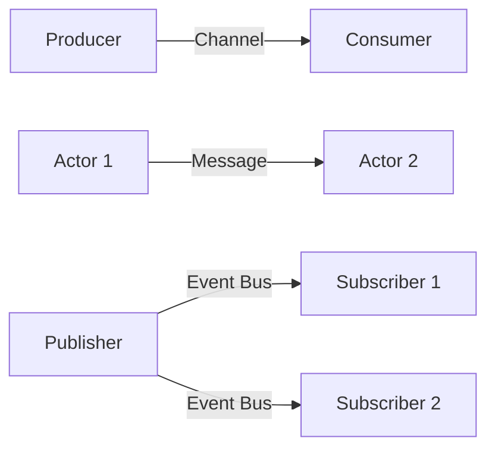
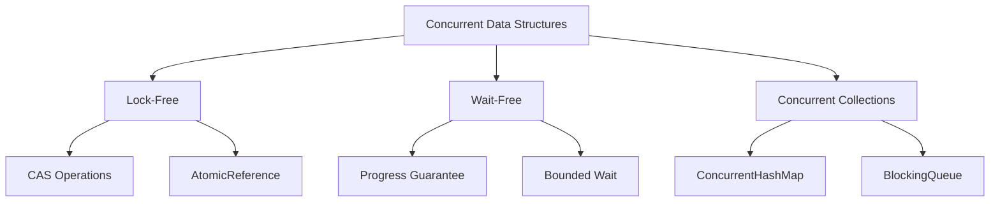
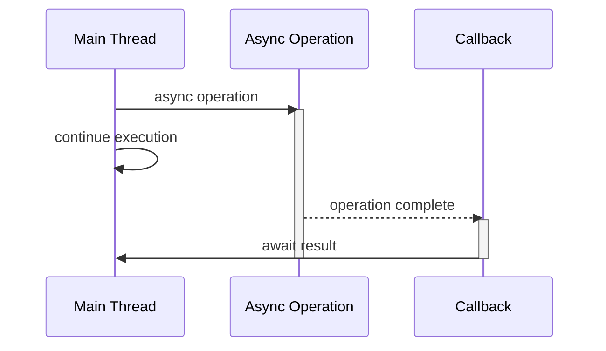
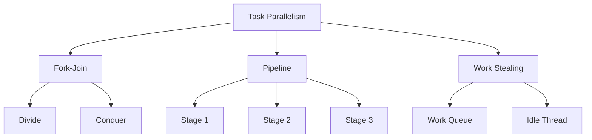
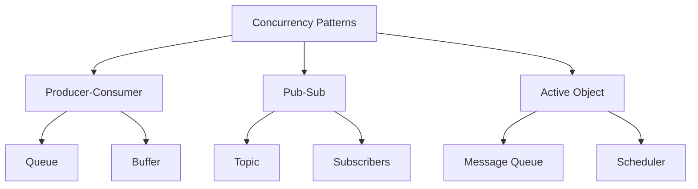
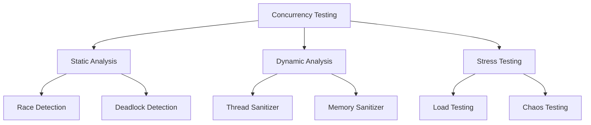

# Concurrency and Parallelism Concepts

This guide covers the fundamental concepts of concurrency and parallelism in software systems, along with practical implementations and best practices.

## 1. Concurrency vs. Parallelism

### Core Concepts
- **Concurrency**: Dealing with multiple things at once (structure)
- **Parallelism**: Doing multiple things at once (execution)



### Implementation Example
```python
# Concurrency with async/await
import asyncio

async def task1():
    print("Task 1 started")
    await asyncio.sleep(2)  # Simulated I/O operation
    print("Task 1 finished")

async def task2():
    print("Task 2 started")
    await asyncio.sleep(1)  # Simulated I/O operation
    print("Task 2 finished")

# Tasks run concurrently
async def main():
    await asyncio.gather(task1(), task2())

# Parallelism with multiprocessing
from multiprocessing import Pool

def parallel_task(x):
    return x * x

if __name__ == '__main__':
    # Tasks run in parallel on multiple CPU cores
    with Pool(4) as p:
        result = p.map(parallel_task, range(1000))
```

## 2. Threading Models

### Concepts
- Single-threaded
- Multi-threaded
- Thread pools
- Green threads



### Implementation Example
```java
// Thread Pool Example in Java
import java.util.concurrent.*;

public class ThreadPoolExample {
    public static void main(String[] args) {
        // Create a fixed size thread pool
        ExecutorService executor = Executors.newFixedThreadPool(4);
        
        // Submit tasks to the pool
        for (int i = 0; i < 10; i++) {
            int taskId = i;
            executor.submit(() -> {
                System.out.println("Task " + taskId + 
                    " executing on thread " + 
                    Thread.currentThread().getName());
                return taskId;
            });
        }
        
        // Shutdown the pool
        executor.shutdown();
    }
}
```

## 3. Synchronization Mechanisms

### Types
- Mutex
- Semaphore
- Monitor
- Read-Write Lock
- Atomic Operations



### Implementation Example
```csharp
// C# lock and Monitor example
public class ThreadSafeCounter
{
    private readonly object _lock = new object();
    private int _count;

    public void Increment()
    {
        lock (_lock)
        {
            _count++;
        }
    }

    // Using Monitor for more control
    public void IncrementWithTimeout()
    {
        if (Monitor.TryEnter(_lock, TimeSpan.FromSeconds(1)))
        {
            try
            {
                _count++;
            }
            finally
            {
                Monitor.Exit(_lock);
            }
        }
    }
}

// Semaphore example
public class ConnectionPool
{
    private readonly SemaphoreSlim _pool;

    public ConnectionPool(int maxConnections)
    {
        _pool = new SemaphoreSlim(maxConnections);
    }

    public async Task UseConnectionAsync()
    {
        await _pool.WaitAsync();
        try
        {
            // Use the connection
        }
        finally
        {
            _pool.Release();
        }
    }
}
```

## 4. Memory Models

### Concepts
- Memory Ordering
- Cache Coherency
- Memory Barriers
- Volatile Variables



### Implementation Example
```java
// Java Memory Model example
public class MemoryModelExample {
    // Volatile ensures visibility across threads
    private volatile boolean flag = false;
    private int data = 0;

    public void producer() {
        data = 42;  // Write to data
        flag = true;  // Signal data is ready
    }

    public void consumer() {
        while (!flag) {
            // Wait until flag is true
            Thread.yield();
        }
        assert data == 42;  // Will always be true
    }
}
```

## 5. Message Passing

### Types
- Channels
- Actors
- Event Bus
- Queues



### Implementation Example
```go
// Go channels example
func producer(ch chan<- int) {
    for i := 0; i < 5; i++ {
        ch <- i  // Send value to channel
        time.Sleep(100 * time.Millisecond)
    }
    close(ch)
}

func consumer(ch <-chan int, done chan<- bool) {
    for num := range ch {
        fmt.Printf("Received: %d\n", num)
    }
    done <- true
}

func main() {
    ch := make(chan int)
    done := make(chan bool)
    
    go producer(ch)
    go consumer(ch, done)
    
    <-done  // Wait for consumer to finish
}
```

## 6. Concurrent Data Structures

### Types
- Lock-free structures
- Wait-free structures
- Concurrent collections
- Immutable data structures



### Implementation Example
```java
// Java concurrent collections
public class ConcurrentCollectionExample {
    private final ConcurrentHashMap<String, User> users = 
        new ConcurrentHashMap<>();
    private final BlockingQueue<Task> taskQueue = 
        new LinkedBlockingQueue<>();

    public void addUser(String id, User user) {
        users.put(id, user);
    }

    public User getUser(String id) {
        return users.get(id);
    }

    public void submitTask(Task task) throws InterruptedException {
        taskQueue.put(task);
    }

    public Task getNextTask() throws InterruptedException {
        return taskQueue.take();
    }
}
```

## 7. Async/Await Patterns

### Concepts
- Promises/Futures
- Coroutines
- Event Loop
- Async I/O



### Implementation Example
```typescript
// TypeScript async/await example
async function fetchUserData(userId: string): Promise<User> {
    try {
        // Parallel async operations
        const [profile, orders, preferences] = await Promise.all([
            fetchProfile(userId),
            fetchOrders(userId),
            fetchPreferences(userId)
        ]);

        return {
            ...profile,
            orders,
            preferences
        };
    } catch (error) {
        console.error('Error fetching user data:', error);
        throw error;
    }
}

// Usage
async function displayUserDashboard(userId: string) {
    try {
        const userData = await fetchUserData(userId);
        renderDashboard(userData);
    } catch (error) {
        showError('Failed to load dashboard');
    }
}
```

## 8. Task Parallelism

### Concepts
- Task Decomposition
- Work Stealing
- Fork-Join
- Pipeline Parallelism



### Implementation Example
```java
// Java Fork/Join example
public class ParallelArraySum extends RecursiveTask<Long> {
    private final long[] array;
    private final int start;
    private final int end;
    private static final int THRESHOLD = 10_000;

    public ParallelArraySum(long[] array, int start, int end) {
        this.array = array;
        this.start = start;
        this.end = end;
    }

    @Override
    protected Long compute() {
        if (end - start <= THRESHOLD) {
            // Sequential computation
            return computeSequentially();
        }
        
        // Fork/Join pattern
        int middle = (start + end) / 2;
        ParallelArraySum left = new ParallelArraySum(array, start, middle);
        ParallelArraySum right = new ParallelArraySum(array, middle, end);
        
        left.fork();  // Compute left half in parallel
        Long rightResult = right.compute();  // Compute right half
        Long leftResult = left.join();  // Wait for left result
        
        return leftResult + rightResult;
    }
}
```

## 9. Concurrency Patterns

### Types
- Producer-Consumer
- Publish-Subscribe
- Active Object
- Reactor Pattern



### Implementation Example
```python
# Python Producer-Consumer pattern
from queue import Queue
from threading import Thread
import time

class ProducerConsumer:
    def __init__(self, buffer_size):
        self.queue = Queue(buffer_size)
        
    def producer(self):
        for i in range(10):
            self.queue.put(f"Item {i}")
            print(f"Produced Item {i}")
            time.sleep(0.1)
            
    def consumer(self):
        while True:
            item = self.queue.get()
            if item is None:
                break
            print(f"Consumed {item}")
            self.queue.task_done()
            
    def run(self):
        producer_thread = Thread(target=self.producer)
        consumer_thread = Thread(target=self.consumer)
        
        producer_thread.start()
        consumer_thread.start()
        
        producer_thread.join()
        self.queue.put(None)  # Signal to stop consumer
        consumer_thread.join()
```

## 10. Testing and Debugging

### Approaches
- Race Condition Detection
- Deadlock Detection
- Thread Dumps
- Concurrent Testing Frameworks



### Implementation Example
```java
// JUnit concurrent testing example
@Test
public void testConcurrentAccess() throws InterruptedException {
    int threadCount = 10;
    int iterationCount = 1000;
    CountDownLatch startLatch = new CountDownLatch(1);
    CountDownLatch endLatch = new CountDownLatch(threadCount);
    
    ThreadSafeCounter counter = new ThreadSafeCounter();
    
    // Create multiple threads
    for (int i = 0; i < threadCount; i++) {
        new Thread(() -> {
            try {
                startLatch.await(); // Wait for start signal
                for (int j = 0; j < iterationCount; j++) {
                    counter.increment();
                }
            } catch (InterruptedException e) {
                Thread.currentThread().interrupt();
            } finally {
                endLatch.countDown();
            }
        }).start();
    }
    
    startLatch.countDown(); // Start all threads
    endLatch.await(); // Wait for all threads to finish
    
    assertEquals(threadCount * iterationCount, counter.getCount());
}
```

## Best Practices for Concurrency and Parallelism

1. **Design for Concurrency**
   - Keep shared state minimal
   - Use immutable objects when possible
   - Prefer message passing over shared memory
   - Design for failure and recovery

2. **Threading Best Practices**
   - Use thread pools
   - Avoid thread leaks
   - Handle interruptions properly
   - Use appropriate thread priorities

3. **Synchronization Guidelines**
   - Keep critical sections small
   - Avoid nested locks
   - Use higher-level synchronization when possible
   - Be aware of deadlock conditions

4. **Performance Considerations**
   - Balance thread count with CPU cores
   - Monitor thread contention
   - Use appropriate granularity
   - Profile and measure

5. **Testing and Debugging**
   - Write concurrent unit tests
   - Use testing frameworks
   - Monitor thread states
   - Use debugging tools

Remember: Concurrency and parallelism are powerful but complex concepts. Always start with the simplest solution that meets your requirements and add complexity only when necessary. Test thoroughly for race conditions and deadlocks, and always have a solid monitoring strategy in place.