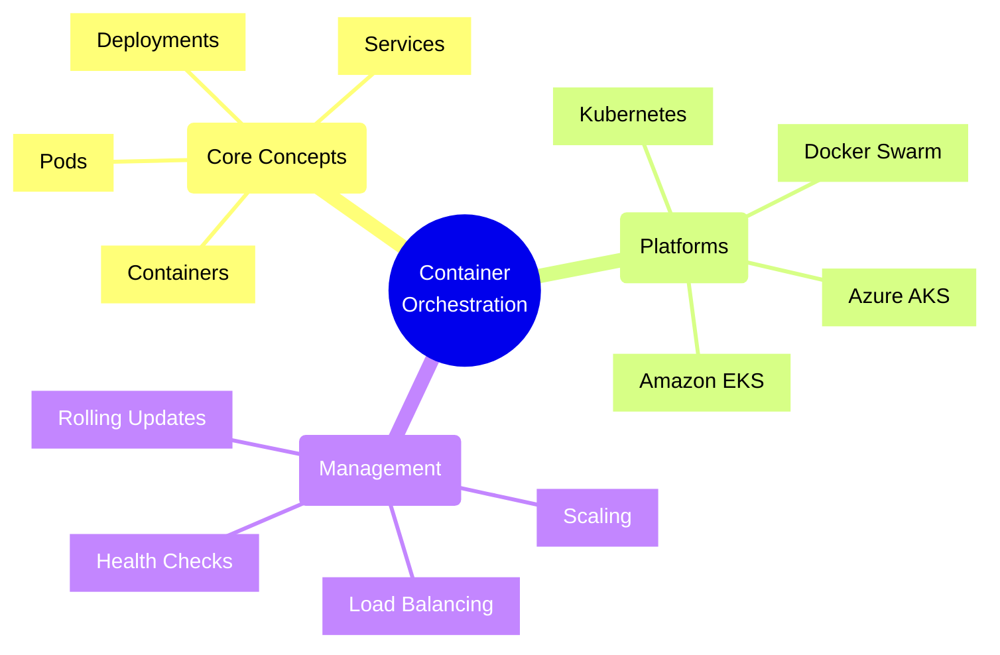
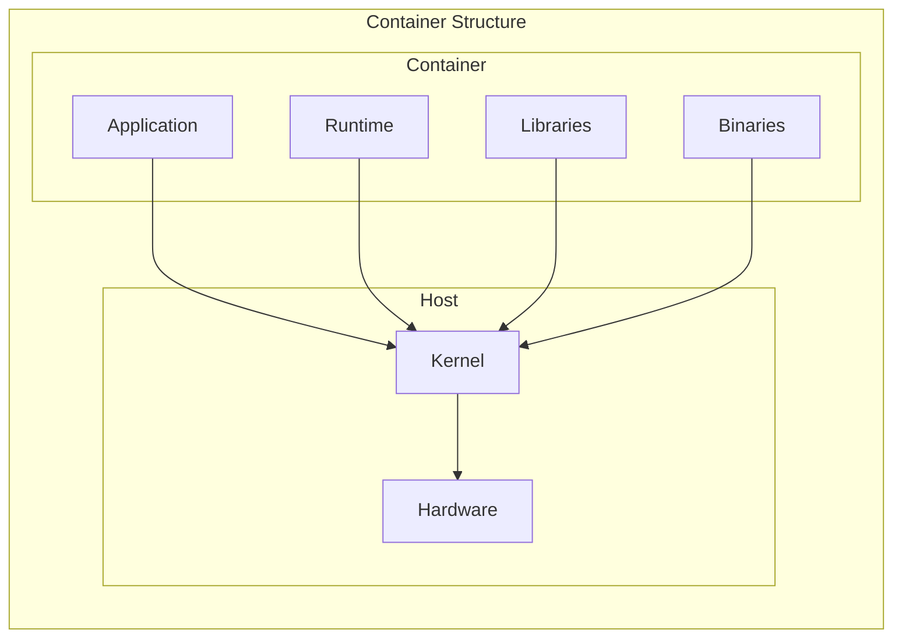
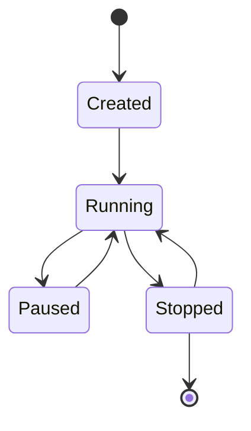
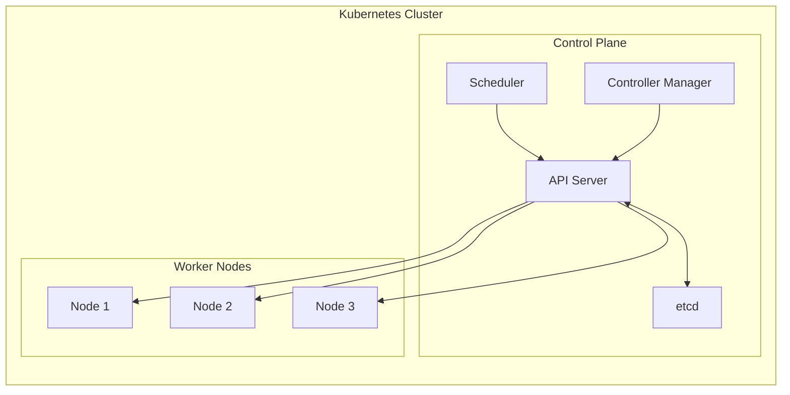
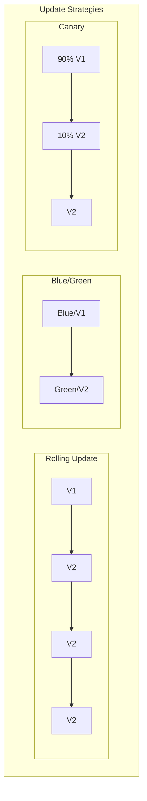
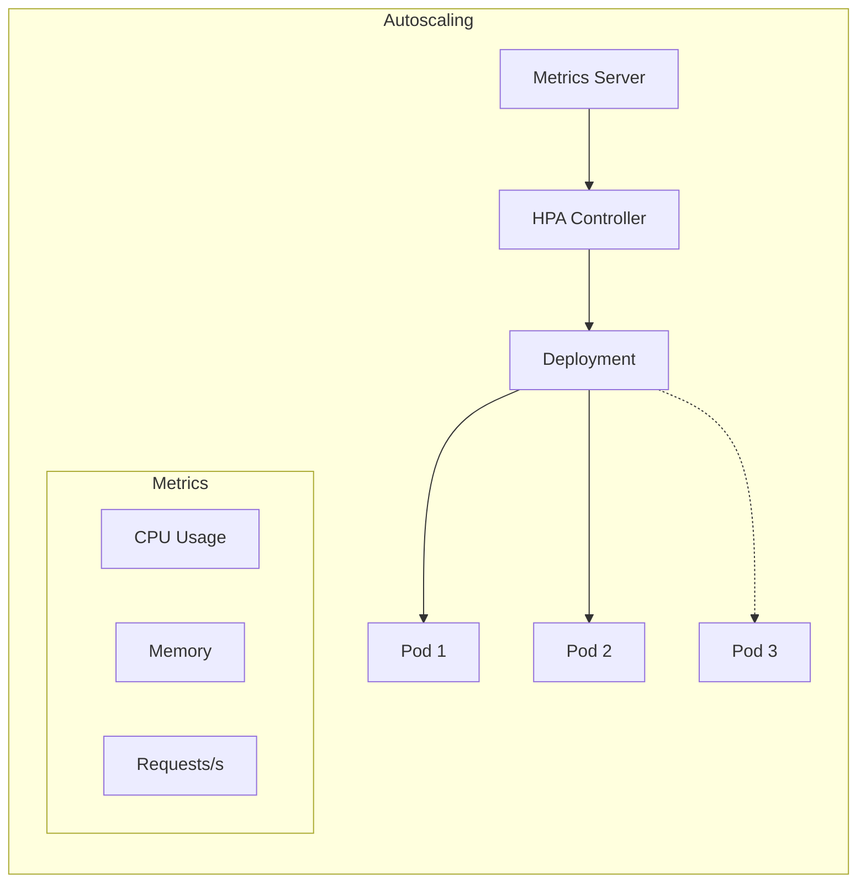
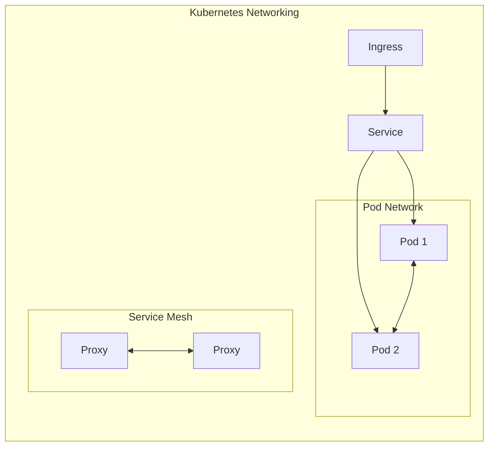
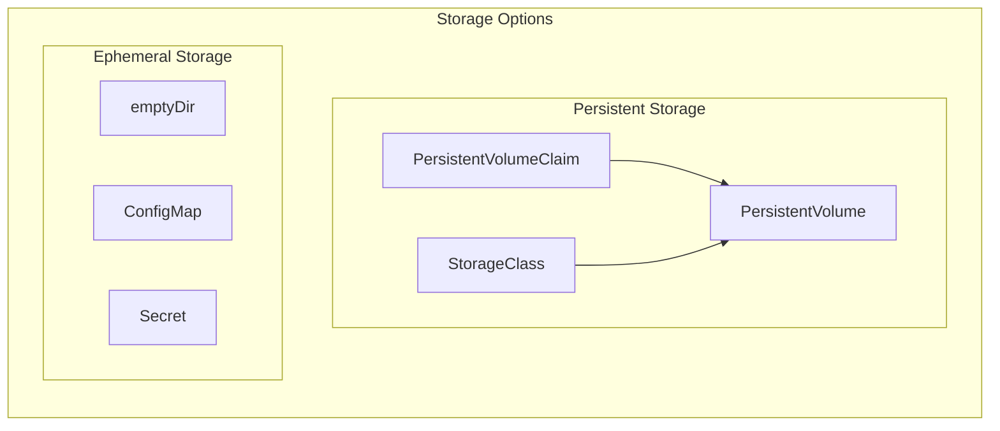

# Container Orchestration Concepts



## Container Architecture

### 1. Container Components



### 2. Container Lifecycle



## Kubernetes Architecture

### 1. Cluster Components



### 2. Basic Resource Types
```yaml
# Pod Definition
apiVersion: v1
kind: Pod
metadata:
  name: web-application
  labels:
    app: web
spec:
  containers:
  - name: web
    image: nginx:1.25
    ports:
    - containerPort: 80
    resources:
      requests:
        memory: "64Mi"
        cpu: "250m"
      limits:
        memory: "128Mi"
        cpu: "500m"
```

## Orchestration Patterns

### 1. Deployment Strategies



### 2. Service Discovery
```yaml
# Service Definition
apiVersion: v1
kind: Service
metadata:
  name: web-service
spec:
  selector:
    app: web
  ports:
  - port: 80
    targetPort: 8080
  type: LoadBalancer
```

## Scaling Patterns

### 1. Horizontal Pod Autoscaling



### 2. Autoscaling Configuration
```yaml
# HPA Configuration
apiVersion: autoscaling/v2
kind: HorizontalPodAutoscaler
metadata:
  name: web-hpa
spec:
  scaleTargetRef:
    apiVersion: apps/v1
    kind: Deployment
    name: web
  minReplicas: 2
  maxReplicas: 10
  metrics:
  - type: Resource
    resource:
      name: cpu
      target:
        type: Utilization
        averageUtilization: 80
```

## Networking Concepts

### 1. Network Architecture



### 2. Network Policies
```yaml
# Network Policy
apiVersion: networking.k8s.io/v1
kind: NetworkPolicy
metadata:
  name: api-network-policy
spec:
  podSelector:
    matchLabels:
      app: api
  policyTypes:
  - Ingress
  - Egress
  ingress:
  - from:
    - podSelector:
        matchLabels:
          app: web
    ports:
    - protocol: TCP
      port: 8080
```

## Storage Management

### 1. Storage Architecture



### 2. Storage Configuration
```yaml
# Persistent Volume Claim
apiVersion: v1
kind: PersistentVolumeClaim
metadata:
  name: data-pvc
spec:
  accessModes:
    - ReadWriteOnce
  storageClassName: standard
  resources:
    requests:
      storage: 10Gi
```

## Best Practices

1. **Resource Management**
   - Set resource requests/limits
   - Implement autoscaling
   - Monitor resource usage
   - Plan capacity properly

2. **High Availability**
   - Use multiple replicas
   - Implement pod anti-affinity
   - Configure liveness probes
   - Set up cluster autoscaling

3. **Security**
   - Use RBAC
   - Implement network policies
   - Scan container images
   - Manage secrets properly

4. **Monitoring**
   - Deploy monitoring tools
   - Set up logging
   - Configure alerts
   - Track cluster health

Remember: Container orchestration is about managing the lifecycle of containerized applications at scale. Always consider operational requirements when designing your container strategy.