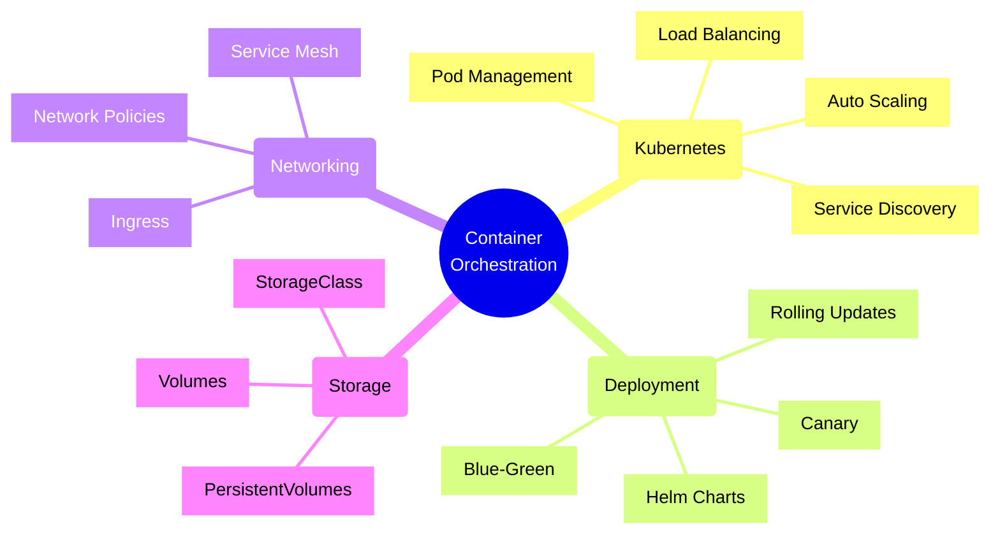
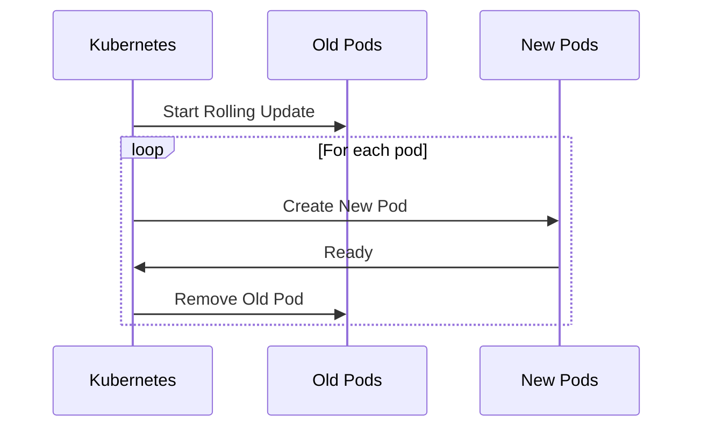
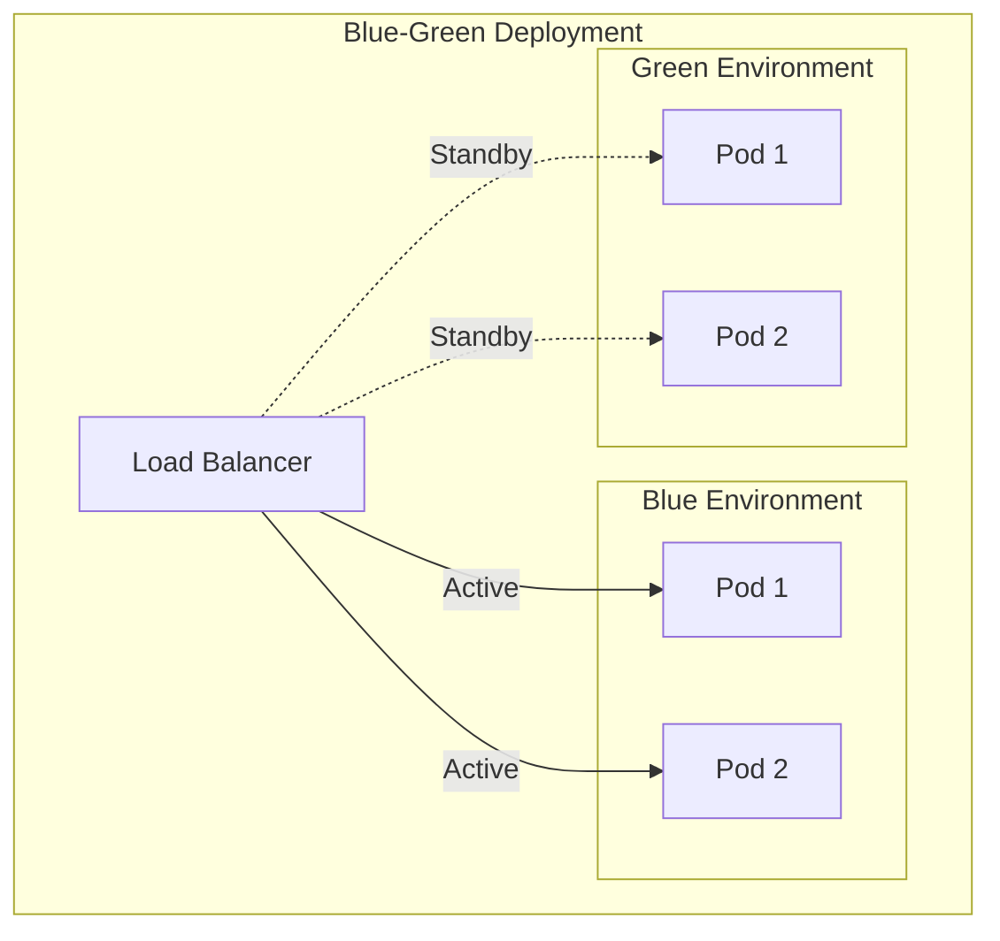
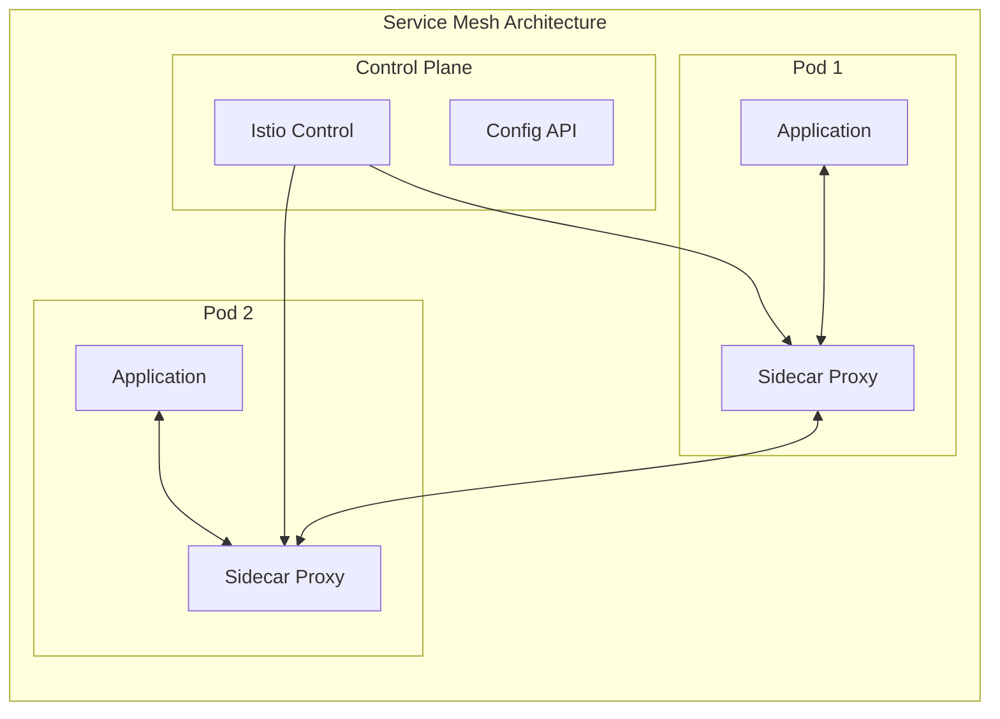
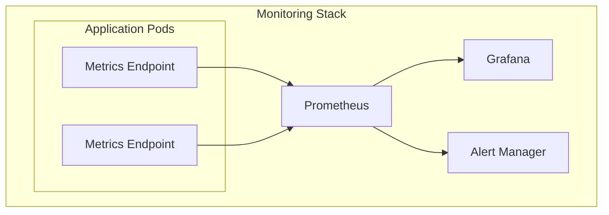

# Container Orchestration Concepts and Implementation



## Overview

Container orchestration automates the deployment, scaling, and management of containerized applications. This guide covers key concepts and implementations using Kubernetes and Helm, with examples in C# and Python.

## Core Concepts

### 1. Pod Management and Service Discovery

Example Kubernetes deployment for a C# Web API:

```yaml
apiVersion: apps/v1
kind: Deployment
metadata:
  name: webapi-deployment
  labels:
    app: webapi
spec:
  replicas: 3
  selector:
    matchLabels:
      app: webapi
  template:
    metadata:
      labels:
        app: webapi
    spec:
      containers:
      - name: webapi
        image: myregistry.azurecr.io/webapi:v1
        ports:
        - containerPort: 80
        env:
        - name: ASPNETCORE_ENVIRONMENT
          value: "Production"
        resources:
          requests:
            memory: "128Mi"
            cpu: "100m"
          limits:
            memory: "256Mi"
            cpu: "200m"
        readinessProbe:
          httpGet:
            path: /health
            port: 80
          initialDelaySeconds: 5
          periodSeconds: 10
        livenessProbe:
          httpGet:
            path: /health
            port: 80
          initialDelaySeconds: 15
          periodSeconds: 20
```

Corresponding C# Health Check Implementation:

```csharp
public class Startup
{
    public void ConfigureServices(IServiceCollection services)
    {
        services.AddHealthChecks()
            .AddCheck("database", async () =>
            {
                try
                {
                    await _dbContext.Database.CanConnectAsync();
                    return HealthCheckResult.Healthy();
                }
                catch (Exception ex)
                {
                    return HealthCheckResult.Unhealthy(ex.Message);
                }
            });
    }

    public void Configure(IApplicationBuilder app)
    {
        app.UseHealthChecks("/health");
    }
}
```

### 2. Service Definition and Load Balancing

```yaml
apiVersion: v1
kind: Service
metadata:
  name: webapi-service
spec:
  selector:
    app: webapi
  ports:
  - port: 80
    targetPort: 80
  type: LoadBalancer
```

### 3. Helm Chart Structure

Example Helm chart for a Python FastAPI application:

```yaml
# Chart.yaml
apiVersion: v2
name: fastapi-app
description: A Helm chart for Python FastAPI application
version: 0.1.0
type: application

# values.yaml
replicaCount: 3
image:
  repository: myregistry.azurecr.io/fastapi-app
  tag: latest
  pullPolicy: Always

service:
  type: ClusterIP
  port: 80

ingress:
  enabled: true
  className: nginx
  hosts:
    - host: api.example.com
      paths:
        - path: /
          pathType: Prefix

resources:
  requests:
    cpu: 100m
    memory: 128Mi
  limits:
    cpu: 200m
    memory: 256Mi
```

Python FastAPI application with health checks:

```python
from fastapi import FastAPI, status
from fastapi.responses import JSONResponse
import asyncio

app = FastAPI()

async def check_database():
    try:
        # Simulate database check
        await asyncio.sleep(0.1)
        return True
    except Exception:
        return False

@app.get("/health")
async def health_check():
    db_healthy = await check_database()
    
    if not db_healthy:
        return JSONResponse(
            status_code=status.HTTP_503_SERVICE_UNAVAILABLE,
            content={"status": "unhealthy", "details": "Database connection failed"}
        )
    
    return {"status": "healthy"}
```

## Deployment Patterns

### 1. Rolling Updates


### 2. Blue-Green Deployment


## Auto Scaling

### Horizontal Pod Autoscaling (HPA)

```yaml
apiVersion: autoscaling/v2
kind: HorizontalPodAutoscaler
metadata:
  name: webapi-hpa
spec:
  scaleTargetRef:
    apiVersion: apps/v1
    kind: Deployment
    name: webapi-deployment
  minReplicas: 3
  maxReplicas: 10
  metrics:
  - type: Resource
    resource:
      name: cpu
      target:
        type: Utilization
        averageUtilization: 80
  - type: Resource
    resource:
      name: memory
      target:
        type: Utilization
        averageUtilization: 80
```

## Best Practices

1. **Resource Management**
   - Always set resource requests and limits
   - Use namespace resource quotas
   - Implement horizontal pod autoscaling

2. **Security**
   - Use network policies
   - Implement RBAC
   - Regular image scanning
   - Use secret management

3. **Monitoring**
   - Implement comprehensive health checks
   - Use Prometheus for metrics
   - Set up Grafana dashboards
   - Enable logging with EFK/ELK stack

4. **Deployment Strategy**
   - Use GitOps workflows
   - Implement proper CI/CD pipelines
   - Use Helm for package management
   - Regular backup and disaster recovery plans

## Service Mesh Integration



## Monitoring and Observability



Remember: Container orchestration is about more than just running containers - it's about managing the entire application lifecycle, ensuring reliability, scalability, and maintainability of your containerized applications.