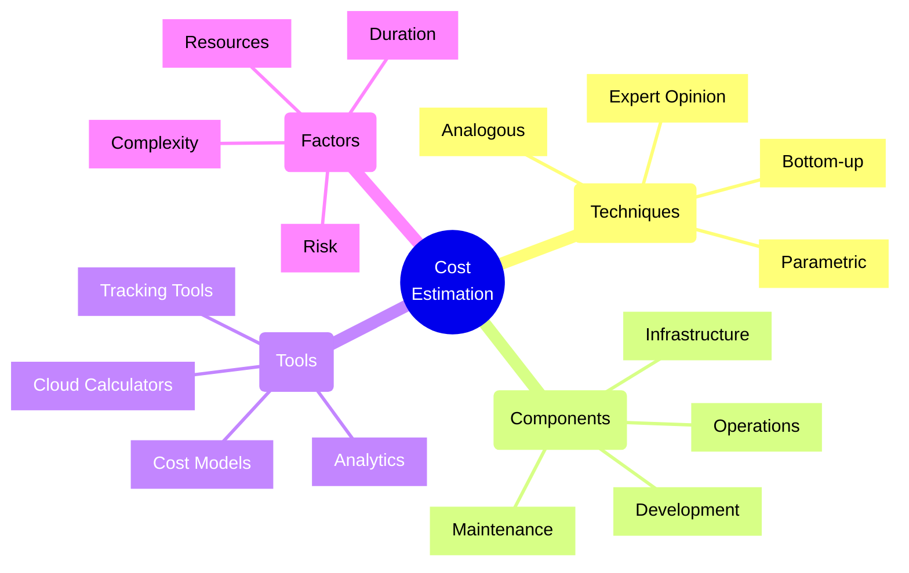
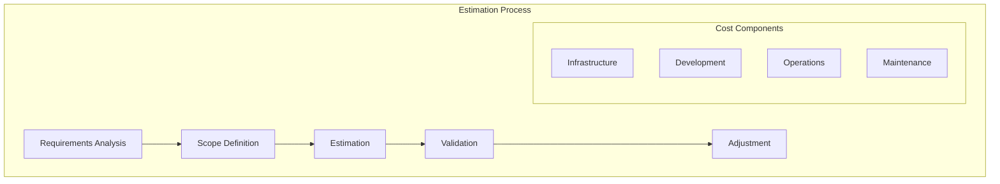
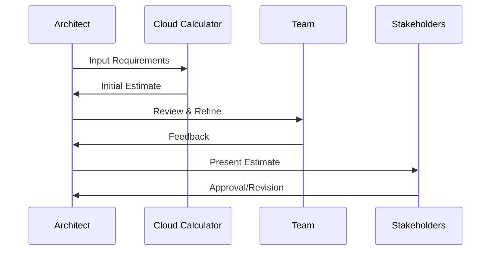
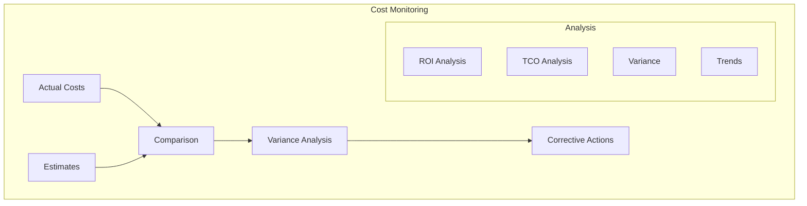

# Cost Estimation Techniques

## Core Concepts Overview



## Estimation Process Flow

### 1. Cost Analysis Framework



### 2. Cloud Cost Modeling



## Implementation Examples

### 1. Cloud Cost Estimation
```typescript
// Example: Cloud Resource Cost Calculator
class CloudCostCalculator {
    private resourceCosts: Map<string, ResourceCost>;
    private utilizationPatterns: UtilizationPattern[];
    
    calculateMonthlyCost(resources: CloudResource[]): CostBreakdown {
        let totalCost = 0;
        const breakdown: CostBreakdown = {
            compute: 0,
            storage: 0,
            network: 0,
            services: 0
        };
        
        for (const resource of resources) {
            const cost = this.calculateResourceCost(resource);
            totalCost += cost.total;
            
            // Update breakdown
            breakdown[resource.category] += cost.total;
            
            // Apply utilization patterns
            const adjustedCost = this.applyUtilizationPattern(cost);
            
            // Add reserved instance savings
            const finalCost = this.applyReservationDiscount(adjustedCost);
            
            breakdown[resource.category] = finalCost;
        }
        
        return {
            ...breakdown,
            total: totalCost,
            savings: this.calculatePotentialSavings(breakdown)
        };
    }
    
    private calculatePotentialSavings(costs: CostBreakdown): Savings {
        return {
            reserved: this.calculateReservedInstanceSavings(costs),
            spotInstance: this.calculateSpotSavings(costs),
            optimization: this.identifyOptimizationOpportunities(costs)
        };
    }
}
```

### 2. Development Cost Estimation
```typescript
// Example: Development Effort Estimator
class DevelopmentEstimator {
    private historicalData: ProjectMetrics[];
    private complexityFactors: ComplexityMatrix;
    
    estimateEffort(requirements: ProjectRequirement[]): EffortEstimate {
        const baseEstimate = this.calculateBaseEstimate(requirements);
        const adjustedEstimate = this.applyComplexityFactors(baseEstimate);
        
        // Calculate confidence intervals
        const confidence = this.calculateConfidenceIntervals(adjustedEstimate);
        
        // Break down by phase
        const breakdown = this.generatePhaseBreakdown(adjustedEstimate);
        
        // Calculate resource requirements
        const resources = this.calculateResourceNeeds(breakdown);
        
        return {
            effort: adjustedEstimate,
            confidence,
            breakdown,
            resources,
            risks: this.identifyEstimationRisks()
        };
    }
    
    private calculateBaseEstimate(requirements: ProjectRequirement[]): number {
        return requirements.reduce((total, req) => {
            const similarTasks = this.findSimilarHistoricalTasks(req);
            const estimate = this.calculateMedianEffort(similarTasks);
            return total + estimate;
        }, 0);
    }
}
```

## Estimation Techniques

### 1. Analogous Estimation
- Use similar projects
- Historical data analysis
- Adjustment factors
- Quick estimation
- Limited accuracy

### 2. Parametric Estimation
- Mathematical models
- Statistical analysis
- Productivity metrics
- Scaling factors
- Higher accuracy

### 3. Bottom-up Estimation
- Detailed work breakdown
- Task-level estimates
- Resource allocation
- Timeline planning
- Most accurate

## Implementation Checklist

### Planning Phase
- [ ] Define scope
- [ ] Gather requirements
- [ ] Identify components
- [ ] Collect historical data
- [ ] Define assumptions
- [ ] List constraints

### Estimation Phase
- [ ] Choose techniques
- [ ] Calculate base estimates
- [ ] Apply adjustment factors
- [ ] Consider risks
- [ ] Validate assumptions
- [ ] Document process

### Review Phase
- [ ] Peer review
- [ ] Compare alternatives
- [ ] Validate with experts
- [ ] Adjust estimates
- [ ] Document rationale
- [ ] Get stakeholder feedback

### Tracking Phase
- [ ] Monitor actuals
- [ ] Track variances
- [ ] Update estimates
- [ ] Document learnings
- [ ] Improve process
- [ ] Report progress

## Best Practices

### 1. Estimation Process
- Use multiple techniques
- Document assumptions
- Include contingency
- Regular updates
- Track accuracy
- Learn from history

### 2. Risk Management
- Identify uncertainties
- Include buffers
- Plan contingencies
- Monitor risks
- Update estimates
- Communicate changes

### 3. Communication
- Clear assumptions
- Regular updates
- Confidence levels
- Range estimates
- Risk factors
- Learning capture

## Cost Breakdown Framework

| Component | Factors | Tools | Confidence Level |
|-----------|---------|-------|-----------------|
| Infrastructure | Usage patterns | Cloud calculators | High |
| Development | Team capacity | Historical data | Medium |
| Operations | Service levels | Monitoring data | Medium-High |
| Maintenance | System complexity | Industry benchmarks | Medium |

## Monitoring Framework



## Cloud Cost Optimization

### 1. Resource Optimization
- Right-sizing
- Auto-scaling
- Reserved instances
- Spot instances
- Storage tiers
- Network optimization

### 2. Architecture Optimization
- Serverless options
- Managed services
- Multi-region strategy
- Caching layers
- Load balancing
- Service mesh

### 3. Operational Optimization
- Automation
- DevOps practices
- Monitoring
- Alerting
- Reporting
- Continuous improvement

Remember:
- Start with clear scope
- Use multiple techniques
- Consider all factors
- Include contingency
- Document assumptions
- Monitor and adjust
- Learn from experience