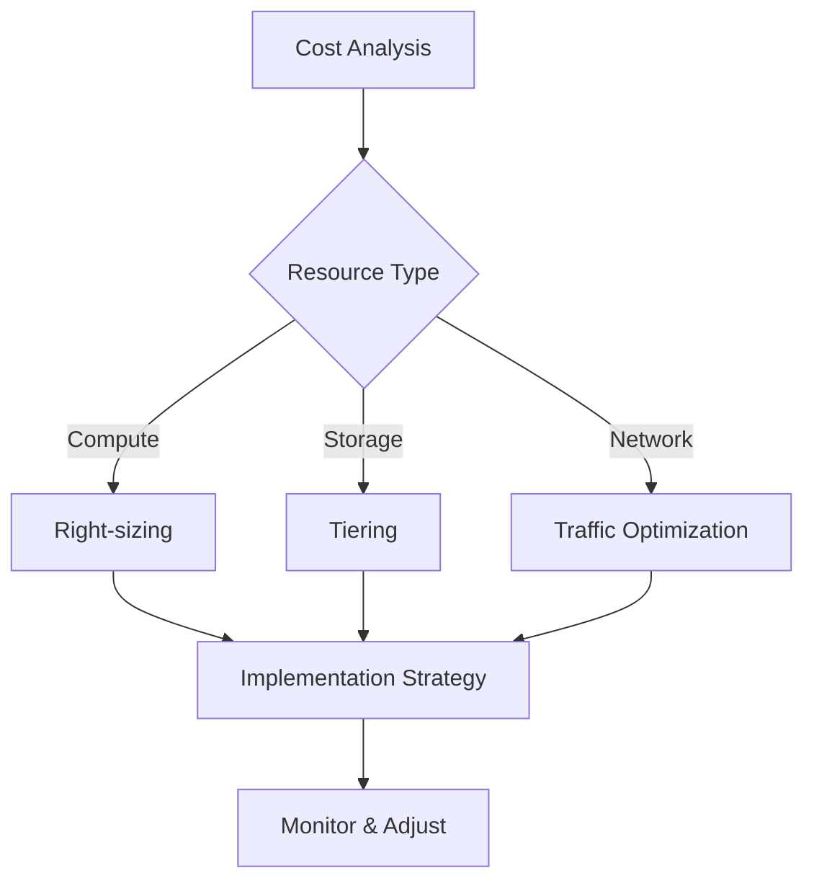
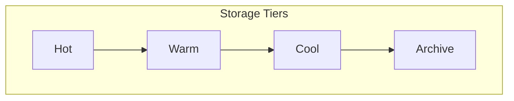
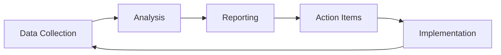

# Cost Optimization Strategies

## Decision Framework

## Core Strategies

### 1. Resource Optimization
- Right-sizing resources
- Automatic scaling
- Reserved instances vs. pay-as-you-go
- Spot instances for non-critical workloads

### 2. Storage Management

- Data lifecycle management
- Storage tier optimization
- Compression and deduplication
- Regular cleanup of unused resources

### 3. Network Cost Control
- Content Delivery Networks utilization
- Traffic routing optimization
- Bandwidth usage monitoring
- Cross-region traffic management

## Cost Analysis Matrix

| Resource Type | Optimization Strategy | Monitoring Metrics | Review Frequency |
|--------------|----------------------|-------------------|------------------|
| Compute      | Auto-scaling         | CPU/Memory Usage  | Weekly          |
| Storage      | Lifecycle Management | Access Patterns   | Monthly         |
| Network      | CDN/Caching         | Bandwidth Usage   | Weekly          |
| Database     | Right-sizing        | IOPS/DTU Usage    | Monthly         |

## Implementation Framework

### 1. Assessment Phase
- [ ] Current cost analysis
- [ ] Resource utilization review
- [ ] Identifying waste
- [ ] Establishing baselines

### 2. Optimization Phase
- [ ] Resource right-sizing
- [ ] Implementation of auto-scaling
- [ ] Storage tier optimization
- [ ] Network optimization

### 3. Governance Phase
- [ ] Cost allocation
- [ ] Budget alerts
- [ ] Regular reviews
- [ ] Policy enforcement

## Monitoring and Control

### Key Performance Indicators
1. Cost per service
2. Resource utilization rates
3. Waste identification
4. Budget variance

### Reporting Framework

## Best Practices

1. **Regular Review Cycle**
   - Monthly cost analysis
   - Quarterly optimization
   - Annual strategy review

2. **Automation**
   - Auto-scaling
   - Resource scheduling
   - Lifecycle management
   - Cost alerts

3. **Governance**
   - Cost policies
   - Budget controls
   - Resource tagging
   - Department allocation

Remember: Cost optimization is an ongoing process, not a one-time activity. Regular monitoring and adjustment are key to maintaining optimal cost efficiency.