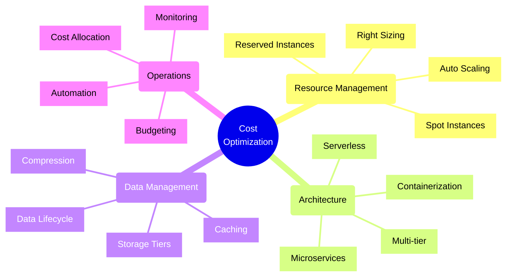
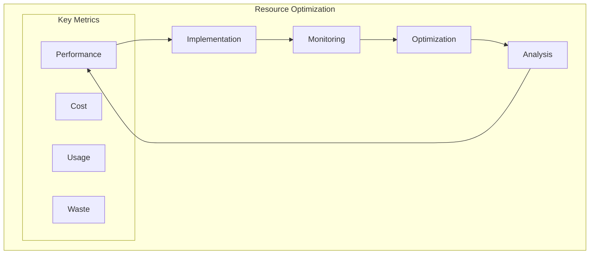
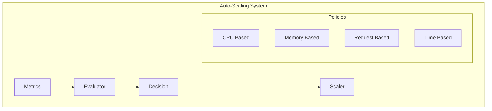
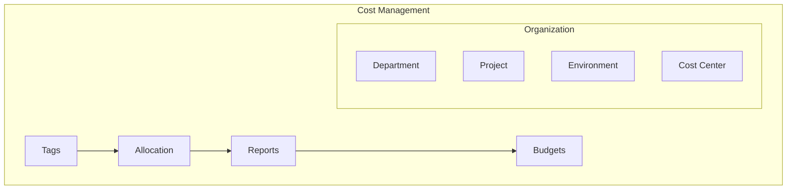

# Cost Optimization Strategies



## Core Optimization Strategies

### 1. Resource Optimization Framework



Implementation Example:
```typescript
// Cost optimization manager
class CostOptimizationManager {
    constructor(
        private resourceManager: ResourceManager,
        private metricsCollector: MetricsCollector,
        private costAnalyzer: CostAnalyzer,
        private alertManager: AlertManager
    ) {}

    async analyzeCosts(): Promise<CostAnalysis> {
        // Collect current metrics
        const metrics = await this.metricsCollector
            .getResourceMetrics();

        // Analyze resource utilization
        const utilization = await this.analyzeUtilization(
            metrics
        );

        // Generate optimization recommendations
        const recommendations = await this.generateRecommendations(
            utilization
        );

        // Calculate potential savings
        const savings = await this.calculatePotentialSavings(
            recommendations
        );

        return {
            currentCosts: await this.costAnalyzer
                .getCurrentCosts(),
            utilization,
            recommendations,
            potentialSavings: savings
        };
    }

    private async analyzeUtilization(
        metrics: ResourceMetrics
    ): Promise<UtilizationAnalysis> {
        const analysis = {
            compute: await this.analyzeComputeUtilization(
                metrics.compute
            ),
            storage: await this.analyzeStorageUtilization(
                metrics.storage
            ),
            network: await this.analyzeNetworkUtilization(
                metrics.network
            )
        };

        return this.correlateUtilization(analysis);
    }

    async implementOptimizations(
        recommendations: Recommendation[]
    ): Promise<void> {
        for (const rec of recommendations) {
            try {
                // Validate recommendation
                await this.validateRecommendation(rec);

                // Create implementation plan
                const plan = await this.createImplementationPlan(
                    rec
                );

                // Execute optimization
                await this.executeOptimization(plan);

                // Monitor changes
                await this.monitorOptimizationEffect(
                    rec.id,
                    plan.id
                );
            } catch (error) {
                await this.handleOptimizationError(error, rec);
            }
        }
    }
}
```

### 2. Auto-Scaling Implementation



Implementation Example:
```typescript
// Auto-scaling manager
class AutoScalingManager {
    constructor(
        private scaler: ResourceScaler,
        private metricCollector: MetricCollector,
        private policyManager: PolicyManager,
        private costCalculator: CostCalculator
    ) {}

    async evaluateScaling(): Promise<ScalingDecision> {
        // Collect current metrics
        const metrics = await this.metricCollector
            .getCurrentMetrics();

        // Evaluate against policies
        const evaluations = await Promise.all(
            this.policyManager.getPolicies().map(policy =>
                this.evaluatePolicy(policy, metrics)
            )
        );

        // Determine optimal scaling action
        const decision = await this.determineScalingAction(
            evaluations
        );

        // Calculate cost impact
        const costImpact = await this.costCalculator
            .calculateScalingCost(decision);

        return {
            decision,
            costImpact,
            metrics,
            evaluations
        };
    }

    private async evaluatePolicy(
        policy: ScalingPolicy,
        metrics: ResourceMetrics
    ): Promise<PolicyEvaluation> {
        const threshold = await this.calculateThreshold(
            policy,
            metrics
        );

        const currentValue = await this.getCurrentValue(
            policy.metric,
            metrics
        );

        return {
            policy: policy.id,
            threshold,
            currentValue,
            action: this.determineAction(
                currentValue,
                threshold,
                policy.rules
            )
        };
    }

    async executeScaling(
        decision: ScalingDecision
    ): Promise<void> {
        try {
            // Pre-scaling validation
            await this.validateScalingDecision(decision);

            // Execute scaling
            await this.scaler.scale(decision.action);

            // Monitor scaling effect
            await this.monitorScalingEffect(decision);

            // Update scaling history
            await this.updateScalingHistory(decision);
        } catch (error) {
            await this.handleScalingError(error, decision);
        }
    }
}
```

### 3. Cost Allocation and Tagging



Implementation Example:
```typescript
// Cost allocation manager
class CostAllocationManager {
    constructor(
        private tagManager: TagManager,
        private costTracker: CostTracker,
        private reportGenerator: ReportGenerator,
        private budgetManager: BudgetManager
    ) {}

    async allocateCosts(): Promise<CostAllocation> {
        // Get tagged resources
        const resources = await this.tagManager
            .getTaggedResources();

        // Calculate costs per tag
        const costsByTag = await this.calculateCostsByTag(
            resources
        );

        // Allocate to cost centers
        const allocation = await this.allocateToCostCenters(
            costsByTag
        );

        // Generate reports
        await this.generateCostReports(allocation);

        // Check budget compliance
        await this.checkBudgetCompliance(allocation);

        return allocation;
    }

    private async calculateCostsByTag(
        resources: TaggedResource[]
    ): Promise<TagCosts> {
        const costs: TagCosts = {};

        for (const resource of resources) {
            const resourceCost = await this.costTracker
                .getResourceCost(resource);

            await this.allocateResourceCost(
                costs,
                resource,
                resourceCost
            );
        }

        return this.normalizeCosts(costs);
    }

    async enforceTaggingPolicy(
        resources: Resource[]
    ): Promise<void> {
        const untaggedResources = await this.findUntaggedResources(
            resources
        );

        if (untaggedResources.length > 0) {
            // Notify resource owners
            await this.notifyResourceOwners(
                untaggedResources
            );

            // Apply default tags
            await this.applyDefaultTags(untaggedResources);

            // Track compliance
            await this.trackTaggingCompliance(
                resources,
                untaggedResources
            );
        }
    }
}
```

## Best Practices

1. **Resource Management**
   - Right-size resources
   - Use auto-scaling
   - Implement reserved instances
   - Clean up unused resources

2. **Architecture Optimization**
   - Use serverless where appropriate
   - Implement caching
   - Optimize data storage
   - Choose cost-effective services

3. **Operational Efficiency**
   - Automate operations
   - Monitor usage patterns
   - Implement tagging
   - Track cost allocation

4. **Cost Control**
   - Set budgets
   - Monitor spending
   - Implement alerts
   - Regular optimization

Remember: Cost optimization is an ongoing process that requires continuous monitoring and adjustment. Balance cost optimization with performance, reliability, and security requirements to achieve optimal business value.