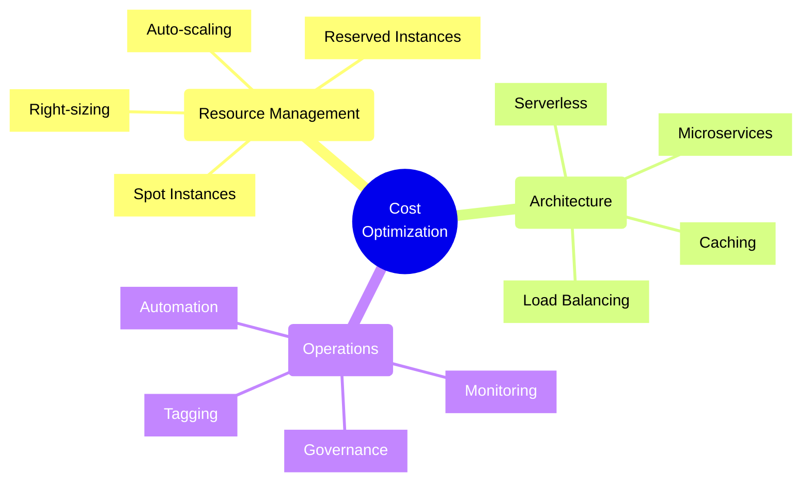
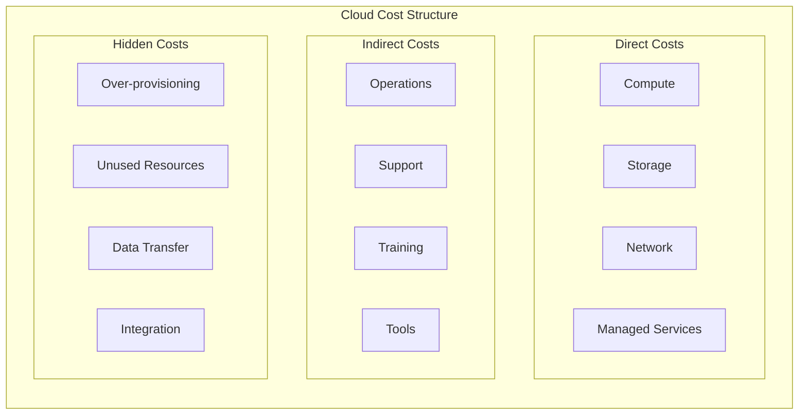
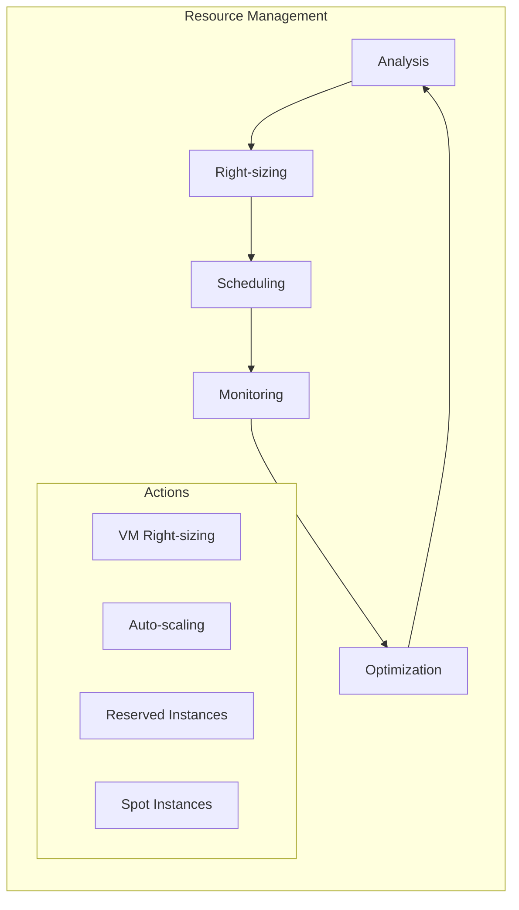
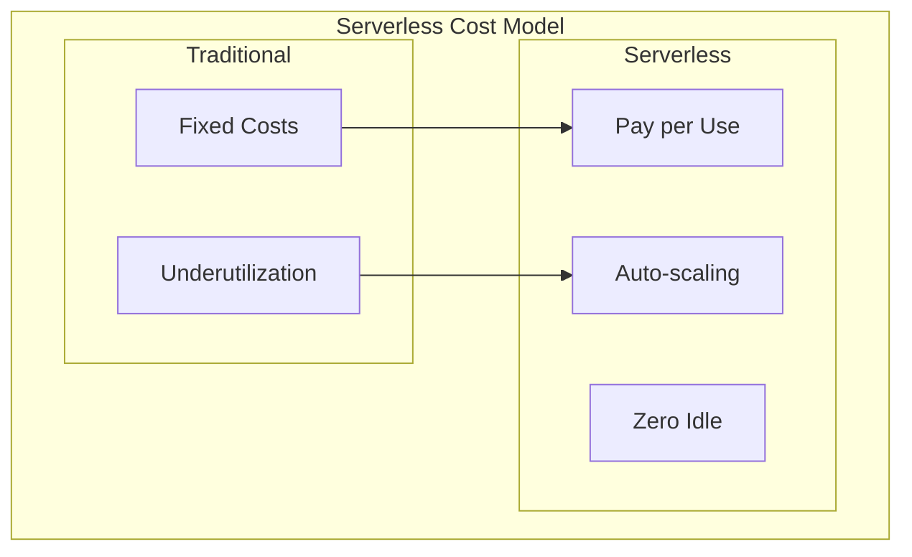
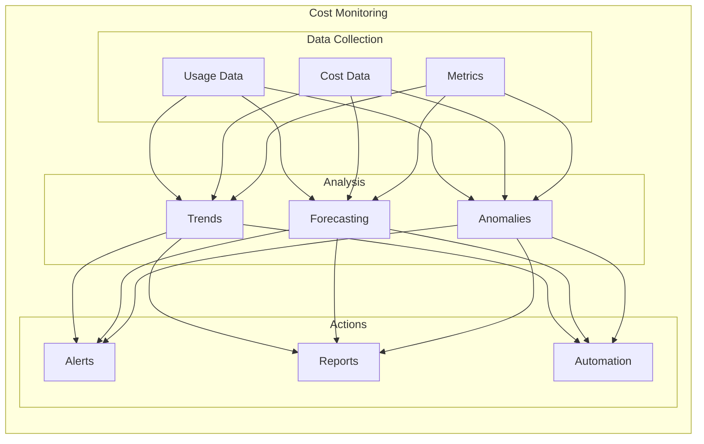
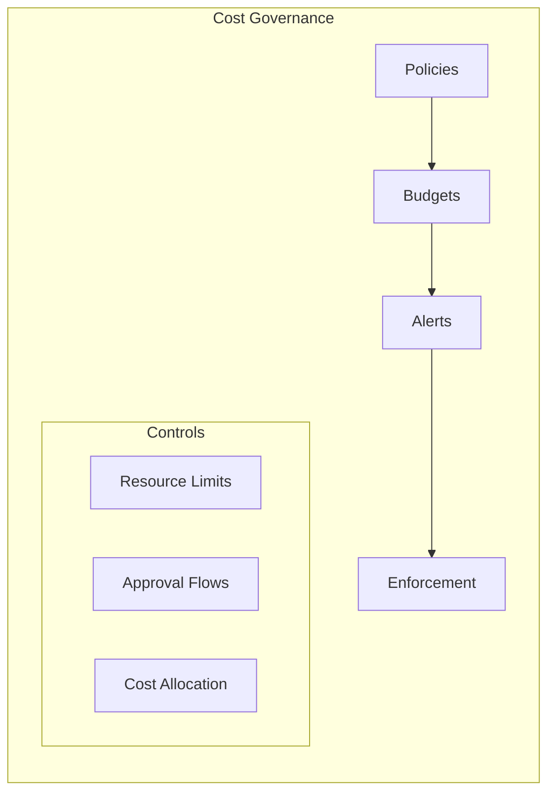

# Cost Optimization Strategies



## Cost Analysis Framework

### 1. Cost Components



## Optimization Strategies

### 1. Resource Optimization



### 2. Implementation Example
```typescript
// Resource Optimizer
interface ResourceMetrics {
    cpu: number;
    memory: number;
    iops: number;
    network: number;
}

class ResourceOptimizer {
    async analyzeUtilization(resourceId: string): Promise<OptimizationRecommendation> {
        const metrics = await this.getResourceMetrics(resourceId);
        const currentCost = await this.getCurrentCost(resourceId);
        
        const recommendation = {
            currentSize: await this.getCurrentSize(resourceId),
            recommendedSize: this.calculateOptimalSize(metrics),
            potentialSavings: this.calculateSavings(currentCost),
            actions: this.generateActions(metrics)
        };
        
        return recommendation;
    }

    private calculateOptimalSize(metrics: ResourceMetrics): string {
        const utilizationPercentage = this.calculateUtilization(metrics);
        if (utilizationPercentage < 30) return 'Downsize';
        if (utilizationPercentage > 80) return 'Upsize';
        return 'Optimal';
    }
}
```

## Cost Management Patterns

### 1. Serverless Architecture Pattern



### 2. Resource Scheduling
```typescript
// Resource Scheduler
class ResourceScheduler {
    async scheduleResources(schedule: Schedule): Promise<void> {
        const resources = await this.getSchedulableResources();
        
        for (const resource of resources) {
            if (this.shouldBeActive(resource, schedule)) {
                await this.startResource(resource);
            } else {
                await this.stopResource(resource);
            }
        }
    }

    private shouldBeActive(resource: Resource, schedule: Schedule): boolean {
        const now = new Date();
        const businessHours = schedule.isBusinessHours(now);
        const criticalResource = resource.tags.includes('critical');
        
        return businessHours || criticalResource;
    }
}
```

## Monitoring and Reporting

### 1. Cost Visibility



### 2. Cost Tracking Implementation
```typescript
class CostTracker {
    async trackResourceCosts(): Promise<CostReport> {
        const resources = await this.getAllResources();
        const costData = await Promise.all(
            resources.map(async resource => {
                const usage = await this.getResourceUsage(resource);
                const cost = await this.calculateCost(resource, usage);
                return {
                    resourceId: resource.id,
                    usage,
                    cost,
                    tags: resource.tags,
                    recommendations: this.generateSavingsRecommendations(usage, cost)
                };
            })
        );

        return this.generateCostReport(costData);
    }

    private generateSavingsRecommendations(usage: Usage, cost: Cost): Recommendation[] {
        const recommendations = [];
        
        if (usage.average < 0.3) {
            recommendations.push({
                type: 'Downsize',
                potentialSavings: cost.monthly * 0.4,
                priority: 'High'
            });
        }

        if (!usage.hasReservedInstance && usage.average > 0.7) {
            recommendations.push({
                type: 'Reserved Instance',
                potentialSavings: cost.monthly * 0.3,
                priority: 'Medium'
            });
        }

        return recommendations;
    }
}
```

## FinOps Best Practices

### 1. Governance Framework



### 2. Cost Allocation
```typescript
// Cost Allocation Manager
class CostAllocationManager {
    async allocateCosts(billingData: BillingData): Promise<AllocationReport> {
        const allocations = new Map<string, number>();
        
        for (const item of billingData.items) {
            const team = this.getTeamFromTags(item.tags);
            const cost = this.calculateSharedCost(item);
            
            allocations.set(team, (allocations.get(team) || 0) + cost);
        }
        
        return this.generateAllocationReport(allocations);
    }

    private calculateSharedCost(item: BillingItem): number {
        const sharedServices = ['monitoring', 'security', 'networking'];
        if (sharedServices.includes(item.service)) {
            return this.distributeSharedCost(item.cost);
        }
        return item.cost;
    }
}
```

## Best Practices

1. **Resource Management**
   - Implement automated right-sizing
   - Use reserved instances for stable workloads
   - Leverage spot instances for flexible workloads
   - Schedule non-production resources

2. **Architecture Optimization**
   - Design for cost efficiency
   - Use serverless where appropriate
   - Implement caching strategies
   - Optimize data transfer

3. **Operational Excellence**
   - Monitor costs continuously
   - Implement tagging policies
   - Automate cost reporting
   - Regular cost reviews

4. **Culture and Process**
   - Build cost-aware culture
   - Regular optimization reviews
   - Clear ownership model
   - Continuous education

Remember: Cost optimization is an ongoing process that requires a balance between performance, reliability, and cost-effectiveness. Regular review and adjustment of strategies is essential for maintaining optimal cloud spend.