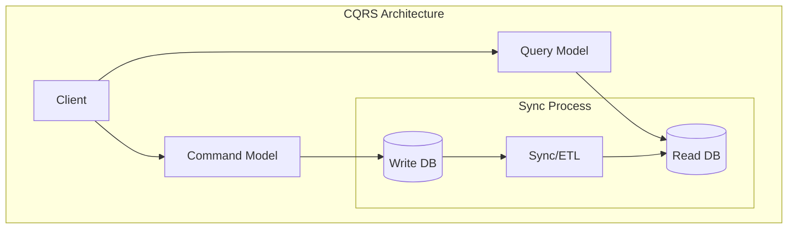
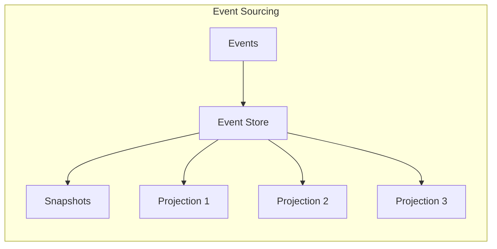
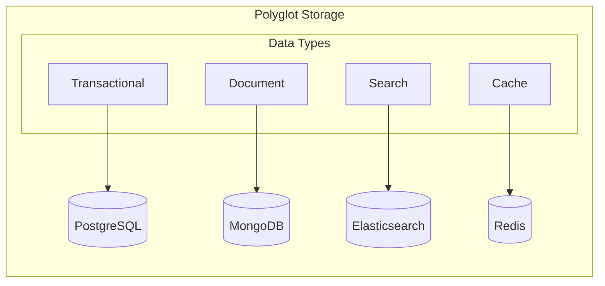
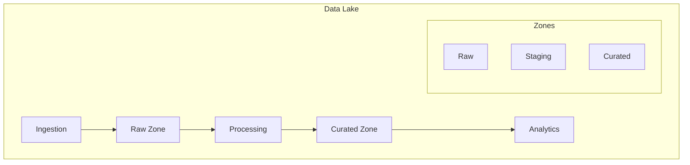
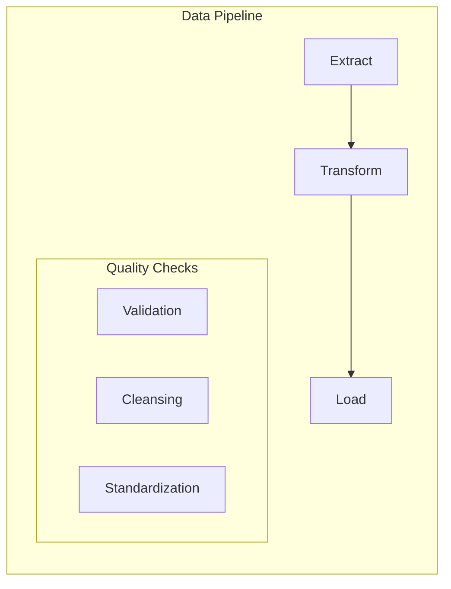
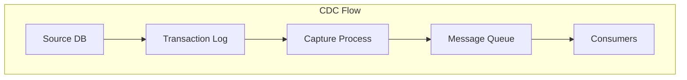
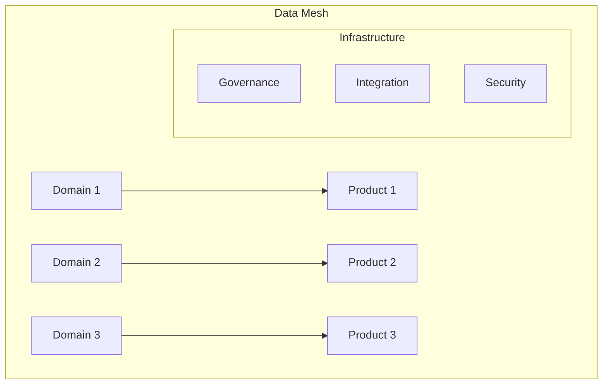
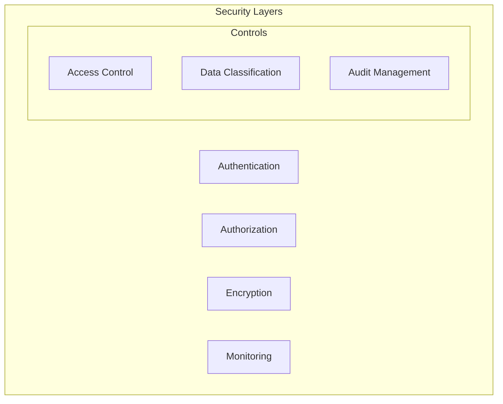

# Data Architecture Patterns

## Core Data Patterns

### 1. CQRS (Command Query Responsibility Segregation)

#### Key Components
1. **Command Side**
   - Write operations
   - Strong consistency
   - Transaction support
   - Data validation

2. **Query Side**
   - Read operations
   - Denormalized views
   - Performance optimized
   - Eventual consistency

### 2. Event Sourcing Pattern

#### Components
1. **Event Store**
   - Immutable log
   - Sequential events
   - Version tracking
   - Event metadata

2. **Projections**
   - Specialized views
   - Real-time processing
   - Custom aggregations
   - State reconstruction

3. **Snapshots**
   - Performance optimization
   - State caching
   - Recovery point
   - Version control

### 3. Polyglot Persistence

#### Storage Selection Matrix

| Data Type | Example Store | Use Case | Trade-offs |
|-----------|--------------|-----------|------------|
| Relational | PostgreSQL | ACID Transactions | Schema Rigidity |
| Document | MongoDB | Flexible Schema | Eventually Consistent |
| Search | Elasticsearch | Full-text Search | Index Overhead |
| Cache | Redis | Fast Access | Volatile Storage |

### 4. Data Lake Architecture

#### Zone Characteristics
1. **Raw Zone**
   - Original format
   - Complete history
   - Immutable data
   - Schema-less

2. **Processing Zone**
   - Data transformation
   - Quality checks
   - Schema enforcement
   - Temporary storage

3. **Curated Zone**
   - Business ready
   - Optimized format
   - Query friendly
   - Analytics ready

## Data Integration Patterns

### 1. ETL/ELT Pipeline

### 2. Change Data Capture

### 3. Data Mesh

## Best Practices

### 1. Data Governance
- Data ownership
- Quality standards
- Security policies
- Compliance rules
- Metadata management

### 2. Performance Optimization
- Indexing strategy
- Query optimization
- Caching layers
- Partitioning
- Data distribution

### 3. Security Framework

### 4. Operational Excellence
- Monitoring setup
- Backup strategy
- Recovery procedures
- Scaling approach
- Maintenance windows

## Decision Framework

### Pattern Selection Criteria
1. **Data Characteristics**
   - Volume
   - Velocity
   - Variety
   - Veracity

2. **Usage Patterns**
   - Read/Write ratio
   - Access patterns
   - Query complexity
   - Consistency needs

3. **Operational Requirements**
   - Availability
   - Scalability
   - Maintenance
   - Cost constraints

Remember: Data architecture should align with business needs while maintaining performance, security, and maintainability.