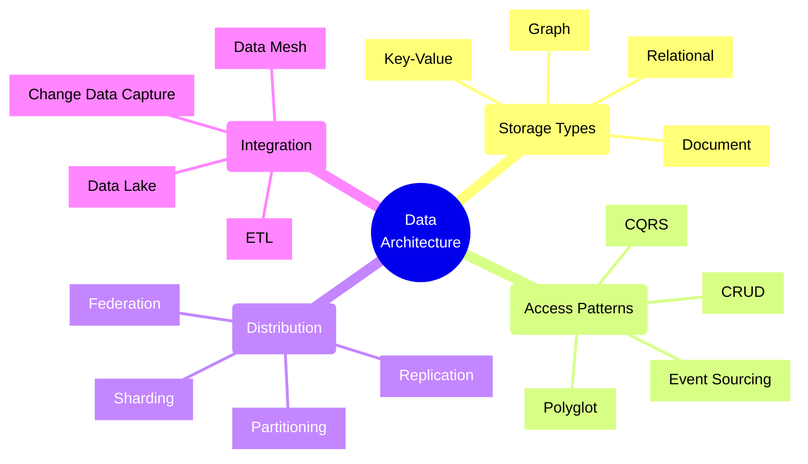
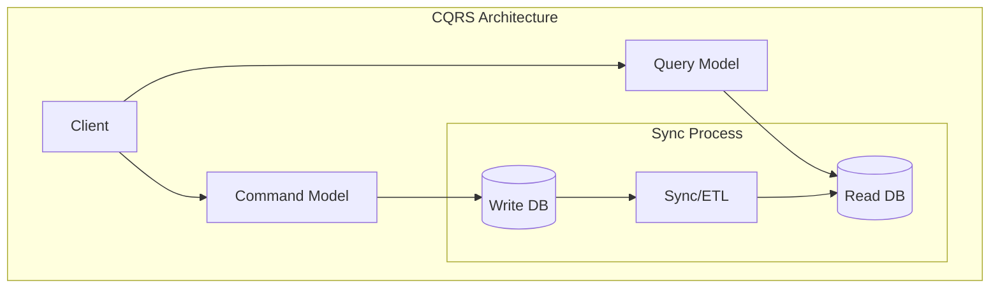
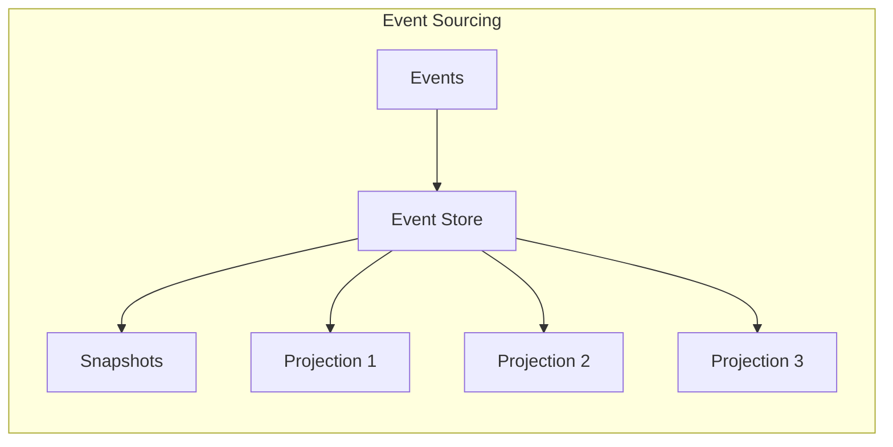
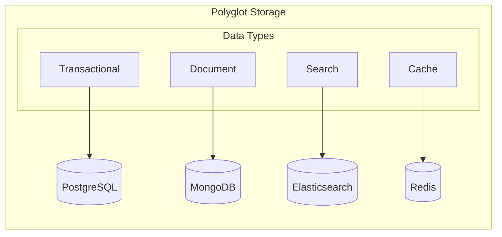
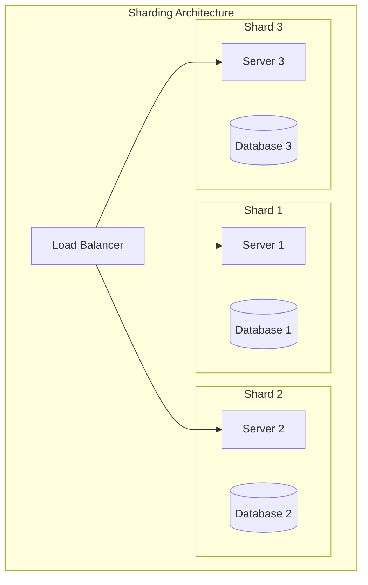
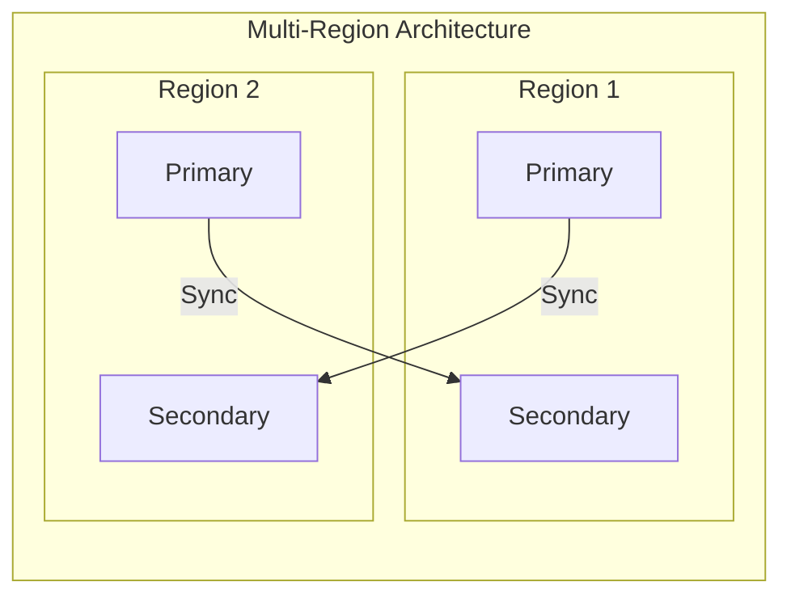

# Data Architecture Patterns



## Core Data Patterns

### 1. CQRS (Command Query Responsibility Segregation)



Implementation Example:
```typescript
// Command side
interface OrderCommand {
    createOrder(order: Order): Promise<string>;
    updateOrder(orderId: string, update: OrderUpdate): Promise<void>;
}

class OrderCommandHandler implements OrderCommand {
    constructor(private writeDb: Database) {}

    async createOrder(order: Order): Promise<string> {
        const orderId = generateId();
        await this.writeDb.execute(
            'INSERT INTO orders (id, customer, items, status) VALUES (?, ?, ?, ?)',
            [orderId, order.customer, JSON.stringify(order.items), 'pending']
        );
        await this.publishEvent('OrderCreated', { orderId, order });
        return orderId;
    }
}

// Query side
interface OrderQuery {
    getOrder(orderId: string): Promise<OrderDetails>;
    getCustomerOrders(customerId: string): Promise<OrderSummary[]>;
}

class OrderQueryHandler implements OrderQuery {
    constructor(private readDb: Database) {}

    async getOrder(orderId: string): Promise<OrderDetails> {
        return this.readDb.queryOne(
            'SELECT * FROM order_details_view WHERE id = ?',
            [orderId]
        );
    }
}
```

### 2. Event Sourcing Pattern



Implementation Example:
```typescript
// Event sourcing with snapshots
class OrderAggregate {
    private state: OrderState;
    private version: number = 0;
    
    async loadFromHistory(events: Event[]): Promise<void> {
        for (const event of events) {
            this.apply(event);
            this.version = event.version;
        }
    }
    
    createOrder(order: Order): Event {
        this.ensureCanCreate(order);
        
        const event = {
            type: 'OrderCreated',
            data: order,
            version: this.version + 1
        };
        
        this.apply(event);
        return event;
    }
    
    private apply(event: Event): void {
        switch (event.type) {
            case 'OrderCreated':
                this.state = {
                    ...event.data,
                    status: 'created'
                };
                break;
            case 'OrderItemAdded':
                this.state.items.push(event.data);
                break;
            // ... other event handlers
        }
    }
}
```

### 3. Polyglot Persistence



Implementation Example:
```typescript
// Polyglot persistence manager
class DataManager {
    constructor(
        private relationalDb: RelationalDB,
        private documentDb: DocumentDB,
        private searchDb: SearchDB,
        private cacheDb: CacheDB
    ) {}

    async saveOrder(order: Order): Promise<void> {
        // Save core transaction data
        const orderId = await this.relationalDb.execute(
            'INSERT INTO orders ...',
            [order.id, order.customerId]
        );

        // Save order details as document
        await this.documentDb.orders.insertOne({
            _id: orderId,
            ...order,
            metadata: { created: new Date() }
        });

        // Index for search
        await this.searchDb.index('orders', {
            id: orderId,
            customerName: order.customerName,
            items: order.items.map(i => i.name)
        });

        // Cache for quick access
        await this.cacheDb.set(
            `order:${orderId}`,
            JSON.stringify(order),
            'EX',
            3600
        );
    }
}
```

## Data Distribution Patterns

### 1. Sharding Strategy



Implementation Example:
```typescript
// Sharding manager with consistent hashing
class ShardManager {
    private shards: Map<string, DatabaseConnection>;
    private hashRing: ConsistentHashRing;

    constructor(shardConfigs: ShardConfig[]) {
        this.hashRing = new ConsistentHashRing();
        
        for (const config of shardConfigs) {
            const connection = createConnection(config);
            this.shards.set(config.id, connection);
            this.hashRing.addNode(config.id);
        }
    }

    async executeQuery(shardKey: string, query: string): Promise<any> {
        const shardId = this.hashRing.getNode(shardKey);
        const shard = this.shards.get(shardId);
        
        return shard.execute(query);
    }
}
```

### 2. Multi-Region Replication



Implementation Example (using Azure Cosmos DB):
```typescript
import { CosmosClient } from "@azure/cosmos";

class MultiRegionDatabase {
    constructor(private client: CosmosClient) {}

    async writeWithConsistency(
        document: any,
        writeRegion: string,
        consistencyLevel: ConsistencyLevel
    ): Promise<void> {
        const container = this.client
            .database('mydb')
            .container('mycollection');

        const options = {
            consistencyLevel,
            sessionToken: null
        };

        if (writeRegion) {
            options.preferredLocations = [writeRegion];
        }

        await container.items.create(document, options);
    }
}
```

## Best Practices

1. **Data Access Patterns**
   - Use appropriate consistency levels
   - Implement proper caching strategy
   - Consider access patterns in schema design
   - Use connection pooling

2. **Data Distribution**
   - Choose sharding key carefully
   - Plan for data locality
   - Implement proper backup strategy
   - Monitor replication lag

3. **Performance Optimization**
   - Index strategically
   - Use appropriate partitioning
   - Monitor query performance
   - Optimize data access patterns

4. **Data Governance**
   - Implement data validation
   - Maintain data quality
   - Apply security controls
   - Monitor data usage

Remember: Data architecture decisions have long-lasting implications for system performance, scalability, and maintenance. Choose patterns that align with your specific requirements while considering future growth.