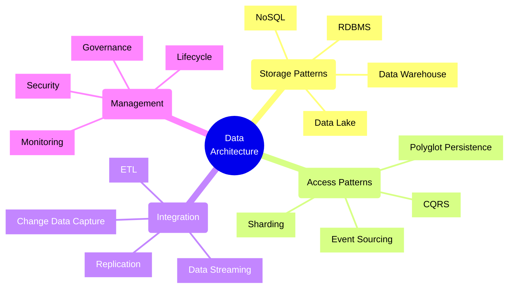
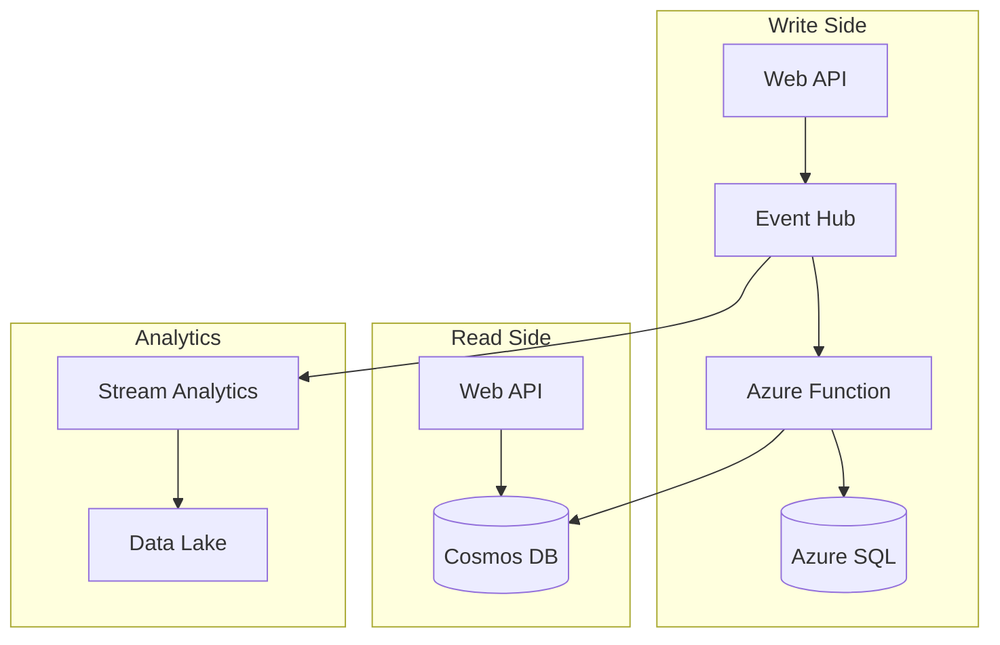
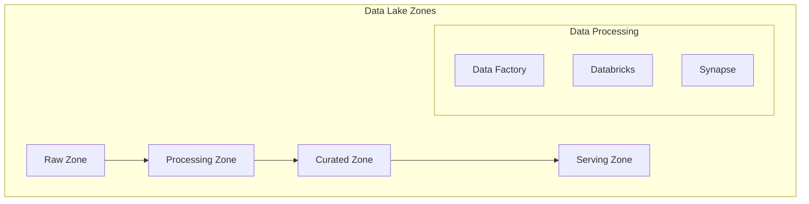
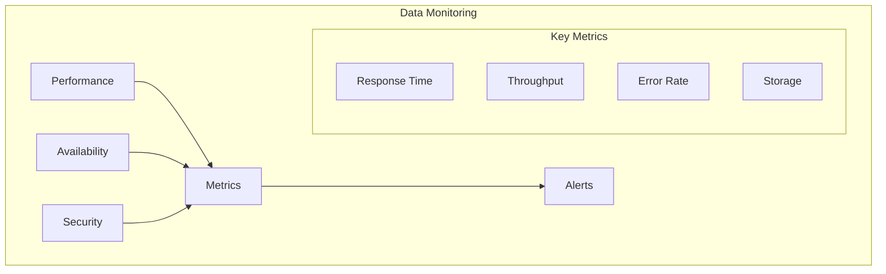

# Data Architecture Patterns

## Core Concepts Overview



## Azure Implementation Patterns

### 1. CQRS with Azure Services



### 2. Data Lake Architecture



## Implementation Examples

### 1. CQRS Pattern
```typescript
// Example: CQRS implementation with Azure
class OrderService {
    constructor(
        private writeDb: SqlDatabase,
        private readDb: CosmosClient,
        private eventHub: EventHubProducerClient
    ) {}
    
    async createOrder(order: Order): Promise<void> {
        // Write to SQL Database
        await this.writeDb.orders.create(order);
        
        // Publish event
        await this.eventHub.sendBatch([{
            body: {
                type: 'OrderCreated',
                data: order
            }
        }]);
    }
    
    async getOrder(orderId: string): Promise<Order> {
        // Read from Cosmos DB
        const container = this.readDb.database('orders').container('orders');
        const { resource } = await container.item(orderId).read();
        return resource;
    }
}
```

### 2. Event Sourcing Pattern
```typescript
// Example: Event Sourcing with Event Hub and Cosmos DB
class EventSourcedOrder {
    private events: OrderEvent[] = [];
    
    async apply(event: OrderEvent): Promise<void> {
        // Store event
        await this.eventHub.sendBatch([{
            body: event
        }]);
        
        // Update read model
        await this.updateReadModel(event);
        
        // Update in-memory state
        this.events.push(event);
    }
    
    private async updateReadModel(event: OrderEvent): Promise<void> {
        const container = this.cosmosClient.database('orders').container('order-view');
        
        switch(event.type) {
            case 'OrderCreated':
                await container.items.create(event.data);
                break;
            case 'OrderUpdated':
                await container.item(event.data.id).replace(event.data);
                break;
            // ... handle other events
        }
    }
}
```

## Implementation Checklist

### Design Phase
- [ ] Choose data storage types
- [ ] Define data access patterns
- [ ] Plan data partitioning
- [ ] Design backup strategy
- [ ] Define SLAs
- [ ] Plan monitoring

### Development Phase
- [ ] Implement data access layer
- [ ] Set up replication
- [ ] Configure monitoring
- [ ] Implement caching
- [ ] Set up backup/restore
- [ ] Configure security

### Operations Phase
- [ ] Monitor performance
- [ ] Optimize queries
- [ ] Manage backups
- [ ] Handle scaling
- [ ] Maintain security
- [ ] Update documentation

## Azure Data Services

### 1. Operational Databases
- **Azure SQL Database**
  - Managed SQL Server
  - Elastic pools
  - Geo-replication
  - Automatic tuning

- **Cosmos DB**
  - Multi-model database
  - Global distribution
  - Multiple consistency levels
  - Automatic scaling

### 2. Analytics
- **Azure Synapse**
  - Data warehousing
  - Big data analytics
  - Real-time analytics
  - Integrated environment

- **Azure Databricks**
  - Big data processing
  - ML workflows
  - Collaborative notebooks
  - Delta Lake support

## Best Practices

### 1. Data Storage
- Choose appropriate storage type
- Plan for scaling
- Implement proper indexing
- Configure backups
- Monitor performance

### 2. Data Access
- Use appropriate patterns
- Implement caching
- Handle concurrency
- Manage connections
- Monitor usage

### 3. Data Security
- Encrypt sensitive data
- Implement access control
- Audit data access
- Secure connections
- Regular security reviews

## Pattern Selection Framework

| Pattern | Use Case | Azure Services | Trade-offs |
|---------|----------|----------------|------------|
| CQRS | High read/write ratio | SQL DB + Cosmos DB | Eventual consistency |
| Event Sourcing | Audit requirements | Event Hub + Cosmos DB | Complexity |
| Data Lake | Big data analytics | Data Lake + Databricks | Management overhead |
| Polyglot | Mixed workloads | Multiple databases | Operational complexity |

## Monitoring Framework



## Data Integration Patterns

### 1. Batch Processing
- ETL pipelines
- Data warehousing
- Periodic synchronization
- Bulk operations

### 2. Real-time Processing
- Change data capture
- Event streaming
- Real-time analytics
- Message queues

### 3. Hybrid Processing
- Lambda architecture
- Kappa architecture
- Data lake processing
- Streaming ETL

Remember:
- Choose patterns based on requirements
- Consider scalability needs
- Plan for data growth
- Monitor performance
- Maintain security
- Document everything
- Test thoroughly