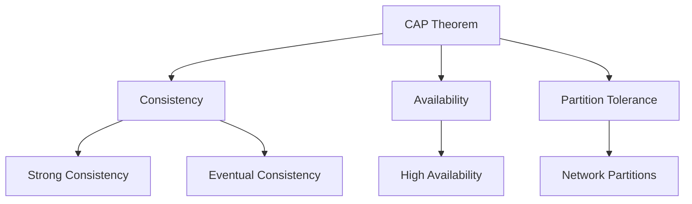

# Data Consistency Models

## Overview of Consistency Models

### Strong Consistency
- All reads reflect the most recent write
- All replicas are in sync
- Highest consistency guarantee
- Examples:
  - Single-leader databases
  - Synchronous replication
  - Two-phase commit (2PC)

### Eventual Consistency
- Replicas will converge over time
- Reads may return stale data
- Better availability and performance
- Examples:
  - DNS systems
  - Social media feeds
  - Content delivery networks

### Causal Consistency
- Preserves cause-and-effect relationships
- Operations that are causally related appear in order
- Independent operations can be seen in different orders
- Examples:
  - Chat applications
  - Collaborative editing
  - Social media comments

## CAP Theorem Trade-offs



### CP Systems (Consistency + Partition Tolerance)
- MongoDB (in default configuration)
- Apache HBase
- Redis (in cluster mode)

### AP Systems (Availability + Partition Tolerance)
- Apache Cassandra
- CouchDB
- Amazon DynamoDB (in multi-region mode)

### CA Systems (Consistency + Availability)
- Traditional RDBMS
- Single-node databases
- Note: Not truly achievable in distributed systems

## Implementation Patterns

### 1. Strong Consistency Implementation
```python
# Example using distributed lock
def update_with_strong_consistency(data):
    try:
        lock.acquire()
        write_to_all_replicas(data)
        verify_all_replicas()
        commit_transaction()
    finally:
        lock.release()
```

### 2. Eventual Consistency Implementation
```python
# Example of async replication
def update_with_eventual_consistency(data):
    write_to_primary(data)
    async_replicate_to_secondaries(data)
    return success  # Don't wait for replication
```

### 3. Causal Consistency Implementation
```python
# Example using vector clocks
def update_with_causal_consistency(data, vector_clock):
    if is_causally_ready(data, vector_clock):
        apply_update(data)
        increment_vector_clock()
    else:
        queue_for_later(data, vector_clock)
```

## Consistency Levels in Different Systems

### Azure Cosmos DB
- Strong
- Bounded staleness
- Session
- Consistent prefix
- Eventual

### Apache Cassandra
- ALL
- QUORUM
- LOCAL_QUORUM
- ONE
- ANY

### MongoDB
- Primary
- PrimaryPreferred
- Secondary
- SecondaryPreferred
- Nearest

## Use Case Selection Guide

### Strong Consistency
- Financial transactions
- Inventory management
- User authentication
- Payment processing

### Eventual Consistency
- Social media posts
- Product reviews
- Activity logs
- Analytics data

### Causal Consistency
- Messaging systems
- Collaborative documents
- Comment threads
- Status updates

## Consistency Patterns

### 1. Read-Your-Writes Consistency
```javascript
// Example implementation
async function updateProfile(userId, data) {
    await writeToDatabase(userId, data);
    const cacheKey = `user:${userId}`;
    await invalidateCache(cacheKey);
}
```

### 2. Monotonic Reads
```javascript
// Example using session tokens
class SessionBasedReader {
    constructor(sessionToken) {
        this.sessionToken = sessionToken;
    }
    
    async read(key) {
        return await database.read(key, {
            minSessionToken: this.sessionToken
        });
    }
}
```

### 3. Monotonic Writes
```javascript
// Example using version numbers
async function writeWithVersion(key, value) {
    const currentVersion = await getVersion(key);
    await write(key, value, {
        version: currentVersion + 1,
        previousVersion: currentVersion
    });
}
```

## Monitoring and Validation

### Metrics to Track
- Replication lag
- Consistency violations
- Read/write latencies
- Conflict rates
- Resolution times

### Testing Strategies
1. Chaos testing for network partitions
2. Load testing with mixed read/write workloads
3. Consistency verification tools
4. Multi-region deployment testing

## Common Challenges and Solutions

### 1. Split Brain Problem
- Detection mechanisms
- Quorum-based decisions
- Fencing tokens
- Leader election protocols

### 2. Clock Synchronization
- Logical clocks
- Vector clocks
- Lamport timestamps
- NTP considerations

### 3. Conflict Resolution
- Last-write-wins
- Custom merge functions
- Operational transforms
- CRDTs (Conflict-free Replicated Data Types)

## References
- Martin Kleppmann's "Designing Data-Intensive Applications"
- Azure Cosmos DB Consistency Levels Documentation
- Apache Cassandra Documentation
- MongoDB Consistency Documentation
- "Consistency Models in Modern Distributed Systems" - ACM Paper