# Data Modeling and Database Design

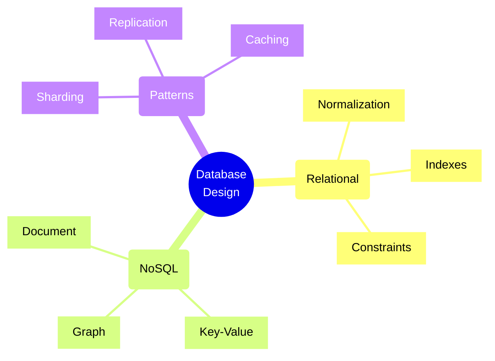

## Data Modeling Concepts

### 1. Conceptual Data Model
The highest-level view of data relationships, focusing on business concepts rather than technical implementation.

Example:
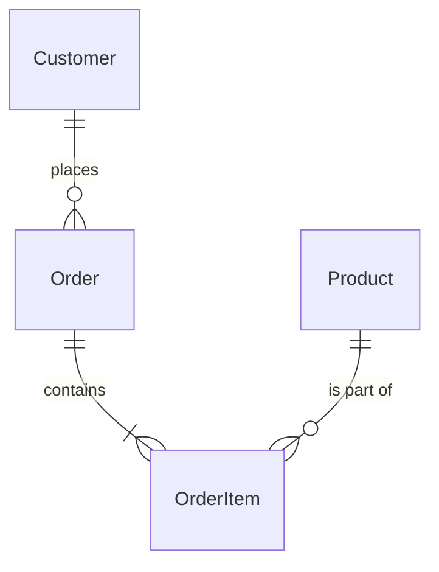

### 2. Logical Data Model
Describes data in detail without regard to physical implementation. Includes all entities and relationships.

Example for an E-commerce System:
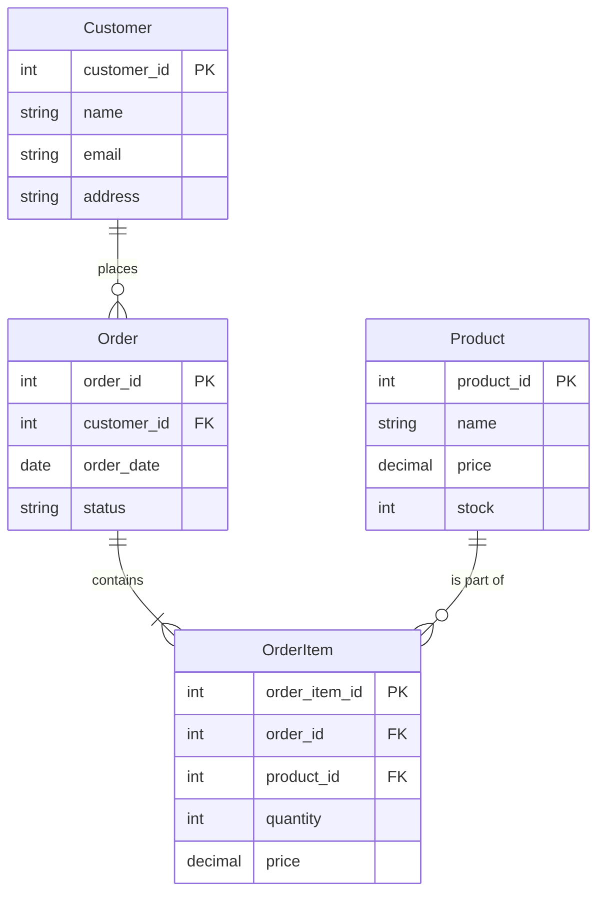

### 3. Physical Data Model
Represents the actual implementation of the database, including tables, columns, data types, and constraints.

Example SQL Schema:
```sql
CREATE TABLE Customer (
    customer_id INT PRIMARY KEY,
    name VARCHAR(100),
    email VARCHAR(100) UNIQUE,
    address TEXT
);

CREATE TABLE Order (
    order_id INT PRIMARY KEY,
    customer_id INT,
    order_date DATE,
    status VARCHAR(20),
    FOREIGN KEY (customer_id) REFERENCES Customer(customer_id)
);
```

## Database Design Concepts

### 1. Normalization
Process of organizing data to reduce redundancy and improve data integrity.

#### First Normal Form (1NF)
- Atomic values (indivisible)
- No repeating groups

Before 1NF:
```
Customer(id, name, phone_numbers)
1, John Doe, "555-0123, 555-0124"
```

After 1NF:
```
Customer(id, name)
1, John Doe

CustomerPhone(customer_id, phone_number)
1, 555-0123
1, 555-0124
```

#### Second Normal Form (2NF)
- Must be in 1NF
- No partial dependencies

#### Third Normal Form (3NF)
- Must be in 2NF
- No transitive dependencies

### 2. Denormalization
Strategic decision to allow redundancy for performance benefits.

Example:
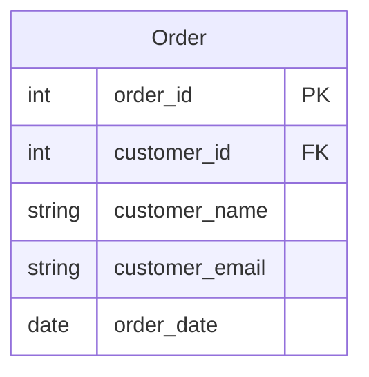

### 3. Database Relationships

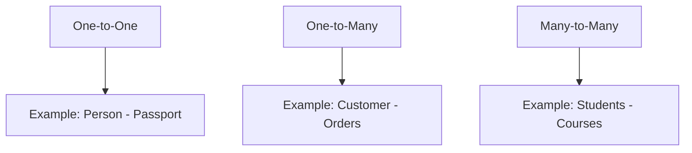

#### Implementation Examples:

1. One-to-One:
```sql
CREATE TABLE Person (
    person_id INT PRIMARY KEY,
    name VARCHAR(100)
);

CREATE TABLE Passport (
    passport_id INT PRIMARY KEY,
    person_id INT UNIQUE,
    passport_number VARCHAR(20),
    FOREIGN KEY (person_id) REFERENCES Person(person_id)
);
```

2. One-to-Many:
```sql
CREATE TABLE Customer (
    customer_id INT PRIMARY KEY,
    name VARCHAR(100)
);

CREATE TABLE Order (
    order_id INT PRIMARY KEY,
    customer_id INT,
    order_date DATE,
    FOREIGN KEY (customer_id) REFERENCES Customer(customer_id)
);
```

3. Many-to-Many:
```sql
CREATE TABLE Student (
    student_id INT PRIMARY KEY,
    name VARCHAR(100)
);

CREATE TABLE Course (
    course_id INT PRIMARY KEY,
    name VARCHAR(100)
);

CREATE TABLE StudentCourse (
    student_id INT,
    course_id INT,
    PRIMARY KEY (student_id, course_id),
    FOREIGN KEY (student_id) REFERENCES Student(student_id),
    FOREIGN KEY (course_id) REFERENCES Course(course_id)
);
```

### 4. Indexing Strategies

#### Types of Indexes:
- Primary Index
- Secondary Index
- Composite Index
- Clustered vs. Non-clustered Index

Example:
```sql
-- Primary Index (automatically created with PRIMARY KEY)
CREATE TABLE Product (
    product_id INT PRIMARY KEY,
    name VARCHAR(100),
    price DECIMAL(10,2)
);

-- Secondary Index
CREATE INDEX idx_product_name ON Product(name);

-- Composite Index
CREATE INDEX idx_product_name_price ON Product(name, price);
```

### 5. Partitioning

#### Horizontal Partitioning (Sharding)
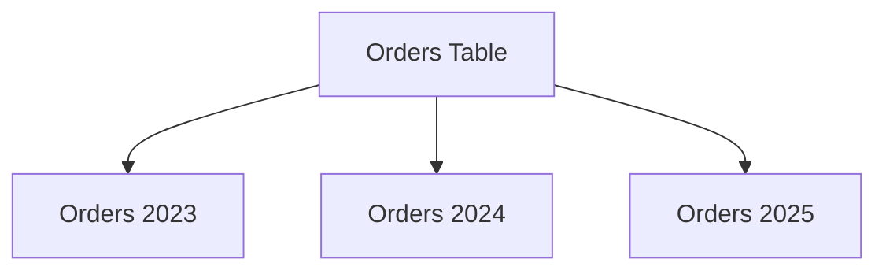

#### Vertical Partitioning
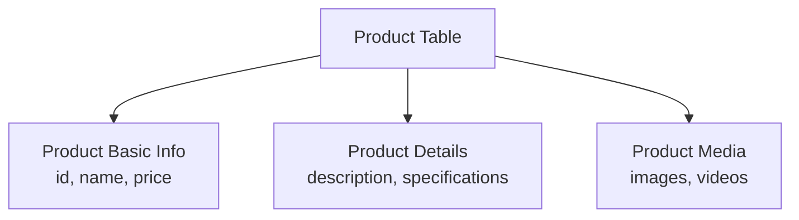

## Database Patterns

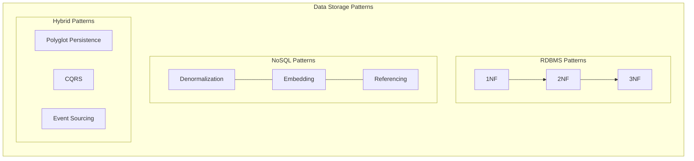

## Data Access Patterns

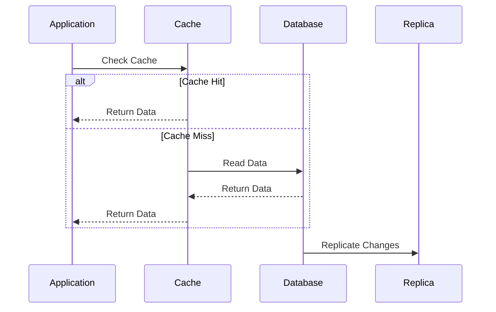

## Implementation Examples

### 1. Repository Pattern

```typescript
interface Repository<T> {
    findById(id: string): Promise<T | null>;
    findAll(criteria: FilterCriteria): Promise<T[]>;
    create(entity: T): Promise<T>;
    update(id: string, entity: Partial<T>): Promise<T>;
    delete(id: string): Promise<void>;
}

class UserRepository implements Repository<User> {
    constructor(
        private db: Database,
        private cache: Cache
    ) {}

    async findById(id: string): Promise<User | null> {
        // Check cache first
        const cached = await this.cache.get(`user:${id}`);
        if (cached) return JSON.parse(cached);

        // Query database
        const user = await this.db.query(
            'SELECT * FROM users WHERE id = ?',
            [id]
        );

        // Cache result
        if (user) {
            await this.cache.set(
                `user:${id}`,
                JSON.stringify(user),
                { ttl: 3600 }
            );
        }

        return user;
    }

    async create(user: User): Promise<User> {
        const result = await this.db.query(
            'INSERT INTO users (name, email) VALUES (?, ?)',
            [user.name, user.email]
        );

        // Invalidate cache
        await this.cache.delete(`user:${result.id}`);

        return { ...user, id: result.id };
    }
}
```

### 2. Query Builder Pattern

```typescript
class QueryBuilder {
    private conditions: string[] = [];
    private params: any[] = [];
    private sorts: string[] = [];
    private limitValue?: number;
    private offsetValue?: number;

    where(field: string, operator: string, value: any): this {
        this.conditions.push(`${field} ${operator} ?`);
        this.params.push(value);
        return this;
    }

    orderBy(field: string, direction: 'ASC' | 'DESC'): this {
        this.sorts.push(`${field} ${direction}`);
        return this;
    }

    limit(value: number): this {
        this.limitValue = value;
        return this;
    }

    offset(value: number): this {
        this.offsetValue = value;
        return this;
    }

    build(): { sql: string; params: any[] } {
        let sql = 'SELECT * FROM users';

        if (this.conditions.length) {
            sql += ` WHERE ${this.conditions.join(' AND ')}`;
        }

        if (this.sorts.length) {
            sql += ` ORDER BY ${this.sorts.join(', ')}`;
        }

        if (this.limitValue !== undefined) {
            sql += ` LIMIT ${this.limitValue}`;
        }

        if (this.offsetValue !== undefined) {
            sql += ` OFFSET ${this.offsetValue}`;
        }

        return { sql, params: this.params };
    }
}
```

### 3. Unit of Work Pattern

```typescript
class UnitOfWork {
    private transactions: Transaction[] = [];

    async begin(): Promise<void> {
        const transaction = await this.db.beginTransaction();
        this.transactions.push(transaction);
    }

    async commit(): Promise<void> {
        const transaction = this.transactions.pop();
        if (!transaction) {
            throw new Error('No active transaction');
        }
        await transaction.commit();
    }

    async rollback(): Promise<void> {
        const transaction = this.transactions.pop();
        if (!transaction) {
            throw new Error('No active transaction');
        }
        await transaction.rollback();
    }

    async execute<T>(work: () => Promise<T>): Promise<T> {
        await this.begin();
        try {
            const result = await work();
            await this.commit();
            return result;
        } catch (error) {
            await this.rollback();
            throw error;
        }
    }
}
```

## Data Model Visualization

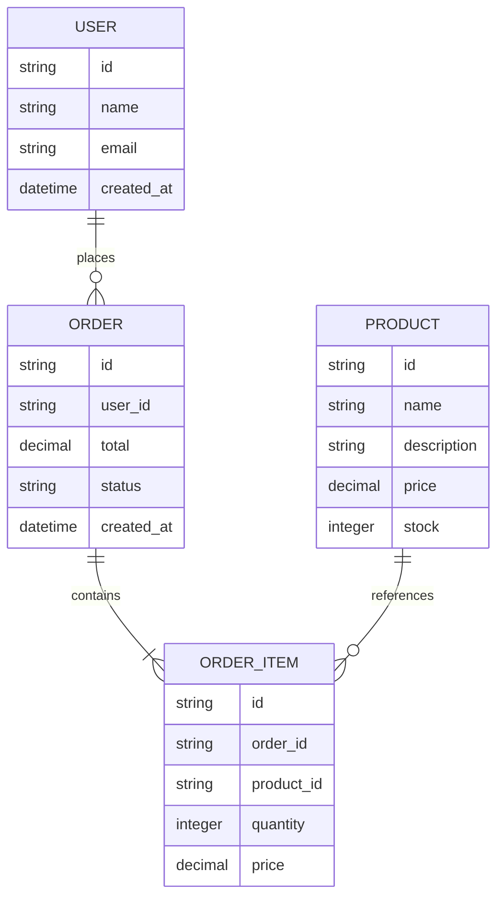

## Best Practices

1. **Use Appropriate Data Types**
   - Choose the most appropriate data type for each column
   - Consider storage and performance implications

2. **Implement Constraints**
   - Primary Keys
   - Foreign Keys
   - Unique Constraints
   - Check Constraints
   - Not Null Constraints

3. **Design for Scale**
   - Consider future growth
   - Plan for partitioning
   - Implement proper indexing
   - Use appropriate normalization level

4. **Security Considerations**
   - Implement proper access controls
   - Encrypt sensitive data
   - Use parameterized queries
   - Regular security audits

5. **Performance Optimization**
   - Efficient indexing strategy
   - Query optimization
   - Proper normalization/denormalization balance
   - Regular maintenance and monitoring

## Common Design Patterns

### 1. Event Sourcing
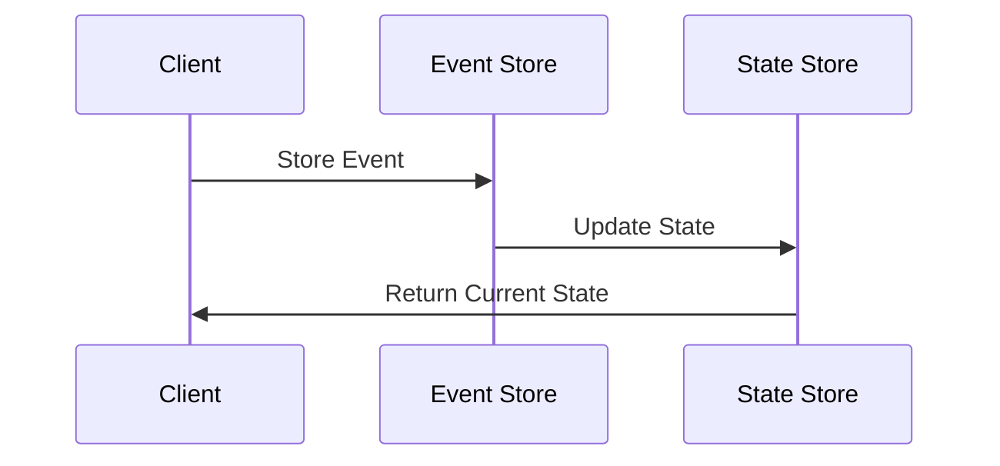

### 2. CQRS (Command Query Responsibility Segregation)
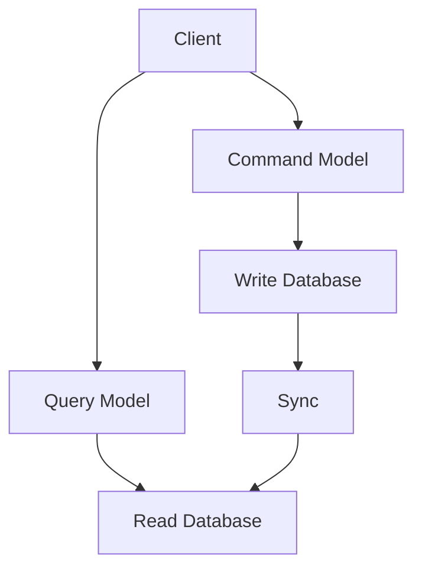

### 3. Multi-tenant Data Architecture
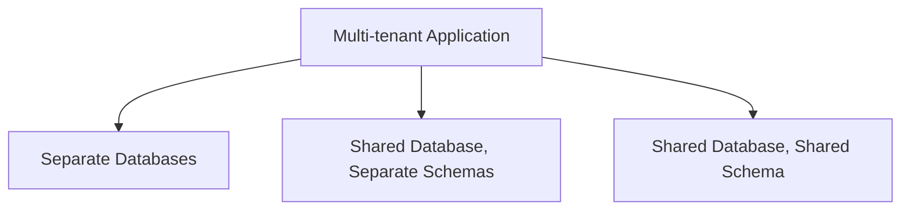

## Database Types and Use Cases

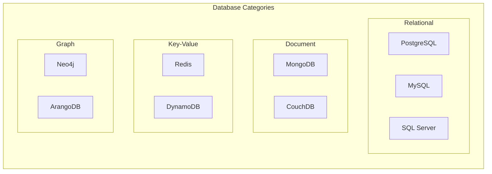

### 1. Relational Databases (RDBMS)
- PostgreSQL
- MySQL
- SQL Server
- Oracle

Best for: Structured data with complex relationships

### 2. Document Databases
- MongoDB
- CouchDB

Best for: Semi-structured data, flexible schema requirements

### 3. Key-Value Stores
- Redis
- DynamoDB

Best for: Caching, session management, real-time data

### 4. Graph Databases
- Neo4j
- ArangoDB

Best for: Highly connected data (social networks, recommendation engines)

### 5. Time Series Databases
- InfluxDB
- TimescaleDB

Best for: Time-series data, monitoring, IoT applications

## Data Relationships

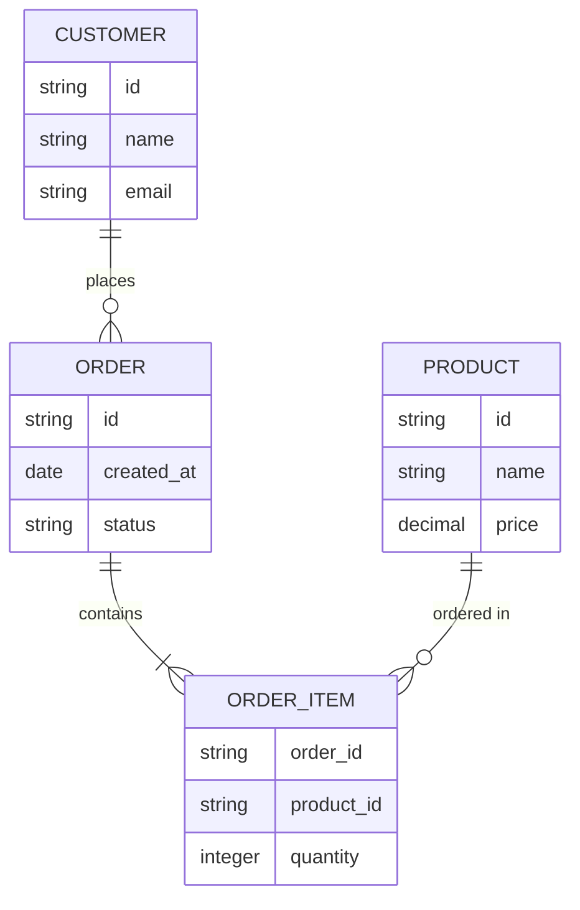

## Conclusion

Effective data modeling and database design are crucial for building scalable, maintainable, and efficient systems. The key is to understand these concepts deeply and know when to apply which approach based on your specific use case and requirements.