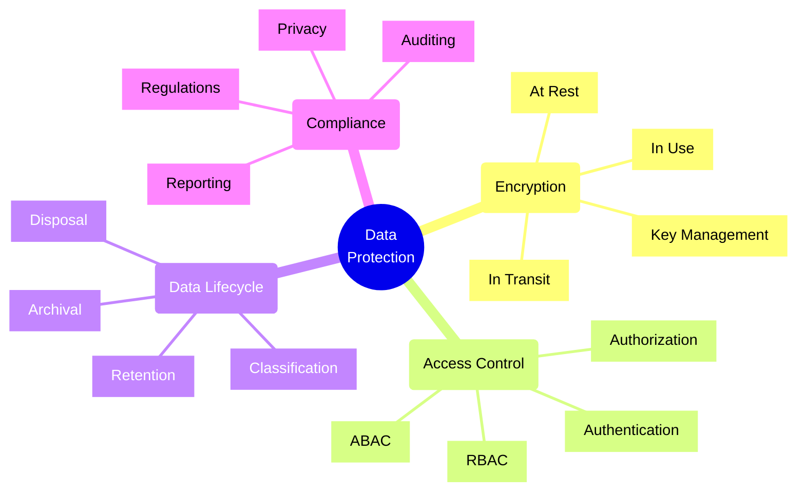
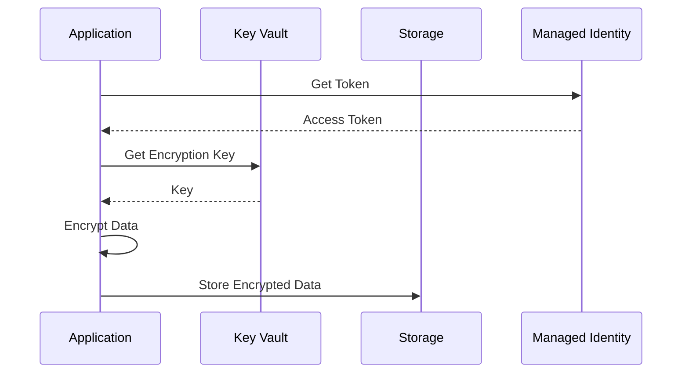
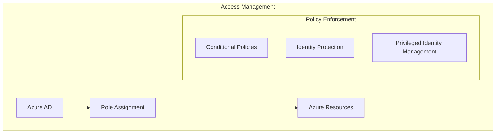
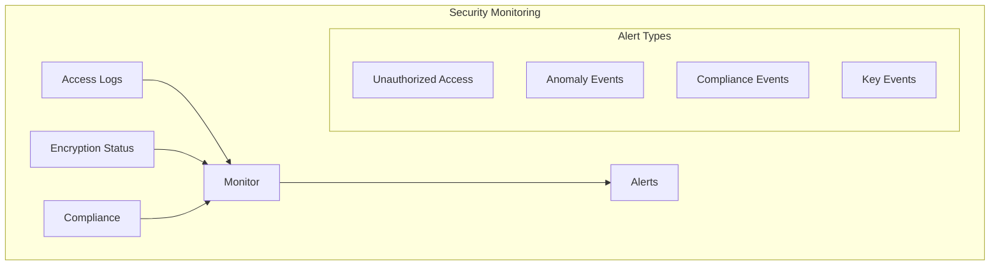

# Data Protection Strategies

## Core Concepts Overview



## Azure Implementation Patterns

### 1. Data Encryption Flow



### 2. Data Access Control



## Implementation Examples

### 1. Client-Side Encryption
```typescript
// Example: Implementing client-side encryption for Azure Storage
class SecureStorageClient {
    constructor(
        private blobClient: BlobServiceClient,
        private keyVaultClient: KeyVaultClient
    ) {}
    
    async uploadSecureBlob(containerName: string, blobName: string, data: Buffer): Promise<void> {
        // Get encryption key from Key Vault
        const key = await this.keyVaultClient.getKey('data-encryption-key');
        
        // Encrypt data
        const encryptionKey = await this.createEncryptionKey(key);
        const encryptedData = await this.encryptData(data, encryptionKey);
        
        // Upload encrypted data
        const containerClient = this.blobClient.getContainerClient(containerName);
        const blobClient = containerClient.getBlobClient(blobName);
        
        await blobClient.upload(encryptedData, encryptedData.length);
    }
    
    private async encryptData(data: Buffer, key: CryptoKey): Promise<Buffer> {
        // Implement encryption logic
        const iv = crypto.randomBytes(16);
        const cipher = crypto.createCipheriv('aes-256-gcm', key, iv);
        
        return Buffer.concat([
            iv,
            cipher.update(data),
            cipher.final()
        ]);
    }
}
```

### 2. Data Classification and Protection
```typescript
// Example: Implementing data classification and protection
class DataProtectionService {
    async processData(data: any): Promise<ProcessedData> {
        // Classify data
        const classification = await this.classifyData(data);
        
        // Apply protection based on classification
        const protectedData = await this.applyProtection(data, classification);
        
        // Log access for audit
        await this.logAccess({
            dataId: protectedData.id,
            classification: classification,
            timestamp: new Date(),
            action: 'PROCESS'
        });
        
        return protectedData;
    }
    
    private async applyProtection(data: any, classification: DataClassification): Promise<ProcessedData> {
        switch(classification) {
            case 'PUBLIC':
                return this.handlePublicData(data);
            case 'INTERNAL':
                return this.handleInternalData(data);
            case 'CONFIDENTIAL':
                return this.handleConfidentialData(data);
            case 'RESTRICTED':
                return this.handleRestrictedData(data);
            default:
                throw new Error('Unknown classification');
        }
    }
}
```

## Implementation Checklist

### Design Phase
- [ ] Classify data sensitivity
- [ ] Define protection requirements
- [ ] Plan encryption strategy
- [ ] Design access controls
- [ ] Plan audit logging
- [ ] Define retention policies

### Development Phase
- [ ] Implement encryption
- [ ] Configure access controls
- [ ] Set up audit logging
- [ ] Implement backup strategy
- [ ] Configure monitoring
- [ ] Test security controls

### Operations Phase
- [ ] Monitor access patterns
- [ ] Review audit logs
- [ ] Rotate encryption keys
- [ ] Update access policies
- [ ] Perform security audits
- [ ] Maintain compliance

## Azure Security Services

### 1. Encryption Services
- **Azure Key Vault**
  - Key management
  - Secret management
  - Certificate management
  - HSM backing

- **Storage Service Encryption**
  - Automatic encryption
  - Microsoft-managed keys
  - Customer-managed keys
  - Infrastructure encryption

### 2. Access Control
- **Azure Active Directory**
  - Identity management
  - Role-based access
  - Conditional access
  - Multi-factor authentication

- **Azure Policy**
  - Policy enforcement
  - Compliance monitoring
  - Resource governance
  - Security standards

## Best Practices

### 1. Data Protection
- Encrypt sensitive data
- Use strong encryption algorithms
- Implement key rotation
- Secure key storage
- Regular security assessments

### 2. Access Management
- Implement least privilege
- Use role-based access
- Enable MFA
- Regular access reviews
- Monitor suspicious activity

### 3. Compliance
- Document procedures
- Regular audits
- Employee training
- Incident response plan
- Regular updates

## Protection Level Framework

| Level | Description | Controls | Example Data |
|-------|-------------|----------|--------------|
| Public | No restrictions | Basic protection | Marketing materials |
| Internal | Limited access | Access controls | Internal documents |
| Confidential | Strict controls | Encryption + MFA | Customer data |
| Restricted | Highest security | Full suite | Financial records |

## Monitoring Framework



## Common Protection Strategies

### 1. Data at Rest
- Storage encryption
- Database encryption
- File system encryption
- Backup encryption

### 2. Data in Transit
- TLS encryption
- VPN tunnels
- API encryption
- Network encryption

### 3. Data in Use
- Confidential computing
- Memory encryption
- Secure enclaves
- Process isolation

Remember:
- Security is a continuous process
- Regular security assessments
- Keep up with compliance
- Monitor and audit regularly
- Train team members
- Update documentation
- Test security controls