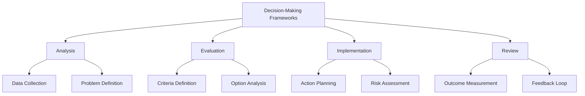
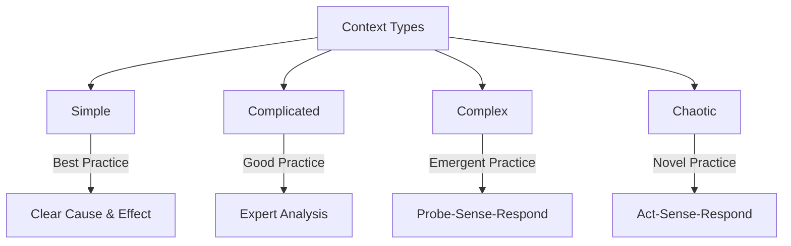
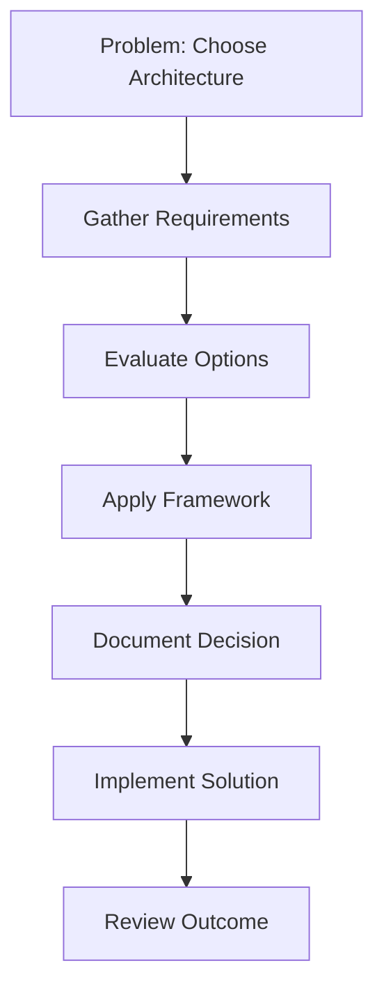
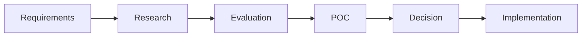

# Decision-Making Frameworks

## Overview
Decision-making frameworks provide structured approaches to evaluate options, consider trade-offs, and make informed choices in complex technical scenarios.



## Common Frameworks

### DACI Framework
- **Driver**: Person driving the decision process
- **Approver**: Person with final approval authority
- **Contributors**: People providing input
- **Informed**: People who need to know the outcome

### RAPID Framework
- **Recommend**: People who propose solutions
- **Agree**: People who must agree with the decision
- **Perform**: People who implement the decision
- **Input**: People consulted for input
- **Decide**: Person who makes the final decision

### OODA Loop
- **Observe**: Gather information
- **Orient**: Analyze and synthesize data
- **Decide**: Choose a course of action
- **Act**: Implement the decision

### Cynefin Framework


## Decision-Making Process

### 1. Problem Definition
- Clear statement of the issue
- Context and constraints
- Stakeholder identification

### 2. Data Collection
- Relevant metrics
- Historical data
- Expert opinions
- Market research

### 3. Option Analysis
- Generate alternatives
- Evaluate feasibility
- Consider constraints
- Assess risks

### 4. Decision Making
- Apply appropriate framework
- Consider stakeholder input
- Document rationale
- Communicate decision

## Best Practices Checklist

### Problem Definition
- [ ] Define the problem clearly
- [ ] Identify stakeholders
- [ ] Document constraints
- [ ] Set success criteria

### Data Collection
- [ ] Gather relevant data
- [ ] Consult experts
- [ ] Research similar cases
- [ ] Document assumptions

### Option Analysis
- [ ] List all viable options
- [ ] Evaluate feasibility
- [ ] Consider risks
- [ ] Document trade-offs

### Decision Making
- [ ] Apply framework
- [ ] Document rationale
- [ ] Communicate decision
- [ ] Plan implementation

## Tools and Techniques

### Analysis Tools
- Decision Trees
- Cost-Benefit Analysis
- SWOT Analysis
- Risk Assessment Matrix

### Collaboration Tools
- Decision Matrix
- Voting Systems
- Consensus Building
- Stakeholder Mapping

## Common Challenges

### Analysis Paralysis
- Too many options
- Over-analysis
- Delayed decisions
- Solution: Set decision deadlines

### Stakeholder Management
- Conflicting interests
- Communication gaps
- Resistance to change
- Solution: Clear communication plan

## Examples

### Decision Matrix Template
| Option | Criteria 1 | Criteria 2 | Criteria 3 | Total |
|--------|------------|------------|------------|-------|
| A      | 5          | 4          | 3          | 12    |
| B      | 3          | 5          | 4          | 12    |
| C      | 4          | 3          | 5          | 12    |

### DACI Template
```plaintext
Decision: [Description of decision needed]

Driver: [Name/Role]
- Responsible for driving the decision process
- Timeline management
- Stakeholder coordination

Approver: [Name/Role]
- Final decision maker
- Accountability for outcome

Contributors: [Names/Roles]
- Technical experts
- Domain specialists
- Implementation team

Informed: [Names/Roles]
- Stakeholders to be notified
- Affected teams
- Dependencies
```

### Decision Log
| Date       | Decision    | Framework | Rationale  | Outcome    |
|------------|-------------|-----------|------------|------------|
| 2025-05-02 | Cloud Migration | RAPID  | Cost reduction | Approved    |
| 2025-05-01 | API Design | DACI   | Standardization | In Progress |

## Real-World Scenarios

### Technical Architecture


### Technology Selection


## Additional Resources
1. Books
   - "Smart Choices" by John S. Hammond
   - "Thinking in Systems" by Donella H. Meadows
   - "The Art of Action" by Stephen Bungay

2. Online Courses
   - Decision Analysis and Leadership
   - Strategic Decision Making
   - Risk Management in Technology

3. Tools
   - Decision Matrix Tools
   - Project Management Software
   - Collaboration Platforms