# Distributed Systems Concepts

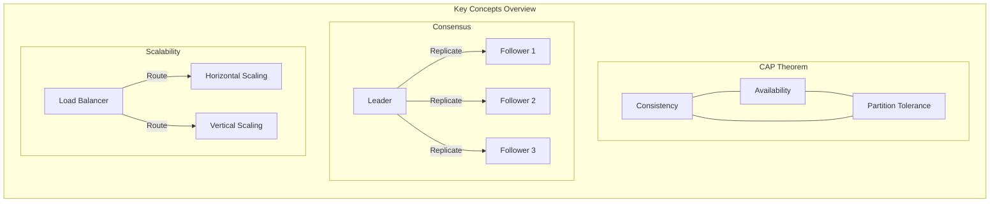

## Distributed System Types

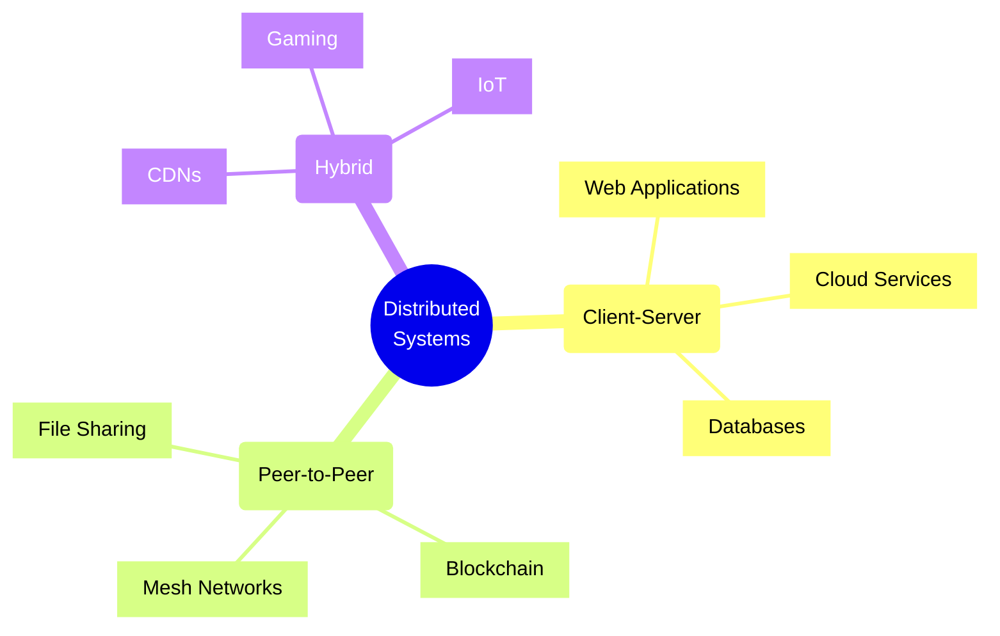

## Consistency Models

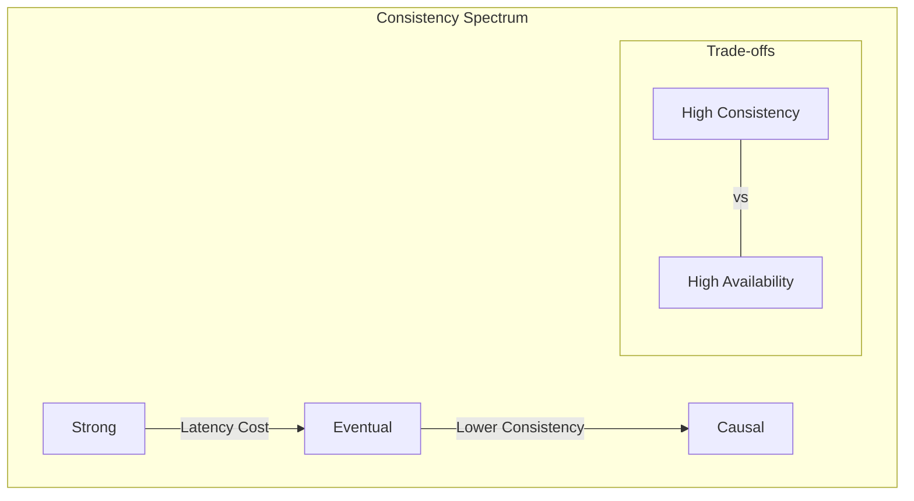

# Distributed Systems Concepts

A distributed system is a collection of independent components located on different networked computers that work together as a single coherent system. Here's a comprehensive guide to distributed systems concepts:

## 1. Fundamental Concepts

### CAP Theorem
The CAP theorem states that a distributed system can only provide two of these three guarantees simultaneously:
- **Consistency**: All nodes see the same data at the same time
- **Availability**: Every request receives a response
- **Partition Tolerance**: The system continues to operate despite network failures

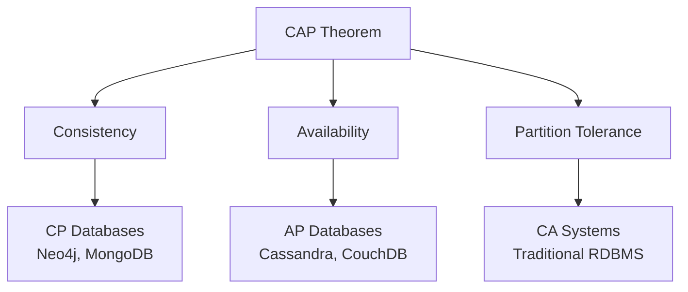

### Implementation Example
```java
// Example of eventual consistency in a distributed cache
public class DistributedCache {
    private Map<String, String> localCache;
    private Queue<CacheUpdate> updateQueue;
    
    public void put(String key, String value) {
        // Update local cache immediately
        localCache.put(key, value);
        
        // Queue update for other nodes
        updateQueue.offer(new CacheUpdate(key, value));
        
        // Asynchronously propagate to other nodes
        asyncPropagateUpdate(new CacheUpdate(key, value));
    }
}
```

## 2. Distributed Time and Ordering

### Clock Synchronization
- Physical clocks (NTP)
- Logical clocks (Lamport timestamps)
- Vector clocks

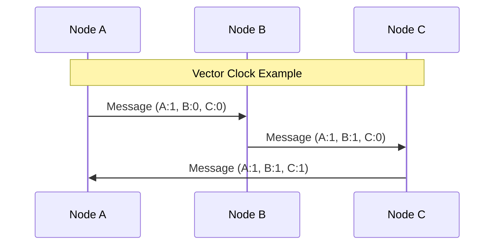

### Implementation Example
```python
class VectorClock:
    def __init__(self, node_id, num_nodes):
        self.clock = [0] * num_nodes
        self.node_id = node_id
    
    def increment(self):
        self.clock[self.node_id] += 1
    
    def update(self, other_clock):
        for i in range(len(self.clock)):
            self.clock[i] = max(self.clock[i], other_clock[i])
```

## 3. Consensus Algorithms

### Types of Consensus
- **Paxos**: Classic consensus algorithm
- **Raft**: More understandable alternative to Paxos
- **Byzantine Fault Tolerance**: Handles malicious nodes

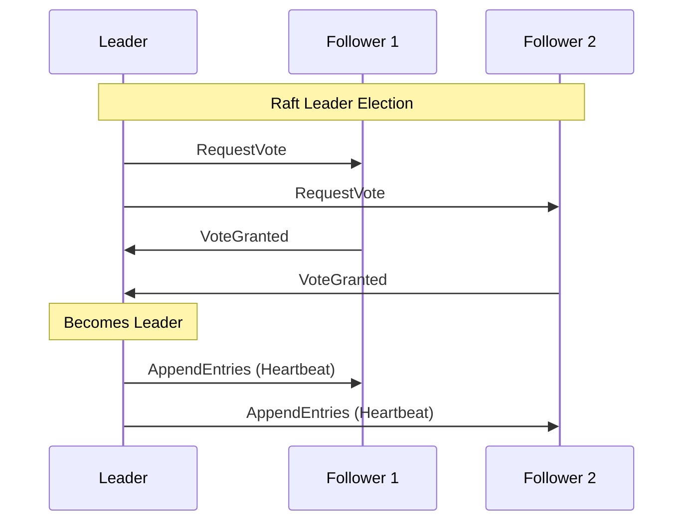

### Implementation Example
```go
// Simplified Raft leader election
type RaftNode struct {
    currentTerm int
    votedFor    string
    state       NodeState // Leader, Follower, Candidate
    nodeId      string
}

func (n *RaftNode) startElection() {
    n.state = Candidate
    n.currentTerm++
    n.votedFor = n.nodeId
    
    // Send RequestVote RPCs to all other nodes
    votes := 1 // Vote for self
    for _, peer := range peers {
        if requestVote(peer, n.currentTerm) {
            votes++
        }
    }
    
    if votes > len(peers)/2 {
        n.state = Leader
        // Start sending heartbeats
    }
}
```

## 4. Replication and Consistency Models

### Consistency Models
- Strong Consistency
- Eventual Consistency
- Causal Consistency
- Sequential Consistency

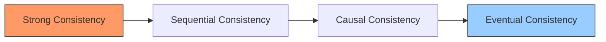

### Implementation Example
```typescript
// Example of multi-master replication with conflict resolution
class ReplicatedDataStore {
    private data: Map<string, VersionedValue>;
    private vectorClock: VectorClock;

    async write(key: string, value: any): Promise<void> {
        const version = this.vectorClock.increment();
        const versionedValue = new VersionedValue(value, version);
        
        // Local write
        this.data.set(key, versionedValue);
        
        // Replicate to other nodes
        await this.replicateToNodes(key, versionedValue);
    }

    async resolveConflict(key: string, values: VersionedValue[]): Promise<VersionedValue> {
        // Last-write-wins conflict resolution
        return values.reduce((a, b) => 
            a.version.isGreaterThan(b.version) ? a : b
        );
    }
}
```

## 5. Distributed Communication Patterns

### Patterns
- Request-Response
- Publish-Subscribe
- Point-to-Point
- Push-Pull

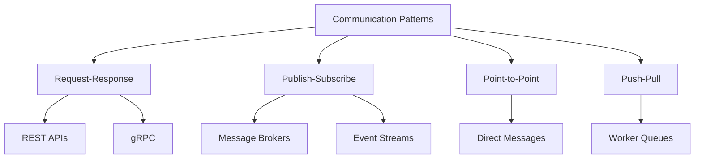

### Implementation Example
```python
# Publish-Subscribe pattern using Redis
import redis

class EventBus:
    def __init__(self):
        self.redis = redis.Redis()
        
    def publish(self, channel: str, message: dict):
        self.redis.publish(channel, json.dumps(message))
        
    def subscribe(self, channel: str, callback):
        pubsub = self.redis.pubsub()
        pubsub.subscribe(channel)
        
        for message in pubsub.listen():
            if message['type'] == 'message':
                callback(json.loads(message['data']))
```

## 6. Partition Management

### Strategies
- Range Partitioning
- Hash Partitioning
- Consistent Hashing
- Directory-Based Partitioning

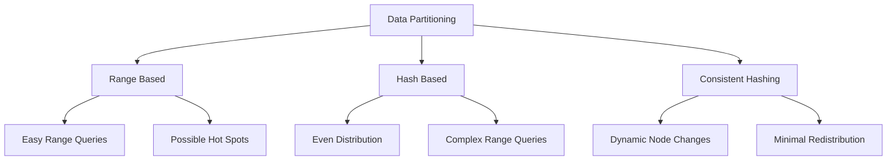

### Implementation Example
```java
// Consistent hashing implementation
public class ConsistentHash<T> {
    private final HashFunction hashFunction;
    private final int numberOfReplicas;
    private final SortedMap<Integer, T> circle = new TreeMap<>();

    public ConsistentHash(HashFunction hashFunction, int numberOfReplicas, 
                         Collection<T> nodes) {
        this.hashFunction = hashFunction;
        this.numberOfReplicas = numberOfReplicas;

        for (T node : nodes) {
            add(node);
        }
    }

    public void add(T node) {
        for (int i = 0; i < numberOfReplicas; i++) {
            circle.put(hashFunction.hash(node.toString() + i), node);
        }
    }

    public T get(Object key) {
        if (circle.isEmpty()) {
            return null;
        }
        int hash = hashFunction.hash(key);
        if (!circle.containsKey(hash)) {
            SortedMap<Integer, T> tailMap = circle.tailMap(hash);
            hash = tailMap.isEmpty() ? circle.firstKey() : tailMap.firstKey();
        }
        return circle.get(hash);
    }
}
```

## 7. Distributed Transactions

### Concepts
- Two-Phase Commit (2PC)
- Three-Phase Commit (3PC)
- SAGA Pattern
- Compensating Transactions

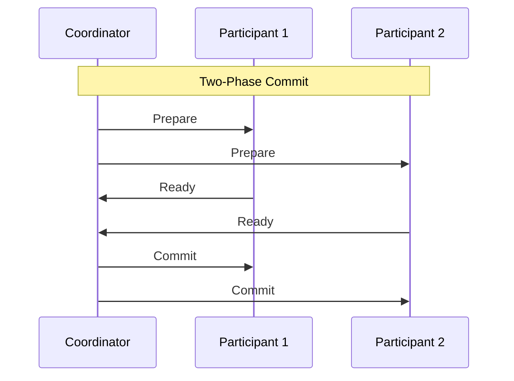

### Implementation Example
```java
// SAGA pattern implementation
public class OrderSaga {
    private final PaymentService paymentService;
    private final InventoryService inventoryService;
    private final ShippingService shippingService;

    public void processOrder(Order order) {
        try {
            // Execute steps
            PaymentResult payment = paymentService.processPayment(order);
            InventoryResult inventory = inventoryService.reserveItems(order);
            ShippingResult shipping = shippingService.scheduleDelivery(order);
            
        } catch (PaymentException e) {
            // Compensating transaction
            compensatePaymentFailure(order);
        } catch (InventoryException e) {
            // Compensating transactions
            compensateInventoryFailure(order);
            paymentService.refund(order);
        } catch (ShippingException e) {
            // Compensating transactions
            compensateShippingFailure(order);
            inventoryService.releaseItems(order);
            paymentService.refund(order);
        }
    }
}
```

## 8. Fault Tolerance and Recovery

### Strategies
- Redundancy
- Replication
- Checkpointing
- Leader Election

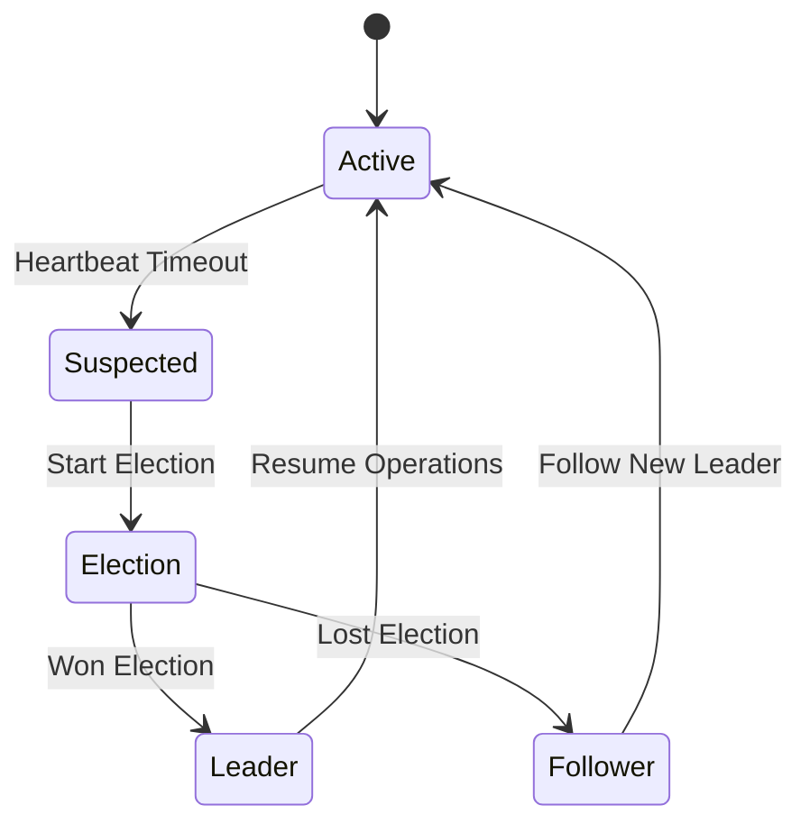

### Implementation Example
```python
class FaultTolerantService:
    def __init__(self):
        self.state = "follower"
        self.current_leader = None
        self.last_heartbeat = time.time()
        
    async def monitor_leader(self):
        while True:
            if self.state == "follower" and \
               time.time() - self.last_heartbeat > HEARTBEAT_TIMEOUT:
                await self.start_election()
            await asyncio.sleep(1)
            
    async def start_election(self):
        self.state = "candidate"
        votes = await self.request_votes()
        if votes > len(self.peers) / 2:
            self.state = "leader"
            await self.start_heartbeat()
```

## 9. Service Discovery

### Methods
- Client-Side Discovery
- Server-Side Discovery
- Service Registry
- Service Mesh

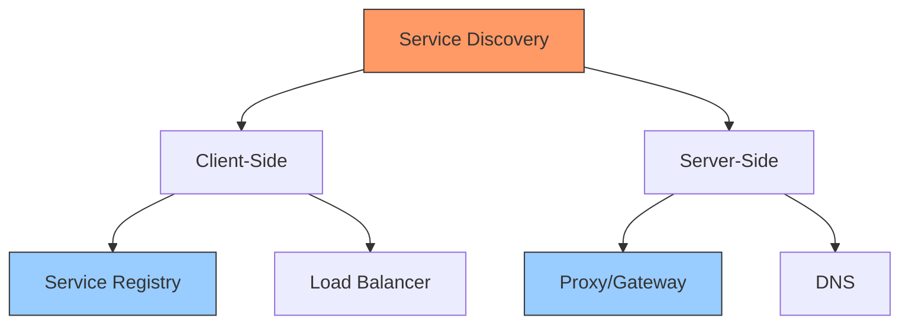

### Implementation Example
```typescript
// Service discovery using Consul
class ServiceRegistry {
    private consul: Consul;
    
    async register(service: Service): Promise<void> {
        await this.consul.agent.service.register({
            name: service.name,
            id: service.id,
            address: service.host,
            port: service.port,
            tags: service.tags,
            check: {
                http: `http://${service.host}:${service.port}/health`,
                interval: '10s'
            }
        });
    }
    
    async discover(serviceName: string): Promise<Service[]> {
        const result = await this.consul.catalog.service.nodes(serviceName);
        return result.map(node => ({
            id: node.ServiceID,
            name: node.ServiceName,
            host: node.ServiceAddress,
            port: node.ServicePort
        }));
    }
}
```

## 10. Distributed Caching

### Strategies
- Cache-Aside
- Read-Through
- Write-Through
- Write-Behind

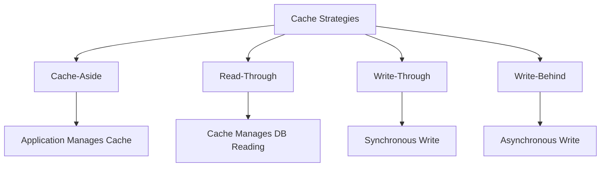

### Implementation Example
```csharp
public class DistributedCacheService
{
    private IDistributedCache cache;
    private IDatabase database;
    
    public async Task<T> GetOrSet<T>(string key, TimeSpan expiration)
    {
        // Try get from cache
        var cached = await cache.GetAsync(key);
        if (cached != null)
        {
            return Deserialize<T>(cached);
        }
        
        // Cache miss - get from database
        var data = await database.GetAsync<T>(key);
        
        // Store in cache
        await cache.SetAsync(
            key,
            Serialize(data),
            new DistributedCacheEntryOptions
            {
                AbsoluteExpirationRelativeToNow = expiration
            }
        );
        
        return data;
    }
}
```

## Best Practices for Distributed Systems

1. **Design for Failure**
   - Assume components will fail
   - Implement proper error handling
   - Use circuit breakers
   - Plan for network partitions

2. **Think About Scaling**
   - Design for horizontal scaling
   - Consider data partitioning early
   - Plan for future growth
   - Monitor system bottlenecks

3. **Manage State Carefully**
   - Minimize shared state
   - Use appropriate consistency models
   - Implement proper concurrency control
   - Consider eventual consistency where appropriate

4. **Monitor Everything**
   - Implement comprehensive logging
   - Use distributed tracing
   - Monitor system metrics
   - Set up proper alerting

5. **Security Considerations**
   - Implement proper authentication
   - Use encryption for data in transit
   - Consider network security
   - Implement proper access controls

Remember: Distributed systems are inherently complex. Always start with the simplest solution that meets your requirements and add complexity only when necessary. Test thoroughly, especially failure scenarios, and always have a plan for monitoring and debugging production issues.