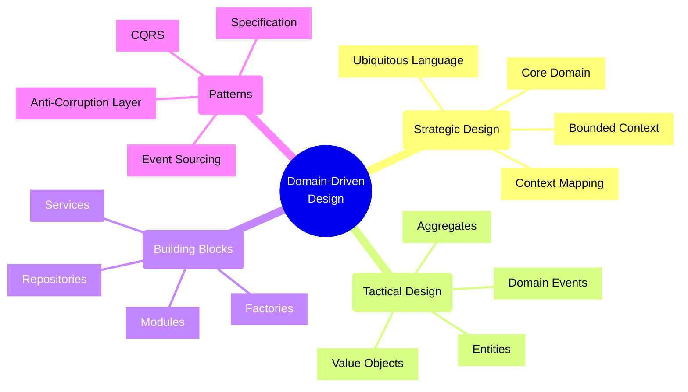
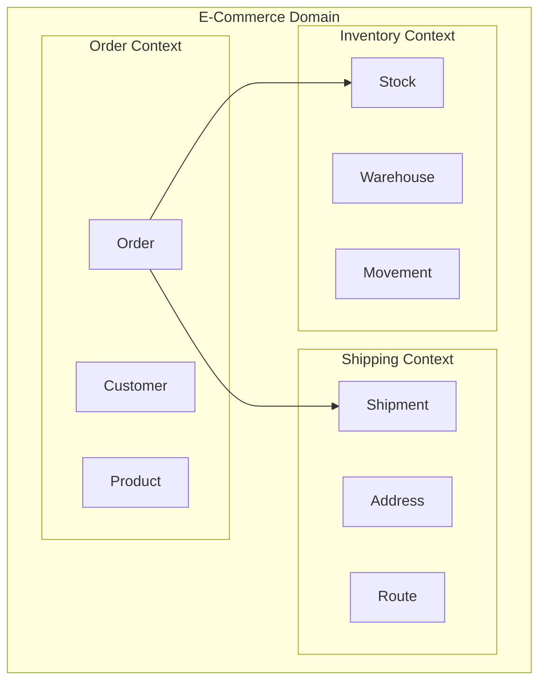
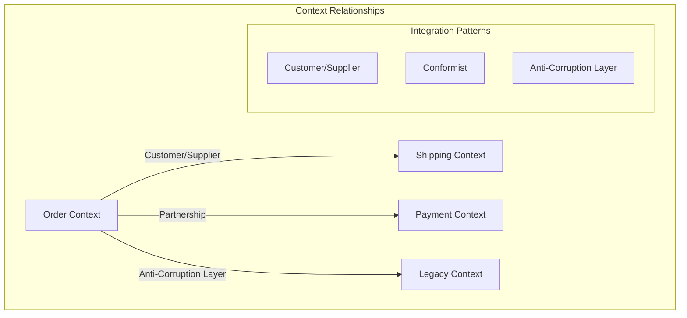
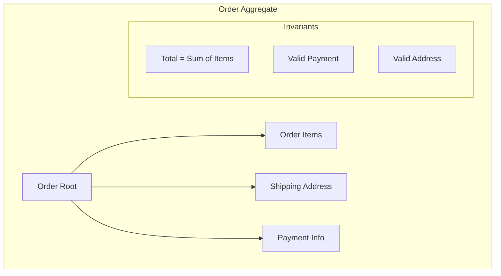
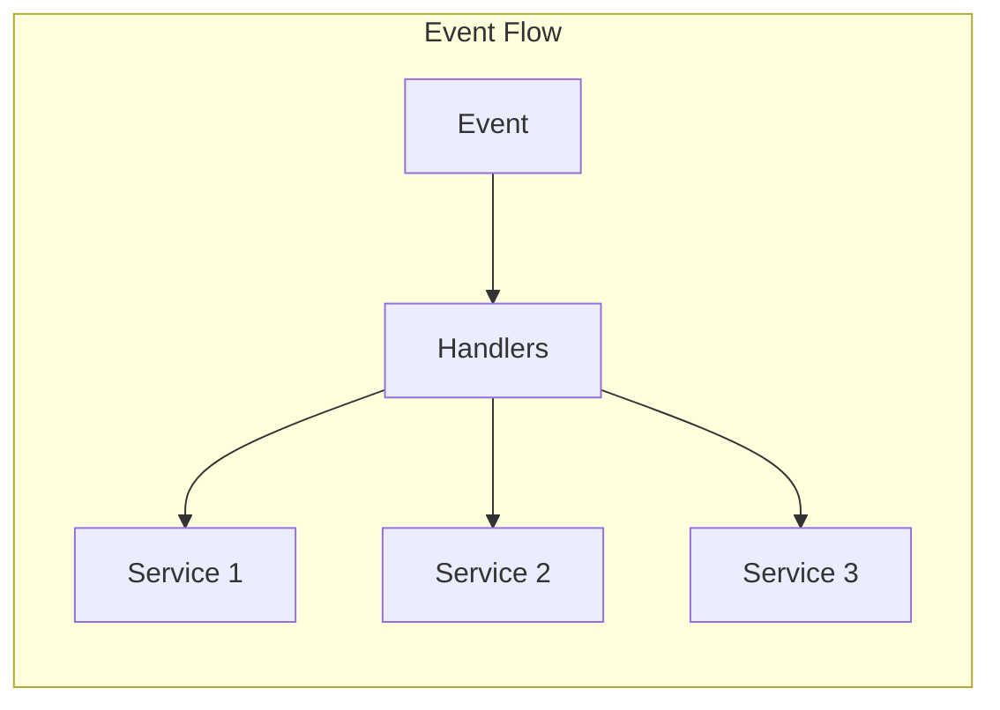
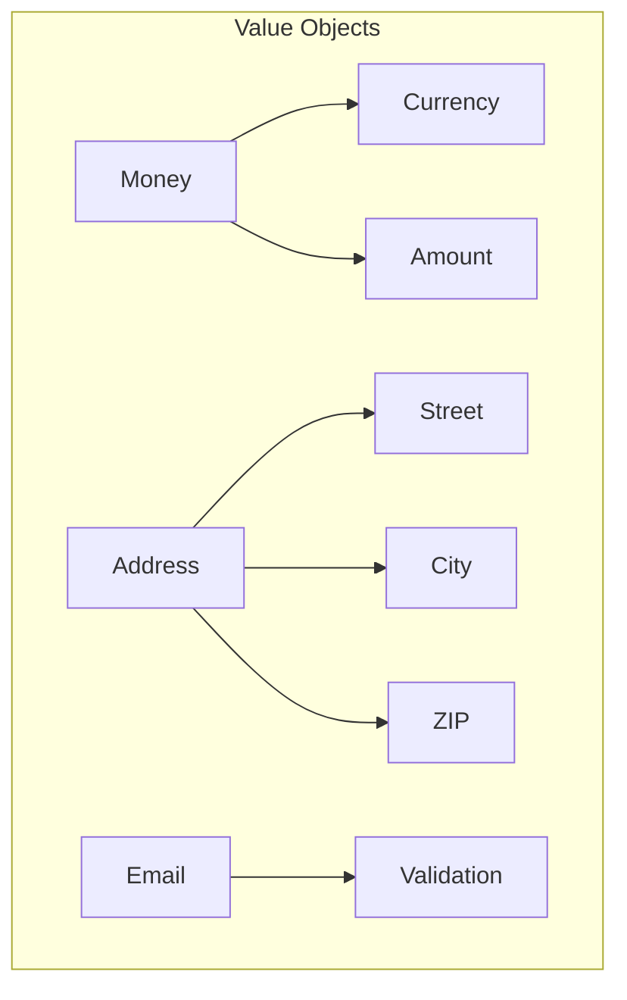

# Domain-Driven Design (DDD)



## Strategic Design Patterns

### 1. Bounded Contexts



Implementation Example:
```typescript
// Order bounded context
namespace OrderContext {
    interface Customer {
        id: string;
        name: string;
        email: string;
        shippingAddresses: ShippingAddress[];
    }

    interface Order {
        id: string;
        customerId: string;
        items: OrderItem[];
        status: OrderStatus;
        total: Money;
    }

    // Domain service
    class OrderService {
        constructor(
            private orderRepo: OrderRepository,
            private customerRepo: CustomerRepository,
            private eventBus: DomainEventBus
        ) {}

        async placeOrder(
            customerId: string,
            items: OrderItem[]
        ): Promise<Order> {
            const customer = await this.customerRepo.findById(customerId);
            if (!customer) {
                throw new CustomerNotFoundError(customerId);
            }

            const order = Order.create({
                customerId,
                items,
                status: 'PENDING'
            });

            await this.validateOrder(order);
            await this.orderRepo.save(order);
            
            await this.eventBus.publish(new OrderPlacedEvent(order));
            
            return order;
        }
    }
}

// Shipping bounded context
namespace ShippingContext {
    interface Shipment {
        id: string;
        orderId: string;
        destination: Address;
        status: ShipmentStatus;
        route: Route;
    }

    // Different representation of Customer
    interface ShippingCustomer {
        id: string;
        address: Address;
        contactNumber: string;
    }
}
```

### 2. Context Mapping



Implementation Example:
```typescript
// Anti-corruption layer for legacy system
class LegacySystemAdapter {
    constructor(private legacyClient: LegacySystemClient) {}

    async translateOrder(
        modernOrder: Order
    ): Promise<LegacyOrder> {
        return {
            orderNumber: modernOrder.id,
            customerCode: this.translateCustomerId(modernOrder.customerId),
            items: modernOrder.items.map(this.translateOrderItem),
            // Map modern to legacy status
            status: this.translateStatus(modernOrder.status)
        };
    }

    private translateStatus(
        modernStatus: OrderStatus
    ): LegacyOrderStatus {
        const statusMap = {
            'PENDING': 'P',
            'CONFIRMED': 'C',
            'SHIPPED': 'S',
            'DELIVERED': 'D',
            'CANCELLED': 'X'
        };
        
        return statusMap[modernStatus] || 'U';
    }
}

// Context map configuration
const contextMap = {
    relationships: [
        {
            upstream: 'OrderContext',
            downstream: 'ShippingContext',
            type: 'CUSTOMER_SUPPLIER',
            contract: 'OrderShippingContract'
        },
        {
            upstream: 'LegacyContext',
            downstream: 'OrderContext',
            type: 'ANTICORRUPTION_LAYER',
            adapter: LegacySystemAdapter
        }
    ]
};
```

## Tactical Design Patterns

### 1. Aggregates and Entities



Implementation Example:
```typescript
// Order aggregate
class Order {
    private constructor(
        private readonly props: OrderProps,
        private readonly id: string
    ) {}

    static create(props: OrderProps): Order {
        const order = new Order(props, generateId());
        order.validate();
        return order;
    }

    addItem(item: OrderItem): void {
        this.props.items.push(item);
        this.validateTotal();
        this.addDomainEvent(new OrderItemAddedEvent(this, item));
    }

    private validate(): void {
        if (this.props.items.length === 0) {
            throw new OrderMustHaveItemsError();
        }
        this.validateTotal();
        this.validateShippingAddress();
    }

    private validateTotal(): void {
        const calculatedTotal = this.props.items
            .reduce((sum, item) => sum + item.price * item.quantity, 0);
            
        if (calculatedTotal !== this.props.total) {
            throw new InvalidOrderTotalError();
        }
    }
}
```

### 2. Domain Events



Implementation Example:
```typescript
// Domain event implementation
interface DomainEvent {
    readonly occurredAt: Date;
    readonly eventType: string;
}

class OrderPlacedEvent implements DomainEvent {
    readonly occurredAt: Date;
    readonly eventType: string = 'ORDER_PLACED';

    constructor(
        public readonly order: Order,
        public readonly customerId: string
    ) {
        this.occurredAt = new Date();
    }
}

// Event handler
class OrderPlacedHandler implements EventHandler<OrderPlacedEvent> {
    constructor(
        private inventoryService: InventoryService,
        private notificationService: NotificationService
    ) {}

    async handle(event: OrderPlacedEvent): Promise<void> {
        // Reserve inventory
        await this.inventoryService.reserveItems(
            event.order.items
        );

        // Notify customer
        await this.notificationService.notifyCustomer(
            event.customerId,
            'ORDER_CONFIRMATION',
            {
                orderId: event.order.id,
                total: event.order.total
            }
        );
    }
}
```

### 3. Value Objects



Implementation Example:
```typescript
// Value object implementation
class Money {
    private constructor(
        private readonly amount: number,
        private readonly currency: Currency
    ) {
        this.validate();
    }

    static create(amount: number, currency: Currency): Money {
        return new Money(amount, currency);
    }

    add(other: Money): Money {
        if (this.currency !== other.currency) {
            throw new CurrencyMismatchError();
        }
        return new Money(this.amount + other.amount, this.currency);
    }

    private validate(): void {
        if (this.amount < 0) {
            throw new NegativeAmountError();
        }
    }

    equals(other: Money): boolean {
        return this.amount === other.amount && 
               this.currency === other.currency;
    }
}

// Email value object with validation
class Email {
    private constructor(private readonly value: string) {
        this.validate();
    }

    static create(email: string): Email {
        return new Email(email);
    }

    private validate(): void {
        if (!this.isValidEmail(this.value)) {
            throw new InvalidEmailError(this.value);
        }
    }

    toString(): string {
        return this.value;
    }
}
```

## Best Practices

1. **Strategic Design**
   - Focus on core domain
   - Define clear boundaries
   - Create ubiquitous language
   - Map context relationships

2. **Tactical Design**
   - Keep aggregates small
   - Protect invariants
   - Use value objects
   - Model state transitions

3. **Implementation**
   - Use domain events
   - Implement repositories
   - Apply CQRS when needed
   - Validate at boundaries

4. **Communication**
   - Document context maps
   - Share ubiquitous language
   - Define team boundaries
   - Align with business

Remember: Domain-Driven Design is about creating a shared understanding between technical and domain experts. Focus on the core domain and maintain clear boundaries between different contexts.