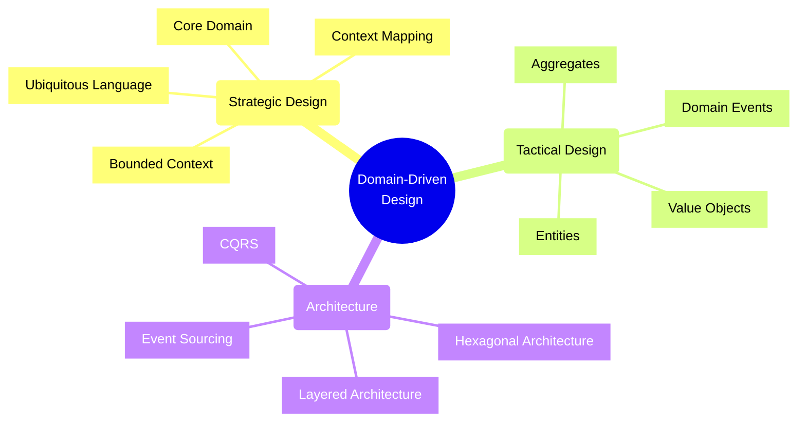
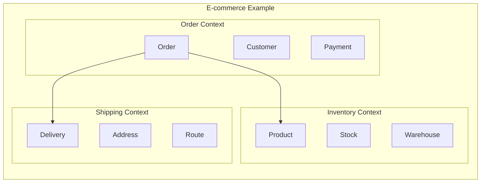
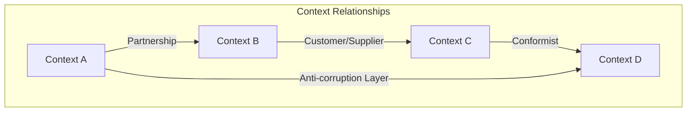
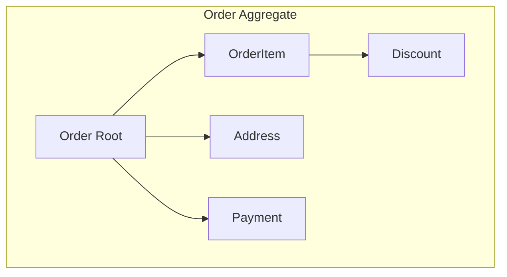
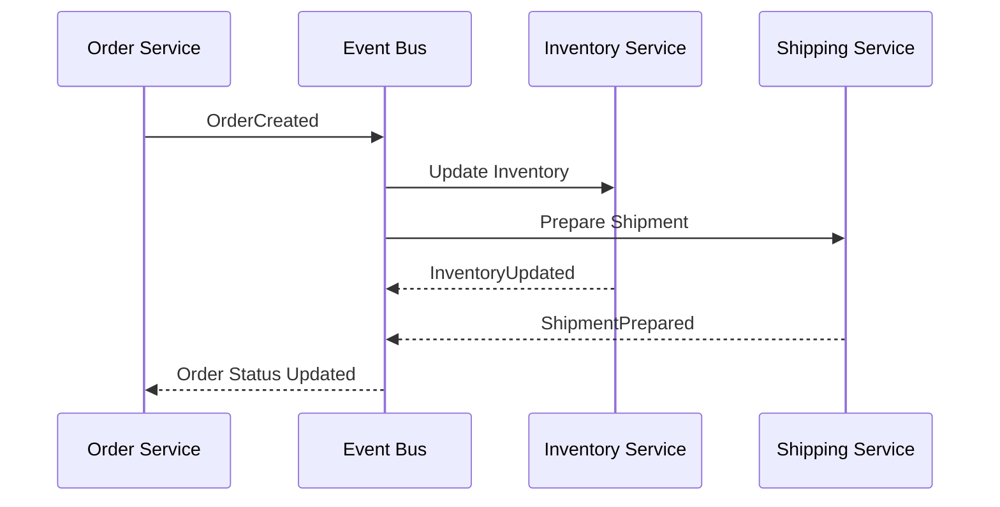
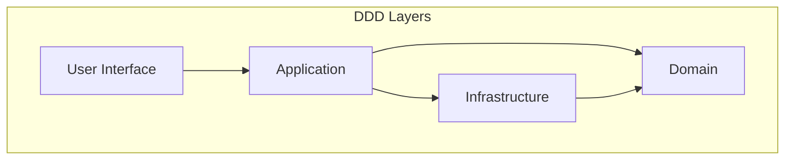
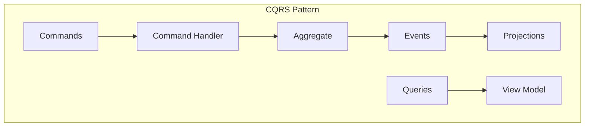

# Domain-Driven Design (DDD)



## Strategic Design Patterns

### 1. Bounded Contexts



### 2. Context Mapping



## Tactical Design Patterns

### 1. Entity Pattern
```typescript
class Order {
    private readonly id: OrderId;
    private items: OrderItem[];
    private status: OrderStatus;

    constructor(id: OrderId) {
        this.id = id;
        this.items = [];
        this.status = OrderStatus.Created;
    }

    addItem(item: OrderItem): void {
        if (this.status !== OrderStatus.Created) {
            throw new OrderModificationError();
        }
        this.items.push(item);
    }
}
```

### 2. Value Object Pattern
```typescript
class Money {
    private readonly amount: number;
    private readonly currency: Currency;

    constructor(amount: number, currency: Currency) {
        this.amount = amount;
        this.currency = currency;
    }

    add(other: Money): Money {
        if (this.currency !== other.currency) {
            throw new CurrencyMismatchError();
        }
        return new Money(this.amount + other.amount, this.currency);
    }
}
```

### 3. Aggregate Pattern



## Domain Events

### Event Flow Pattern


## Implementation Guidelines

### 1. Ubiquitous Language
- Use domain terms consistently
- Document domain vocabulary
- Reflect language in code
- Evolve language with domain experts

### 2. Bounded Context Guidelines
- Define clear boundaries
- Identify context relationships
- Document context maps
- Maintain context integrity

### 3. Aggregate Design Rules
- Keep aggregates small
- Ensure business invariants
- Use eventual consistency between aggregates
- Reference other aggregates by ID

## Architecture Patterns

### 1. Layered Architecture


### 2. CQRS with Domain Events


## Best Practices

1. **Domain Modeling**
   - Focus on business rules
   - Identify domain experts
   - Model state transitions
   - Document assumptions

2. **Testing Strategy**
   - Unit test domain logic
   - Test aggregate invariants
   - Verify event handling
   - Test business scenarios

3. **Performance Considerations**
   - Aggregate size limits
   - Event sourcing overhead
   - Read model optimization
   - Eventual consistency impact

4. **Common Pitfalls**
   - Over-complicated models
   - Missing bounded contexts
   - Anemic domain models
   - Inconsistent language

Remember: DDD is most valuable for complex domains with sophisticated business rules. For simpler applications, a more straightforward approach might be more appropriate.