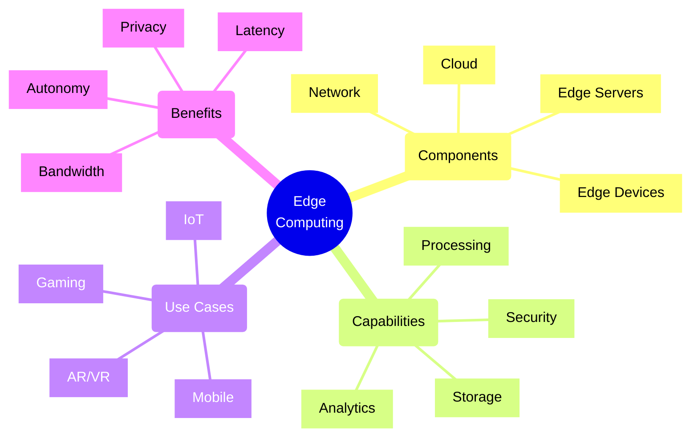
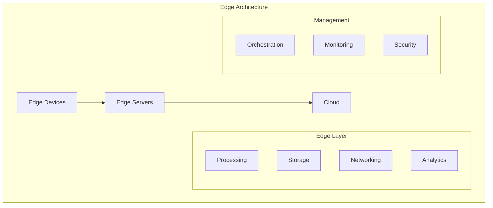
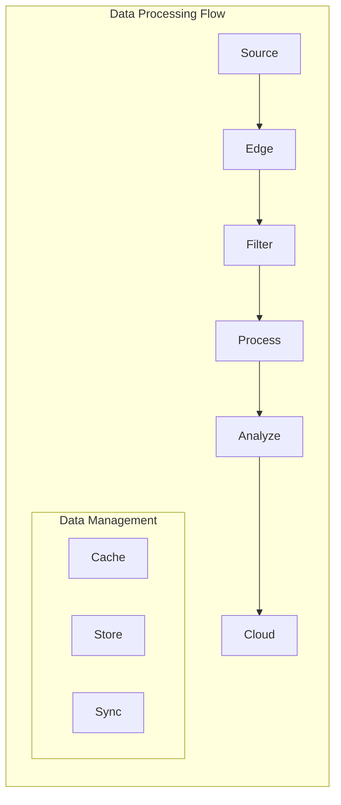

# Edge Computing Architectures

## Core Architecture

### 1. Edge Components

### 2. Data Flow

## Implementation Checklist

### Edge Infrastructure
- [ ] Hardware selection
- [ ] Network setup
- [ ] Storage configuration
- [ ] Processing capacity
- [ ] Power management
- [ ] Cooling solutions
- [ ] Physical security
- [ ] Redundancy planning
- [ ] Maintenance schedule

### Network Configuration
- [ ] Connectivity setup
- [ ] Bandwidth allocation
- [ ] Latency optimization
- [ ] QoS configuration
- [ ] Failover setup
- [ ] Traffic routing
- [ ] Network security
- [ ] Monitoring tools
- [ ] Performance testing

### Security Implementation
- [ ] Device authentication
- [ ] Data encryption
- [ ] Access control
- [ ] Network security
- [ ] Physical security
- [ ] Monitoring setup
- [ ] Incident response
- [ ] Compliance checks
- [ ] Regular audits

### Application Deployment
- [ ] Workload distribution
- [ ] Service deployment
- [ ] Data synchronization
- [ ] Cache strategy
- [ ] Error handling
- [ ] Version management
- [ ] Resource allocation
- [ ] Performance monitoring
- [ ] Scaling configuration

## Trade-offs

### Edge vs. Cloud Processing
- **Edge Processing**
  - Pros:
    * Lower latency
    * Reduced bandwidth
    * Better privacy
    * Offline capability
  - Cons:
    * Limited resources
    * Higher complexity
    * More maintenance
    * Increased cost

### Local vs. Distributed Storage
- **Local Storage**
  - Pros:
    * Faster access
    * Better privacy
    * Lower bandwidth
    * Offline access
  - Cons:
    * Limited capacity
    * Sync challenges
    * Data consistency
    * Backup complexity

### Autonomy vs. Control
- **High Autonomy**
  - Pros:
    * Better reliability
    * Lower latency
    * Offline operation
    * Local decisions
  - Cons:
    * Complex management
    * Consistency issues
    * Higher risk
    * More resources

### Performance vs. Cost
- **High Performance**
  - Pros:
    * Better user experience
    * Lower latency
    * More capabilities
    * Better reliability
  - Cons:
    * Higher costs
    * More complexity
    * More maintenance
    * Resource intensive

## Best Practices

1. **Architecture Design**
   - Layered approach
   - Clear boundaries
   - Failure handling
   - Scalability planning
   - Security by design
   - Data management
   - Monitoring strategy

2. **Network Design**
   - Proper segmentation
   - Bandwidth planning
   - Latency optimization
   - Redundancy
   - Security measures
   - QoS implementation
   - Monitoring setup

3. **Security**
   - Device security
   - Network security
   - Data protection
   - Access control
   - Monitoring
   - Incident response
   - Regular audits

4. **Operations**
   - Deployment automation
   - Monitoring setup
   - Update management
   - Backup strategy
   - Recovery planning
   - Performance tuning
   - Resource optimization

## Edge Computing Matrix

| Aspect | Metric | Target | Warning | Critical |
|--------|--------|--------|---------|----------|
| Latency | Response Time | <10ms | >50ms | >100ms |
| Bandwidth | Usage | <70% | >80% | >90% |
| Processing | CPU Usage | <70% | >85% | >95% |
| Storage | Capacity | <75% | >85% | >95% |
| Availability | Uptime | >99.99% | <99.9% | <99% |
| Security | Incidents | 0/day | >1/day | >5/day |

## Common Challenges

1. **Infrastructure**
   - Resource constraints
   - Power management
   - Heat management
   - Physical security
   - Maintenance access

2. **Networking**
   - Connectivity issues
   - Bandwidth limitations
   - Latency variations
   - Network security
   - Protocol compatibility

3. **Management**
   - Device management
   - Software updates
   - Configuration sync
   - Monitoring
   - Troubleshooting

4. **Security**
   - Physical access
   - Network security
   - Data protection
   - Device authentication
   - Compliance

Remember: Edge computing architectures require careful balance between local processing capabilities and cloud integration. Focus on reliability, security, and performance while managing resource constraints effectively.