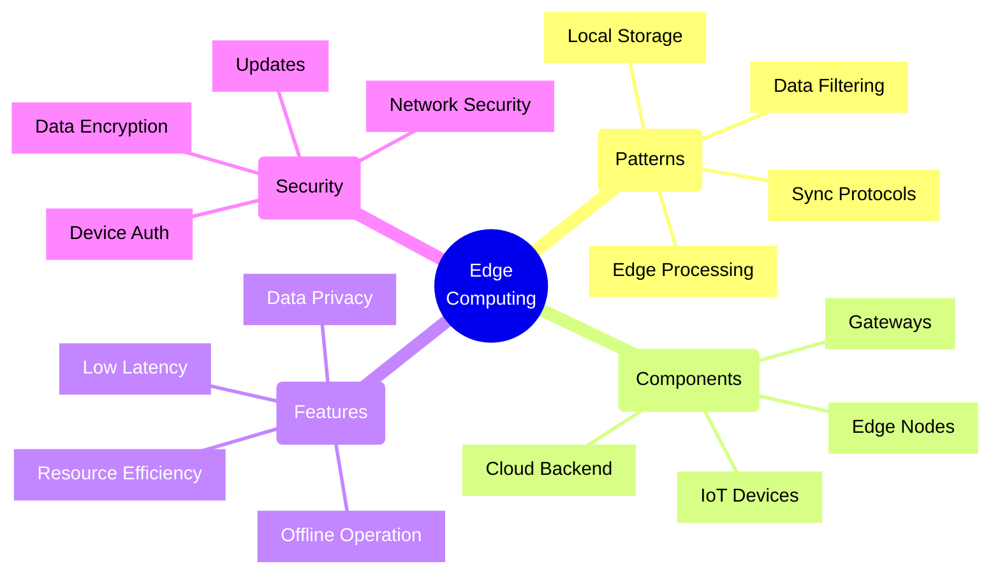
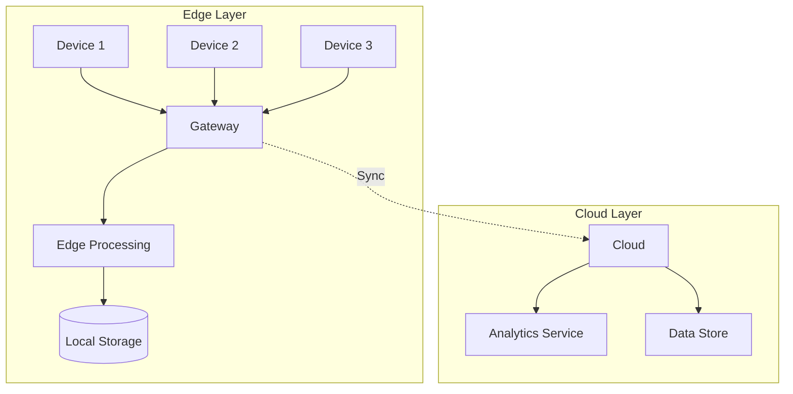
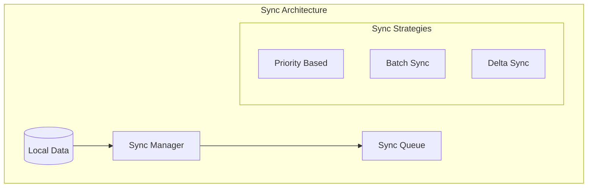
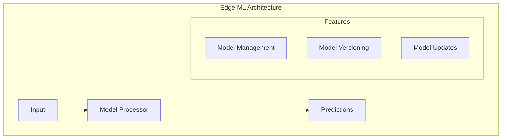

# Edge Computing Architectures



## Core Architecture Patterns

### 1. IoT Edge Architecture



Implementation Example:
```typescript
// Edge device manager implementation
class EdgeDeviceManager {
    constructor(
        private deviceRegistry: DeviceRegistry,
        private messageProcessor: MessageProcessor,
        private storageManager: StorageManager,
        private syncManager: SyncManager
    ) {}

    async processDeviceMessage(
        message: DeviceMessage
    ): Promise<void> {
        try {
            // Validate device
            const device = await this.deviceRegistry
                .validateDevice(message.deviceId);

            // Process message based on type
            switch (message.type) {
                case 'TELEMETRY':
                    await this.handleTelemetry(message);
                    break;
                case 'ALERT':
                    await this.handleAlert(message);
                    break;
                case 'STATUS':
                    await this.handleStatus(message);
                    break;
                default:
                    throw new UnknownMessageTypeError(message.type);
            }

            // Store processed data locally
            await this.storageManager.store(
                this.transformForStorage(message)
            );

            // Queue for sync if online
            if (this.syncManager.isOnline()) {
                await this.syncManager.queueForSync(message);
            }
        } catch (error) {
            await this.handleProcessingError(error, message);
        }
    }

    private async handleTelemetry(
        message: TelemetryMessage
    ): Promise<void> {
        // Apply edge analytics
        const enrichedData = await this.messageProcessor
            .enrichTelemetry(message);

        // Check thresholds
        await this.checkThresholds(enrichedData);

        // Aggregate data
        await this.aggregateData(enrichedData);
    }

    private async handleAlert(
        message: AlertMessage
    ): Promise<void> {
        // Process alert immediately
        await this.messageProcessor.processAlert(message);

        // Notify local systems
        await this.notifyLocalSystems(message);

        // Force sync for alerts
        await this.syncManager.forceSyncMessage(message);
    }
}
```

### 2. Edge Data Synchronization



Implementation Example:
```typescript
// Edge sync manager implementation
class EdgeSyncManager {
    private readonly syncQueue: PriorityQueue<SyncItem>;
    private readonly retryPolicy: RetryPolicy;

    constructor(
        private cloudConnector: CloudConnector,
        private networkMonitor: NetworkMonitor,
        private config: SyncConfig
    ) {
        this.syncQueue = new PriorityQueue();
        this.retryPolicy = new ExponentialBackoff(config.retry);
    }

    async queueForSync(
        data: SyncItem,
        priority: SyncPriority = 'NORMAL'
    ): Promise<void> {
        // Add to sync queue
        this.syncQueue.enqueue(data, priority);

        // Attempt sync if online
        if (this.networkMonitor.isOnline()) {
            await this.attemptSync();
        }
    }

    async forceSyncMessage(
        message: SyncItem
    ): Promise<void> {
        try {
            // Attempt immediate sync
            await this.cloudConnector.syncItem(message);
        } catch (error) {
            // Queue with high priority if failed
            await this.queueForSync(message, 'HIGH');
        }
    }

    private async attemptSync(): Promise<void> {
        while (!this.syncQueue.isEmpty()) {
            const item = this.syncQueue.peek();

            try {
                await this.retryPolicy.execute(() =>
                    this.cloudConnector.syncItem(item)
                );

                // Remove on successful sync
                this.syncQueue.dequeue();
            } catch (error) {
                if (this.shouldRetry(error)) {
                    // Will be retried next sync cycle
                    break;
                } else {
                    // Move to dead letter queue
                    await this.handleFailedSync(item, error);
                    this.syncQueue.dequeue();
                }
            }
        }
    }
}
```

### 3. Edge ML/AI Processing



Implementation Example:
```typescript
// Edge ML processor implementation
class EdgeMLProcessor {
    constructor(
        private modelManager: ModelManager,
        private inferenceEngine: InferenceEngine,
        private metricsCollector: MetricsCollector
    ) {}

    async processInput(
        input: MLInput
    ): Promise<MLPrediction> {
        // Load appropriate model
        const model = await this.modelManager
            .getModelForInput(input.type);

        // Track inference start
        const startTime = performance.now();

        try {
            // Preprocess input
            const processedInput = await this.preprocessInput(
                input,
                model.preprocessor
            );

            // Run inference
            const prediction = await this.inferenceEngine
                .runInference(processedInput, model);

            // Post-process results
            const result = await this.postprocessPrediction(
                prediction,
                model.postprocessor
            );

            // Track metrics
            await this.trackInferenceMetrics(
                input,
                result,
                performance.now() - startTime
            );

            return result;
        } catch (error) {
            await this.handleInferenceError(error, input);
            throw error;
        }
    }

    private async preprocessInput(
        input: MLInput,
        preprocessor: Preprocessor
    ): Promise<ProcessedInput> {
        // Apply preprocessing steps
        const normalized = await preprocessor.normalize(input);
        const transformed = await preprocessor.transform(
            normalized
        );

        return {
            data: transformed,
            metadata: {
                originalInput: input,
                preprocessingSteps: preprocessor.steps
            }
        };
    }

    private async trackInferenceMetrics(
        input: MLInput,
        prediction: MLPrediction,
        duration: number
    ): Promise<void> {
        await this.metricsCollector.record({
            type: 'INFERENCE',
            modelId: prediction.modelId,
            inputType: input.type,
            duration,
            timestamp: new Date(),
            resource: {
                cpu: await this.getCpuUsage(),
                memory: await this.getMemoryUsage()
            }
        });
    }
}
```

## Best Practices

1. **Device Management**
   - Secure registration
   - Health monitoring
   - Remote updates
   - Device lifecycle

2. **Data Management**
   - Local processing
   - Data filtering
   - Efficient storage
   - Sync strategies

3. **Security**
   - Device authentication
   - Data encryption
   - Network security
   - Regular updates

4. **Performance**
   - Resource optimization
   - Latency management
   - Bandwidth efficiency
   - Power consumption

Remember: Edge computing brings processing closer to data sources, reducing latency and bandwidth usage while improving privacy and reliability. Design your edge architecture to handle offline operations, efficient resource usage, and secure data handling.