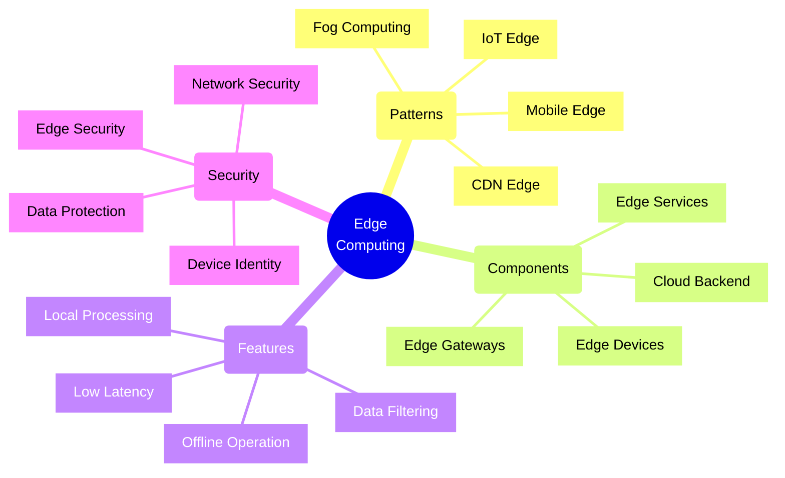
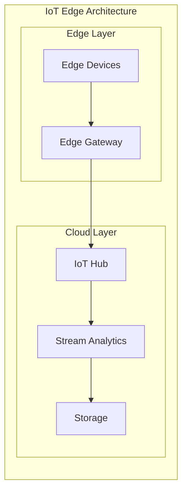
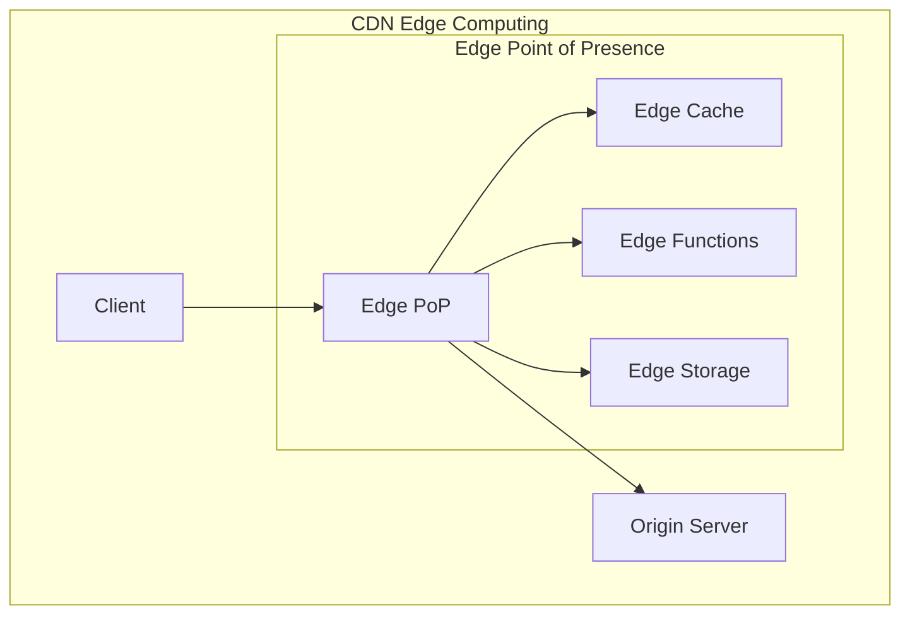
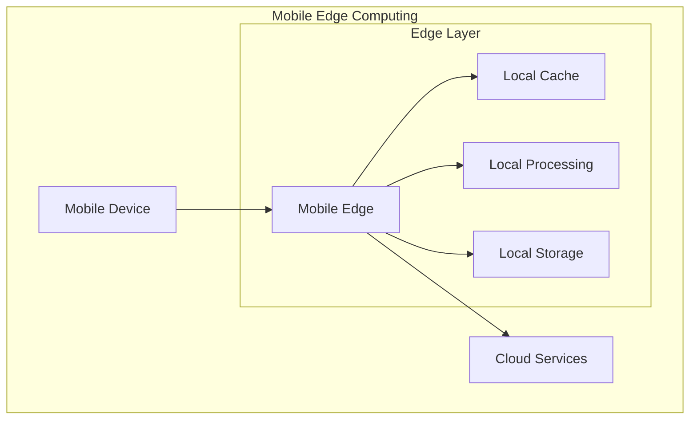
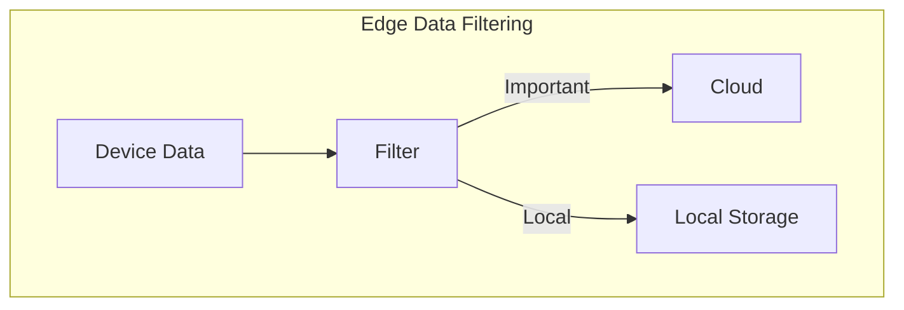
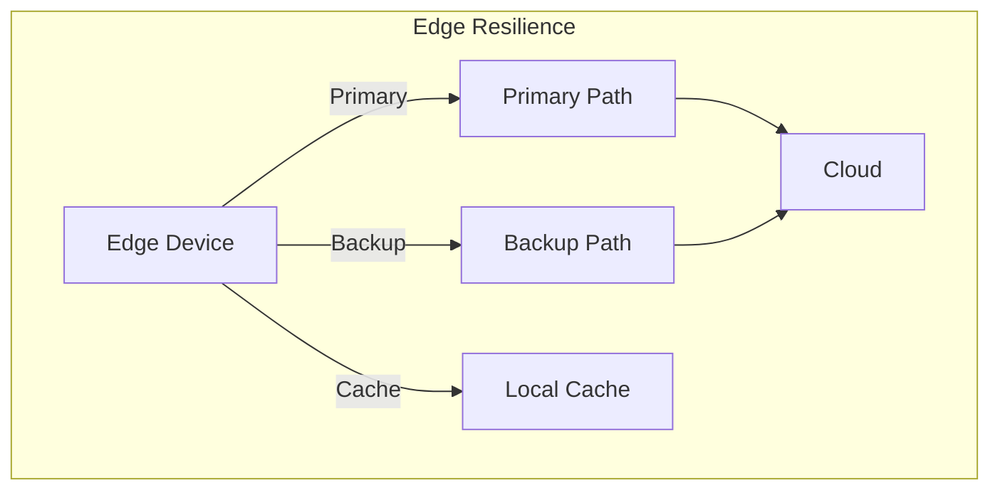

# Edge Computing Architectures



## Core Architecture Patterns

### 1. IoT Edge Pattern



Implementation Example (using Azure IoT Edge):
```typescript
// IoT Edge module configuration
const moduleConfig = {
    modules: {
        tempProcessor: {
            version: '1.0',
            type: 'docker',
            status: 'running',
            settings: {
                image: 'temperatureprocessor:1.0',
                createOptions: JSON.stringify({
                    HostConfig: {
                        Privileged: true,
                        Devices: [
                            {
                                PathOnHost: '/dev/ttyACM0',
                                PathInContainer: '/dev/ttyACM0'
                            }
                        ]
                    }
                })
            }
        }
    },
    routes: {
        'tempToCloud': 'FROM /messages/modules/tempProcessor/* INTO $upstream',
        'filterToProcessor': 'FROM /messages/* WHERE temp > 30 INTO BrokeredEndpoint("/modules/tempProcessor")'
    }
};

// Edge module implementation
class TemperatureProcessor {
    async processMessage(message: IoTMessage): Promise<void> {
        const temperature = message.temperature;
        
        // Local processing
        if (temperature > this.threshold) {
            await this.handleHighTemperature(temperature);
        }

        // Store locally if offline
        if (!this.isConnected) {
            await this.storeLocally(message);
            return;
        }

        // Send to cloud
        await this.sendToIoTHub(message);
    }

    private async handleHighTemperature(temp: number): Promise<void> {
        // Immediate local action
        await this.triggerCoolingSystem();
        
        // Alert local operators
        await this.sendLocalAlert({
            type: 'HIGH_TEMP',
            value: temp,
            timestamp: new Date()
        });
    }
}
```

### 2. CDN Edge Computing



Implementation Example (using Azure Front Door):
```typescript
// Edge function for image processing
export async function processImage(context: Context, req: HttpRequest): Promise<void> {
    const imageData = req.body;
    const processingParams = req.query;

    // Process at edge
    if (processingParams.resize) {
        const processedImage = await resizeImage(
            imageData,
            processingParams.width,
            processingParams.height
        );

        // Cache at edge
        context.res = {
            body: processedImage,
            headers: {
                'Content-Type': 'image/jpeg',
                'Cache-Control': 'public, max-age=3600',
                'Edge-Cache': 'hit'
            }
        };
    }
}

// CDN rule configuration
const cdnRules = {
    rules: [
        {
            name: 'ImageOptimization',
            order: 1,
            conditions: [
                {
                    matchVariable: 'RequestURI',
                    operator: 'Contains',
                    matchValue: ['images/']
                }
            ],
            actions: [
                {
                    name: 'CacheExpiration',
                    parameters: {
                        cacheBehavior: 'SetIfMissing',
                        cacheType: 'All',
                        cacheDuration: '1.12:00:00'
                    }
                }
            ]
        }
    ]
};
```

### 3. Mobile Edge Computing



Implementation Example:
```typescript
// Mobile edge computing with offline support
class MobileEdgeManager {
    private localDB: IndexedDB;
    private syncQueue: Queue;
    private networkStatus: boolean;

    async processRequest(request: ApiRequest): Promise<Response> {
        // Check if operation can be handled locally
        if (this.canProcessLocally(request)) {
            return this.processLocally(request);
        }

        // Try online processing
        if (this.networkStatus) {
            try {
                const response = await this.processOnline(request);
                await this.updateLocalCache(request, response);
                return response;
            } catch (error) {
                // Fallback to local processing
                return this.processLocally(request);
            }
        }

        // Queue for later sync
        await this.queueForSync(request);
        return this.processLocally(request);
    }

    private async processLocally(request: ApiRequest): Promise<Response> {
        const cachedData = await this.localDB.get(request.cacheKey);
        
        if (cachedData) {
            return {
                data: cachedData,
                source: 'local',
                timestamp: new Date()
            };
        }

        throw new Error('Data not available offline');
    }

    private async syncWithCloud(): Promise<void> {
        if (!this.networkStatus) return;

        const pendingRequests = await this.syncQueue.getAll();
        
        for (const request of pendingRequests) {
            try {
                const response = await this.processOnline(request);
                await this.updateLocalCache(request, response);
                await this.syncQueue.remove(request.id);
            } catch (error) {
                console.error('Sync failed for request:', request.id);
            }
        }
    }
}
```

## Edge Computing Patterns

### 1. Data Filtering Pattern



Implementation Example:
```typescript
// Edge data filtering
class EdgeDataFilter {
    private readonly rules: FilterRule[];
    private readonly localBuffer: CircularBuffer;

    async filterData(data: SensorData): Promise<void> {
        // Apply filtering rules
        if (this.shouldSendToCloud(data)) {
            await this.sendToCloud(data);
        } else {
            // Store locally with retention policy
            await this.localBuffer.add(data);
        }
    }

    private shouldSendToCloud(data: SensorData): boolean {
        return this.rules.some(rule => rule.evaluate(data));
    }

    // Implement backpressure
    private async sendToCloud(data: SensorData): Promise<void> {
        if (await this.hasCloudCapacity()) {
            await this.cloudClient.send(data);
        } else {
            await this.handleBackpressure(data);
        }
    }
}
```

### 2. Edge Resilience Pattern



Implementation Example:
```typescript
// Edge resilience implementation
class EdgeResilience {
    private readonly paths: CommunicationPath[];
    private readonly healthChecks: HealthCheck[];
    
    async sendData(data: EdgeData): Promise<void> {
        // Try paths in order
        for (const path of this.paths) {
            if (await this.isPathHealthy(path)) {
                try {
                    await this.sendViaPath(path, data);
                    return;
                } catch (error) {
                    await this.markPathUnhealthy(path);
                    continue;
                }
            }
        }

        // All paths failed, store locally
        await this.storeLocally(data);
    }

    private async isPathHealthy(path: CommunicationPath): Promise<boolean> {
        return this.healthChecks
            .filter(check => check.appliesTo(path))
            .every(async check => await check.execute());
    }
}
```

## Best Practices

1. **Design Principles**
   - Process data close to source
   - Implement proper data filtering
   - Plan for offline operation
   - Consider network constraints

2. **Security Considerations**
   - Secure device identity
   - Encrypt data in transit
   - Implement access control
   - Monitor edge security

3. **Performance Optimization**
   - Optimize local processing
   - Implement efficient caching
   - Manage resource constraints
   - Monitor edge performance

4. **Reliability**
   - Plan for device failure
   - Implement data backup
   - Handle network issues
   - Monitor edge health

Remember: Edge computing architectures require careful consideration of local processing capabilities, network constraints, and security requirements. Always design with offline operation and fault tolerance in mind.