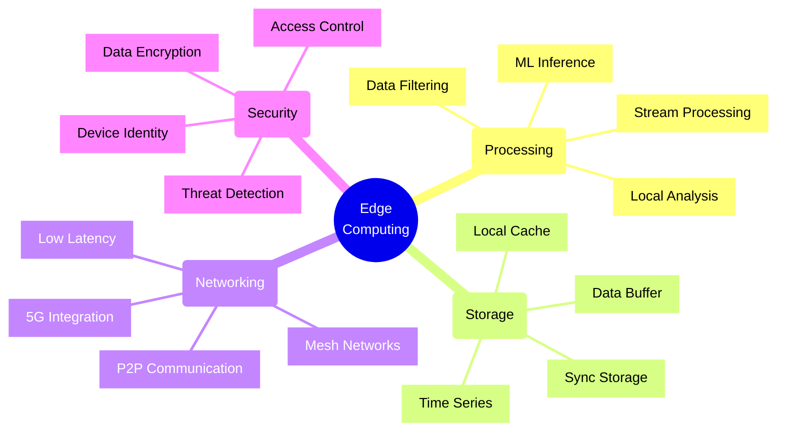
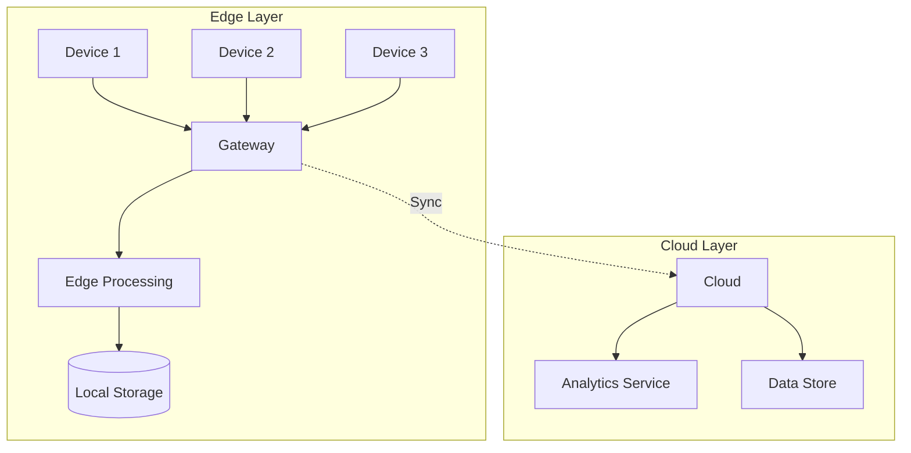
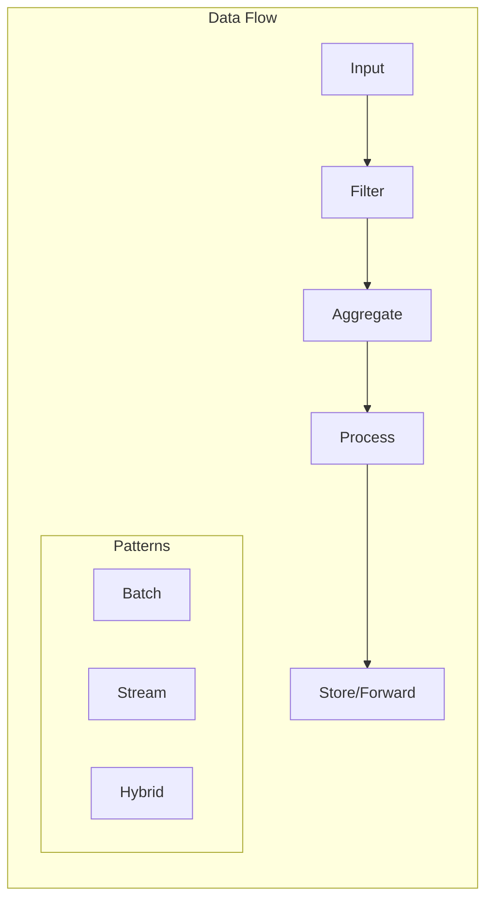
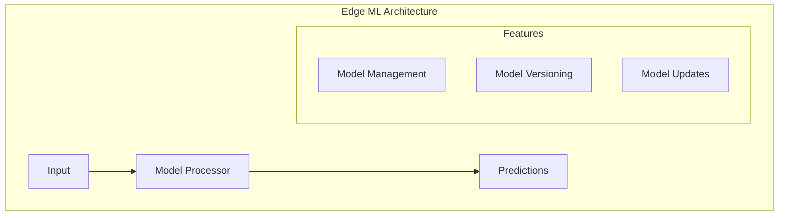
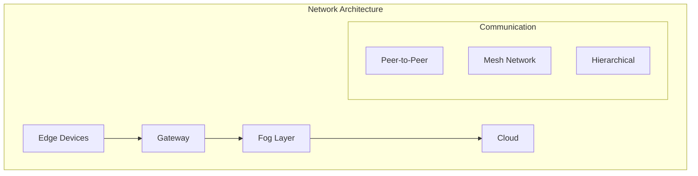
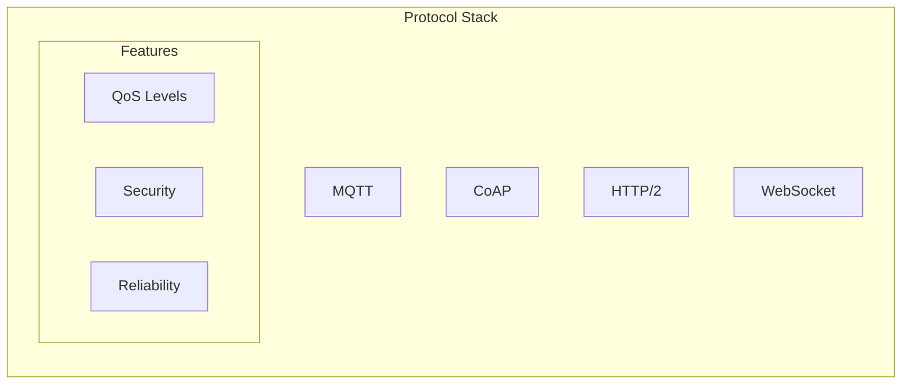
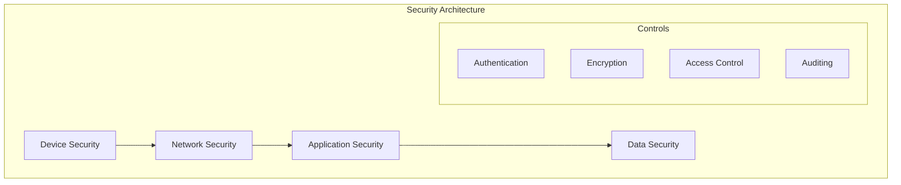
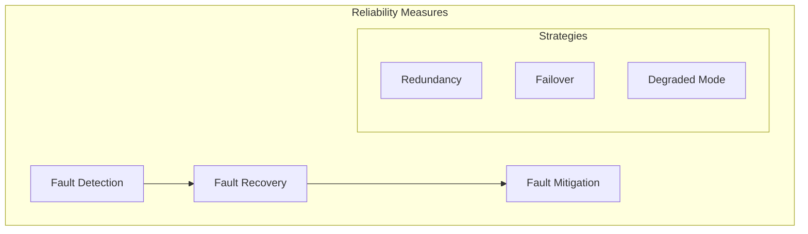

# Edge Computing Architectures

## Core Concepts

## Architecture Patterns

### 1. IoT Edge Architecture

#### Components
1. **Edge Devices**
   - Sensors
   - Actuators
   - Controllers
   - Smart devices

2. **Edge Gateway**
   - Protocol translation
   - Data aggregation
   - Local processing
   - Security enforcement

3. **Edge Processing**
   - Stream analytics
   - ML inference
   - Data filtering
   - Event processing

### 2. Data Processing Patterns

#### Processing Models
| Model | Latency | Bandwidth | Use Case |
|-------|---------|-----------|----------|
| Stream | Low | High | Real-time analytics |
| Batch | High | Low | Data consolidation |
| Hybrid | Medium | Medium | Adaptive processing |

### 3. Edge ML/AI Processing

#### ML Operations
1. **Model Deployment**
   - Version control
   - A/B testing
   - Rollback strategy
   - Performance monitoring

2. **Inference Pipeline**
   - Data preprocessing
   - Model inference
   - Result aggregation
   - Confidence scoring

## Network Topology

### 1. Edge Network Patterns

#### Topology Selection
| Pattern | Reliability | Latency | Complexity |
|---------|------------|----------|------------|
| P2P | High | Low | High |
| Mesh | Very High | Low | Very High |
| Hierarchical | Medium | Medium | Medium |

### 2. Communication Protocols

#### Protocol Selection Matrix
| Protocol | Size | Battery | Security | Use Case |
|----------|------|---------|-----------|----------|
| MQTT | Small | Low | Medium | IoT Telemetry |
| CoAP | Tiny | Very Low | Medium | Constrained Devices |
| HTTP/2 | Large | High | High | Rich Data |
| WebSocket | Medium | Medium | High | Bidirectional |

## Security Framework

### 1. Security Layers

### 2. Security Checklist
- [ ] Device identity management
- [ ] Secure boot process
- [ ] Network encryption
- [ ] Access control
- [ ] Data encryption
- [ ] Security monitoring
- [ ] Update management
- [ ] Incident response

## Reliability Patterns

### 1. Fault Tolerance

### 2. Data Resilience
1. **Local Storage**
   - Buffering
   - Caching
   - Synchronization
   - Conflict resolution

2. **Network Resilience**
   - Multiple paths
   - Protocol fallback
   - QoS management
   - Connection recovery

## Implementation Checklist

### 1. Device Management
- [ ] Device provisioning
- [ ] Configuration management
- [ ] Monitoring setup
- [ ] Update mechanism
- [ ] Health checks
- [ ] Logging strategy

### 2. Data Management
- [ ] Data collection plan
- [ ] Storage strategy
- [ ] Sync mechanism
- [ ] Retention policy
- [ ] Privacy controls
- [ ] Backup strategy

### 3. Operations
- [ ] Deployment process
- [ ] Monitoring setup
- [ ] Alert configuration
- [ ] Scaling strategy
- [ ] Maintenance plan
- [ ] Support procedures

## Decision Framework

### 1. Architecture Selection
| Factor | Edge | Fog | Cloud |
|--------|------|-----|-------|
| Latency | Low | Medium | High |
| Bandwidth | Low | Medium | High |
| Processing | Limited | Moderate | Unlimited |
| Storage | Limited | Moderate | Unlimited |
| Cost | High | Medium | Low |

### 2. Technology Selection
1. **Hardware**
   - Processing power
   - Memory capacity
   - Network capability
   - Power constraints
   - Environmental factors

2. **Software**
   - Operating system
   - Runtime environment
   - Development framework
   - Security features
   - Management tools

Remember: Edge computing architectures should balance local processing capabilities with cloud integration while maintaining security and reliability.