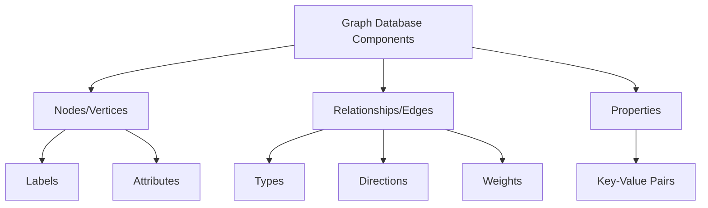
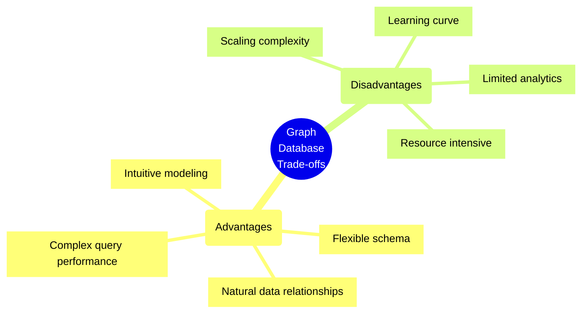
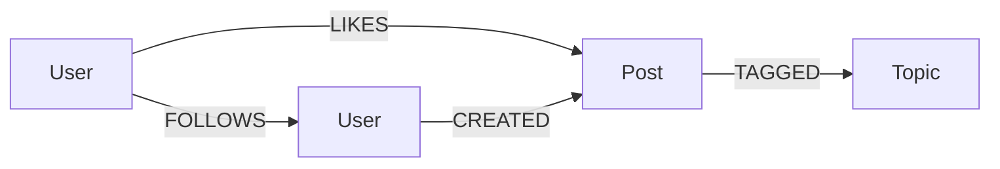
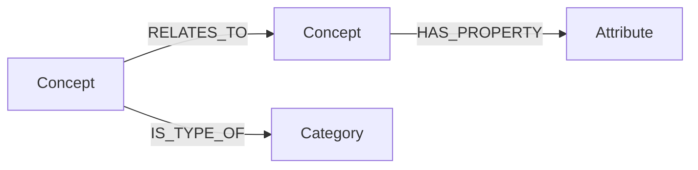

# Graph Databases

## Overview
Graph databases store data in nodes (vertices) and relationships (edges) to represent and traverse complex relationships between data elements.



## Key Characteristics
- Native graph storage
- Index-free adjacency
- ACID compliance (in most cases)
- Flexible schema
- Relationship-first approach

## Common Use Cases
1. Social Networks
2. Recommendation Engines
3. Fraud Detection
4. Knowledge Graphs
5. Network/IT Operations
6. Identity and Access Management

## Popular Graph Databases

### Neo4j
- Industry standard
- Cypher query language
- ACID compliant
- Enterprise features

### Amazon Neptune
- Fully managed
- Multi-model support
- High availability
- Gremlin/SPARQL support

### ArangoDB
- Multi-model database
- Native graph functions
- AQL query language
- Strong consistency

## Best Practices Checklist

### Data Model Design
- [ ] Identify clear node types
- [ ] Define relationship types
- [ ] Plan property structure
- [ ] Consider query patterns

### Performance Optimization
- [ ] Implement proper indexing
- [ ] Optimize query patterns
- [ ] Plan for scalability
- [ ] Monitor relationship depth

### Operations
- [ ] Regular backups
- [ ] Monitor performance
- [ ] Plan capacity
- [ ] Consider partitioning

## Trade-offs Analysis



### When to Use
- Complex relationships
- Variable schema needs
- Path-finding requirements
- Real-time recommendations
- Identity and access management

### When Not to Use
- Simple hierarchical data
- Basic CRUD operations
- Heavy write operations
- Tabular data analysis

## Query Languages

### Cypher (Neo4j)
```cypher
// Find friends of friends
MATCH (person:Person {name: 'John'})-[:FRIEND]->()-[:FRIEND]->(fof)
RETURN DISTINCT fof.name
```

### Gremlin (Apache TinkerPop)
```groovy
// Find shortest path between two vertices
g.V().has('name', 'John')
  .shortestPath()
  .with(Distance.max, 5)
  .to(__.has('name', 'Mary'))
```

## Data Modeling Patterns

### Social Graph


### Knowledge Graph


## Performance Considerations
1. Query Optimization
   - Proper indexing
   - Efficient traversal patterns
   - Relationship depth control
   - Cache utilization

2. Scaling Strategies
   - Horizontal scaling
   - Sharding approaches
   - Read replicas
   - Cache layers

## Security Best Practices
1. Access Control
   - Role-based access
   - Node-level security
   - Relationship-level security
   - Property-level encryption

2. Data Protection
   - Encryption at rest
   - Encryption in transit
   - Audit logging
   - Backup strategies

## Monitoring Checklist
- [ ] Query execution times
- [ ] Memory usage
- [ ] Cache hit rates
- [ ] Network latency
- [ ] Storage growth
- [ ] Relationship depth
- [ ] Index performance

## Tools and Ecosystem

### Development
- Graph visualization tools
- Query builders
- Data modelers
- Testing frameworks

### Operations
- Monitoring solutions
- Backup tools
- Migration utilities
- Performance analyzers

## Sample Implementations

### Social Network
```cypher
// Neo4j example
CREATE (john:Person {name: 'John'})
CREATE (mary:Person {name: 'Mary'})
CREATE (john)-[:FRIEND {since: '2023'}]->(mary)
```

### Recommendation Engine
```cypher
// Find product recommendations
MATCH (user:User)-[:PURCHASED]->(product:Product)
MATCH (product)<-[:PURCHASED]-(other:User)-[:PURCHASED]->(rec:Product)
WHERE user <> other AND NOT (user)-[:PURCHASED]->(rec)
RETURN rec.name, count(*) as frequency
ORDER BY frequency DESC
LIMIT 5
```

## Disaster Recovery
1. Backup Strategy
   - Regular snapshots
   - Transaction logs
   - Point-in-time recovery

2. Recovery Process
   - Data consistency checks
   - Relationship verification
   - Index rebuilding

## Additional Resources
1. Documentation
   - [Neo4j Documentation](https://neo4j.com/docs/)
   - [Amazon Neptune Documentation](https://docs.aws.amazon.com/neptune/)
   - [ArangoDB Documentation](https://www.arangodb.com/docs/)

2. Learning Resources
   - Graph Database Fundamentals
   - Query Language Tutorials
   - Use Case Studies
   - Community Forums