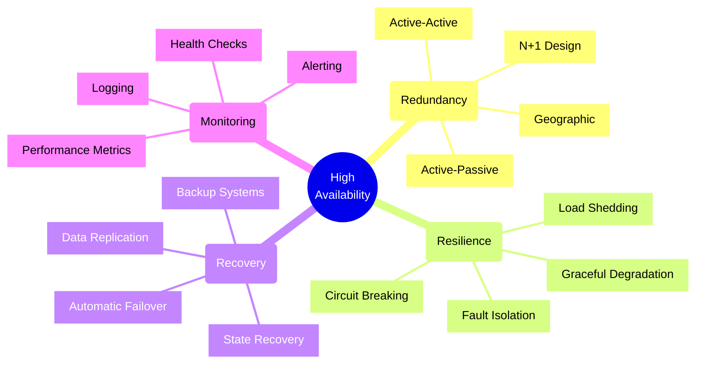
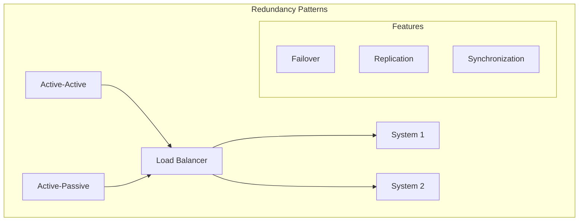
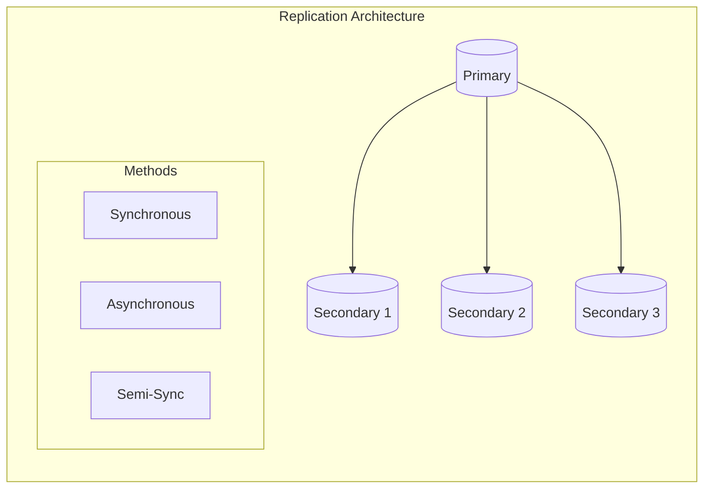
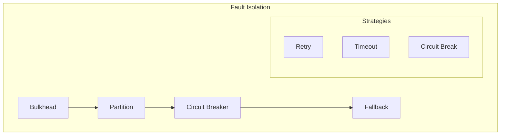
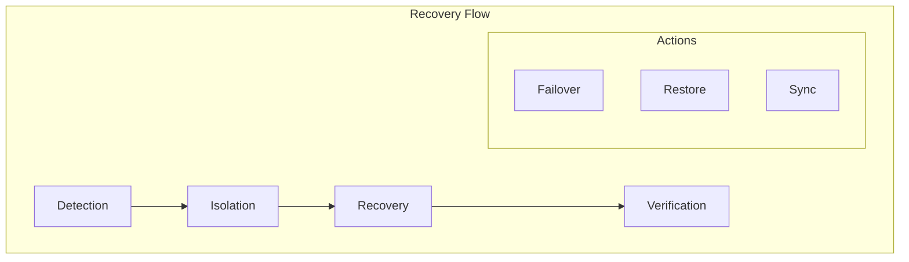
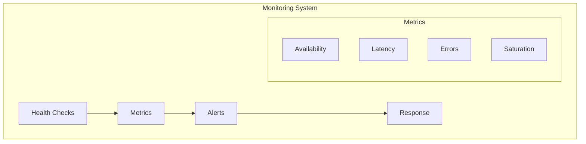
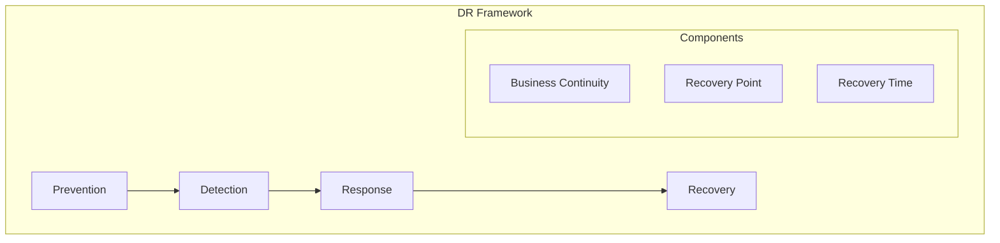

# High Availability Design

## Core Concepts

## Availability Patterns

### 1. Redundancy Models

#### Pattern Selection
| Pattern | Complexity | Cost | Recovery Time |
|---------|------------|------|---------------|
| Active-Active | High | High | Instant |
| Active-Passive | Medium | Medium | Minutes |
| N+1 | Medium | Medium-High | Seconds |
| Geographic | Very High | Very High | Variable |

### 2. Data Replication

#### Replication Strategies
1. **Synchronous**
   - Strong consistency
   - Higher latency
   - Lower throughput
   - Zero data loss

2. **Asynchronous**
   - Eventually consistent
   - Lower latency
   - Higher throughput
   - Possible data loss

3. **Semi-Synchronous**
   - Balanced approach
   - Configurable delay
   - Moderate performance
   - Minimal data loss

## Fault Tolerance

### 1. Isolation Patterns

#### Isolation Methods
| Method | Purpose | Impact | Recovery |
|--------|---------|--------|----------|
| Bulkhead | Resource Isolation | Low | Immediate |
| Partition | Failure Containment | Medium | Quick |
| Circuit Break | Failure Prevention | High | Delayed |

### 2. Recovery Patterns

#### Recovery Components
1. **Detection**
   - Health checks
   - Monitoring
   - Alerting
   - Logging

2. **Isolation**
   - Circuit breaking
   - Load shedding
   - Traffic routing
   - Resource quarantine

3. **Recovery**
   - System restore
   - Data sync
   - State recovery
   - Service restart

## Monitoring Framework

### 1. Health Monitoring

### 2. Monitoring Checklist
- [ ] System health checks
- [ ] Performance metrics
- [ ] Error tracking
- [ ] Resource monitoring
- [ ] SLA compliance
- [ ] Alert configuration
- [ ] Log aggregation
- [ ] Trend analysis

## Disaster Recovery

### 1. Recovery Strategy

### 2. Recovery Metrics
| Metric | Description | Target | Impact |
|--------|-------------|--------|--------|
| RPO | Data Loss Tolerance | Minutes | Business |
| RTO | Recovery Time | Hours | Operations |
| MTTR | Mean Time to Recover | Minutes | Technical |
| MTBF | Mean Time Between Failures | Months | Reliability |

## Implementation Framework

### 1. Architecture Checklist
- [ ] Redundancy design
- [ ] Failover strategy
- [ ] Data replication
- [ ] Network redundancy
- [ ] Load balancing
- [ ] Monitoring setup
- [ ] Recovery procedures
- [ ] Documentation

### 2. Deployment Strategy
1. **Infrastructure**
   - Multiple regions
   - Redundant components
   - Network paths
   - Power systems

2. **Application**
   - Stateless design
   - Session management
   - Cache strategy
   - Error handling

3. **Data**
   - Backup strategy
   - Replication setup
   - Consistency model
   - Recovery process

## SLA Framework

### 1. Availability Tiers
| Tier | Availability | Downtime/Year | Appropriate For |
|------|-------------|---------------|-----------------|
| Tier 1 | 99.9% | 8.76 hours | Development, Testing |
| Tier 2 | 99.95% | 4.38 hours | Internal Tools |
| Tier 3 | 99.99% | 52.56 minutes | Business Critical |
| Tier 4 | 99.999% | 5.26 minutes | Mission Critical |

### 2. Component SLA Matrix
| Component | Target SLA | Dependencies | Recovery Time |
|-----------|------------|--------------|---------------|
| Load Balancer | 99.99% | DNS, Network | < 1 minute |
| Application | 99.95% | Database, Cache | < 5 minutes |
| Database | 99.99% | Storage, Network | < 2 minutes |
| Cache | 99.9% | None | < 1 minute |

### 3. Recovery Objectives
| Metric | Target | Measurement | Validation |
|--------|--------|-------------|------------|
| RTO | < 5 minutes | Failover Time | DR Drills |
| RPO | < 1 minute | Data Loss | Replication Lag |
| MTTR | < 30 minutes | Repair Time | Incident Data |
| MTBF | > 90 days | Uptime | System Logs |

## Operational Guidelines

### 1. Maintenance Procedures
1. **Planned Maintenance**
   - Schedule during low-traffic periods
   - Use rolling updates
   - Verify backups before starting
   - Have rollback plan ready
   - Monitor system metrics

2. **Emergency Maintenance**
   - Assess impact and urgency
   - Notify stakeholders
   - Execute minimal changes
   - Verify system stability
   - Document actions taken

### 2. Incident Response
1. **Detection**
   - Monitor key metrics
   - Set up alerts
   - Track error rates
   - Check system logs

2. **Response**
   - Follow runbook
   - Notify team
   - Begin investigation
   - Take corrective action
   - Update status

3. **Recovery**
   - Restore service
   - Verify functionality
   - Update documentation
   - Schedule post-mortem
   - Implement fixes

### 3. Health Checks
1. **Application Health**
   - Response time
   - Error rates
   - Resource usage
   - Business metrics
   - Dependent services

2. **Infrastructure Health**
   - CPU utilization
   - Memory usage
   - Network latency
   - Disk space
   - Connection pools

## Implementation Checklist

### 1. Design Phase
- [ ] Define availability requirements
- [ ] Identify critical components
- [ ] Design redundancy strategy
- [ ] Plan data replication
- [ ] Document dependencies

### 2. Implementation Phase
- [ ] Set up monitoring
- [ ] Configure load balancers
- [ ] Implement health checks
- [ ] Deploy redundant systems
- [ ] Test failover

### 3. Validation Phase
- [ ] Perform load testing
- [ ] Test failure scenarios
- [ ] Verify monitoring
- [ ] Document procedures
- [ ] Train operations team

### 4. Operations Phase
- [ ] Monitor SLA compliance
- [ ] Regular DR drills
- [ ] Update runbooks
- [ ] Review incidents
- [ ] Optimize performance

Remember: High availability is a continuous process that requires regular monitoring, testing, and improvement. The key is to balance availability requirements with operational complexity and cost considerations.