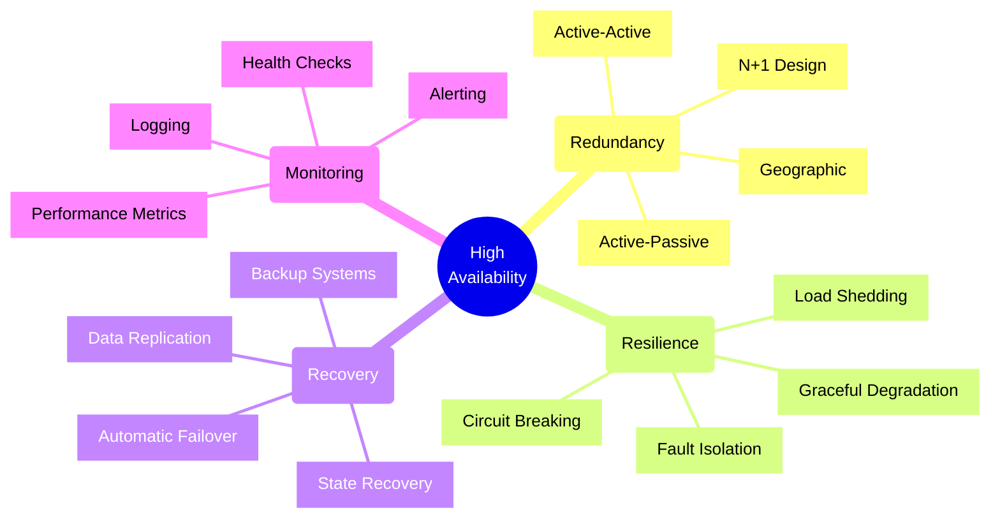
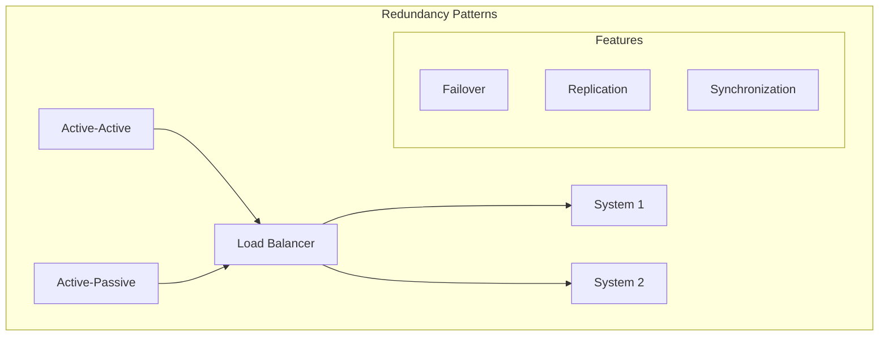
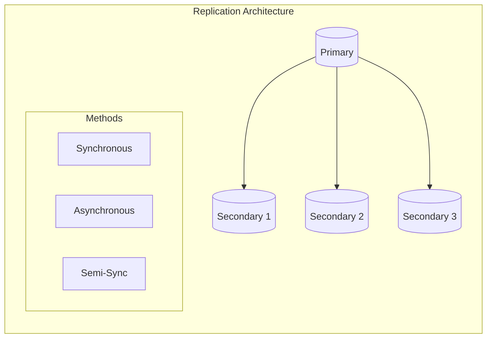
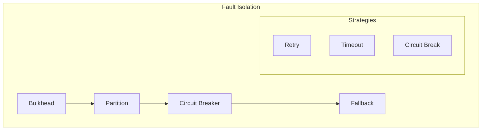
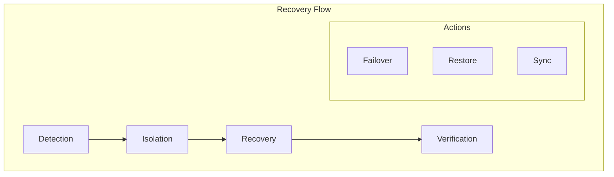
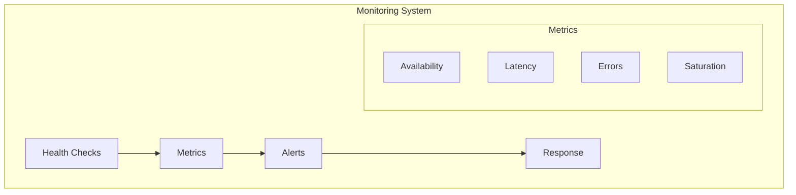
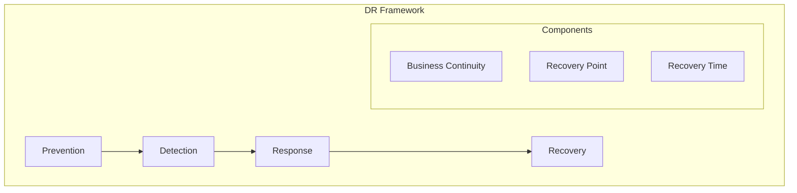

# High Availability Design

## Core Concepts

## Availability Patterns

### 1. Redundancy Models

#### Pattern Selection
| Pattern | Complexity | Cost | Recovery Time |
|---------|------------|------|---------------|
| Active-Active | High | High | Instant |
| Active-Passive | Medium | Medium | Minutes |
| N+1 | Medium | Medium-High | Seconds |
| Geographic | Very High | Very High | Variable |

### 2. Data Replication

#### Replication Strategies
1. **Synchronous**
   - Strong consistency
   - Higher latency
   - Lower throughput
   - Zero data loss

2. **Asynchronous**
   - Eventually consistent
   - Lower latency
   - Higher throughput
   - Possible data loss

3. **Semi-Synchronous**
   - Balanced approach
   - Configurable delay
   - Moderate performance
   - Minimal data loss

## Fault Tolerance

### 1. Isolation Patterns

#### Isolation Methods
| Method | Purpose | Impact | Recovery |
|--------|---------|--------|----------|
| Bulkhead | Resource Isolation | Low | Immediate |
| Partition | Failure Containment | Medium | Quick |
| Circuit Break | Failure Prevention | High | Delayed |

### 2. Recovery Patterns

#### Recovery Components
1. **Detection**
   - Health checks
   - Monitoring
   - Alerting
   - Logging

2. **Isolation**
   - Circuit breaking
   - Load shedding
   - Traffic routing
   - Resource quarantine

3. **Recovery**
   - System restore
   - Data sync
   - State recovery
   - Service restart

## Monitoring Framework

### 1. Health Monitoring

### 2. Monitoring Checklist
- [ ] System health checks
- [ ] Performance metrics
- [ ] Error tracking
- [ ] Resource monitoring
- [ ] SLA compliance
- [ ] Alert configuration
- [ ] Log aggregation
- [ ] Trend analysis

## Disaster Recovery

### 1. Recovery Strategy

### 2. Recovery Metrics
| Metric | Description | Target | Impact |
|--------|-------------|--------|--------|
| RPO | Data Loss Tolerance | Minutes | Business |
| RTO | Recovery Time | Hours | Operations |
| MTTR | Mean Time to Recover | Minutes | Technical |
| MTBF | Mean Time Between Failures | Months | Reliability |

## Implementation Framework

### 1. Architecture Checklist
- [ ] Redundancy design
- [ ] Failover strategy
- [ ] Data replication
- [ ] Network redundancy
- [ ] Load balancing
- [ ] Monitoring setup
- [ ] Recovery procedures
- [ ] Documentation

### 2. Deployment Strategy
1. **Infrastructure**
   - Multiple regions
   - Redundant components
   - Network paths
   - Power systems

2. **Application**
   - Stateless design
   - Session management
   - Cache strategy
   - Error handling

3. **Data**
   - Backup strategy
   - Replication setup
   - Consistency model
   - Recovery process

## Decision Framework

### 1. Availability Requirements
| Level | Availability | Downtime/Year | Cost |
|-------|-------------|---------------|------|
| Level 1 | 99.9% | 8.76 hours | Low |
| Level 2 | 99.99% | 52.56 minutes | Medium |
| Level 3 | 99.999% | 5.26 minutes | High |
| Level 4 | 99.9999% | 31.5 seconds | Very High |

### 2. Component Selection
1. **Infrastructure**
   - Cloud provider
   - Region strategy
   - Network design
   - Storage solutions

2. **Services**
   - Load balancers
   - Monitoring tools
   - Backup services
   - Management systems

Remember: High availability design should balance reliability requirements with operational complexity and cost considerations.