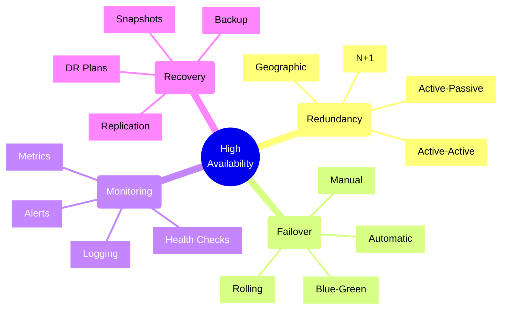
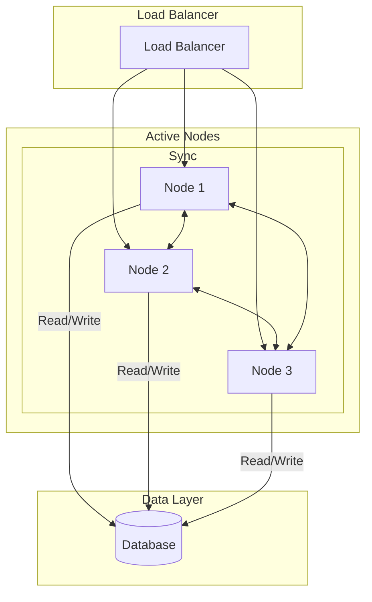
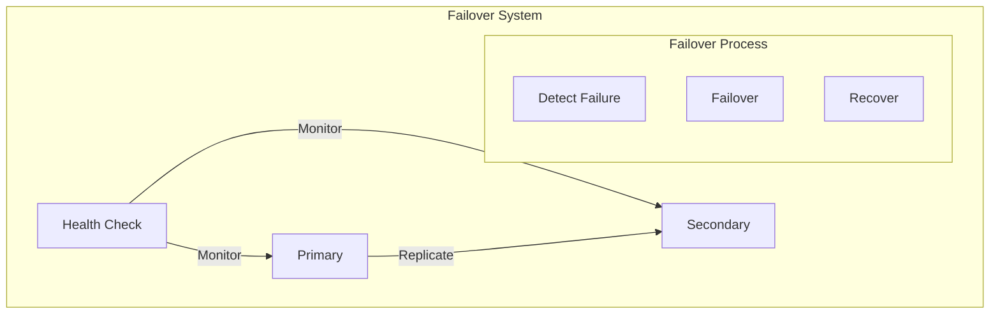
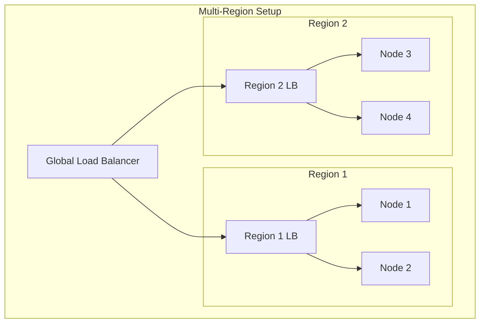

# High Availability Design



## Core Design Patterns

### 1. Active-Active Pattern



Implementation Example:
```typescript
// Active-Active cluster manager
class ClusterManager {
    constructor(
        private nodes: ClusterNode[],
        private loadBalancer: LoadBalancer,
        private healthChecker: HealthChecker,
        private metrics: MetricsCollector
    ) {}

    async start(): Promise<void> {
        // Initialize cluster state
        await this.initializeCluster();

        // Start health monitoring
        await this.startHealthMonitoring();

        // Configure load balancer
        await this.configureLoadBalancer();

        // Start metrics collection
        await this.startMetricsCollection();
    }

    private async initializeCluster(): Promise<void> {
        // Ensure data consistency
        await this.synchronizeNodes();

        // Initialize shared state
        await this.initializeSharedState();

        // Start consensus protocol
        await this.startConsensusProtocol();
    }

    private async handleNodeFailure(
        node: ClusterNode
    ): Promise<void> {
        // Update cluster state
        await this.updateClusterState({
            failedNode: node,
            timestamp: Date.now()
        });

        // Rebalance load
        await this.loadBalancer.rebalance(
            this.getHealthyNodes()
        );

        // Notify operations
        await this.notifyOperations({
            event: 'NODE_FAILURE',
            node: node.id,
            cluster: this.clusterId,
            timestamp: new Date()
        });
    }

    private async synchronizeNodes(): Promise<void> {
        const consensus = await this.runConsensusRound();
        
        for (const node of this.nodes) {
            await node.synchronize(consensus.state);
        }
    }
}
```

### 2. Failover Patterns



Implementation Example:
```typescript
// Automated failover system
class FailoverSystem {
    constructor(
        private primary: SystemNode,
        private secondary: SystemNode,
        private config: FailoverConfig,
        private monitor: HealthMonitor
    ) {}

    async start(): Promise<void> {
        // Start health monitoring
        await this.startHealthChecks();

        // Initialize replication
        await this.initializeReplication();

        // Set up automated failover
        await this.setupFailover();
    }

    private async handleFailover(
        failedNode: SystemNode
    ): Promise<void> {
        try {
            // Log failover start
            await this.logFailoverEvent('START', {
                failedNode: failedNode.id,
                timestamp: new Date()
            });

            // Execute failover
            await this.executeFailover(failedNode);

            // Verify failover success
            await this.verifyFailover();

            // Log failover completion
            await this.logFailoverEvent('COMPLETE', {
                failedNode: failedNode.id,
                timestamp: new Date()
            });
        } catch (error) {
            // Handle failover failure
            await this.handleFailoverFailure(error);
        }
    }

    private async executeFailover(
        failedNode: SystemNode
    ): Promise<void> {
        // Stop the failed node
        await this.stopNode(failedNode);

        // Promote secondary to primary
        await this.promoteSecondary();

        // Update DNS/load balancer
        await this.updateEndpoints();

        // Start recovery process
        await this.startRecovery(failedNode);
    }

    private async verifyFailover(): Promise<void> {
        // Check system health
        const healthCheck = await this.monitor
            .checkSystemHealth();

        if (!healthCheck.healthy) {
            throw new FailoverVerificationError(
                healthCheck.details
            );
        }

        // Verify data consistency
        const consistencyCheck = await this.monitor
            .checkDataConsistency();

        if (!consistencyCheck.consistent) {
            throw new DataConsistencyError(
                consistencyCheck.details
            );
        }
    }
}
```

### 3. Geographic Distribution



Implementation Example:
```typescript
// Multi-region deployment manager
class MultiRegionManager {
    constructor(
        private regions: Region[],
        private globalLoadBalancer: GlobalLoadBalancer,
        private configManager: ConfigManager,
        private metrics: MetricsCollector
    ) {}

    async deployToRegions(
        application: Application,
        config: DeploymentConfig
    ): Promise<void> {
        // Validate deployment config
        await this.validateConfig(config);

        // Deploy to each region
        const deployments = await Promise.all(
            this.regions.map(region =>
                this.deployToRegion(application, region, config)
            )
        );

        // Configure global load balancer
        await this.configureGlobalRouting(deployments);

        // Set up cross-region monitoring
        await this.setupCrossRegionMonitoring(deployments);
    }

    private async deployToRegion(
        application: Application,
        region: Region,
        config: DeploymentConfig
    ): Promise<RegionDeployment> {
        // Create regional resources
        const resources = await this.createRegionalResources(
            application,
            region,
            config
        );

        // Deploy application
        const deployment = await this.executeDeployment(
            application,
            resources
        );

        // Configure regional monitoring
        await this.configureRegionalMonitoring(
            deployment,
            config.monitoring
        );

        // Set up regional auto-scaling
        await this.configureAutoScaling(
            deployment,
            config.scaling
        );

        return deployment;
    }

    private async handleRegionFailure(
        region: Region
    ): Promise<void> {
        // Update global routing
        await this.globalLoadBalancer.excludeRegion(region);

        // Redirect traffic
        await this.redirectTraffic(
            region,
            this.getHealthyRegions()
        );

        // Start region recovery
        await this.initiateRegionRecovery(region);

        // Notify operations
        await this.notifyOperations({
            event: 'REGION_FAILURE',
            region: region.id,
            timestamp: new Date(),
            impact: await this.assessImpact(region)
        });
    }
}
```

## Best Practices

1. **Architecture Design**
   - Eliminate single points of failure
   - Design for failure
   - Implement redundancy
   - Use geographic distribution

2. **Operational Excellence**
   - Automate failover
   - Monitor continuously
   - Test regularly
   - Document procedures

3. **Data Management**
   - Replicate data
   - Maintain consistency
   - Regular backups
   - Quick recovery

4. **Performance**
   - Load balance effectively
   - Scale horizontally
   - Cache strategically
   - Optimize resources

Remember: High availability is achieved through careful design, proper implementation, and continuous monitoring. Regular testing and updates are essential to maintain system reliability.