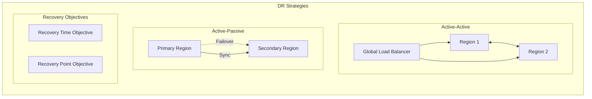
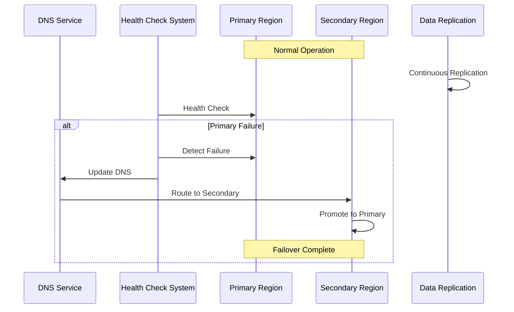
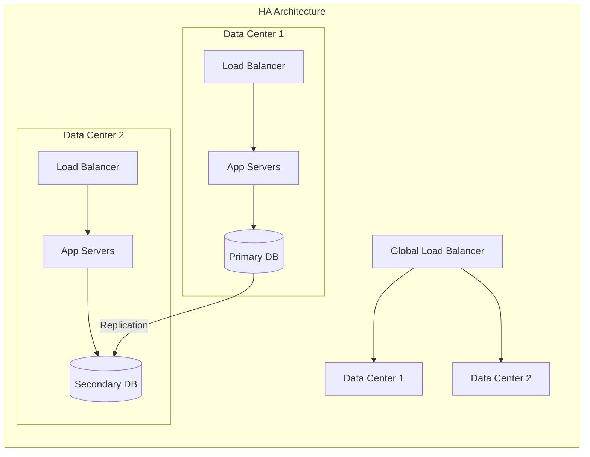
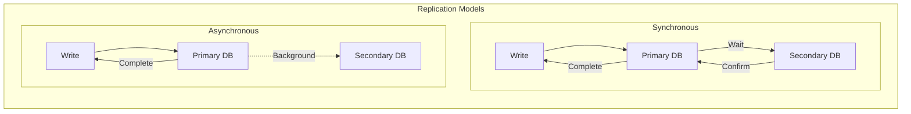
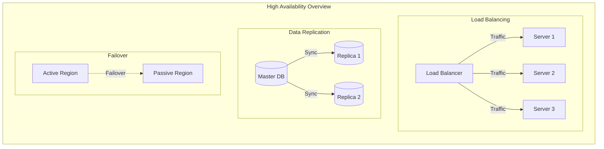
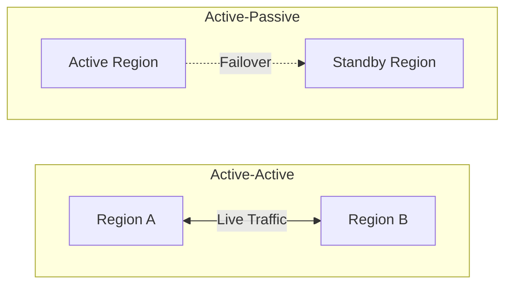
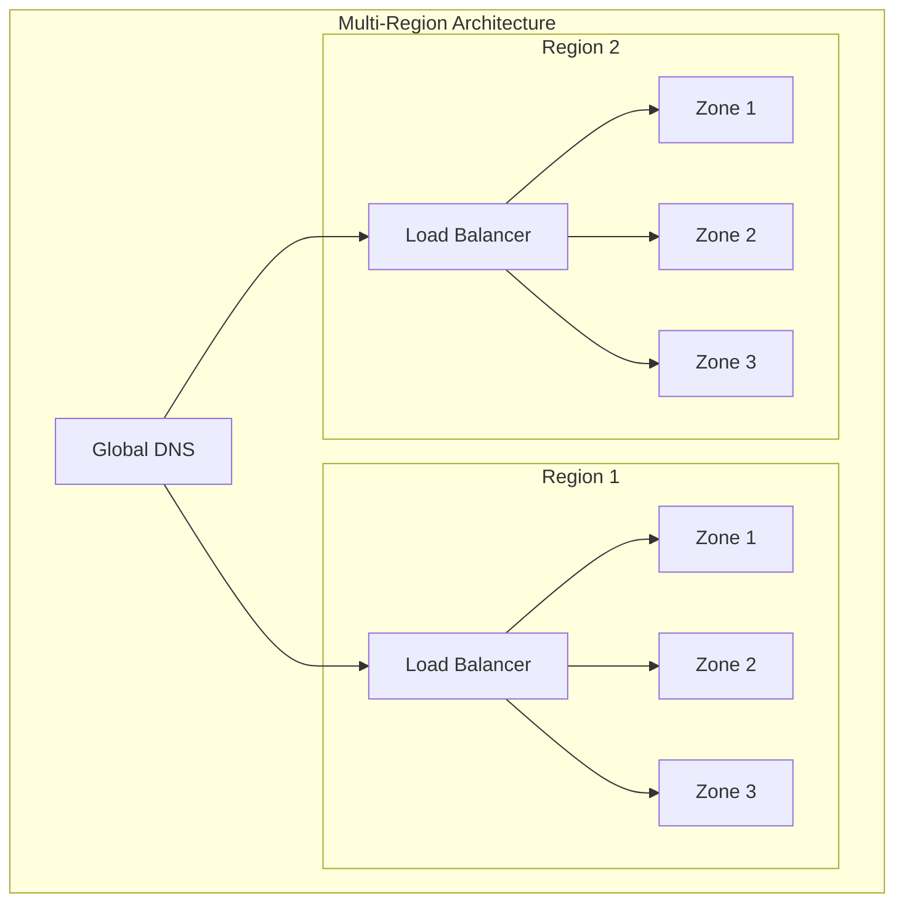

# High Availability Design Principles and Implementations

High Availability (HA) is the ability of a system to remain operational and accessible even in the face of component failures. Here's a comprehensive guide to high availability design principles and their implementations:

## 1. Redundancy

### Principles
- Eliminating single points of failure
- Component duplication
- Geographic distribution
- Active-Active vs Active-Passive configurations

### Implementation Example
```yaml
# Azure Load Balancer with multiple instances
resource "azurerm_lb" "example" {
  name                = "ha-loadbalancer"
  location            = azurerm_resource_group.example.location
  resource_group_name = azurerm_resource_group.example.name
  sku                = "Standard"

  frontend_ip_configuration {
    name                 = "PublicIPAddress"
    public_ip_address_id = azurerm_public_ip.example.id
  }
}

# Multiple VM instances in availability set
resource "azurerm_availability_set" "example" {
  name                = "ha-aset"
  location            = azurerm_resource_group.example.location
  resource_group_name = azurerm_resource_group.example.name
  platform_fault_domain_count  = 3
  platform_update_domain_count = 5
}
```

## 2. Fault Detection and Recovery

### Principles
- Health monitoring
- Automated failover
- Self-healing systems
- Circuit breakers

### Implementation Example
```java
// Circuit Breaker Pattern Implementation
@CircuitBreaker(name = "backendService", fallbackMethod = "fallbackMethod")
public String backendServiceCall() {
    return restTemplate.getForObject("/api/data", String.class);
}

public String fallbackMethod(Exception ex) {
    return "Fallback Response due to: " + ex.getMessage();
}

// Health Check Implementation
@Component
public class DatabaseHealthIndicator extends AbstractHealthIndicator {
    @Override
    protected void doHealthCheck(Health.Builder builder) {
        try {
            int result = jdbcTemplate.queryForObject("SELECT 1", Integer.class);
            if (result == 1) {
                builder.up();
            } else {
                builder.down();
            }
        } catch (Exception e) {
            builder.down(e);
        }
    }
}
```

## 3. Load Distribution and Balancing

### Principles
- Traffic distribution
- Session persistence
- Health probes
- Geographic routing

### Implementation Example
```nginx
# Nginx High Availability Configuration
upstream backend {
    server backend1.example.com:8080 max_fails=3 fail_timeout=30s;
    server backend2.example.com:8080 max_fails=3 fail_timeout=30s;
    server backend3.example.com:8080 backup;
    
    keepalive 32;
    least_conn;
}

server {
    listen 80;
    server_name example.com;
    
    location / {
        proxy_pass http://backend;
        proxy_next_upstream error timeout invalid_header http_500;
        proxy_next_upstream_tries 3;
        proxy_connect_timeout 5s;
        health_check interval=5s fails=3 passes=2;
    }
}
```

## 4. Data Replication and Consistency

### Principles
- Synchronous vs Asynchronous replication
- Data consistency models
- Backup strategies
- Point-in-time recovery

### Implementation Example
```sql
-- PostgreSQL Streaming Replication Configuration
-- On Primary Server (postgresql.conf)
wal_level = replica
max_wal_senders = 10
wal_keep_size = 16

-- On Replica Server (recovery.conf)
primary_conninfo = 'host=primary_host port=5432 user=repl password=password'
restore_command = 'cp /path/to/archive/%f %p'
recovery_target_timeline = 'latest'

-- Azure SQL Database Geo-Replication
CREATE DATABASE SecondaryDatabase 
AS COPY OF PrimaryDatabase
(SERVICE_OBJECTIVE = 'HS_Gen5_2');

-- Set up Active Geo-Replication
ALTER DATABASE SecondaryDatabase
ADD SECONDARY ON SERVER SecondaryServer;
```

## 5. Disaster Recovery

### Principles
- Recovery Point Objective (RPO)
- Recovery Time Objective (RTO)
- Business Continuity Planning
- Disaster Recovery Testing

### Implementation Example
```typescript
// Azure Site Recovery Configuration
import * as pulumi from "@pulumi/pulumi";
import * as azure from "@pulumi/azure-native";

const vault = new azure.recoveryservices.Vault("example-vault", {
    resourceGroupName: resourceGroup.name,
    location: "eastus",
    sku: {
        name: "Standard"
    },
    properties: {
        monitoringSettings: {
            alertSettings: {
                alertsForAllJobFailures: "Enabled"
            }
        }
    }
});

const policy = new azure.recoveryservices.ReplicationPolicy("example-policy", {
    resourceGroupName: resourceGroup.name,
    resourceName: vault.name,
    properties: {
        providerSpecificInput: {
            instanceType: "A2A",
            recoveryPointHistoryInMinutes: 1440,
            applicationConsistentSnapshotFrequencyInMinutes: 240
        }
    }
});
```

## Disaster Recovery Patterns



## Failover Architecture



## High Availability Components



## Disaster Recovery Implementation

```typescript
interface FailoverConfig {
    primaryRegion: string;
    secondaryRegion: string;
    healthCheckInterval: number;
    failureThreshold: number;
}

class RegionalFailover {
    private failures: number = 0;
    private isFailedOver: boolean = false;

    constructor(private config: FailoverConfig) {
        this.startHealthChecks();
    }

    private async startHealthChecks(): Promise<void> {
        setInterval(async () => {
            try {
                await this.checkPrimaryHealth();
                this.failures = 0;
                if (this.isFailedOver) {
                    await this.failbackToPrimary();
                }
            } catch (error) {
                this.failures++;
                if (this.failures >= this.config.failureThreshold) {
                    await this.failoverToSecondary();
                }
            }
        }, this.config.healthCheckInterval);
    }

    private async failoverToSecondary(): Promise<void> {
        if (this.isFailedOver) return;

        // Implement failover logic:
        // 1. Update DNS/Traffic Manager
        // 2. Promote secondary to primary
        // 3. Update application configurations
        this.isFailedOver = true;
    }

    private async failbackToPrimary(): Promise<void> {
        // Implement failback logic:
        // 1. Verify primary is healthy
        // 2. Sync any missed data
        // 3. Switch traffic back
        this.isFailedOver = false;
    }
}
```

## Data Replication Strategies



## 6. Service Mesh Architecture

### Principles
- Service discovery
- Network resilience
- Traffic management
- Observability

### Implementation Example
```yaml
# Istio Service Mesh Configuration
apiVersion: networking.istio.io/v1alpha3
kind: VirtualService
metadata:
  name: reviews-route
spec:
  hosts:
  - reviews.prod.svc.cluster.local
  http:
  - route:
    - destination:
        host: reviews.prod.svc.cluster.local
        subset: v1
      weight: 90
    - destination:
        host: reviews.prod.svc.cluster.local
        subset: v2
      weight: 10
  retries:
    attempts: 3
    perTryTimeout: 2s
    retryOn: gateway-error,connect-failure,refused-stream
```

## 7. Monitoring and Alerting

### Principles
- Real-time monitoring
- Predictive analytics
- Alert thresholds
- Incident response

### Implementation Example
```yaml
# Prometheus Alert Rules
groups:
- name: high-availability-alerts
  rules:
  - alert: InstanceDown
    expr: up == 0
    for: 5m
    labels:
      severity: critical
    annotations:
      summary: "Instance {{ $labels.instance }} down"
      description: "{{ $labels.instance }} has been down for more than 5 minutes"

  - alert: HighLatency
    expr: http_request_duration_seconds{quantile="0.9"} > 1
    for: 10m
    labels:
      severity: warning
    annotations:
      summary: "High latency on {{ $labels.instance }}"
```

## 8. Auto-Scaling

### Principles
- Horizontal scaling
- Vertical scaling
- Predictive scaling
- Resource optimization

### Implementation Example
```yaml
# Kubernetes Horizontal Pod Autoscaler
apiVersion: autoscaling/v2
kind: HorizontalPodAutoscaler
metadata:
  name: web-app
spec:
  scaleTargetRef:
    apiVersion: apps/v1
    kind: Deployment
    name: web-app
  minReplicas: 3
  maxReplicas: 10
  metrics:
  - type: Resource
    resource:
      name: cpu
      target:
        type: Utilization
        averageUtilization: 70
  - type: Resource
    resource:
      name: memory
      target:
        type: Utilization
        averageUtilization: 80
  behavior:
    scaleDown:
      stabilizationWindowSeconds: 300
```

## 9. Cross-Region Deployment

### Principles
- Geographic redundancy
- Traffic routing
- Data synchronization
- Regional failover

### Implementation Example
```typescript
// Azure Traffic Manager Configuration
const trafficManager = new azure.network.TrafficManagerProfile("example", {
    resourceGroupName: resourceGroup.name,
    trafficManagerProfiles: {
        relativeName: "ha-app",
        trafficRoutingMethod: "Performance",
        dnsConfig: {
            relativeName: "ha-app",
            ttl: 30
        },
        monitorConfig: {
            protocol: "HTTPS",
            port: 443,
            path: "/health",
            intervalInSeconds: 30,
            timeoutInSeconds: 10,
            toleratedNumberOfFailures: 3
        },
        endpoints: [
            {
                name: "primary",
                type: "AzureEndpoints",
                targetResourceId: primaryApp.id,
                priority: 1
            },
            {
                name: "secondary",
                type: "AzureEndpoints",
                targetResourceId: secondaryApp.id,
                priority: 2
            }
        ]
    }
});
```

## 10. Security and Compliance

### Principles
- Identity and access management
- Encryption at rest and in transit
- Compliance requirements
- Security monitoring

### Implementation Example
```yaml
# Azure Key Vault Configuration
resource "azurerm_key_vault" "example" {
  name                       = "ha-keyvault"
  location                   = azurerm_resource_group.example.location
  resource_group_name        = azurerm_resource_group.example.name
  tenant_id                  = data.azurerm_client_config.current.tenant_id
  soft_delete_retention_days = 90
  purge_protection_enabled   = true

  sku_name = "standard"

  network_acls {
    default_action = "Deny"
    bypass         = "AzureServices"
    ip_rules       = ["trusted_ip_range"]
  }
}

# Enable encryption for storage account
resource "azurerm_storage_account" "example" {
  name                     = "hastorageaccount"
  resource_group_name      = azurerm_resource_group.example.name
  location                 = azurerm_resource_group.example.location
  account_tier             = "Standard"
  account_replication_type = "GRS"

  blob_properties {
    versioning_enabled       = true
    change_feed_enabled      = true
    default_service_version  = "2020-06-12"
    delete_retention_policy {
      days = 30
    }
  }

  encryption_scopes {
    enable_infrastructure_encryption = true
  }
}
```

# High Availability Design Patterns



## Active-Active vs Active-Passive



## Availability Zones and Regions



## High Availability Principles

1. **Design for Failure**
   - Assume components will fail
   - Plan for graceful degradation
   - Implement retry policies
   - Use circuit breakers

2. **Implement Proper Monitoring**
   - Set up comprehensive monitoring
   - Use proper alerting thresholds
   - Monitor system health
   - Track key metrics

3. **Data Management**
   - Implement proper backup strategies
   - Use data replication
   - Maintain data consistency
   - Plan for disaster recovery

4. **Performance Considerations**
   - Monitor system performance
   - Implement caching strategies
   - Use load balancing
   - Optimize resource usage

5. **Security Integration**
   - Implement security at every layer
   - Use proper authentication/authorization
   - Encrypt sensitive data
   - Regular security audits

Remember: High availability is not just about implementing redundant components; it's about creating a comprehensive strategy that ensures your system remains operational under various conditions. Always consider your specific requirements and constraints when implementing high availability solutions.